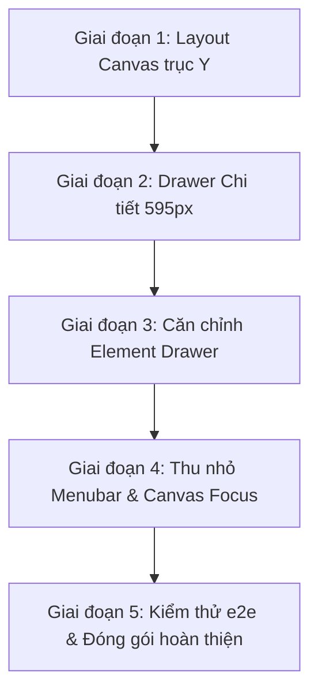

# KẾ HOẠCH NÂNG CẤP & TỐI ƯU TOÀN DIỆN SƠ ĐỒ TỔ CHỨC (CORE ORGANIZATION WORKSPACE PLAN)

> **Mã tài liệu**: `CORE_Sơ đồ tổ chức_PLAN.md`  
> **Phân hệ**: Nền tảng lõi (Enterprise CORE) / Module Quản trị Cơ cấu Tổ chức (`/organization`)  
> **Ngày thiết lập**: 30/09/2026  
> **Trạng thái**: Sẵn sàng triển khai (Ready for Implementation)  
> **Mục tiêu**: Khắc phục triệt để bài toán dàn trải không gian hiển thị, cải tiến kiến trúc tương tác 3 vùng (Tree Outline - Canvas - Inspector Drawer) và tối đa hóa diện tích làm việc chuẩn Widescreen 16:9.

---

## 1. BỐI CẢNH VÀ VẤN ĐỀ HIỆN TẠI (PROBLEM STATEMENT)

### 1.1. Hiện trạng trên Canvas ReactFlow
- **Dàn trải chiều ngang cực lớn (Trục X)**: Thuật toán sắp xếp `calculateHierarchicalLayout` hiện đang xếp các cây sơ đồ/nhánh gốc (`roots`) nối tiếp nhau theo chiều ngang (`rootLeft += width + H_GAP * 2`). Khi doanh nghiệp có 4 khối hoặc sơ đồ phân nhánh sâu, chiều rộng canvas bị kéo dài hơn **8.000px**.
- **Trải nghiệm Zoom/Pan kém hiệu quả**: Khi mới vào trang hoặc bấm `fitView`, hệ thống phải co zoom nhỏ xuống còn **10% - 25%** để hiển thị trọn vẹn. Ở mức zoom này, chữ và nội dung trong thẻ node hoàn toàn không thể đọc được. Ngược lại, nếu phóng to lên 50% - 100% để đọc thông tin thì người dùng phải lăn chuột và kéo rê (pan) liên tục rất mất thời gian.
- **Lãng phí không gian dọc**: Trong khi chiều ngang bị quá tải thì chiều dọc (trục Y) lại dư thừa nhiều khoảng trống.

### 1.2. Thẻ chi tiết Node (Inspector) đang chiếm diện tích cố định
- **Bố cục 3 cột cứng**: Workspace hiện chia lưới cố định `[280px_1fr_340px]`. Cột thứ 3 (`OrganizationNodeInspector` - 340px) luôn hiển thị chiếm chỗ ngay cả khi người dùng chỉ có nhu cầu duyệt và quan sát sơ đồ.
- **Kích thước hẹp, giao diện chật chội**: Độ rộng 340px khiến các form thông tin, danh sách nhân sự bổ nhiệm, nút thao tác và các trường cấu hình bị dồn ép, khó theo dõi.

### 1.3. Thanh điều hướng phân hệ (Menubar) chiếm dụng diện tích
- Thanh sidebar của nền tảng/phân hệ hiện có chiều rộng cố định (`w-60` hoặc `w-64`), làm thu hẹp khung nhìn của các công cụ trực quan đòi hỏi không gian lớn như Sơ đồ tổ chức Canvas.

---

## 2. NGUYÊN TẮC THIẾT KẾ VÀ QUY CHUẨN KỸ THUẬT (DESIGN PRINCIPLES)

1. **Tuân thủ UI/UX Guideline (`AGENTS.md` & `ui-design`)**:
   - Tối ưu tỉ lệ hiển thị **Widescreen 16:9** (1920×1080, 1600×900, 1440×900).
   - **Tuyệt đối không sử dụng Emoji** trên giao diện (nút bấm, badge, tiêu đề, modal). Sử dụng icon SVG chuẩn từ `lucide-react`.
   - Sử dụng **Drawer** trượt từ mép phải cho bảng chi tiết kiểm tra/cấu hình node.
   - Sử dụng **Popconfirm** tại chỗ cho các hành động nguy hiểm (xóa node, bãi nhiệm nhân sự).
   - Sử dụng **SearchableSelect** (Ant Design / Shadcn Combobox) cho việc tìm kiếm, gán nhân sự hoặc chọn đơn vị cha.
2. **Hiệu năng & Khả năng mở rộng**:
   - Hỗ trợ tốt cho doanh nghiệp từ vài chục đến hàng nghìn node tổ chức.
   - Thao tác chuyển đổi mượt mà, lưu vị trí và trạng thái vào Redux Store / LocalStorage.

---

## 3. GIẢI PHÁP CHI TIẾT THEO 4 TRỤ CỘT CẢI TIẾN

```
+---------------------------------------------------------------------------------------------------+
|  HEADER / BREADCRUMB / ACTIONS (Bộ lọc, Thu nhỏ Sidebar, Toàn màn hình, Xuất ảnh, Đặt lại góc nhìn)  |
+--------------------+-----------------------------------------------------+------------------------+
|                    |                                                     |                        |
|  CỘT 1 (280px)     |  CỘT 2: CANVAS KHÔNG GIAN CHÍNH (Chiếm trọn 100%)    |  DRAWER TRƯỢT PHẢI     |
|  CÂY THƯ MỤC PHÂN CẤP|                                                   |  (595px - 1.75x)       |
|  - Danh mục Root   |  [Root 1: Hội đồng quản trị]                        |  - Mặc định: ẨN        |
|  - Tìm kiếm node   |        |                                            |  - Bung ra khi click   |
|  - Expand/Collapse |   [Root 2: Ban Tổng Giám đốc]                       |    trực tiếp vào node  |
|  - Click để Focus  |        |                                            |  - Form 2 cột thoáng   |
|                    |   [Root 3: Khối Vận hành & Kinh doanh]              |  - Quản lý bổ nhiệm    |
|                    |                                                     |  - Phân quyền & mô tả  |
+--------------------+-----------------------------------------------------+------------------------+
```

---

### TRỤ CỘT 1: TỔ CHỨC LẠI LAYOUT CANVAS THEO CHIỀU DỌC (TRỤC Y) KẾT HỢP SUBTREE FOCUS

#### A. Tái cấu trúc thuật toán xếp Root theo chiều Y
- **Vấn đề giải quyết**: Chuyển đổi tư duy dàn trải trục X sang cộng dồn trục Y cho các cây gốc độc lập.
- **Cơ chế thực hiện tại `organization-layout-utils.ts`**:
  - Mỗi nhánh gốc (`root`) vẫn giữ cấu trúc phân cấp cây bên trong (hoặc Grid dạng ma trận nếu là node lá/chức danh).
  - Tọa độ `X` của mỗi nhánh gốc được căn giữa trục `X = 0`.
  - Tọa độ `Y` của các nhánh gốc kế tiếp được tính lũy kế theo chiều cao của khối hộp trước:
    $$\text{currentY} \mathrel{+}= \text{height}(\text{root}_i) + V\_SECTION\_GAP \quad (V\_SECTION\_GAP = 160\text{px})$$
- **Kết quả đạt được**:
  - Độ rộng Canvas co gọn từ **> 8.000px** xuống chỉ còn **~1.200px - 1.400px**.
  - Tỉ lệ zoom mặc định khi `fitView` đạt **80% - 95%** (gần kích thước thật 1:1), người dùng có thể đọc rõ tên phòng ban, mã đơn vị và nhân sự mà không cần phải zoom to nhỏ thủ công.

#### B. Cơ chế Focus & Subtree View khi tương tác từ Cây thư mục (Cột trái)
- Người dùng có thể chọn chế độ:
  1. **Toàn cảnh (Full View)**: Xếp toàn bộ các khối theo chiều dọc Y.
  2. **Tập trung nhánh (Subtree Focus Mode)**: Khi click vào 1 Root hoặc 1 Khối phòng ban lớn ở Cây thư mục bên trái, Canvas chỉ hiển thị phân nhánh của khối đó, giúp giảm tải DOM và người dùng tập trung cao độ vào phòng ban đang xử lý.
  3. **Auto-Center Animation**: Khi nhấp đúp vào node ở Cây thư mục, Canvas tự động bay (smooth pan & zoom) vào trung tâm của node đó trên sơ đồ.

---

### TRỤ CỘT 2: CHUYỂN ĐỔI THẺ DETAIL SANG DRAWER TRƯỢT PHẢI (KÍCH THƯỚC 1.75X)

#### A. Cơ chế hiển thị thông minh
- **Mặc định**: Thẻ Detail hoàn toàn **ẨN**.
- **Kích hoạt mở Drawer**: Chỉ mở khi người dùng thực hiện 1 trong 2 thao tác:
  1. Click trực tiếp vào một Node thẻ trên Canvas ReactFlow.
  2. Click chọn một Node trong Cây thư mục phân cấp bên trái (`OrganizationTreeOutline`).
- **Nút đóng Drawer**: Hỗ trợ nút `X`, phím tắt `Escape`, hoặc click ra vùng overlay (tùy chọn cho phép tương tác song song).

#### B. Kích thước chuẩn hóa 1.75x chiều ngang
- Kích thước ban đầu: $340\text{px}$.
- Kích thước mới sau khi tăng $1.75\text{x}$:
  $$340\text{px} \times 1.75 = 595\text{px} \approx 600\text{px}$$
- Hoàn toàn tương thích và đáp ứng quy chuẩn Drawer của hệ thống (`580px - 720px`).

#### C. Tái cấu trúc và căn chỉnh lại các Element bên trong Drawer
Nhờ chiều rộng được mở rộng lên 595px, bố cục bên trong được tổ chức lại chuyên nghiệp và thoáng đãng:
1. **Header Drawer**:
   - Badge danh mục đơn vị: `Đơn vị / Phòng ban` hoặc `Vị trí / Chức danh` kèm mã code nổi bật.
   - Nút hành động nhanh: Lưu thay đổi (`Save`), Xóa node (`Trash2` với Popconfirm chống bấm nhầm), Đóng (`X`).
2. **Tab 1: Thông tin cơ bản (Grid 2 cột)**:
   - Dòng 1: [ Tên đơn vị / vị trí (Col-Span 2) ]
   - Dòng 2: [ Mã định danh ] và [ Thuộc cấp cha (Đơn vị cấp trên) ]
   - Dòng 3: [ Danh mục node: Unit / Position ] và [ Chức danh trưởng đơn vị ]
   - Dòng 4: [ Mô tả chức năng nhiệm vụ (Textarea Col-Span 2) ]
3. **Tab 2: Nhân sự & Bổ nhiệm (Assignment Management)**:
   - Thanh công cụ gán nhanh nhân sự: Sử dụng Combobox tìm kiếm họ tên / email đa năng.
   - Bảng danh sách nhân sự hiện tại:
     - Avatar, Họ tên, Email, Mã nhân viên.
     - Badge đánh dấu: `Trưởng đơn vị / Đương nhiệm chính` (Primary).
     - Nút gán làm nhân sự chính hoặc Bãi nhiệm (`Popconfirm`).
4. **Tab 3: Lịch sử & Thống kê nhanh**:
   - Thống kê quân số cấp dưới trực tiếp / gián tiếp.
   - Ngày cập nhật gần nhất.

---

### TRỤ CỘT 3: TỐI ƯU HÓA KHÔNG GIAN BẰNG TÍNH NĂNG THU NHỎ MENUBAR (COLLAPSIBLE SIDEBAR)

#### A. Cơ chế 2 trạng thái cho Menubar
1. **Trạng thái Mở rộng (Default - `w-60` / `240px`)**:
   - Hiển thị logo đầy đủ, tiêu đề phân hệ, tên các mục chức năng và thông tin người dùng.
2. **Trạng thái Thu nhỏ (Collapsed Rail - `w-16` / `64px`)**:
   - Ẩn toàn bộ nhãn chữ dài.
   - Thu nhỏ logo và các icon điều hướng căn giữa (`mx-auto size-9`).
   - Tự động hiển thị **Tooltip / Floating Popover** khi di chuột qua icon để người dùng vẫn nhận diện được màn hình đích.
   - Thao tác thu nhỏ giúp **Canvas giải phóng thêm ~180px không gian chiều ngang**, giúp nhìn bao quát sơ đồ tối đa.

#### B. Tiện ích điều khiển công thái học
- **Nút Toggle Sidebar**: Bố trí nút thu gọn/mở rộng ở góc chân sidebar hoặc góc trái thanh Topbar (`PanelLeftClose` / `PanelLeftOpen`).
- **Phím tắt hỗ trợ**: Hỗ trợ tổ hợp phím tắt nhanh (`Ctrl + B` hoặc `[`) giúp ẩn/hiện menubar tức thì.
- **Nút "Toàn màn hình Canvas" (Focus Mode)** ngay trên Toolbar của sơ đồ:
  - Cho phép tạm thời ẩn cả Menubar chính và Cây thư mục bên trái để Canvas chiếm trọn 100% màn hình khi cần thuyết trình, hội chẩn sơ đồ cơ cấu.
- **Lưu trạng thái (`Persistence`)**: Trạng thái đóng/mở thanh điều hướng được lưu trữ trong `localStorage` (`ep_sidebar_collapsed`).

---

### TRỤ CỘT 4: NÂNG CẤP THANH CÔNG CỤ CANVAS (CANVAS TOOLBAR)

Bổ sung các nút chức năng tiêu chuẩn ngay trên Canvas:
1. **Bộ chọn chế độ bố cục (Layout Selector)**:
   - `Bố cục dọc (Mặc định)`: Xếp các gốc theo trục Y.
   - `Bố cục ngang truyền thống`: Phục vụ khi sơ đồ chỉ có 1 root duy nhất dạng ngang.
2. **Nút "Góc nhìn tối ưu" (Smart Fit & Focus)**:
   - Phím tắt `Space` hoặc nút icon: Tự động căn chỉnh toàn bộ sơ đồ về giữa màn hình với mức zoom hợp lý nhất (60% - 100%).
3. **Nút "Thu gọn / Mở rộng toàn bộ nhánh"**:
   - Cho phép thu gọn các node con của từng phòng ban để chỉ nhìn các khối lớn, sau đó click bung dần từng khối.
4. **Bộ lọc tìm kiếm trực tiếp trên Canvas**:
   - Highlight sáng các node khớp với từ khóa tìm kiếm (tên phòng ban, chức vụ, tên nhân viên), làm mờ các node không liên quan.

---

## 4. MA TRẬN TÁC ĐỘNG TỆP TIN (FILE IMPACT MATRIX)

| Tệp tin cần cập nhật | Mục tiêu điều chỉnh |
|---|---|
| `apps/web/src/app/(tenant)/organization/organization-layout-utils.ts` | Điều chỉnh hàm `calculateHierarchicalLayout`: sắp xếp các root theo chiều dọc trục Y (`currentY += height + V_GAP`), căn giữa trục X. |
| `apps/web/src/app/(tenant)/organization/organization-workspace.tsx` | - Chuyển đổi grid 3 cột thành grid 2 cột (`[280px_1fr]`).<br>- Đưa `OrganizationNodeInspector` vào trong `Drawer`/`Sheet` trượt mép phải (`side="right"`), độ rộng `w-[595px]`.<br>- Quản lý state mở Drawer khi click node từ Tree Outline hoặc Canvas. |
| `apps/web/src/app/(tenant)/organization/organization-node-inspector.tsx` | - Căn chỉnh lại giao diện theo chiều rộng 595px.<br>- Dàn form thông tin thành 2 cột (`grid-cols-2`).<br>- Tối ưu hóa bảng gán nhân sự và các nút bấm hành động. |
| `apps/web/src/app/(tenant)/tenant-shell.tsx` | - Triển khai Collapsible Sidebar: Chuyển đổi `w-60` $\leftrightarrow$ `w-16`.<br>- Tự động co giãn phần nội dung chính `pl-60` $\leftrightarrow$ `pl-16`.<br>- Thêm nút toggle và lưu trạng thái vào `localStorage`. |
| `apps/web/src/app/(tenant)/organization/organization-flow.tsx` | - Tối ưu hóa sự kiện `onNodeClick` để kích hoạt mở Drawer.<br>- Bổ sung phím tắt và chế độ Focus. |

---

## 5. LỘ TRÌNH THỰC HIỆN (EXECUTION PHASES)



### Giai đoạn 1: Tối ưu thuật toán Layout Canvas theo trục Y
- Chỉnh sửa `calculateHierarchicalLayout` trong `organization-layout-utils.ts`.
- Đảm bảo các nhánh gốc được xếp dọc cách nhau khoảng cách hợp lý (`V_SECTION_GAP = 160px`).
- Đảm bảo tọa độ X của các nhánh được căn giữa đối xứng.

### Giai đoạn 2: Tích hợp Drawer cho Node Inspector
- Cập nhật `organization-workspace.tsx`: Xóa bỏ cột thứ 3 cứng trong grid layout.
- Tạo Wrapper Drawer (sử dụng component Sheet/Drawer chuẩn của hệ sinh thái).
- Thiết lập độ rộng chuẩn xác `595px` (1.75x so với ban đầu).
- Gắn trigger mở Drawer vào sự kiện chọn node tại Canvas và Cây thư mục.

### Giai đoạn 3: Tái thiết kế giao diện bên trong Node Inspector
- Chỉnh sửa `organization-node-inspector.tsx` để tận dụng diện tích 595px.
- Sắp xếp các trường dữ liệu thành 2 cột (`grid grid-cols-2 gap-4`).
- Cải tiến giao diện phân quyền, bổ nhiệm nhân sự và nút Popconfirm xóa/bãi nhiệm.

### Giai đoạn 4: Bổ sung tính năng thu nhỏ Menubar & Focus Mode
- Chỉnh sửa `tenant-shell.tsx` để hỗ trợ Collapsible Sidebar (`w-60` $\rightarrow$ `w-16`).
- Thêm nút Toggle và phím tắt `Ctrl + B`.
- Thêm nút phóng to Canvas (Focus Canvas Mode) tại thanh công cụ của Organization Workspace.

### Giai đoạn 5: Kiểm thử, Tinh chỉnh và Bàn giao
- Kiểm tra tính mượt mà khi zoom, pan, click mở Drawer trên các độ phân giải: Full HD 1920x1080, 1600x900, 1440x900.
- Kiểm tra không phát sinh lỗi layout hoặc tràn thanh cuộn ngoài ý muốn.
- Kiểm tra tuân thủ đầy đủ quy tắc không dùng emoji và chuẩn giao diện `AGENTS.md`.

---
*Tài liệu này là cơ sở kỹ thuật chính thức để tiến hành triển khai mã nguồn cho phân hệ Sơ đồ tổ chức CORE.*
