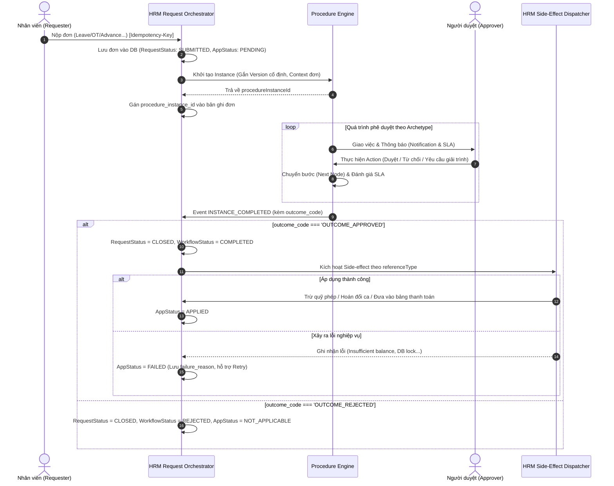
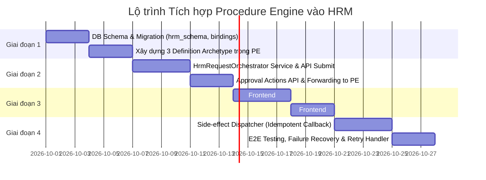

# KẾ HOẠCH TÍCH HỢP PROCEDURE ENGINE VÀO XỬ LÝ ĐƠN TỪ HRM (HRM_LinkPE_PLAN)

Tài liệu này đặc tả toàn diện giải pháp kiến trúc, luồng tích hợp, thiết kế cơ sở dữ liệu, API, giao diện UI/UX và cơ chế xử lý kết quả giữa **Procedure Engine (Quy trình động)** và **HRM Requests (Xử lý đơn từ)** trên nền tảng Enterprise Platform.

---

## 1. Các Nguyên tắc Thiết kế Cốt lõi (Core Architectural Principles)

Để đảm bảo tính toàn vẹn dữ liệu, khả năng mở rộng và chống lỗi hệ thống phân tán (Data drift, Race conditions, Failure recovery), kiến trúc tuân thủ 8 nguyên tắc sau:

1. **Procedure Engine là Source of Truth của Workflow**:
   - Trạng thái vòng đời của quy trình duyệt (đang ở bước nào, ai duyệt, lịch sử duyệt, thời hạn SLA) do Procedure Engine quản lý độc quyền.
   - **Không duplicate** các trường chi tiết như `current_step_name`, `current_assignee_id` vào từng bảng HRM. HRM chỉ lưu duy nhất khóa ngoại `procedure_instance_id`. Các thông tin hiển thị bước/người duyệt sẽ được truy vấn trực tiếp từ PE hoặc thông qua Read-Model/Cache.
2. **Tách biệt 3 tầng trạng thái độc lập (Three-Layer State Model)**:
   - **Request Status** (Tầng hồ sơ đơn): `DRAFT` $\rightarrow$ `SUBMITTED` $\rightarrow$ `CLOSED` (hoặc `CANCELLED`).
   - **Workflow Status** (Tầng động cơ quy trình): `IN_PROGRESS` $\rightarrow$ `COMPLETED` (hoặc `TERMINATED`).
   - **Business Application Status** (Tầng hiệu ứng nghiệp vụ): `PENDING` $\rightarrow$ `PROCESSING` $\rightarrow$ `APPLIED` (hoặc `FAILED`).
3. **`COMPLETED` không tự động đồng nghĩa với `APPROVED` (Cần Outcome Code)**:
   - Khi một Instance trong PE kết thúc (`COMPLETED`), nó phải trả về mã kết quả (`outcome_code`), ví dụ: `OUTCOME_APPROVED`, `OUTCOME_REJECTED`, `OUTCOME_AUTO_EXPIRED`. HRM chỉ kích hoạt logic khi `outcome_code === 'OUTCOME_APPROVED'`.
4. **Pin Procedure Definition Version tại thời điểm Submit**:
   - Khi nhân viên nộp đơn, hệ thống ghi nhận chính xác `procedure_definition_id` kèm `version` (hoặc snapshot). Nếu HR Admin cập nhật sơ đồ quy trình sau đó, các đơn đang chạy dở dang không bị ảnh hưởng.
5. **Tính Idempotent và Khả năng Retry (Idempotency & Retries)**:
   - Mọi thao tác Submit đơn, Event Webhook và tác vụ Side-effect đều phải có `idempotency_key` (dựa trên `request_id` / `event_id`) để đảm bảo khi mạng chập chờn hoặc retry không bị duplicate hành động (vd: không bị trừ phép 2 lần).
6. **Business Side-effect có trạng thái và cơ chế phục hồi riêng**:
   - Nếu duyệt thành công nhưng việc trừ phép hoặc giải ngân gặp lỗi (khóa bảng, lỗi logic), trạng thái ghi nhận là `FAILED` kèm lý do lỗi, không làm rollback trạng thái đã duyệt trên quy trình. Cung cấp API/UI cho phép HR bấm `Retry Application`.
7. **Mô hình Khung quy trình chuẩn hóa (Workflow Archetypes)**:
   - Không gộp tất cả loại đơn vào 1 quy trình duy nhất (gây rối rắm ma trận node), cũng không tạo rời rạc từng loại đơn. Hệ thống chia làm 3 nhóm bản chất nghiệp vụ: *Tuyến tính chuẩn*, *Xác nhận chéo 2 chiều*, và *Liên phòng ban / Tài chính*.
8. **HRM Request Broker / Orchestrator mỏng**:
   - Trong module HRM xây dựng service trung gian (`HrmRequestOrchestrator`) đóng vai trò điều phối giữa các Controller đơn từ của HRM và Procedure Engine.

---

## 2. Mô hình 3 Nhóm Quy trình Khung (Workflow Archetypes)

Toàn bộ 7 loại đơn từ hiện tại của HRM được phân loại vào 3 nhóm bản chất quy trình:

| Nhóm Quy trình (Archetype) | Các loại đơn áp dụng | Cấu trúc luồng duyệt trong Procedure Engine |
| :--- | :--- | :--- |
| **Nhóm 1: Tuyến tính tiêu chuẩn**<br>*(Standard Line Approval)* | • Đơn xin nghỉ phép (`leave`)<br>• Đơn làm thêm giờ (`ot`)<br>• Đơn công tác (`business_trip`)<br>• Đơn bổ sung công (`correction`) | `[Nộp đơn]` $\rightarrow$ `[Quản lý trực tiếp duyệt]` $\rightarrow$ *(Rẽ nhánh nếu ngày nghỉ > 3 hoặc chi phí cao: Giám đốc duyệt)* $\rightarrow$ `[Hoàn tất & Trả outcome]` |
| **Nhóm 2: Xác nhận chéo 2 chiều**<br>*(Peer-to-Peer Approval)* | • Đơn hoán đổi ca làm việc (`shift_change`) | `[Nộp đơn]` $\rightarrow$ `[Đồng nghiệp được đề xuất xác nhận]` $\rightarrow$ `[Quản lý ca / Trưởng bộ phận duyệt]` $\rightarrow$ `[Hoàn tất & Trả outcome]` |
| **Nhóm 3: Liên phòng ban / Tài chính**<br>*(Cross-functional / Financial)* | • Đơn tạm ứng lương (`advance`)<br>• Đơn điều chỉnh hồ sơ (`profile_correction`) | `[Nộp đơn]` $\rightarrow$ `[Quản lý trực tiếp xác nhận]` $\rightarrow$ `[Bộ phận chuyên môn thẩm định: C&B / Pháp chế]` $\rightarrow$ `[CFO / Lãnh đạo phê duyệt]` $\rightarrow$ `[Hoàn tất & Trả outcome]` |

> **Ưu điểm**: Ban đầu chỉ cần tạo 3 định nghĩa quy trình trong Procedure Engine. Thông qua bảng cấu hình `request_procedure_bindings`, HR Admin có thể linh hoạt chuyển đổi hoặc tách thêm quy trình riêng biệt khi cần mà không cần can thiệp code.

---

## 3. Kiến trúc Luồng Tích hợp & Xử lý Side-Effect (End-to-End Flow)



---

## 4. Thiết kế Cơ sở dữ liệu (Database Schema)

### 4.1. Bổ sung trường liên kết trên các bảng đơn (`hrm_schema.*_requests`)
Áp dụng cho: `leave_requests`, `ot_requests`, `business_trip_requests`, `shift_change_requests`, `attendance_corrections`, `salary_advances`, `profile_correction_requests`.

```sql
-- Ví dụ trên bảng leave_requests (các bảng đơn khác cấu trúc tương tự)
ALTER TABLE hrm_schema.leave_requests
  ADD COLUMN procedure_instance_id UUID REFERENCES procedure_schema.procedure_instances(id) ON DELETE SET NULL,
  ADD COLUMN request_status VARCHAR(30) DEFAULT 'SUBMITTED',       -- SUBMITTED, CLOSED, CANCELLED
  ADD COLUMN application_status VARCHAR(30) DEFAULT 'PENDING',     -- PENDING, PROCESSING, APPLIED, FAILED, NOT_APPLICABLE
  ADD COLUMN application_error TEXT,                               -- Chi tiết lỗi nếu application_status = FAILED
  ADD COLUMN applied_at TIMESTAMPTZ,
  ADD COLUMN idempotency_key VARCHAR(100);

CREATE UNIQUE INDEX idx_hrm_leave_req_idempotency ON hrm_schema.leave_requests(tenant_id, idempotency_key);
CREATE INDEX idx_hrm_leave_req_proc_inst ON hrm_schema.leave_requests(procedure_instance_id);
```

### 4.2. Bảng cấu hình ánh xạ Quy trình (`request_procedure_bindings`)
Quản lý việc loại đơn nào sử dụng quy trình nào và phiên bản nào:

```sql
CREATE TABLE hrm_schema.request_procedure_bindings (
  id UUID PRIMARY KEY DEFAULT gen_random_uuid(),
  tenant_id VARCHAR(50) NOT NULL,
  request_kind VARCHAR(50) NOT NULL,                 -- 'leave', 'ot', 'advance', 'shift_change',...
  sub_type_code VARCHAR(50),                         -- Ví dụ: Loại phép cụ thể 'ANNUAL', 'UNPAID', hoặc NULL (mặc định)
  procedure_definition_id UUID NOT NULL REFERENCES procedure_schema.procedure_definitions(id),
  pinned_version INT,                                -- Phiên bản quy trình cố định (NULL nếu luôn lấy phiên bản Active mới nhất khi tạo mới)
  condition_rules JSONB DEFAULT '{}',                -- Điều kiện rẽ nhánh nâng cao (vd: {"min_days": 3})
  is_active BOOLEAN DEFAULT TRUE,
  created_at TIMESTAMPTZ DEFAULT now(),
  updated_at TIMESTAMPTZ DEFAULT now(),
  UNIQUE(tenant_id, request_kind, sub_type_code)
);

CREATE INDEX idx_hrm_req_proc_bindings ON hrm_schema.request_procedure_bindings(tenant_id, request_kind);
```

---

## 5. Thiết kế Giao tiếp API & Event Broker

### 5.1. Khởi tạo đơn từ HRM sang Procedure Engine
- **Endpoint tiếp nhận của HRM**: `POST /api/hrm/v1/<request-kind>`
- **Xử lý tại `HrmRequestOrchestrator`**:
  1. Kiểm tra bảng `request_procedure_bindings` theo `request_kind` và `sub_type_code` để lấy `definitionId` và phiên bản.
  2. Tạo bản ghi đơn HRM trong transaction (trạng thái: `request_status = 'SUBMITTED'`, `application_status = 'PENDING'`).
  3. Gọi nội bộ `ProcedureEngineApplication.createInstance(tenantId, payload)`:
     ```json
     {
       "definitionId": "uuid-cua-quy-trinh",
       "title": "Đơn xin nghỉ phép - Nguyễn Văn A",
       "referenceType": "HRM_LEAVE_REQUEST",
       "referenceId": "leave-uuid-001",
       "variables": {
         "employeeId": "emp-001",
         "departmentId": "dep-tech",
         "duration": 3.0,
         "directManagerId": "emp-lead-002"
       }
     }
     ```
  4. Cập nhật `procedure_instance_id` vào đơn và commit transaction.

### 5.2. Chuyển tiếp hành động duyệt (Approval Actions)
- **Endpoint**: `POST /api/hrm/v1/requests/:id/action`
- Client gửi hành động:
  ```json
  {
    "actionId": "APPROVE", // APPROVE | REJECT | REQUEST_INFO | DELEGATE
    "comment": "Đồng ý cho nghỉ phép theo lịch đăng ký",
    "delegateTo": null
  }
  ```
- HRM Orchestrator ủy quyền trực tiếp sang PE: `POST /api/procedure-engine/v1/instances/:instanceId/actions`.

### 5.3. Xử lý Callback & Side-effect Dispatcher (Idempotent Handler)
- Lắng nghe event `procedure.instance.completed` từ PE:
  ```typescript
  export class HrmSideEffectDispatcher {
    async handleProcedureCompleted(event: ProcedureCompletedEvent) {
      const { referenceType, referenceId, outcomeCode } = event;

      // 1. Kiểm tra Idempotency - Không xử lý lại nếu đơn đã CLOSED
      const request = await this.findRequest(referenceType, referenceId);
      if (request.requestStatus === 'CLOSED') return;

      if (outcomeCode !== 'OUTCOME_APPROVED') {
        await this.markRejected(referenceType, referenceId, outcomeCode);
        return;
      }

      // 2. Kích hoạt Side-effect theo từng loại đơn
      try {
        await this.updateApplicationStatus(referenceType, referenceId, 'PROCESSING');
        switch (referenceType) {
          case 'HRM_LEAVE_REQUEST':
            await this.leaveService.deductLeaveBalance(referenceId);
            break;
          case 'HRM_SHIFT_CHANGE':
            await this.attendanceService.executeShiftSwap(referenceId);
            break;
          case 'HRM_SALARY_ADVANCE':
            await this.payrollService.recordAdvanceDisbursement(referenceId);
            break;
          case 'HRM_PROFILE_CORRECTION':
            await this.profileService.applyProfilePatch(referenceId);
            break;
        }
        await this.updateApplicationStatus(referenceType, referenceId, 'APPLIED');
      } catch (err: any) {
        // Ghi nhận lỗi nhưng không rollback quy trình duyệt đã hoàn tất
        await this.updateApplicationStatus(referenceType, referenceId, 'FAILED', err.message);
      }
    }
  }
  ```

---

## 6. Giải pháp Giao diện người dùng (UI/UX)

Tuân thủ nghiêm ngặt chuẩn thiết kế: **Tỉ lệ 16:9, Dark/Light Enterprise Theme, Shadcn/ui + Tailwind CSS, không dùng emoji, 3 định dạng tương tác Popconfirm / Drawer / Dialog**:

### 6.1. Drawer chi tiết đơn từ (`640px` - Master-Detail Detail Pane)
- **Tầng hiển thị 3 trạng thái rõ ràng**:
  - Badge Header: Hiển thị song song **Trạng thái hồ sơ** (`Đã gửi / Hoàn tất / Đã hủy`) và **Trạng thái áp dụng** (`Đang chờ / Đã ghi nhận / Thất bại`).
- **Khối Timeline Stepper tương tác**:
  - Không hardcode bước duyệt mà render động từ `procedure_instance.nodes`.
  - Node xanh lá: Đã duyệt xong, hiển thị tên người duyệt, thời gian và comment.
  - Node vàng: Đang xử lý, hiển thị người đang giữ quyền duyệt và đồng hồ đếm ngược SLA.
  - Node xám viền nét đứt: Các bước tiếp theo trong quy trình.
- **Thanh thao tác theo thẩm quyền (Action Bar)**:
  - Nếu người xem là người có quyền xử lý bước hiện tại:
    - Nút **"Phê duyệt"**: Sử dụng `Popconfirm` với màu xanh thương hiệu `#021E73`.
    - Nút **"Từ chối"**: Sử dụng `Popconfirm` cảnh báo màu đỏ, bắt buộc nhập lý do.
    - Nút **"Ủy quyền duyệt"**: Chọn nhân sự thay thế qua `SearchableSelect`.
  - Nếu `application_status === 'FAILED'`: Hiển thị nút **"Thử lại ghi nhận nghiệp vụ (Retry)"** cho HR Admin kèm thông báo lỗi chi tiết.

### 6.2. Màn hình Cấu hình Quy trình đơn từ (HR Settings)
- Tab **"Quy trình xử lý đơn từ"** trong cài đặt HRM:
  - Danh mục các loại đơn từ dạng bảng.
  - Mỗi loại đơn có combobox `SearchableSelect` để gán với 1 Quy trình trong Procedure Engine.
  - Có switch chọn: *"Luôn dùng bản mới nhất"* hoặc *"Cố định phiên bản (Pin Version)"*.
  - Nút **"Xem sơ đồ quy trình"**: Mở modal hiển thị đồ thị luồng duyệt (Workflow Graph) trực quan.

### 6.3. Bảng Master danh sách đơn từ
- Bổ sung 2 cột thông tin quan trọng:
  - **Bước quy trình**: Tên bước hiện tại trong PE.
  - **Người thụ lý**: Tên/Avatar người đang giữ quyền duyệt và cảnh báo SLA.

---

## 7. Lộ trình Triển khai (4 Giai đoạn)


