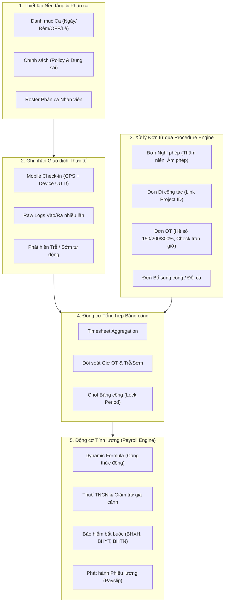

# KẾ HOẠCH PHÁT TRIỂN & LỘ TRÌNH TRIỂN KHAI HRM PHASE 1 (HRM_PLAN_1)

> **Tài liệu tham chiếu:**
> - Đặc tả luồng: `D:\HRM\DOCX_md\P2_S1_HRM_FLOW_giai đoạn 1.md`
> - Kế hoạch tích hợp Procedure Engine: `HRM_LinkPE_PLAN.md`
> - Kế hoạch Chấm công Mobile App: `D:\HRM\DOCX_md\HRM_Chấm công_PLAN của app.md`
> - Mã nguồn triển khai: `packages/modules/hrm` (Backend NestJS) & `packages/features/hrm` (Frontend React)

---

## 1. Bảng Tổng hợp Phân loại Hiện trạng 7 Nhóm Chức năng Cốt lõi

Bảng đối soát chi tiết giữa các chức năng **đã có / đang xây dựng** và **phần còn thiếu / cần làm tiếp** trên nền tảng:

| STT | Nhóm chức năng | Đã có / Đang xây dựng trên Platform | Phần còn thiếu / Cần phát triển thêm | Mức độ hoàn thiện |
| :---: | :--- | :--- | :--- | :---: |
| **1** | **Phân ca** | • CRUD danh mục ca (`shift_definitions`)<br>• Gán ca cho nhân viên (`shift_assignments`)<br>• Giao diện Roster phân ca hàng tuần/tháng (`qu_n_l_ca_ch_m_c_ng_sub_tab_b_ng_ph_n_ca_roster_svn_dts`) | • Ca đêm + tự động tính phụ trội đêm $\ge 30\%$<br>• Lịch ngày nghỉ tuần (**OFF**) phân biệt với vắng mặt/bỏ việc<br>• Danh mục ngày Lễ/Tết toàn quốc & hệ số công Lễ<br>• Cơ chế ca gãy (Split shift) & xoay ca tự động | 🟡 Đang làm<br>**(60%)** |
| **2** | **Phép & Đơn từ** | • Schema & Controller: `leave_requests`, `shift_change_requests`<br>• Khung tích hợp **Procedure Engine** (`HRM_LinkPE_PLAN.md` - Archetype 1 & 2)<br>• Quy trình duyệt, trừ quỹ phép khi đơn Approved | • Phép thâm niên (+1 ngày sau mỗi 5 năm)<br>• Thời hạn chốt chuyển phép tồn (Carry-over hết hạn 31/03)<br>• Chính sách **Ứng phép & Âm phép** (tối đa 2 ngày)<br>• Xử lý bù trừ phép khi thôi việc | 🟡 Đang làm<br>**(70%)** |
| **3** | **Chấm công** | • Endpoints Check-in/Check-out Mobile (`hrm-attendance.controller.ts`)<br>• Cấu hình dung sai đi trễ / về sớm cơ bản (Grace period)<br>• Đơn giải trình quên quẹt / bổ sung công (`attendance_corrections`) | • **Nhiều lần vào - ra**: Thuật toán ghép cặp (Pairing/First In - Last Out)<br>• **Geofencing**: Xác thực GPS + bán kính cho phép ($R \le 100m$), IP/BSSID Wi-Fi văn phòng<br>• **Bảo mật**: Khóa 1 tài khoản / 1 thiết bị di động (*Device Binding*) | 🟡 Đang làm<br>**(50%)** |
| **4** | **Công tác** | • Bảng dữ liệu `business_trip_requests`<br>• Luồng duyệt đơn qua Procedure Engine<br>• Ghi nhận ngày công tác tính là ngày công chuẩn vào Timesheet | • **Liên kết Dự án / Đầu việc**: Cột `project_id`, `milestone_id`, `client_id`<br>• Hạch toán phân bổ chi phí công tác vào dự án (*Cost Allocation*)<br>• Check-in GPS xác nhận tại địa điểm công tác | 🔴 Chưa làm<br>**(30%)** |
| **5** | **OT / Tăng ca** | • Đơn đăng ký làm thêm giờ (`ot_requests`)<br>• Luồng duyệt qua Procedure Engine<br>• Đưa tổng số giờ OT vào Timesheet & Payroll | • Phân loại hệ số OT: 150% (thường), 200% (nghỉ tuần), 300% (Lễ/Tết)<br>• Ràng buộc trần giờ OT (4h/ngày, 40h/tháng, 200h/năm)<br>• Đối soát tự động 2 vòng: $\min(\text{Giờ đăng ký duyệt}, \text{Giờ quẹt thực tế})$ | 🟡 Đang làm<br>**(50%)** |
| **6** | **Bảng công tháng** | • Khung tổng hợp `timesheet_periods`, `timesheets`<br>• Giao diện Bảng công chi tiết & nghiệp vụ chốt sổ kỳ công (`Flow 14, 15, 16`) | • Phân rã đầy đủ các cột: Công chuẩn, công thực tế, ca đêm, Lễ/Tết, phép có lương, không lương, công tác, OT các bậc, số lần & phút trễ/sớm<br>• Tự động đánh dấu các ngày bất thường cần giải trình | 🟡 Đang làm<br>**(65%)** |
| **7** | **Tính lương** | • Bảng lương `payroll_runs`, `payslips`<br>• Ghi nhận khấu trừ tạm ứng lương (`salary_advances`) | • **Formula Engine linh hoạt**: Cho phép cấu hình công thức động không cần sửa code backend<br>• Liên kết tự động bảng công + OT + Thưởng/Phạt trễ/sớm<br>• Biểu thuế TNCN lũy tiến từng phần và trần đóng BHXH | 🔴 Chưa làm<br>**(35%)** |

---

## 2. Sơ đồ Quan hệ Kiến trúc Luồng Dữ liệu (Data Flow Architecture)

Chuỗi phụ thuộc dữ liệu đi từ gốc Thiết lập $\rightarrow$ Giao dịch phát sinh $\rightarrow$ Quy trình phê duyệt $\rightarrow$ Tổng hợp công $\rightarrow$ Quyết toán lương:



---

## 3. Lộ trình Triển khai Kỹ thuật 4 Giai đoạn (Implementation Roadmap)

---

### 📍 Giai đoạn 1: Chuẩn hóa Ca kíp & Nâng cấp Bảo mật Chấm công
> **Trọng tâm**: Hoàn thiện toàn diện Nhóm 1 (Phân ca) & Nhóm 3 (Chấm công). Đảm bảo dữ liệu chấm công từ Mobile App chính xác, đúng người, đúng tọa độ trước khi đổ vào bảng công.

1. **Nâng cấp Phân ca theo Cây Tổ chức (`core_schema.organization_nodes` & `hrm_schema.shift_definitions`)**:
   - **Tái cấu trúc Ma trận Roster (Tab 2)**: Chuyển từ phân ca phẳng theo 1.000 cá nhân sang **Phân ca theo Cấp Phòng ban / Đơn vị (Hierarchical Org Roster)** kết hợp **Ngoại lệ cá nhân (Individual Overrides)**.
   - **Cơ chế Kế thừa tự động (Inheritance)**: 95% nhân sự tự động áp dụng ca làm việc chuẩn của phòng ban trực thuộc từ `core_schema`; chỉ 5% nhân sự làm ca đêm/đổi ca/trực đột xuất mới phát sinh bản ghi ngoại lệ.
   - Thêm cờ `is_night_shift` (tự động cộng hệ số phụ trội ca đêm $\ge 30\%$).
   - Thiết lập loại ngày nghỉ tuần **`OFF`** trên Roster (tránh bị hệ thống phạt vắng mặt/bỏ việc).
   - Thiết lập bảng danh mục **Ngày Lễ/Tết** toàn quốc: tự động ghi nhận công hưởng nguyên lương; nếu đi làm ngày Lễ sẽ kích hoạt chế độ làm việc ngày Lễ (hưởng lương ngày lễ + OT 300%).
   - Cấu hình ca gãy (*Split Shift*) và xoay ca luân phiên.
2. **Nâng cấp API & Bảo mật Chấm công Mobile (`hrm-attendance.controller.ts`)**:
   - **Xác thực Geofencing**: Nhân viên gửi kèm tọa độ (Latitude, Longitude); backend kiểm tra khoảng cách với danh sách văn phòng/chi nhánh:
     $$\text{Distance} = \text{Haversine}(\text{UserLoc}, \text{OfficeLoc}) \le R \ (100m)$$
   - **Bảo mật thiết bị (Device Binding - 1 Account / 1 Thiết bị)**:
     - Tạo bảng `hrm_schema.employee_devices` lưu `device_uuid`, `device_model`, `status`.
     - Lần đầu điểm danh sẽ kích hoạt đăng ký thiết bị chính thức. Chặn tuyệt đối hành vi điểm danh hộ từ thiết bị khác khi chưa được HR duyệt yêu cầu đổi máy.
   - **Xử lý Nhiều lần vào - ra trong ngày**:
     - Lưu trữ chuỗi Raw Logs quẹt thẻ theo thời gian thực (`In1, Out1, In2, Out2...`).
     - Hỗ trợ 2 chế độ ghép cặp: Theo phiên làm việc (*Pairing Intervals*) hoặc theo mốc đầu - cuối ngày (*First-In / Last-Out*).

---

### 📍 Giai đoạn 2: Tích hợp Procedure Engine & Hoàn thiện Đơn từ Nâng cao
> **Trọng tâm**: Hoàn thiện toàn diện Nhóm 2 (Phép), Nhóm 4 (Công tác) & Nhóm 5 (OT). Nối toàn bộ đơn từ vào Procedure Engine theo kiến trúc `HRM_LinkPE_PLAN.md`.

1. **Quản lý Phép nâng cao (`leave_requests` & `leave_balances`)**:
   - **Phép thâm niên**: Tự động cộng thêm ngày phép hàng năm dựa trên ngày gia nhập công ty (`join_date`): Cứ mỗi 5 năm làm việc $+1$ ngày phép theo Bộ luật Lao động.
   - **Chuyển phép tồn (Carry-over)**: Quy định hạn chốt sử dụng phép năm cũ (ví dụ: ngày 31/03 hàng năm). Quá hạn tự động hủy hoặc chuyển thành tiền theo chính sách.
   - **Ứng phép & Âm phép (Negative Balance)**: Cấu hình trần âm phép tối đa (ví dụ: $\le 2$ ngày) cho phép nhân viên tạm ứng phép tháng sau, tự động bù trừ khi có ngày phép mới hoặc trừ vào lương thôi việc.
2. **Đơn Công tác liên kết Dự án (`business_trip_requests`)**:
   - Bổ sung trường `project_id`, `milestone_id`, `client_id` vào schema đơn công tác.
   - Cho phép nhân viên chọn Dự án/Hợp đồng liên quan để hệ thống phục vụ bài toán **Hạch toán chi phí công theo dự án (Project Cost Allocation)**.
   - Hỗ trợ check-in GPS tại địa điểm khách hàng/công trường theo tọa độ chỉ định trong đơn.
3. **Quy định & Ràng buộc OT (`ot_requests`)**:
   - Bổ sung phân loại hệ số OT: Ngày thường (**150%**), Ngày nghỉ tuần (**200%**), Ngày Lễ/Tết (**300%**), Phụ trội ca đêm ($+30\%$).
   - **Kiểm soát trần giờ làm thêm**: Chặn hoặc cảnh báo khi vượt ngưỡng pháp luật (4h/ngày, 40h/tháng, 200h/năm).
   - **Quy trình đối soát 2 vòng**: Đăng ký duyệt kế hoạch trước $\rightarrow$ Quẹt thẻ thực tế $\rightarrow$ Hệ thống tự động lấy:
     $$\text{Giờ OT thanh toán} = \min(\text{Giờ đăng ký duyệt}, \text{Giờ quẹt thẻ thực tế})$$

---

### 📍 Giai đoạn 3: Động cơ Bảng công Tháng Toàn diện
> **Trọng tâm**: Hoàn thiện toàn diện Nhóm 6 (Bảng công tháng). Đảm bảo bảng công phản ánh đa chiều mọi khía cạnh làm việc và vi phạm của nhân viên.

1. **Thuật toán Aggregation Bảng công (`timesheets`)**:
   - Thu thập và chuẩn hóa dữ liệu từ 6 nguồn: `Attendance Logs + Shift Roster + Leave Requests + OT Requests + Business Trips + Attendance Corrections`.
   - Tính toán thời gian đi muộn / về sớm sau khi trừ thời gian dung sai (*Grace Period*).
   - Tự động cộng ngày công Lễ hưởng nguyên lương và ngày công tác gắn mã dự án.
2. **Cấu trúc Hiển thị & Quy trình Nghiệp vụ**:
   - Phân rã đầy đủ các cột dữ liệu:
     - Công chuẩn theo lịch
     - Công thực tế đi làm (ca ngày, ca đêm)
     - Công Lễ/Tết
     - Nghỉ hưởng lương (phép năm, thâm niên, việc riêng)
     - Nghỉ không hưởng lương
     - Nghỉ chế độ BHXH (ốm đau, thai sản)
     - Ngày nghỉ tuần (OFF)
     - Ngày công tác theo dự án
     - Giờ làm thêm OT (tách 150%, 200%, 300% và đêm)
     - Số lần & số phút đi trễ / về sớm
     - Danh sách ngày bất thường cần giải trình
   - Quy trình khóa kỳ công: **Tổng hợp sơ bộ** $\rightarrow$ **Nhân viên đối soát & giải trình** $\rightarrow$ **HR chốt sổ (Lock Timesheet)** $\rightarrow$ **Mở lại khi có phê duyệt (Unlock Request)**.

---

### 📍 Giai đoạn 4: Động cơ Tính lương & Công thức Động
> **Trọng tâm**: Hoàn thiện toàn diện Nhóm 7 (Tính lương). Tự động hóa tính lương minh bạch từ Bảng công và cấu hình công thức linh hoạt.

1. **Liên kết Bảng công $\rightarrow$ Lương**:
   - Lương thời gian:
     $$\text{Lương ngày công} = \frac{\text{Lương cơ bản}}{\text{Công chuẩn tháng}} \times \text{Công thực tế}$$
   - Tiền làm thêm giờ (OT):
     $$\text{Tiền OT} = \text{Đơn giá giờ chuẩn} \times \left( \text{OT}_{150\%} \times 1.5 + \text{OT}_{200\%} \times 2.0 + \text{OT}_{300\%} \times 3.0 + \text{OT}_{\text{đêm}} \times 0.3 \right)$$
   - Khấu trừ phạt vi phạm đi trễ / về sớm theo bảng quy định công ty.
2. **Thuế Thu nhập Cá nhân & Bảo hiểm Bắt buộc**:
   - Tự động trích đóng Bảo hiểm: BHXH (8%), BHYT (1.5%), BHTN (1%) theo mức lương đóng bảo hiểm (áp trần 20 lần mức lương cơ sở / tối thiểu vùng).
   - Giảm trừ gia cảnh tự động: Giảm trừ bản thân (11.000.000 đ/tháng) và giảm trừ người phụ thuộc (4.400.000 đ/người/tháng lấy từ `hrm_schema.employee_profiles`).
   - Tự động áp dụng Biểu thuế lũy tiến từng phần 7 bậc cho hợp đồng lao động $\ge 3$ tháng hoặc khấu trừ 10% cho thử việc/thời vụ.
3. **Cơ chế Cấu hình Công thức Lương Động (Dynamic Formula Engine)**:
   - Cung cấp trình biên tập công thức (Formula Editor) cho phép HR tự định cấu trúc lương cho từng Chức danh / Khối phòng ban mà không cần sửa code backend:
   ```text
   GROSS = BASE_SALARY + POSITION_ALLOWANCE + MEAL_ALLOWANCE + KPI_BONUS + OT_PAY
   DEDUCTIONS = SOCIAL_INSURANCE + PERSONAL_INCOME_TAX + LATE_PENALTY + ADVANCE_PAYMENT
   NET_SALARY = GROSS - DEDUCTIONS
   ```
   - Hỗ trợ các biến số hệ thống: `TOTAL_WORK_DAYS`, `STANDARD_WORK_DAYS`, `BASE_SALARY`, `DEPENDENTS_COUNT`, `OT_HOURS`, `KPI_SCORE`...
   - Tự động phát hành và phân phối **Phiếu lương điện tử (Payslip)** an toàn qua Cổng nhân viên / Mobile App.


---

# 66. Cơ chế Tùy biến Nghỉ Lễ Đột xuất & Công chuẩn Tháng (HR-Driven Policy)

> **Nguyên tắc cốt lõi**:
> Hệ thống **TUYỆT ĐỐI KHÔNG HARD-CODE** bất kỳ quy định cứng nhắc nào từ Bộ luật Lao động. Mọi hành vi chấm công, tính ngày công chuẩn và chế độ ngày lễ đều do **HR toàn quyền cấu hình động** theo Quy chế nội bộ và Thỏa ước lao động của từng doanh nghiệp.

## 66.1. Công chuẩn trong tháng (Standard Working Days)
Công chuẩn là mẫu số bắt buộc để tính đơn giá 1 ngày công và quy đổi lương thời gian:
$$\text{Đơn giá ngày} = \frac{\text{Lương cơ bản}}{\text{Công chuẩn}}$$

HR được toàn quyền lựa chọn 1 trong 2 phương pháp cho từng kỳ lương:
1. **Chế độ Cố định (Fixed Standard Days)**: Nhập cứng số ngày công định mức theo Quy chế công ty (ví dụ: luôn chốt 26 ngày công hoặc 24 ngày công cho mọi tháng trong năm, bất kể rơi vào tháng Tết 28 ngày hay tháng 31 ngày).
2. **Chế độ Động theo Lịch (Dynamic Calendar-based)**: Tự động lấy tổng số ngày trong tháng trừ đi số ngày nghỉ tuần (OFF). Tháng có 20 công chia 20, tháng có 23 công chia 23.
3. **Phân bổ theo Khối phòng ban**: Cho phép Khối Văn phòng chốt 22 công chuẩn (nghỉ T7, CN); Khối Nhà máy/Vận hành chốt 26 công chuẩn (chỉ nghỉ CN).

## 66.2. Giải pháp Khai báo Sự kiện Nghỉ Lễ / Nghỉ Đột xuất (Global Calendar Overlay)
Khi phát sinh ngày nghỉ lễ đột xuất (theo chỉ đạo hoán đổi của Chính phủ hoặc quyết định nội bộ công ty), HR không cần sửa từng ca của hàng nghìn nhân sự mà chỉ cần tạo 1 Sự kiện Lịch với các tùy chọn linh hoạt:

1. **Chính sách đối với nhân sự NGHỈ trong ngày:**
   - **Hưởng 100% lương**: Công ty đài thọ nguyên lương ngày nghỉ (cộng 1 công Lễ hưởng lương).
   - **Hưởng theo tỷ lệ**: Hưởng 50% hoặc mức hỗ trợ thỏa thuận.
   - **Tự động trừ Quỹ phép năm**: Trừ 1 ngày phép tồn của nhân viên.
   - **Nghỉ không lương (Unpaid)**: Trừ trực tiếp vào công hưởng lương tháng đó.
   - **Nghỉ hoán đổi / Đi làm bù**: Gán ngày nghỉ hoán đổi và chỉ định ngày thứ Bảy đi làm bù (hưởng 100% công bình thường, không tính làm thêm).

2. **Chính sách đối với nhân sự ĐI LÀM / TRỰC CA (Phát sinh công):**
   - **Hệ số lương do HR gõ**: 300% (theo luật), 200% (theo thỏa ước), 150%, hoặc 100% (như ngày thường).
   - **Chế độ Nghỉ bù (Compensatory Off)**: Tự động cộng +1 ngày vào Quỹ nghỉ bù của nhân viên thay vì chi trả tiền mặt.

3. **Ảnh hưởng tới Công chuẩn tháng:**
   - HR tích chọn: Giữ nguyên công chuẩn tháng hoặc Trừ bớt 1 ngày công chuẩn của tháng đó.

## 66.3. Cơ chế Phân ca Đa ca trong Ngày (Multi-Shift Schedule: Ca 1, Ca 2, Ca 3... Không Phân Biệt Cứng Nhắc)
- **Nguyên tắc Thiết kế Chuẩn hóa**:
  - Hệ thống **tuyệt đối không phân biệt cứng ca chính hay ca đêm**. Mỗi ngày làm việc của một phòng ban hoặc nhân sự có thể có từ **1 ca, 2 ca, 3 ca...** tùy theo bố trí thực tế của doanh nghiệp.
  - **Ví dụ thực tế đa dạng:**
    - Mô hình 2 ca: `Ca 1: HC (08:00 - 17:30)` & `Ca 2: Ca đêm (22:00 - 06:00)`.
    - Mô hình 3 ca: `Ca 1: Sáng (08:00 - 12:00)` & `Ca 2: Chiều (13:30 - 17:30)` & `Ca 3: Tối / Trực (18:00 - 22:00)`.
    - Mô hình Nhà máy 3 ca xoay: `Ca 1: 06:00 - 14:00` & `Ca 2: 14:00 - 22:00` & `Ca 3: 22:00 - 06:00`.
- **Hiển thị trực quan trên Ma trận Roster**:
  - Tại từng ô ngày: Hiển thị tuần tự các block ca gọn gàng theo tiền tố chuẩn: `Ca 1: [MÃ_CA] Tên ca (Số giờ công)` - `Ca 2: [MÃ_CA] Tên ca (Số giờ công)` - `Ca 3: [MÃ_CA]...`.
  - Có badge thể hiện rõ tổng số giờ của từng ca, kèm thời gian nghỉ giữa ca (nếu có).
- **Thao tác tại Popover trực tiếp từng Ô**:
  - Bấm vào bất kỳ ô giao điểm Hàng × Cột để mở Popover tại chỗ:
    - Danh sách các ca hiện tại kèm số thứ tự `Ca 1`, `Ca 2`, `Ca 3`...
    - Nút bấm `[+ Thêm Ca N]`: Cho phép bổ sung thêm ca mới vào ngày đó ngay tức thì.
    - Nút `[Gỡ bỏ]`: Cho phép xóa bớt bất kỳ ca nào nếu giảm tải.
    - Dropdown chọn mã ca áp dụng tức thời cho từng ca.
- **Cấu hình Lịch chuẩn Node gốc Công ty Mẹ**:
  - Cho phép định nghĩa số lượng ca linh hoạt (`Ca 1`, `Ca 2`, `Ca 3`...) cho từng thứ trong tuần (T2 đến CN).
  - Toàn bộ các phòng ban trực thuộc tự động kế thừa mô hình đa ca này.

## 66.4. Cơ chế Kế thừa Ma trận từ Node gốc Công ty Mẹ (Organizational Inheritance Matrix)
- **Quy tắc Kế thừa Tự động (Default Inheritance):**
  - Cung cấp nút cấu hình **"Cấu hình Lịch chuẩn Công ty mẹ"** tại đầu trang.
  - Khi thiết lập lịch chuẩn tại Node gốc (ví dụ: T2-T6 sáng chiều, T7 sáng, CN nghỉ), toàn bộ phòng ban, trung tâm, chi nhánh trực thuộc sẽ **tự động kế thừa 100%** lịch này mà HR không cần thao tác lặp lại cho từng bộ phận.
- **Cơ chế Ghi đè Tùy biến (Department-level Override):**
  - Nếu một đơn vị có tính chất đặc thù (ví dụ: Khối Sản xuất làm 3 ca xoay, Khối Bán lẻ làm ca gãy), HR chỉ cần tùy biến tại thẻ riêng của phòng ban đó.
  - Phòng ban đã tùy biến sẽ được gắn badge nhận diện `[Đã tùy biến]` và cung cấp nút bấm `[Khôi phục gốc]` để nhanh chóng trả về theo lịch công ty mẹ khi kết thúc đợt đặc thù.

## 66.5. Tái cấu trúc Logic & UX Chức năng "Gán ca ngoại lệ nhân sự" (> 1.000 Nhân sự)
- **Vấn đề tồn đọng trước đây:**
  - Đặt nút chung chung và hiển thị dropdown chọn nhân viên bao gồm toàn bộ công ty khiến hệ thống bị quá tải, tìm kiếm khó khăn và dễ gán nhầm người khi quy mô lên đến trên 1.000 nhân viên.
- **Giải pháp UX Tinh gọn mới:**
  1. **Nút Gán ngoại lệ đặt trực tiếp tại từng dòng Phòng ban:** Trong bảng ma trận phân ca, mỗi dòng phòng ban đều có nút bấm `[+ Gán ngoại lệ]`. Bấm nút này sẽ mở modal đã **tự động chọn sẵn phòng ban mục tiêu**, dropdown nhân viên chỉ lọc ra danh sách nhân sự thuộc đúng đơn vị đó.
  2. **Bộ lọc Phòng ban tích hợp trong Modal:** Trong Dialog gán ngoại lệ, bổ sung bộ lọc Phòng ban cho phép HR nhanh chóng đổi đơn vị và lọc tức thì danh sách nhân sự tương ứng.
  3. **Tách biệt rõ 2 Chế độ xem (View Mode):**
     - `Chế độ 1: Ma trận Ca cấp Phòng ban (ORG_LEVEL)`: Tập trung vào lịch tổng thể và kế thừa công ty mẹ.
     - `Chế độ 2: Danh sách Ngoại lệ / Đổi ca cá nhân (INDIVIDUAL_EXCEPTIONS)`: Chỉ hiển thị các cá nhân có lịch trực đặc biệt, ca đêm hoặc hoán đổi ca khác với mặc định của phòng ban kèm bộ lọc Tìm kiếm & Phòng ban chuyên sâu.

