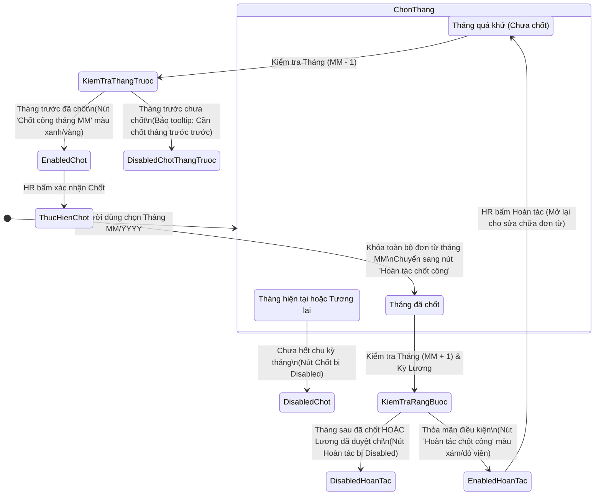

# KẾ HOẠCH CẢI TIẾN TRUNG TÂM BẢNG CÔNG & TIỀN LƯƠNG (HRM)
**Tài liệu mã số:** `PLAN_HRM_Bảng công và chấm lương.md`  
**Ngày lập:** 06/10/2026  
**Trạng thái:** Dự thảo phê duyệt kiến trúc  
**Phạm vi:** Module Quản lý Nhân sự (`packages/features/hrm`), bao gồm Bảng công (`timesheets`), Tiền lương (`payroll`), Tạm ứng lương (`advances`) và Xuất dữ liệu Excel.

---

## 1. TỔNG QUAN & LÝ DO CẢI TIẾN

### 1.1. Hiện trạng triển khai cũ
- **Trang phân tán**: Hệ thống đang tách rời thành các trang riêng biệt: `/modules/hrm/timesheets`, `/modules/hrm/payroll`, `/modules/hrm/payroll/advances`.
- **Thao tác thủ công, phức tạp**:
  - Người dùng (HR) phải thực hiện quy trình tạo kỳ công thủ công (nhập mã `BC-YYYY-MM`, chọn khoảng ngày từ `01/MM` đến `28..31/MM`), sau đó bấm "Tính toán lại", rồi bấm "Khóa kỳ".
  - Sang kỳ lương, Kế toán lại phải lặp lại việc tạo kỳ lương thủ công (`KL-YYYY-MM`), bấm "Tính toán bảng lương", "Chốt lương", "Phát hành phiếu lương".
- **Rủi ro vận hành**: 
  - Cho phép chốt kỳ nhảy cóc (ví dụ chốt tháng 10 khi tháng 9 chưa chốt).
  - Có thể vô tình bấm chốt tháng hiện hành khi chu kỳ chưa kết thúc.
  - Phân quyền chưa khép kín, thiếu tính năng báo cáo/xuất bảng lương Excel theo chuẩn kế toán.

### 1.2. Mục tiêu cải tiến mới
1. **Trải nghiệm Zero-Setup (Chọn tháng tức thì)**: HR/Kế toán không cần tạo kỳ thủ công; chỉ cần chọn tháng qua ô chọn `SearchableSelect` (Tháng 1 -> Tháng 12) là dữ liệu công và lương tự động kết xuất thời gian thực.
2. **Máy trạng thái nút bấm thông minh (Chốt ⇄ Hoàn tác)**: Nút hành động tự động đảo trạng thái dựa trên tháng đang xem, kiểm soát tính hợp lệ (không cho chốt tháng chưa hết, bắt buộc chốt tuần tự).
3. **Cơ chế khóa đơn từ tự động**: Khi bấm "Chốt công" tháng `MM`, hệ thống tự động chặn mọi thao tác tạo mới/duyệt sửa đơn nghỉ phép, làm thêm giờ (OT), giải trình check-in/out thuộc tháng đó.
4. **Hợp nhất thành "Trung tâm Công & Lương" (3 Tab)**: Gom `Bảng công`, `Tạm ứng`, `Bảng lương` về một màn hình điều hành thống nhất, kết hợp phân quyền RBAC chặt chẽ (HR không thấy lương, Kế toán xem toàn bộ).
5. **Xuất báo cáo Excel chuyên nghiệp**: Tích hợp nút xuất Excel bảng lương (`.xlsx`) gồm đầy đủ các sheet Tổng hợp lương và Chi tiết khoản mục khấu trừ/phụ cấp.

---

## 2. SO SÁNH QUY TRÌNH: HIỆN TẠI VS ĐỀ XUẤT MỚI

| Tiêu chí | Cơ chế Hiện tại (Cũ) | Cơ chế Đề xuất Cải tiến (Mới) | Lợi ích đạt được |
| :--- | :--- | :--- | :--- |
| **Khởi tạo chu kỳ** | Phải bấm nút `Tạo kỳ mới`, nhập mã, chọn ngày bắt đầu - kết thúc thủ công. | Tự động hoàn toàn. Chỉ cần chọn `Tháng/Năm` từ Select Box (mặc định tháng hiện hành). | Giảm 90% thao tác thừa; loại bỏ lỗi nhập sai khoảng ngày. |
| **Xem dữ liệu** | Phải bấm `Tính toán lại` thì bảng mới hiển thị dữ liệu tổng hợp. | Xem trực tiếp (Real-time Preview) dựa trên dữ liệu chấm công và đơn từ đã duyệt. | Nhanh chóng, trực quan, không phải chờ chạy batch tính toán. |
| **Cơ chế Chốt kỳ** | Nút bấm tĩnh (Khóa kỳ/Mở kỳ) trong modal danh sách kỳ. | Nút động ngay Toolbar: **Chốt công tháng MM** hoặc **Hoàn tác chốt công**. | Tránh bấm nhầm, thao tác 1 chạm trực tiếp trên giao diện đang xem. |
| **Kiểm soát đơn từ** | Kỳ bị khóa nhưng nếu không cấu hình chặt, nhân viên vẫn có thể nộp đơn lùi ngày. | Hệ thống Backend tự động chặn (Reject validation) mọi đơn từ rơi vào tháng đã chốt. | Đảm bảo số liệu công bất biến, không bị xáo trộn sau khi chốt. |
| **Tính tuần tự** | Có thể chốt tháng 10 dù tháng 9 còn mở. | **Bắt buộc chốt tuần tự**: Muốn chốt tháng $N$ thì tháng $N-1$ phải đã được chốt. | Tránh lỗi lũy kế phép năm và tính bù trừ lương sai lệch. |
| **Bảo mật Lương** | Hai module nằm ở hai URL riêng biệt, HR có thể tò mò truy cập nếu phân quyền URL lỏng lẻo. | Gộp chung 3 Tab: Phân quyền theo Tab và trường dữ liệu (HR ẩn hoàn toàn tab Tiền lương & trường tiền tệ). | Chuẩn mực RBAC, bảo mật thu nhập nhân sự tuyệt đối. |
| **Xuất báo cáo** | Không có hoặc phụ thuộc vào in PDF giao diện. | Nút **Xuất Excel** trực tiếp (Multi-sheet, định dạng chuẩn kế toán doanh nghiệp). | Sẵn sàng gửi ngân hàng chi trả hoặc nộp cơ quan bảo hiểm/thuế. |

---

## 3. THIẾT KẾ MÁY TRẠNG THÁI NÚT BẤM (BUTTON STATE MACHINE)



### Chi tiết các kịch bản hiển thị nút bấm:

1. **Trường hợp 1: Tháng hiện hành (ví dụ hôm nay là 06/10, đang xem Tháng 10/2026)**
   - Nút hiển thị: `Chốt công tháng 10/2026` (Trạng thái: **Disabled** kèm Tooltip: *"Chưa thể chốt kỳ công do tháng hiện hành chưa kết thúc"*).
2. **Trường hợp 2: Tháng quá khứ chưa chốt (ví dụ Tháng 09/2026)**
   - *Nếu Tháng 08/2026 chưa chốt*: Nút `Chốt công tháng 09` bị **Disabled** (Tooltip: *"Vui lòng chốt kỳ công tháng 08/2026 trước"*).
   - *Nếu Tháng 08/2026 đã chốt*: Nút `Chốt công tháng 09` hiển thị **Active** (Kèm Popconfirm cảnh báo: *"Khi chốt công, toàn bộ đơn từ nghỉ phép, làm thêm, giải trình trong tháng 09 sẽ bị khóa. Bạn có chắc chắn?"*).
3. **Trường hợp 3: Tháng quá khứ đã chốt (ví dụ Tháng 08/2026)**
   - Nút hiển thị chuyển thành: `Hoàn tác chốt công tháng 08/2026`.
   - *Nếu Tháng 09 đã chốt HOẶC Bảng lương tháng 08 đã phát hành phiếu*: Nút Hoàn tác bị **Disabled** (Cần mở khóa các tháng/quy trình sau trước).
   - *Nếu chưa bị ràng buộc*: Cho phép bấm Hoàn tác kèm Popconfirm cảnh báo rủi ro dữ liệu.

---

## 4. KIẾN TRÚC GIAO DIỆN HỢP NHẤT: TRUNG TÂM CÔNG & LƯƠNG (3 TAB)

Để tối ưu trải nghiệm và bảo mật, toàn bộ tính năng gom về đường dẫn duy nhất `/modules/hrm/timesheets-payroll` (hoặc `/modules/hrm/payroll` với cấu trúc tab nội bộ).

```
┌─────────────────────────────────────────────────────────────────────────────────────────────┐
│ TRUNG TÂM BẢNG CÔNG & TIỀN LƯƠNG                                                            │
├─────────────────────────────────────────────────────────────────────────────────────────────┤
│ Bộ lọc chung: [ Chọn Năm: 2026 ▼ ] [ Chọn Tháng: Tháng 10 ▼ ] [ Phòng ban: Tất cả ▼ ]       │
├─────────────────────────────────────────────────────────────────────────────────────────────┤
│ [ Tab 1: BẢNG CÔNG ]     [ Tab 2: TẠM ỨNG LƯƠNG ]     [ Tab 3: BẢNG LƯƠNG & XUẤT EXCEL ]    │
└─────────────────────────────────────────────────────────────────────────────────────────────┘
```

### 4.1. Tab 1: Bảng công (`Timesheet Tab`)
- **Đối tượng sử dụng**: Bộ phận Chuyên viên C&B / Nhân sự (HR).
- **Phạm vi hiển thị**:
  - Mã NV, Họ tên, Chức vụ, Phòng ban.
  - Công chuẩn trong tháng, Công thực tế, Số ngày nghỉ phép hưởng lương, Nghỉ không lương.
  - Giờ làm thêm (OT 150%, 200%, 300%), Số lần đi muộn / về sớm.
  - **Tuyệt đối KHÔNG hiển thị** bất kỳ trường nào liên quan đến Lương cơ bản, Hệ số lương hay Tiền mặt.
- **Nút hành động Toolbar**:
  - `Xem chi tiết ngày công` (Drawer trượt phải).
  - `Chốt công tháng MM` / `Hoàn tác chốt công`.
  - `Xuất bảng công Excel`.

### 4.2. Tab 2: Quản lý Tạm ứng lương (`Advances Tab`)
- **Đối tượng sử dụng**: Chuyên viên C&B + Kế toán tiền lương.
- **Phạm vi hiển thị**:
  - Danh sách đơn xin tạm ứng lương của nhân viên phát sinh trong tháng.
  - Số tiền đề nghị ứng, Lý do, Ngày đề xuất, Trạng thái phê duyệt (Đã duyệt / Chờ duyệt / Đã chi tiền).
  - Phương thức khấu trừ: Trừ toàn bộ vào bảng lương tháng đang chọn hoặc trừ trả góp nhiều kỳ.
- **Nút hành động Toolbar**:
  - `Tạo đề xuất tạm ứng nhanh` (Popup Form).
  - `Duyệt chi tạm ứng` (Popconfirm).

### 4.3. Tab 3: Bảng lương & Xuất Excel (`Payroll Tab`)
- **Đối tượng sử dụng**: Kế toán trưởng, Giám đốc tài chính (CFO), HR Director.
- **Cơ chế hoạt động**:
  - Kế toán chọn tháng $\rightarrow$ Dữ liệu ngày công từ **Tab 1** tự động ánh xạ với Mức lương đóng BH & Lương thỏa thuận của Hồ sơ nhân viên.
  - Hệ thống tự động trừ khoản tạm ứng đã duyệt từ **Tab 2**.
  - Tính toán tự động: Thu nhập chịu thuế, Các khoản giảm trừ gia cảnh, Trừ BHXH/BHYT/BHTN (10.5%), Thuế TNCN lũy tiến, ra Lương thực lĩnh (Net).
- **Nút hành động Toolbar**:
  - `Tính lại bảng lương`.
  - `Chốt bảng lương & Phát hành phiếu`.
  - **`Xuất file Excel bảng lương`** (`.xlsx` với 2 sheet chi tiết).

---

## 5. MA TRẬN PHÂN QUYỀN TRUY CẬP (RBAC MATRIX)

| Vai trò người dùng | Tab 1: Bảng công | Thao tác Chốt công | Tab 2: Tạm ứng | Tab 3: Bảng lương | Xuất Excel Lương |
| :--- | :---: | :---: | :---: | :---: | :---: |
| **Nhân viên thường** | Chỉ xem công của mình | ❌ Không | Chỉ nộp đơn ứng | ❌ Ẩn tab | ❌ Ẩn |
| **Quản lý bộ phận** | Xem công phòng ban | ❌ Không | Xem đơn phòng ban | ❌ Ẩn tab | ❌ Ẩn |
| **Chuyên viên HR (C&B)** | Toàn quyền xem & sửa | **Có quyền Chốt/Mở** | Xem & Lập đơn ứng | ❌ Ẩn tab (Không có quyền) | ❌ Không |
| **Kế toán tiền lương** | Chỉ xem dữ liệu công | ❌ Chỉ xem | Toàn quyền duyệt chi | Xem & Tính toán bảng lương | **Có quyền** |
| **Kế toán trưởng / CFO** | Xem toàn bộ | Duyệt chốt công (nếu cần) | Toàn quyền | Toàn quyền (Chốt & Duyệt chi) | **Có quyền** |
| **Admin hệ thống** | Toàn quyền | Toàn quyền | Toàn quyền | Toàn quyền | **Có quyền** |

---

## 6. ĐẶC TẢ TÍNH NĂNG XUẤT EXCEL BẢNG LƯƠNG (`exportPayrollToExcel`)

Tính năng đã được xây dựng và tích hợp thư viện `xlsx` vào gói `@enterprise-platform/feature-hrm`. Bảng xuất file gồm 2 sheet được cấu trúc theo chuẩn kế toán Việt Nam:

### 6.1. Sheet 1: `Tong_Hop_Luong` (Bảng thanh toán tiền lương tổng hợp)
- **Tiêu đề header**:
  - `STT`, `Mã NV`, `Họ và tên`, `Phòng ban`, `Chức danh`.
  - `Lương cơ bản`, `Lương thỏa thuận (Gross)`.
  - `Số ngày công tính lương`, `Lương theo công thực tế`.
  - `Tổng phụ cấp (Ăn trưa, xăng xe, điện thoại, chức vụ)`.
  - `Tiền làm thêm giờ (OT)`.
  - `Tổng thu nhập (Thu nhập Gross thực nhận)`.
  - `Các khoản giảm trừ`:
    - `Trừ BHXH (8%)`, `Trừ BHYT (1.5%)`, `Trừ BHTN (1%)`.
    - `Giảm trừ gia cảnh & Người phụ thuộc`.
    - `Thuế TNCN tạm tính`.
    - **`Trừ tiền tạm ứng lương`** (Lấy từ dữ liệu Tab 2).
  - `Lương thực lĩnh (Net chuyển khoản)`.
  - `Số tài khoản`, `Ngân hàng thụ hưởng`, `Ghi chú`.
- **Dòng tổng cộng (Footer)**: Tính hàm `SUM` toàn bộ các cột tài chính để kế toán đối soát quỹ lương.

### 6.2. Sheet 2: `Chi_Tiet_Khoan_Muc` (Phụ lục giải trình chi tiết từng nhân viên)
- Bóc tách chi tiết từng khoản phụ cấp đóng bảo hiểm và không đóng bảo hiểm.
- Bóc tách chi tiết số giờ làm thêm ngày thường, ngày nghỉ, ngày lễ.
- Nhật ký các lần giải ngân tạm ứng và số tiền khấu trừ trong kỳ.

---

## 7. LỘ TRÌNH TRIỂN KHAI CHI TIẾT (IMPLEMENTATION ROADMAP)

### Giai đoạn 1: Hoàn thiện UI & Cài đặt Thư viện (Đã hoàn thành sơ bộ)
- [x] Cài đặt `xlsx` vào package HRM.
- [x] Xây dựng hàm tiện ích `exportPayrollToExcel` và gắn nút xuất Excel trên thanh công cụ Bảng lương.
- [x] Chuẩn hóa `SearchableSelect` cho ô chọn chu kỳ Tháng/Năm.

### Giai đoạn 2: Tái cấu trúc Backend API & Máy trạng thái Chốt công
- [ ] Bổ sung trường `status` và `isTimesheetLocked` trong cơ sở dữ liệu chu kỳ công.
- [ ] Xây dựng Endpoint API `POST /api/hrm/timesheets/lock-period`:
  - Kiểm tra điều kiện tháng trước đã chốt hay chưa.
  - Cập nhật cờ khóa bảng công tháng `MM/YYYY`.
- [ ] Bổ sung Middleware kiểm tra tính hợp lệ khi nhân viên nộp đơn:
  - Chặn đơn xin nghỉ phép (`leave-requests`), làm thêm giờ (`overtime-requests`), giải trình công (`attendance-corrections`) nếu ngày phát sinh rơi vào tháng đã bị chốt.
- [ ] Xây dựng Endpoint API `POST /api/hrm/timesheets/unlock-period` kèm kiểm tra ràng buộc bảng lương.

### Giai đoạn 3: Tích hợp Giao diện Hợp nhất (3 Tab) & RBAC
- [ ] Chuyển đổi màn hình `payroll-screen.tsx` và `timesheet-screen.tsx` thành màn hình dùng chung 3 Tabs sử dụng Shadcn UI `Tabs`.
- [ ] Nhúng component `AdvancesScreen` vào Tab 2 để đồng bộ dữ liệu khấu trừ sang Tab 3.
- [ ] Áp dụng RBAC Guard: Ẩn hoàn toàn Tab 3 và Tab 2 đối với tài khoản chỉ có quyền HR thường.
- [ ] Kiểm thử luồng end-to-end: Chấm công $\rightarrow$ Nộp đơn $\rightarrow$ Chốt công $\rightarrow$ Tạm ứng $\rightarrow$ Tính lương $\rightarrow$ Xuất file Excel đối soát.

---

## 8. KẾT LUẬN & KIẾN NGHỊ

Mô hình cải tiến mới giải quyết triệt để sự rời rạc giữa quản lý công và tính lương. Việc tự động hóa chu kỳ theo tháng và áp dụng máy trạng thái nút bấm "Chốt" ⇄ "Hoàn tác" giúp bộ phận Nhân sự và Kế toán loại bỏ hoàn toàn các sai sót vận hành thủ công, bảo vệ toàn vẹn dữ liệu đơn từ và số liệu chi trả thu nhập của doanh nghiệp.
