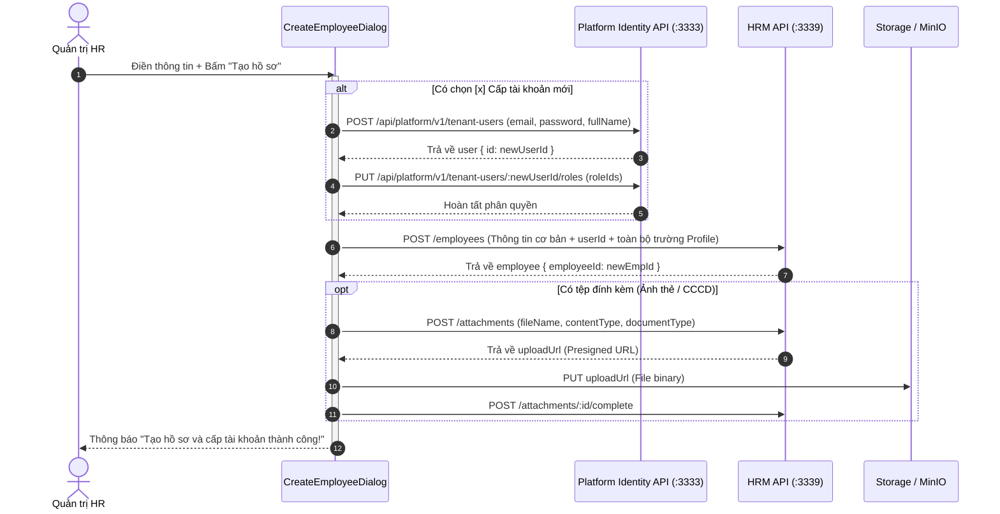

# KẾ HOẠCH NÂNG CẤP FORM TẠO MỚI HỒ SƠ NHÂN VIÊN & TÍCH HỢP TÀI KHOẢN (HRM)

> **Mã tài liệu**: `PLAN_HRM_Hồ Sơ.md`  
> **Phân hệ**: HRM (Quản trị Nhân sự) & CORE (Nền tảng Identity / RBAC)  
> **Trạng thái**: Bản thảo kế hoạch thực thi (Draft Plan)  
> **Ngày lập**: 06/10/2026  

---

## 1. Bối cảnh & Mục tiêu

### 1.1. Hiện trạng
- Form tạo mới hồ sơ nhân sự hiện tại ([`create-employee-dialog.tsx`](file:///d:/CRM/enterprise-platform/packages/features/hrm/src/lib/ui/create-employee-dialog.tsx)) chỉ hỗ trợ tạo nhanh 6 trường dữ liệu cơ bản (`employeeCode`, `fullName`, `joinDate`, `workEmail`, `employmentStatus`, `userId`).
- Trường **Tài khoản liên kết** (`userId`) hiện chỉ cho phép chọn tài khoản Core đã tạo sẵn từ trước. Nếu HR muốn cấp tài khoản cho nhân sự mới, họ phải rời HRM sang Cổng Core (`/tenant-users`) tạo user trước, rồi quay lại HRM tìm kiếm để liên kết, gây đứt gãy trải nghiệm làm việc (disconnected UX).
- Các trường thông tin quan trọng như ảnh thẻ, CCCD, thông tin ngân hàng, thuế, liên hệ khẩn cấp... dù backend đã hỗ trợ sẵn nhưng form tạo mới chưa cho phép nhập, buộc HR phải cập nhật phân tán qua nhiều bước sau đó.

### 1.2. Mục tiêu cải tiến
1. **Tái cấu trúc bố cục form**: Đưa các thông tin bắt buộc lên đầu, chia nhóm các khối thông tin mở rộng tương tự trang Hồ sơ cá nhân (`profile-screen.tsx`).
2. **Không bắt buộc thông tin phụ**: Các trường địa chỉ, ngân hàng, CCCD, liên hệ khẩn cấp... là không bắt buộc, cho phép nhân viên có thể tự cập nhật sau tại trang Hồ sơ cá nhân của họ.
3. **Tích hợp đính kèm tệp / ảnh**: Hỗ trợ upload ảnh đại diện (avatar preview), ảnh CCCD mặt trước/sau trực tiếp ngay khi tạo hồ sơ.
4. **Cấp tài khoản & Phân quyền ngay tại HRM**:
   - Bổ sung tùy chọn checkbox: `[x] Cấp tài khoản đăng nhập hệ thống ngay`.
   - Khi chọn, hiển thị các trường nhập Email đăng nhập, Mật khẩu và chọn gán vai trò (`tenant-roles`) từ Core.
   - Khi bấm lưu, hệ thống tự động tạo Core User, gán quyền và liên kết trực tiếp vào hồ sơ HRM trong một giao dịch liền mạch.

---

## 2. Thiết kế Giao diện & Trải nghiệm Người dùng (UI/UX)

Form sẽ được hiển thị trong Popup Dialog độ rộng mở rộng `sm:max-w-[760px]`, có thanh cuộn nội bộ mượt mà, phân chia thành 4 khối chức năng:

```
┌────────────────────────────────────────────────────────────────────────┐
│  Thêm mới Hồ sơ Nhân viên & Cấp tài khoản                             │
├────────────────────────────────────────────────────────────────────────┤
│  🟢 KHỐI 1: THÔNG TIN BẮT BUỘC                                        │
│  - Họ và tên (*)               - Mã nhân viên (*)                      │
│  - Ngày vào làm (*)            - Trạng thái: [ Chính thức ▼ ]          │
│  - Email công việc                                                    │
├────────────────────────────────────────────────────────────────────────┤
│  🔵 KHỐI 2: CẤP TÀI KHOẢN ĐĂNG NHẬP & PHÂN QUYỀN                      │
│  [x] Cấp tài khoản đăng nhập hệ thống ngay                            │
│  ┌──────────────────────────────────────────────────────────────────┐  │
│  │ Email đăng nhập: [nguyenvana@savina.local]                        │  │
│  │ Mật khẩu khởi tạo: [••••••••••••••] [Tạo tự động]                 │  │
│  │ Gán vai trò (Roles): [ SearchableSelect Multi: Nhân viên, HR... ]│  │
│  └──────────────────────────────────────────────────────────────────┘  │
├────────────────────────────────────────────────────────────────────────┤
│  🟡 KHỐI 3: GIẤY TỜ TÙY THÂN & ẢNH ĐẠI DIỆN (Tùy chọn)                │
│  - Ảnh chân dung (3x4): [Upload & Preview Avatar]                      │
│  - Số CCCD/Hộ chiếu            - Ngày cấp / Nơi cấp                   │
│  - Đính kèm ảnh CCCD: [Mặt trước] [Mặt sau]                            │
├────────────────────────────────────────────────────────────────────────┤
│  ⚪ KHỐI 4: THÔNG TIN MỞ RỘNG (User có thể tự cập nhật sau)          │
│  ▼ Thông tin cá nhân & Liên lạc (Điện thoại, Ngày sinh, Địa chỉ)      │
│  ▼ Thông tin Ngân hàng & Thuế (Số TK, Tên ngân hàng, MST, Số BHXH)    │
│  ▼ Người liên hệ khẩn cấp (Họ tên, SĐT, Mối quan hệ)                  │
├────────────────────────────────────────────────────────────────────────┤
│                                        [ Hủy bỏ ]  [ Tạo hồ sơ nhân sự ]│
└────────────────────────────────────────────────────────────────────────┘
```

---

## 3. Chi tiết các Trường Dữ liệu theo Khối

### Khối 1: Thông tin cốt lõi (Bắt buộc - Lên đầu Form)
| Tên trường | Định danh | Loại trường | Ràng buộc |
| :--- | :--- | :--- | :---: |
| **Họ và tên** | `fullName` | Input text | Bắt buộc (Tối đa 180 ký tự) |
| **Mã nhân viên** | `employeeCode` | Input text | Bắt buộc (Unique, max 50 ký tự) |
| **Ngày vào làm** | `joinDate` | Date picker | Bắt buộc |
| **Trạng thái làm việc** | `employmentStatus` | `SearchableSelect` | Bắt buộc (`OFFICIAL` / `PROBATION`) |
| **Email công việc** | `workEmail` | Input email | Tùy chọn (Khuyến nghị điền) |

---

### Khối 2: Cấp tài khoản & Phân quyền Core (Điều kiện theo Checkbox)
- **Checkbox trigger**: `createAccount` (mặc định: `false`).
- Khi `createAccount === true`, hiển thị các trường:
  - **Email đăng nhập** (`accountEmail`): Mặc định đồng bộ theo `workEmail`, có thể chỉnh sửa độc lập.
  - **Mật khẩu** (`password`): Input password kèm nút sinh ngẫu nhiên an toàn (tối thiểu 12 ký tự theo chuẩn Core).
  - **Vai trò gán sẵn** (`roleIds`): `SearchableSelect` nạp từ API `/api/platform/v1/tenant-roles`. Mặc định tự chọn vai trò cơ bản (ví dụ role `employee` hoặc role hệ thống mặc định).
- *Trường hợp không check*: Hiển thị lại ô chọn tài khoản chưa liên kết cũ (`userId`) nếu muốn gán với tài khoản đã có sẵn trên Core.

---

### Khối 3: Giấy tờ & File đính kèm (Tùy chọn)
- **Ảnh đại diện** (`avatarFile`): Kéo thả hoặc chọn tệp ảnh (`jpg`, `png`), hiển thị thumbnail tròn xem trước.
- **Số định danh cá nhân** (`identityCardNumber`): Số CCCD 12 chữ số.
- **Ngày cấp / Nơi cấp** (`identityCardIssuedDate`, `identityCardIssuedPlace`).
- **File CCCD mặt trước & mặt sau** (`idCardFrontFile`, `idCardBackFile`): Hỗ trợ đính kèm tệp PDF hoặc ảnh chụp.

---

### Khối 4: Thông tin bổ sung (Collapsible - Không bắt buộc)
*Có nhãn hướng dẫn: "Các trường dưới đây không bắt buộc, nhân sự có thể tự bổ sung sau tại mục Cá nhân".*
- **Cá nhân & Liên lạc**: Số điện thoại (`phone`), Email cá nhân (`personalEmail`), Ngày sinh (`dateOfBirth`), Giới tính (`gender`), Nơi thường trú (`permanentAddress`), Nơi ở hiện tại (`currentAddress`).
- **Tài chính & Thuế**: Số tài khoản (`bankAccountNumber`), Tên ngân hàng (`bankName`), Chi nhánh (`bankBranch`), Mã số thuế (`taxCode`), Mã BHXH (`socialInsuranceNumber`).
- **Liên hệ khẩn cấp**: Tên người liên hệ (`emergencyContactName`), Số điện thoại (`emergencyContactPhone`), Quan hệ (`emergencyContactRelationship`).

---

## 4. Kiến trúc Kỹ thuật & Luồng Xử lý Dữ liệu

### 4.1. Quy trình xử lý tại Frontend khi submit form


### 4.2. File và Module cần chỉnh sửa

| Tệp tin cần chỉnh sửa | Phân hệ | Nhiệm vụ chính |
| :--- | :---: | :--- |
| [`packages/features/hrm/src/lib/ui/create-employee-dialog.tsx`](file:///d:/CRM/enterprise-platform/packages/features/hrm/src/lib/ui/create-employee-dialog.tsx) | `features-hrm` | Tái cấu trúc toàn bộ UI form, thêm các khối thông tin, logic toggle tạo user, upload avatar/CCCD. |
| [`packages/modules/hrm/src/lib/presentation/hrm-employee.controller.ts`](file:///d:/CRM/enterprise-platform/packages/modules/hrm/src/lib/presentation/hrm-employee.controller.ts) | `module-hrm` | Đảm bảo endpoint `POST /employees` nhận đầy đủ các trường profile bổ sung ngay trong payload tạo ban đầu (không chỉ 6 trường tối thiểu). |
| [`packages/features/hrm/src/lib/hrm-attachment-upload.ts`](file:///d:/CRM/enterprise-platform/packages/features/hrm/src/lib/hrm-attachment-upload.ts) | `features-hrm` | Sử dụng helper tải file đính kèm MinIO cho ảnh thẻ và CCCD. |

---

## 5. Kế hoạch Triển khai (Action Steps)

- [ ] **Giai đoạn 1: Mở rộng Payload Backend HRM**
  - Cập nhật DTO `CreateHrmEmployeeRequest` trong HRM Controller để nhận toàn bộ thông tin profile (`phone`, `address`, `taxCode`, `bankAccount`...).
  - Lưu đầy đủ thông tin vào `hrm_schema.employee_profiles` ngay trong hàm `insertProfile`.
- [ ] **Giai đoạn 2: Xây dựng UI Form mới trong `create-employee-dialog.tsx`**
  - Tạo khối Thông tin bắt buộc lên trên cùng.
  - Tạo khối Cấp tài khoản với checkbox toggle, load danh sách roles từ `/api/platform/v1/tenant-roles`.
  - Tạo các khối thu gọn Collapsible cho thông tin cá nhân, thuế, ngân hàng.
  - Tích hợp component chọn và preview ảnh chân dung / CCCD.
- [ ] **Giai đoạn 3: Tích hợp logic Submit đa tầng**
  - Xử lý tuần tự: Tạo User Core -> Gán Roles Core -> Tạo Hồ sơ HRM -> Upload Files.
  - Bắt lỗi giao dịch rõ ràng (ví dụ: trùng email, trùng CCCD, sai định dạng mật khẩu).
- [ ] **Giai đoạn 4: Kiểm thử & Nghiệm thu**
  - Tạo hồ sơ không kèm tài khoản: Thành công.
  - Tạo hồ sơ có kèm tài khoản & phân quyền: Đăng nhập được ngay với email & mật khẩu vừa tạo.
  - Kiểm tra dữ liệu hiển thị tương thích hoàn toàn trên trang Cá nhân (`/my-profile`).
