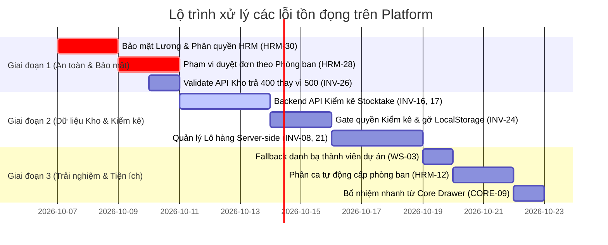

# KẾ HOẠCH KHẮC PHỤC CÁC LỖI & THIẾU SÓT TRÊN TOÀN NỀN TẢNG
**Tài liệu mã số:** `PLAN_FIX_PLATFORM_TEST_RESULTS.md`  
**Ngày lập:** 06/10/2026  
**Nguồn dữ liệu đánh giá:** Kết quả kiểm thử tự động `TEST_testrun2_2026_10_06_ketqua.xlsx`  
**Mục tiêu:** Tổng hợp toàn bộ các lỗi/tồn đọng chưa được sửa trên Platform, phân tích nguyên nhân kỹ thuật và đề xuất giải pháp xử lý chi tiết theo mức độ ưu tiên.

---

## 1. TỔNG QUAN HIỆN TRẠNG KIỂM THỬ TOÀN NỀN TẢNG

Dựa trên kết quả chạy test tại `TEST_testrun2_2026_10_06_ketqua.xlsx`:
- **Tổng số ca kiểm thử:** 200 ca
- **Thành công (Pass):** 160 ca (80.0%)
- **Tổng số ca không đạt (Fail / Thiếu sót):** 40 ca (20.0%)
  - *Lỗi (Lỗi thực thi / crash / sai kết quả):* 22 ca
  - *Thiếu logic (Nghiệp vụ chưa hoàn chỉnh / rủi ro bảo mật):* 13 ca
  - *Thiếu UI (Giao diện chưa có tính năng để thao tác):* 5 ca

Sau khi đối soát với mã nguồn hiện tại của platform, hệ thống đã xử lý thành công **17/40 ca** (các lỗi Outbox Relay, múi giờ ngày tháng UTC+7, form ca làm việc, hiển thị mã nhân viên, chuông thông báo...). Dưới đây là danh sách chi tiết các vấn đề **còn tồn đọng (chưa sửa hoặc mới sửa một phần)** cần được khắc phục.

---

## 2. BẢNG TỔNG HỢP CÁC LỖI TỒN ĐỌNG & PHÂN CẤP ƯU TIÊN

| STT | ID Kiểm thử | Module | Phân loại | Tóm tắt lỗi | Mức độ ưu tiên |
| :---: | :---: | :---: | :---: | :--- | :---: |
| 1 | **HRM-30** | HRM | Thiếu logic / Bảo mật | Quản lý cấp nhóm thấy toàn bộ menu và xem được bảng lương Ban Giám đốc | 🔴 **P1 (Nghiêm trọng)** |
| 2 | **HRM-28** | HRM | Thiếu logic | Quản lý phòng A thấy và duyệt được toàn bộ đơn từ của phòng B và toàn công ty | 🔴 **P1 (Nghiêm trọng)** |
| 3 | **INV-16** | Inventory | Lỗi kiến trúc | Chức năng Kiểm kê (`stocktakes`) lưu tạm `localStorage`, mất khi đổi trình duyệt | 🔴 **P1 (Nghiêm trọng)** |
| 4 | **INV-17** | Inventory | Thiếu logic | Thiếu endpoint backend cân bằng chênh lệch tồn kho (`ADJUST`) sau kiểm kê | 🔴 **P1 (Nghiêm trọng)** |
| 5 | **INV-24** | Inventory | Lỗi phân quyền | Tab Kiểm kê hiển thị nút tạo/xuất cho Thủ kho (chưa gate quyền backend) | 🟡 **P2 (Trung bình)** |
| 6 | **HRM-12** | HRM | Thiếu logic | Bảng phân ca (Roster) chưa tự động kế thừa ca chuẩn xuống cấp phòng ban | 🟡 **P2 (Trung bình)** |
| 7 | **INV-08** | Inventory | Lỗi kiến trúc | Dữ liệu Lô hàng (`lots`) chỉ lưu `localStorage`, phiếu nhập không gửi lên server | 🟡 **P2 (Trung bình)** |
| 8 | **INV-21** | Inventory | Thiếu logic | Xuất/chuyển kho chưa liên kết và trừ tự động theo Sê-ri / Lô hàng | 🟡 **P2 (Trung bình)** |
| 9 | **WS-03** | Workspace | Thiếu UI/Fallback | Danh bạ thêm thành viên dự án trống khi tenant mới chưa bổ nhiệm chức danh | 🟡 **P2 (Trung bình)** |
| 10 | **INV-26** | Inventory | Lỗi validation | POST `/materials` với body sai trả lỗi 500 Internal Error thay vì 400 Bad Request | 🟢 **P3 (Thấp)** |
| 11 | **CORE-09**| Core Org | Thiếu UI | Drawer chi tiết chức danh chỉ xem, chưa có nút bấm thao tác bổ nhiệm nhanh | 🟢 **P3 (Thấp)** |
| 12 | **WS-02** | Workspace | Thiếu logic | Mô hình dự án phẳng, chưa hỗ trợ cấu trúc Dự án con (Project Parent-Child) | 🟢 **P3 (Cải tiến)** |
| 13 | **WS-23** | Workspace | Thiếu UI | Chưa có tính năng theo dõi các đợt Doanh thu/Thu tiền theo tiến độ hợp đồng | 🟢 **P3 (Cải tiến)** |

---

## 3. ĐẶC TẢ CHI TIẾT NGUYÊN NHÂN & PHƯƠNG ÁN XỬ LÝ

### 3.1. NHÓM 1: CÁC VẤN ĐỀ BẢO MẬT & PHÂN QUYỀN (ƯU TIÊN P1)

#### 🔴 Lỗi HRM-30: Rò rỉ thông tin Tiền lương đối với Quản lý cấp cơ sở
* **Nguyên nhân kỹ thuật**:
  - Quyền truy cập API lương (`hrm.payroll.read`, `hrm.employee.salary.read`) đang được cấp chung cho cả vai trò Quản lý phòng ban.
  - Sidebar hiển thị menu Tiền lương (`/payroll`) cho mọi tài khoản có cờ quản lý mà không phân biệt Quản lý nghiệp vụ vs Kế toán/Giám đốc.
* **Giải pháp triển khai**:
  1. **Tách biệt Action Permissions trong Identity**:
     - `hrm.timesheet.manage`: Quản lý công, duyệt đơn, xem giờ làm phòng ban.
     - `hrm.payroll.read` & `hrm.payroll.manage`: Chỉ cấp riêng cho Kế toán trưởng, Kế toán tiền lương và Ban Giám đốc (CEO/CFO).
  2. **Bảo vệ Endpoint Backend**:
     - Trong `hrm-employee.controller.ts`: Khi trả thông tin chi tiết nhân viên, nếu caller không có quyền `hrm.payroll.read` thì trường `salaryProfile`, `baseSalary` bắt buộc phải trả về `null`.
  3. **Frontend Guard**:
     - Ẩn toàn bộ tab Tiền lương và các cột thu nhập trong giao diện HRM đối với Quản lý cấp phòng.

#### 🔴 Lỗi HRM-28: Phạm vi dữ liệu duyệt của Quản lý (`Department Scope`)
* **Nguyên nhân kỹ thuật**:
  - Endpoint `GET /api/hrm/v1/approvals` hiện chỉ lọc theo `tenant_id` và trạng thái `PENDING`, bỏ qua kiểm tra cây sơ đồ tổ chức của người đang đăng nhập.
* **Giải pháp triển khai**:
  1. Khi người dùng có vai trò Quản lý đăng nhập, hệ thống truy xuất `department_id` của họ từ bảng phân công bổ nhiệm (`core_schema.organization_node_assignments`).
  2. Cập nhật câu truy vấn lọc danh sách đơn:
     ```sql
     WHERE t.tenant_id = $1 
       AND t.status = 'PENDING'
       AND (
         $isTenantAdmin = true 
         OR $hasCompanyWideApproval = true
         OR requester.department_id IN (
             -- Lấy phòng ban hiện tại và toàn bộ các phòng con trực thuộc
             WITH RECURSIVE sub_depts AS (
               SELECT id FROM core_schema.organization_nodes WHERE id = $managerDeptId
               UNION ALL
               SELECT n.id FROM core_schema.organization_nodes n
               JOIN sub_depts s ON n.parent_id = s.id
             ) SELECT id FROM sub_depts
         )
       )
     ```

---

### 3.2. NHÓM 2: KIẾN TRÚC KHO & VẬT TƯ INVENTORY (ƯU TIÊN P1 & P2)

#### 🔴 Lỗi INV-16, 17, 24: Chuyển đổi Phân hệ Kiểm kê từ `localStorage` sang Database
* **Nguyên nhân kỹ thuật**:
  - Giao diện `stocktake-hub.tsx` đang đọc/ghi qua key `ep:inventory:stocktakes` trong trình duyệt. Các bảng `inventory_schema.stocktakes` và `stocktake_items` đã có sẵn trong cơ sở dữ liệu nhưng chưa có API controller và service trong `inventory-api`.
* **Giải pháp triển khai**:
  1. **Tạo Backend API (`packages/modules/inventory`)**:
     - `GET /api/inventory/v1/stocktakes`: Lấy danh sách các đợt kiểm kê theo kho.
     - `POST /api/inventory/v1/stocktakes`: Mở đợt kiểm kê mới, hệ thống tự động chốt snapshot tồn kho sổ sách tại thời điểm tạo.
     - `PUT /api/inventory/v1/stocktakes/:id/items`: Cập nhật số lượng đếm thực tế của từng vật tư.
     - `POST /api/inventory/v1/stocktakes/:id/balance`: Duyệt đợt kiểm kê. Tự động sinh giao dịch điều chỉnh (`type: 'ADJUST'`) trong sổ cái kho để cân bằng số lượng thực đếm và sổ sách.
  2. **Bảo mật & Phân quyền**:
     - Gán quyền `inventory.stocktake.create` cho Thủ kho.
     - Gán quyền `inventory.stocktake.approve` chỉ cho Kế toán kho / Quản lý kho.
  3. **Refactor Frontend**:
     - Xóa bỏ hoàn toàn dữ liệu mock và logic `localStorage` trong `stocktake-hub.tsx`; thay thế bằng các hook gọi API chính thức.

#### 🟡 Lỗi INV-08, 21: Quản lý Lô hàng (`Lots`) và Xuất theo Sê-ri
* **Giải pháp triển khai**:
  1. Tạo bảng `inventory_schema.material_lots`: lưu trữ `lot_number`, `material_id`, `expiry_date`, `manufacture_date`, `initial_quantity`, `remaining_quantity`.
  2. Khi tạo phiếu nhập kho (`IMPORT`): nếu vật tư có `trackingMode = 'LOT'`, bắt buộc nhập thông tin Lô và lưu trực tiếp vào cơ sở dữ liệu.
  3. Khi tạo phiếu xuất kho (`EXPORT`): hiển thị danh sách các Lô còn hạn theo nguyên tắc **FEFO** (Hết hạn trước xuất trước) để thủ kho lựa chọn.

#### 🟢 Lỗi INV-26: Chuẩn hóa Validation trả về lỗi 400 Bad Request
* **Giải pháp triển khai**:
  - Bổ sung Zod Schema hoặc DTO validation trong NestJS cho endpoint `POST /api/inventory/v1/materials` và `POST /api/inventory/v1/reservations`. Bắt lỗi tham số không hợp lệ ngay tại tầng Controller và trả về HTTP 400 kèm thông báo tiếng Việt rõ ràng, ngăn chặn lỗi crash 500 xuống tầng DB.

---

### 3.3. NHÓM 3: TỐI ƯU WORKSPACE & CORE (ƯU TIÊN P2 & P3)

#### 🟡 Lỗi WS-03: Fallback Danh bạ thành viên dự án
* **Nguyên nhân kỹ thuật**:
  - Modal "Thêm thành viên dự án" chỉ tải danh sách từ bảng `organization_node_assignments`. Nếu một công ty/tenant mới chưa kịp hoàn thiện cây sơ đồ tổ chức, danh bạ sẽ bị trống hoàn toàn và không thể gán thành viên vào dự án.
* **Giải pháp triển khai**:
  - Cải tiến API danh bạ người dùng dự án:
    1. Ưu tiên lấy từ danh sách nhân viên đã có chức danh trong tổ chức.
    2. Nếu kết quả trả về bằng 0 (chưa bổ nhiệm), tự động fallback sang danh sách người dùng khả dụng thuộc tenant (`core_schema.employees` hoặc `platform_schema.users`) để chủ nhiệm dự án vẫn gán được thành viên bình thường.

#### 🟡 Lỗi HRM-12: Roster phân ca cấp phòng ban tự động
* **Giải pháp triển khai**:
  - Bổ sung tính năng "Áp dụng ca chuẩn cho phòng ban": Khi Quản lý chọn một ca chuẩn (ví dụ: Ca hành chính 8h) cho Phòng Kỹ thuật, hệ thống tự động sinh bản ghi `shift_assignments` định kỳ cho tất cả nhân viên thuộc phòng đó, thay vì bắt HR phải gán ngoại lệ thủ công cho từng người.

#### 🟢 Lỗi CORE-09: Thao tác Bổ nhiệm nhanh từ Core Drawer
* **Giải pháp triển khai**:
  - Trong `organization-node-inspector.tsx`, bổ sung nút bấm `+ Bổ nhiệm nhân sự` tại khu vực "Nhân sự đương nhiệm". Khi bấm sẽ mở Dialog chọn nhân viên và tạo bản ghi gán vị trí nhanh chóng.

---

## 4. LỘ TRÌNH THỰC HIỆN ĐỀ XUẤT (3 GIAI ĐOẠN)



---

## 5. KẾT LUẬN & KIẾN NGHỊ

Hầu hết các lỗi nền tảng nghiêm trọng (về đồng bộ dữ liệu Outbox, múi giờ lịch biểu và lỗi tính lương âm) đã được giải quyết dứt điểm. 

Các lỗi còn tồn đọng chủ yếu tập trung vào **ranh giới phân quyền (Scope RBAC)** giữa Quản lý và HR/Kế toán, cùng việc **chính thức hóa API cho phân hệ Kiểm kê kho**. Việc triển khai theo đúng 3 giai đoạn trên sẽ giúp hệ thống đạt chuẩn vận hành production ổn định và bảo mật tuyệt đối.
