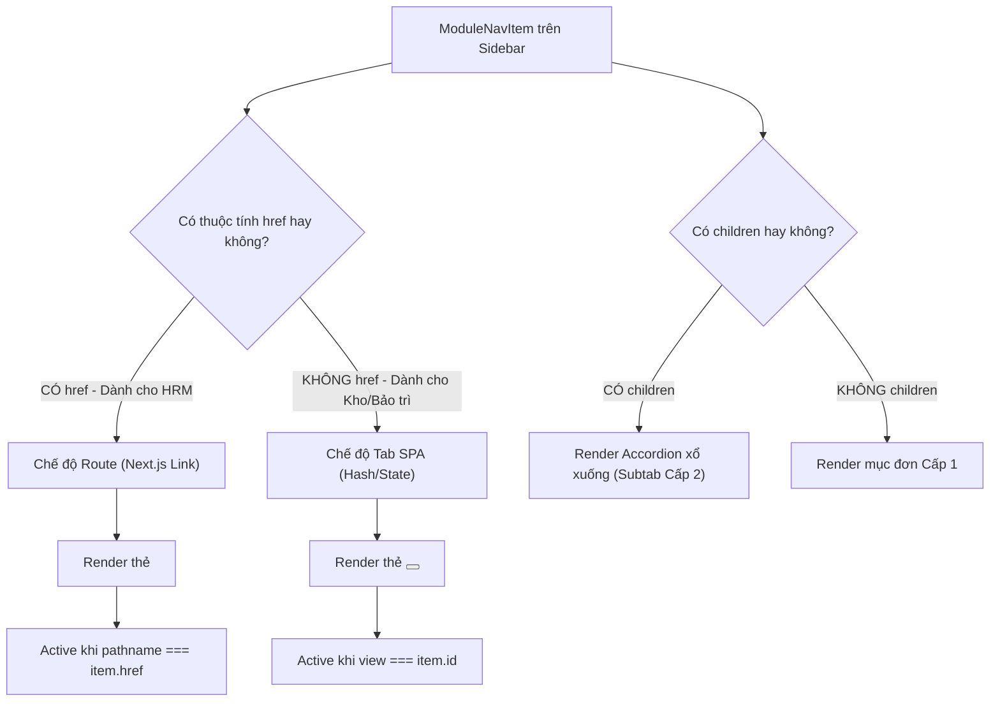

# BÁO CÁO TỔNG HỢP TOÀN DIỆN: ĐỒNG BỘ KIẾN TRÚC SHELL (MODULE SHELL & HRM SHELL)
*Hệ thống Enterprise Platform · Ngày lập: 30/09/2026*

---

## I. BỐI CẢNH & VẤN ĐỀ ĐẶT RA

Nền tảng của chúng ta là mô hình **Monorepo đa ứng dụng (Micro-frontends)** gồm nhiều phân hệ độc lập:
- **Nhóm 1**: Kho (Inventory), Bảo trì (Maintenance), Quy trình (Procedure), Không gian làm việc (Workspace) – dùng chung **`ModuleShell`**.
- **Nhóm 2**: Phân hệ Quản trị nhân sự (HRM & Chấm công) – sử dụng riêng **`HrmShell`**.

### Câu hỏi đặt ra:
1. *Tại sao lại có 2 hệ vỏ shell và chúng đang hoạt động ra sao?*
2. *Header bar hiện tại là riêng lẻ hay đồng bộ duy nhất?*
3. *Đồng bộ icon Chuông thông báo (Bell) và Avatar người dùng đầy đủ như thế nào?*
4. *Phân định ranh giới ảnh đại diện giữa CORE User và HRM Employee?*
5. *Nên giữ 2 shell riêng, mỗi module tự làm shell riêng, hay quy về 1 ModuleShell duy nhất? Xử lý xung đột giữa URL Hash (`#`) và Next.js Route (`/path`) như thế nào?*

---

## II. ĐẶC ĐIỂM KIẾN TRÚC HIỆN TẠI GIỮA HAI SHELL

| Tiêu chí | `ModuleShell` (Kho, Bảo trì, Quy trình, Workspace) | `HrmShell` (Quản trị Nhân sự & Chấm công) |
| :--- | :--- | :--- |
| **Mô hình điều hướng** | **SPA Hash-based Subviews** (`#assets`, `#items`). Toàn bộ app nằm trong một trang `app/page.tsx` duy nhất. | **Multi-Page App Router** (`/employees`, `/payroll`, `/attendance`, `/profile`...). Các trang là các file vật lý độc lập. |
| **Cấu trúc Sidebar** | 1 cấp phẳng, chia nhóm `group`, chuyển tab bằng state/hash `onViewChange`. | Đa cấp (Accordion cha - con `
`), hỗ trợ các mục "Sắp có" (disabled). |
| **Cơ chế Phân quyền** | Phân quyền mức Module chung. | Tích hợp lớp Context riêng (`HrmPermissionsProvider`), lọc từng route con theo quyền hạt nhân. |
| **Giao diện Top Bar** | Đồng bộ màu sắc Dark Navy `#091426`, Breadcrumb, Title, Profile avatar. |

---

## III. CÁC THAY ĐỔI ĐÃ THỰC THI (QUY CHUẨN MỚI CHO HEADER BAR)

Theo yêu cầu đã thống nhất, Top Bar ở cả 2 Shell đã được cập nhật:
1. **Nút Chuông thông báo (Notification Bell)**:
   - Thêm nút icon Chuông (`Bell`) bo tròn, viền tinh tế nằm ngay bên cạnh cụm Profile.
   - Tích hợp **chấm đỏ chỉ báo trạng thái (Unread Indicator)**, chuẩn bị sẵn sàng cho việc kết nối API thông báo toàn hệ thống.
2. **Avatar Icon & Tên người dùng đầy đủ**:
   - Loại bỏ hoàn toàn 2 ký tự viết tắt (`EP`, `HR`, `AD`...) gây cảm giác viết tắt khó nhận diện.
   - Thay thế bằng **Avatar Icon người dùng (`User`)** chuẩn thiết kế SVG Dark Navy hiện đại.
   - Hiển thị **đầy đủ Họ và Tên** người dùng (`displayName` / `fullName`), kèm vai trò và tên Tenant (`Tenant Admin · SAVINA`).

---

## IV. RANH GIỚI DỮ LIỆU: CORE USER VS. HRM EMPLOYEE

Hệ thống phân định ranh giới dữ liệu rõ ràng theo chuẩn Enterprise IAM:
- **CORE User (Tài khoản người dùng nền tảng)**:
  - Bản chất: Đối tượng đăng nhập (`AuthenticatedPrincipal`), có mặt trên toàn hệ thống (mọi module).
  - Avatar: Ảnh đại diện tài khoản (Profile Picture) hiển thị trên Header Bar, comment công việc. Người dùng được tự do đổi.
- **HRM Employee (Hồ sơ nhân sự pháp lý)**:
  - Bản chất: Đối tượng nhân sự thuộc phòng HR quản lý theo luật lao động.
  - Ảnh hồ sơ: **Ảnh thẻ 3x4 / 4x6 chính thức**, dùng cho in thẻ nhân viên, hợp đồng lao động, bảo hiểm.
  - Dữ liệu mật đi kèm: Ảnh chụp CCCD 2 mặt, hộ chiếu, mã số thuế.
- *(Đã lập kế hoạch lưu trữ chi tiết bằng MinIO S3 & Pre-signed URL tại file `HRM_AVATAR_PLAN.md`)*.

---

## V. PHÂN TÍCH SO SÁNH 2 HƯỚNG TIẾP CẬN VỎ SHELL

### Kịch bản A: Mỗi module tự tách ra một Shell riêng (Decentralized)
- **Ưu điểm**: Các module hoàn toàn tự do biến tấu layout mà không sợ ảnh hưởng module khác.
- **Nhược điểm (Rất nguy hiểm)**: 
  - Trải nghiệm người dùng bị "chắp vá", lệch chuẩn UI theo thời gian.
  - Cơn ác mộng bảo trì: mỗi lần đổi Logo, thêm nút Chuông, thêm tính năng Global Search phải copy-paste sửa ở 5-6 nơi.
- **Kết luận**: **Không nên áp dụng.**

### Kịch bản B: Quy tụ về một Shell chung duy nhất (`ModuleShell`) (Recommended)
- **Ưu điểm**:
  - Nhất quán 100% nhận diện thương hiệu và trải nghiệm người dùng toàn nền tảng.
  - Tối ưu chi phí bảo trì: Sửa 1 lần ở `feature-module-shell` là ăn cho toàn bộ 5 module.
  - Xóa bỏ hơn 400 dòng code trùng lặp của `HrmShell`.
- **Thách thức**: Phải giải quyết được xung đột giữa cơ chế Hash (`#`) của các module cũ và Route trực tiếp (`/path`) của HRM.

---

## VI. GIẢI PHÁP KỸ THUẬT: ĐIỀU HƯỚNG ĐA HÌNH (POLYMORPHIC NAVIGATION)

Để `ModuleShell` gộp được cả HRM mà **không làm hỏng router của HRM** và **không làm vỡ các module cũ**, kiến trúc giải pháp như sau:

### Xử lý chi tiết Subtab Cấp 1 và Cấp 2:
1. **Subtab Cấp 1 (Nhóm cha)**: 
   - Nếu có con: Render dạng Accordion bấm đóng/mở danh sách con, không làm nhảy URL.
   - Nếu là mục đơn: Bấm vào chuyển trang bình thường.
2. **Subtab Cấp 2 (Mục con mang `href`)**:
   - Render bằng `<Link href={child.href}>` trực tiếp.
   - Tự động so sánh với `usePathname()` của Next.js: Nếu route trùng khớp thì mục con sáng đèn và nhóm cha tự động mở ra.
3. **Các module cũ (Kho, Bảo trì, Quy trình)**:
   - Giữ nguyên các mục không có `href`, tiếp tục dùng hash `#` và state nội bộ mà không cần thay đổi bất kỳ dòng code logic nào.

---

## VII. KẾ HOẠCH HÀNH ĐỘNG TIẾP THEO

1. **Bước 1**: Mở rộng `ModuleNavItem` trong `module-shell.types.ts` để hỗ trợ `children?: ModuleNavItem[]`, `href?: string`, `disabled?: boolean`.
2. **Bước 2**: Nâng cấp `NavEntry` trong `module-shell.tsx` hỗ trợ render đệ quy menu cha-con và nhận diện `pathname` của Next.js.
3. **Bước 3**: Chuyển đổi file điều hướng của HRM sang định dạng của `ModuleShell` và gỡ bỏ `HrmShell`.
