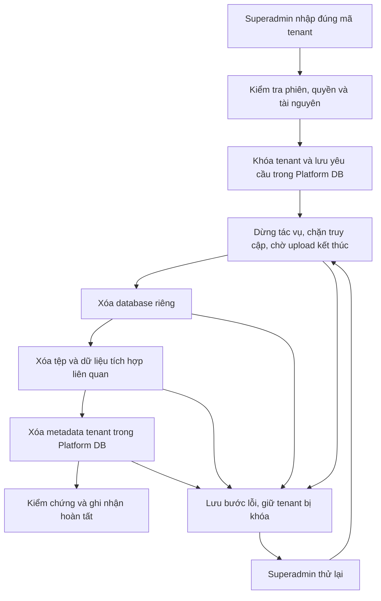

# Kế hoạch triển khai xóa tenant và toàn bộ dữ liệu đang vận hành

Ngày: 15/09/2026. Trạng thái: đã triển khai mã nguồn; hướng dẫn phát hành và điều kiện bật chức năng tại [runbook vận hành](../operations/tenant-deletion.md). Các mục dưới đây ghi lại thiết kế ban đầu. Bản triển khai gộp kiểm chứng vào bước `purge_platform`, dùng session advisory lock và heartbeat để tiếp tục sau khi worker khởi động lại.

## 1. Mục tiêu và phạm vi đã thống nhất

- Chỉ superadmin của hệ thống được khởi tạo, xem chi tiết và thử lại tác vụ xóa tenant.
- Xóa database PostgreSQL riêng của tenant, gồm tài khoản Tenant Core, tổ chức, dữ liệu tất cả module, lịch sử nghiệp vụ và bảng tích hợp trong database đó.
- Xóa tệp của tenant trên S3/MinIO và các bản ghi quản lý tenant tại Platform DB.
- Theo lựa chọn của người dùng: **backup hết hạn theo chính sách lưu trữ hiện có; giữ nhật ký xóa tối thiểu**. Không tạo backup mới tự động cho mỗi lần xóa.
- Không có nút hoàn tác sau khi bắt đầu xóa dữ liệu. Khôi phục từ backup là quy trình vận hành riêng; phải đối chiếu nhật ký xóa trước khi đưa bản phục hồi vào phục vụ.
- Không xóa tài khoản superadmin, dữ liệu tenant khác, danh mục module/role/permission/plan dùng chung hoặc toàn bộ bucket/queue dùng chung.
- Thực hiện từng tenant; không thêm chức năng xóa hàng loạt trong đợt này.

## 2. Hiện trạng đã kiểm tra trong repository

| Thành phần | Hiện trạng | Việc cần bổ sung |
|---|---|---|
| Quản trị tenant | `PlatformAccessController` có tạo, cập nhật, reset mật khẩu và entitlement; chưa có API xóa tenant | API riêng cho tác vụ xóa |
| Superadmin | Seed gán tài khoản quản trị hệ thống `kind = platform-admin`, role `platform-admin`, permission `platform.manage` | Giữ mô hình này, thêm permission chuyên biệt `platform.tenants.delete` |
| Xác thực | `verifyAccessToken()` kiểm tra JWT; `platformAdmin()` kiểm tra `kind` | Kiểm tra phiên, tài khoản và quyền hiện tại trong Platform DB cho toàn bộ API xóa |
| Database | `tenant_db_configs` lưu tên DB, host/port, secret ref; kết nối thực tế lấy từ secret hoặc URL template | Đối chiếu database thực tế với cấu hình và cụm DB được phép trước khi xóa |
| Hàm DROP hiện tại | `dropTenantDatabase()` chỉ phục vụ dọn lỗi tạo tenant; bỏ qua lỗi | Tạo adapter xóa riêng, kiểm chứng kết quả và báo lỗi có thể tiếp tục |
| Lifecycle | Contract tenant chỉ có `active` / `disabled` | Thêm trạng thái đang xóa và xóa lỗi; chặn mọi thao tác bật lại |
| Module API | Procedure, Maintenance, Inventory cache quyết định truy cập 30 giây | Kiểm tra lifecycle hiện tại, loại bỏ quyền truy cập từ cache cũ |
| Kết nối | `PostgresPoolRegistry` chưa có đóng riêng tenant; `TenantDatabaseRegistry` chưa có unregister | Bổ sung đóng toàn bộ phiên bản pool và gỡ reference theo tenant |
| Tác vụ nền | Worker xử lý provisioning/outbox; migrator có luồng provisioning/upgrade riêng | Phối hợp khóa theo tenant với cả worker và migrator |
| Maintenance | Scheduler mỗi 60 giây duyệt registry trong bộ nhớ | Kiểm tra tenant còn hoạt động trước generate/reconcile |
| Tệp | Ba module dùng prefix `tenants/{tenantId}/...`; URL upload hiện có TTL 300 giây | Xóa prefix, phiên bản object và multipart; xử lý URL upload đã cấp |
| Lưu trữ | `ObjectStoragePort` hiện chỉ có upload/download/put | Bổ sung adapter cleanup và khả năng kiểm tra rỗng |
| Kiểm thử | API e2e hiện mới kiểm tra readiness; web e2e chủ yếu kiểm tra cổng đăng nhập | Bổ sung kiểm thử xóa thật trong hạ tầng test độc lập |

Các nguồn chính trong repository:

- [Controller quản trị](../../packages/platform/identity/src/lib/platform-access.controller.ts), [Identity service](../../packages/platform/identity/src/lib/platform-identity.service.ts), [Contract tenant](../../packages/contracts/tenancy/src/lib/contracts-tenancy.ts).
- [Schema Platform](../../migrations/platform/0001-platform.sql), [session và reset token](../../migrations/platform/0004-tenant-password-reset.sql), [migrator và seed](../../apps/migrator/src/main.ts).
- [Worker](../../apps/worker/src/main.ts), [provisioning processor](../../packages/platform/entitlement/src/lib/tenant-provisioning.processor.ts), [Maintenance scheduler](../../packages/modules/maintenance/src/lib/maintenance.module.ts).
- [Database adapter](../../packages/adapters/database/src/lib/adapter-database.ts), [storage adapter](../../packages/adapters/storage/src/lib/adapter-storage.ts), [UI tenant](../../apps/web/src/app/platform/tenant-management.tsx).

## 3. Phương án kiến trúc

API chỉ xác thực, kiểm tra điều kiện, khóa tenant và ghi nhận yêu cầu bền vững vào Platform DB. Worker hiện có thực thi các bước xóa. Trạng thái lưu trong DB để tiếp tục được sau khi API/worker khởi động lại; không cần thêm hệ thống hàng đợi mới.

Database tenant, Platform DB và object storage không có transaction chung. Vì vậy phải lưu tiến độ từng bước; không thể coi rollback Platform DB là khôi phục database đã xóa. PostgreSQL không cho chạy `DROP DATABASE` trong transaction block. [Tài liệu PostgreSQL 17](https://www.postgresql.org/docs/17/sql-dropdatabase.html).

### 3.1. Trạng thái và dữ liệu điều phối

- Tenant: `active | disabled | deleting | deletion_failed`. `UpdateTenantRequest` vẫn chỉ cho cập nhật trạng thái thông thường; client không tự đặt trạng thái xóa.
- Job: `pending | processing | failed | completed`; tiến độ riêng: `quiesce`, `drop_database`, `purge_storage`, `purge_integration`, `purge_platform`, `verify`.
- Thêm migration Platform kế tiếp, dự kiến `0006-tenant-deletion.sql`, đăng ký tường minh trong `apps/migrator/src/main.ts`.
- Bảng `integration_schema.tenant_deletion_jobs`: UUID job/tenant, actor, thời điểm yêu cầu, idempotency key và hash request, bước hiện tại, số lần thử, thời điểm chạy lại, lease/heartbeat, lỗi đã loại bỏ thông tin bí mật, mốc hoàn tất từng bước.
- Lưu snapshot bất biến của tài nguyên cần xóa: cluster được quản lý, database name/OID, config version, các storage location/prefix. Chỉ lưu tham chiếu secret, không lưu mật khẩu hoặc connection URL. Xóa snapshot nhạy cảm khi hoàn tất.
- Job không có FK bắt buộc tới tenant để vẫn theo dõi được sau khi bản ghi tenant biến mất. Ràng buộc duy nhất theo tenant ngăn tạo hai quy trình xóa.
- Giữ bản ghi tối thiểu xác nhận tenant đã bị xóa, gồm tenant UUID, job UUID, actor UUID, mốc thời gian, kết quả và chính sách backup. Bản ghi này cũng giúp từ chối event cũ và đối chiếu khi phục hồi backup.
- Claim job bằng khóa hàng, có lease và mã phiên thực thi. Worker cũ hết lease không được ghi tiến độ hoặc tiếp tục thao tác; các bước ngoài DB phải kiểm tra lease và tài nguyên trước khi chạy. Dùng advisory lock theo tenant trên một connection Platform được giữ cho lượt thực thi để chỉ một executor thao tác; provisioning/migrator dùng cùng quy ước khóa. Mất connection khóa phải dừng lượt thực thi, không chỉ chờ heartbeat tiếp theo.
- Giới hạn job đồng thời, mặc định một tenant mỗi worker. Chờ upload bằng `next_run_at`, không giữ worker ngủ hay giữ transaction mở nhiều phút.

### 3.2. Quyền superadmin

1. JWT hợp lệ; tài khoản còn `active`, `kind = platform-admin`.
2. Session thuộc đúng tài khoản, chưa hết hạn/chưa bị thu hồi.
3. Quyền `platform.tenants.delete` được đọc lại từ role có `scope = platform`, assignment không gắn membership tenant.
4. Với request thay đổi dữ liệu: CSRF header khớp cookie và hash CSRF của session.
5. API nhận tenant UUID; backend lấy target từ registry. Không nhận SQL, database name, host, secret hoặc storage prefix tùy ý từ client.
6. `confirmSlug` phải khớp slug hiện tại ở backend; việc khóa nút ở UI không thay thế kiểm tra này.

**Điểm cần sửa cùng migration/seed:** seed hiện cấp tenant-admin mọi permission khác `platform.manage`. Nếu thêm permission mới mà giữ điều kiện này, tenant-admin sẽ nhận cả quyền xóa. Thay bằng danh sách permission phù hợp từng scope; migration phải cấp quyền xóa cho role platform-admin hiện hữu và bảo đảm không cấp cho role tenant. Không dựa vào email `superadmin@...` hay UUID seed để xác định quyền.

Không bổ sung loại tài khoản thứ ba trong đợt này: `platform-admin` hiện là superadmin theo mô hình của dự án. Các API nội bộ dùng service token không được phép khởi tạo/retry việc xóa. Job đã được superadmin chấp nhận có thể tiếp tục bằng service identity khi phiên người dùng hết hạn.

### 3.3. Kiểm tra đúng database trước khi khóa/xóa

- Chỉ xử lý database thuộc cluster tenant đã cấu hình ở server. Đợt đầu hỗ trợ cluster hiện được quản lý bởi `TENANT_DATABASE_ADMIN_URL`; tenant trỏ cluster khác trả lỗi chưa hỗ trợ, không phỏng đoán target.
- Chuẩn hóa và so khớp endpoint thực tế từ secret với registry. Các alias Docker/public hostname chỉ hợp lệ khi có mapping cấu hình được quản lý; không chỉ so sánh chuỗi tên DB.
- Xác thực database thuộc duy nhất tenant mục tiêu; kiểm tra trùng target giữa các cấu hình. Snapshot database OID/config version; kiểm tra lại ngay trước thao tác và khi retry để không xóa DB khác vừa được tạo cùng tên.
- Chặn Platform DB, DB quản trị kết nối hiện tại, `postgres`, `template0`, `template1`, mọi template và danh sách DB được bảo vệ. Kiểm tra định danh và quote identifier an toàn ở adapter.
- Kết nối bằng credential quản trị từ server tới database quản trị của đúng cluster; credential phải có quyền sở hữu/xóa DB và dừng connection cần thiết. Không cấp credential này cho frontend.
- Tenant mất/sai cấu hình hoặc DB không tồn tại ngay từ yêu cầu đầu phải qua xử lý đối soát; không mặc định báo xóa thành công. Khi retry, DB đã biến mất chỉ được coi là bước hoàn tất nếu target đã được xác minh và snapshot trước đó còn khớp cluster.
- Giữ slug và tài nguyên target được đặt chỗ cho tới khi job hoàn tất. Luồng tạo tenant cũng phải kiểm tra reservation; job cũ đã completed không được chạy DROP lại.

### 3.4. Trình tự thực thi

**A. Chấp nhận yêu cầu — một transaction Platform DB**

- Khóa hàng tenant; xác thực trạng thái/config version sau preflight.
- Tạo hoặc lấy job theo idempotency key; cùng key khác nội dung trả `409`.
- Đặt tenant `deleting`, database config sang trạng thái chặn sử dụng; thu hồi tenant sessions và reset tokens; chặn cập nhật, cấp module, import và cấp session mới.
- Hủy provisioning chưa chạy; ghi audit `platform.tenant.deletion.requested`. Commit rồi trả `202 Accepted`.

**B. Dừng truy cập và công việc đang chạy**

- Login/refresh, Tenant Core, access-decisions và API service-to-service phải kiểm tra trạng thái tenant/config hiện tại. Chặn cả direct URL và đường import; không chỉ ẩn menu.
- Đợt đầu bỏ cache quyết định `allowed` tại ba module guard để mỗi request được đối chiếu Platform. Khi Platform không truy cập được, từ chối truy cập. Có thể tối ưu cache sau khi đo tải, nhưng phải giữ bảo đảm thu hồi.
- Bổ sung `closeTenant(tenantId)` cho mọi phiên bản pool và `unregister(tenantId)` cho reference. Mỗi instance tự kiểm tra lifecycle khi sử dụng/chạy nền, gỡ reference và đóng pool khi tenant không còn hoạt động; không phụ thuộc một event chỉ được giao cho một replica.
- Maintenance scheduler, outbox relay, provisioning worker, migrator và import đều dùng chung quy tắc khóa/lifecycle theo tenant. Tác vụ provisioning đang chạy phải hoàn tất hoặc được dừng có kiểm soát; trạng thái entitlements không được ghi ngược thành active sau khi tenant bị khóa.
- Các request/tác vụ đã bắt đầu trước thời điểm khóa được drain với thời hạn. Trước DROP, chặn connection mới ở PostgreSQL đối với riêng target rồi dừng connection còn lại; không terminate connection của tenant khác.
- Ngăn tạo session/token hoặc event mới sau bước khóa bằng điều kiện trạng thái bên trong transaction tương ứng; các bước cleanup cuối quét lại để bắt race đã bắt đầu trước đó.

**C. Xử lý tệp đang upload**

- Dừng cấp URL upload và server-side upload; bao phủ cả URL đã cấp trước khi tenant khóa.
- Đợt đầu dùng cửa sổ chờ có giới hạn sau khi bên cấp URL đã drain: TTL URL tối đa + thời lượng upload tối đa được cưỡng chế ở ingress + sai số đồng hồ. TTL hiện là 300 giây; đưa thành cấu hình chung, không hard-code ở job.
- Chỉ cho đi tiếp khi hạ tầng chứng minh không còn đường upload bỏ qua giới hạn ingress. Nếu không bảo đảm được, cần cơ chế từ chối ghi theo tenant tại storage trước khi bật chức năng; báo lỗi điều kiện vận hành thay vì báo xóa xong.
- Hết hạn URL không có nghĩa mọi request đã bắt đầu đều kết thúc. Do đó cần kiểm thử upload bắt đầu sát hạn và quét storage sau cửa sổ drain. Đây là lý do job có thể chờ vài phút. [Tài liệu presigned URL](https://docs.aws.amazon.com/AmazonS3/latest/userguide/using-presigned-url.html).

**D. Xóa database**

- Adapter kết nối DB quản trị, ngoài transaction Platform, đối chiếu lại target và kiểm tra lease.
- Dùng `DROP DATABASE ... WITH (FORCE)` sau khi đã chặn truy cập. Xác minh target không còn trong catalog trước khi đánh dấu bước hoàn tất.
- `FORCE` vẫn có thể thất bại do quyền, prepared transaction hoặc logical replication. Ghi mã lỗi rõ ràng, giữ tenant bị khóa, yêu cầu xử lý rồi retry; không nuốt exception như hàm cleanup hiện tại. [Tài liệu PostgreSQL 17](https://www.postgresql.org/docs/17/sql-dropdatabase.html).

**E. Xóa tệp và dữ liệu tích hợp**

- Duyệt tất cả storage location đã xác minh, xóa đúng prefix `tenants/{tenantUUID}/` kể cả object không còn metadata trong DB. Không xóa theo slug hay prefix thiếu dấu `/` kết thúc.
- Phân trang, xóa theo batch, kiểm tra lỗi từng object. Với bucket có versioning, xóa version và delete marker; abort multipart chưa hoàn tất. S3 hỗ trợ tối đa 1.000 key mỗi `DeleteObjects` và trả kết quả từng key. [Tài liệu DeleteObjects](https://docs.aws.amazon.com/AmazonS3/latest/API/API_DeleteObjects.html).
- Kiểm chứng tương thích trên đúng phiên bản MinIO đang triển khai. Storage location thiếu quyền, object bị giữ bởi retention hoặc không xác minh được rỗng khiến job failed; không dùng thao tác bypass retention tự động.
- Dọn platform outbox theo `payload.tenantId` được kiểm tra chính xác; lấy các event ID trước để dọn inbox tương ứng. Không xóa outbox/inbox của tenant khác.
- Consumer từ chối event của tenant đang/đã xóa và acknowledge để không tái tạo dữ liệu. Với backlog/DLQ có payload tenant, bổ sung cleanup chọn lọc theo tenantId trên danh sách queue đã khai báo; bảo toàn message của tenant khác, headers và cơ chế chống xử lý lặp. Nếu phải chuyển message qua queue tạm, dùng publisher confirm trước khi acknowledge bản gốc và chấp nhận delivery lặp qua idempotency; không coi snapshot queue rỗng là đủ khi còn message chưa acknowledge. Không purge cả queue dùng chung. Kiểm thử cả event được publish sát thời điểm khóa.

**F. Dọn Platform DB và hoàn tất**

- Trong transaction có khóa tenant/job: xóa reset tokens, tenant sessions, admin directory, entitlement/subscription, provisioning jobs, role assignments theo membership, rồi memberships và database config.
- Với `identity_schema.users` lịch sử: chỉ xóa `kind = tenant-user` khi không còn membership/assignment hoặc tham chiếu dùng chung nào. Thu thập ứng viên trước khi xóa membership; dọn auth sessions/role assignments của tài khoản độc quyền theo đúng FK. Khóa ứng viên để tránh race gán membership mới.
- Session kiểu cũ không có tenantId: thu hồi những session gắn với người thuộc tenant để chặn token cũ; với tài khoản còn tenant khác, giữ account/membership khác và chấp nhận cần đăng nhập lại. Không xóa user còn sử dụng ở tenant khác.
- Xóa audit nghiệp vụ của tenant; giữ riêng nhật ký điều phối xóa tối thiểu. Không giữ email, tên tệp, mật khẩu, URL có chữ ký hoặc payload dữ liệu nghiệp vụ trong nhật ký xóa.
- Xóa hàng tenant cuối cùng. Với schema cũ, kiểm tra migration `0005` đã loại bỏ organization dùng chung; FK không dự kiến phải làm transaction thất bại để đối soát, không tự cascade toàn schema.
- Sau các bước kiểm chứng, ghi `completed` và audit hoàn tất. API trạng thái tra theo job ID, vẫn hoạt động khi hàng tenant đã bị xóa. Nếu crash giữa xóa metadata và xác nhận cuối, snapshot/job còn lại cho phép tiếp tục kiểm chứng.

### 3.5. Lỗi, retry và giới hạn hoàn tác

- Lỗi trước khi request được commit: không thay đổi tenant.
- Lỗi sau khi request được chấp nhận: tenant giữ `deletion_failed`, database config vẫn bị chặn; không tự mở lại tenant, kể cả DB vẫn còn.
- Retry lỗi tạm thời có backoff/giới hạn; lỗi sai target, quyền hoặc điều kiện storage cần superadmin xử lý nguyên nhân rồi thử lại.
- Mỗi bước có checkpoint và kiểm chứng idempotent. Crash ngay sau DROP nhưng trước checkpoint, object đã xóa một phần, hoặc metadata cleanup đã commit đều phải tiếp tục được.
- Hoàn tất nghĩa là dữ liệu đang vận hành đã được kiểm chứng xóa; backup đang giữ theo chính sách được trình bày riêng. Không tuyên bố backup đã bị xóa hay tự đặt một thời hạn retention chưa có cấu hình.

## 4. API đề xuất

Tất cả endpoint dưới đây nằm sau guard superadmin và kiểm tra session hiện tại.

| Method và đường dẫn | Nội dung |
|---|---|
| `GET /api/platform/v1/tenants/:tenantId/deletion-preview` | Tên/mã tenant, phạm vi ảnh hưởng, trạng thái kiểm tra tài nguyên, chính sách backup, preview token/config version; không thay đổi dữ liệu |
| `POST /api/platform/v1/tenants/:tenantId/deletion` | Body `{ confirmSlug, previewToken }`, header `Idempotency-Key`, CSRF; trả `202` với `{ jobId, status, step, statusUrl }` |
| `GET /api/platform/v1/tenant-deletions/:jobId` | Tiến độ, mốc thời gian, lỗi đã lọc, `retryable`; còn truy cập được sau khi tenant đã xóa |
| `POST /api/platform/v1/tenant-deletions/:jobId/retry` | Chỉ tiếp tục job failed; yêu cầu quyền, phiên và CSRF như lần đầu |

Preview token ngắn hạn gắn với tenant, actor/session và config version. Backend kiểm tra lại điều kiện khi nhận POST; preview không phải quyền xóa. Lặp cùng yêu cầu trả cùng job; request tới tenant đang xóa trả job hiện tại. Mã lỗi phân biệt `401`, `403`, `404`, `409` do thay đổi trạng thái/preview cũ và lỗi cấu hình tài nguyên. Các route job áp dụng kiểm tra quyền trước khi tra dữ liệu.

## 5. Giao diện và trải nghiệm

- Tại `/platform/tenants`: thêm hành động **Xóa vĩnh viễn**; chỉ hiển thị khi principal có quyền xóa. Trang server truyền capability tới `TenantManagement`.
- Chọn tenant để xem phạm vi ảnh hưởng ở vùng chi tiết; nút xóa dùng `Popconfirm` của `@enterprise-platform/shared-ui`, màu danger và `confirmInput` yêu cầu nhập chính xác slug.
- Nội dung xác nhận: database, tất cả module, tài khoản tenant và tệp sẽ bị xóa; không hoàn tác tại đây; backup hết hạn theo chính sách.
- Component hiện chỉ gọi `onConfirm()` không truyền giá trị input. Bổ sung callback tương thích ngược để gửi giá trị người dùng thực nhập cho API, không tự điền slug cố định vào request.
- Sau `202`: hiển thị **Đang xóa**, bước đang xử lý; khóa sửa tenant/reset mật khẩu/entitlement/import. Poll job có backoff, tiếp tục hiển thị được sau refresh trang; không báo thành công ngay khi API nhận yêu cầu.
- Khi lỗi: trạng thái **Xóa chưa hoàn tất**, mô tả bước lỗi và nút **Thử lại** dành cho superadmin. Có Drawer 580–720px xem lịch sử tác vụ; không lộ connection URL hoặc secret ref.
- Khi completed: loại tenant khỏi danh sách hoạt động, cập nhật thống kê; lịch sử vẫn xem được bằng job ID.
- Theo skill `ui-design`: shadcn/ui + Tailwind, tái sử dụng component có sẵn; bố cục danh sách/chi tiết hai cột và cuộn độc lập trên màn hình ngang, thu gọn trên mobile. Không thay toàn bộ trang thành thư viện bảng mới chỉ để thêm nút xóa.

## 6. Phân chia triển khai

| Giai đoạn | Thay đổi chính | Điều kiện hoàn tất |
|---|---|---|
| 1. Contract, schema, quyền | `contracts-tenancy`, migration Platform, migrator seed, guard xác thực trực tiếp | Quyền không lọt sang tenant-admin; job lưu bền vững, không bị cascade |
| 2. Khóa lifecycle | Identity/Tenant Core, ba module guards, import, maintenance scheduler, provisioning/upgrade, pool registry | Tenant bị chặn trên tất cả đường truy cập và tác vụ nền, race có kiểm thử |
| 3. API và worker xóa | Controller/service điều phối trong platform identity/tenancy; processor trong platform tenancy; worker, DB/storage/events adapter | Xóa thật, đúng target, tiếp tục được sau crash/lỗi từng bước |
| 4. UI | Trang tenant, Popconfirm dùng chung, Drawer trạng thái, bộ lọc/thống kê | Superadmin thực hiện trọn luồng; tenant-admin không thao tác được |
| 5. Kiểm thử và phát hành | Test tích hợp/e2e, cấu hình Docker/Coolify, quyền worker, runbook | Nghiệm thu trên staging có nhiều tenant và upload đang chạy |

Tách điều phối xóa khỏi file `PlatformIdentityService` đang lớn. Tận dụng package `platform-tenancy`, worker và adapter sẵn có; chỉ bổ sung module/provider/exports cần thiết. Những thay đổi dependency phải dùng package manager workspace theo hướng dẫn repository.

Ước lượng sơ bộ: **8–12 ngày công kỹ thuật** nếu staging, quyền PostgreSQL/MinIO và giới hạn ingress đã sẵn sàng. Chưa bao gồm thời gian chờ hạ tầng hoặc xử lý cấu hình tenant cũ không nhất quán; điều kiện storage và broker có thể làm tăng khối lượng. Có thể nghiệm thu riêng từng giai đoạn, nhưng chỉ bật xóa khi hoàn tất cả 5.

## 7. Kiểm thử và tiêu chí nghiệm thu

### Phân quyền

- Không đăng nhập, JWT giả/hết hạn, session đã logout/revoke, tài khoản disabled: bị từ chối.
- Tenant user, tenant-admin, principal giả permission, service token, platform-admin thiếu quyền: không tạo/xem/retry job.
- Thiếu/sai CSRF, sai confirmSlug, preview hết hạn/thay config, lặp idempotency key với body khác: không xóa.
- Seed/migration chạy lại vẫn không cấp `platform.tenants.delete` cho role tenant.

### Xóa thực tế và cách ly tenant

- Fixture ít nhất tenant A và B, có DB/tệp/session/module/event dữ liệu khác nhau; xóa A, B còn đọc/ghi và đăng nhập bình thường.
- Kiểm chứng DB A không còn trong catalog; mọi schema module biến mất, các bảng Platform được dọn; superadmin và danh mục chung còn nguyên.
- Prefix A rỗng cả versions/delete markers/multipart; hơn 1.000 object, file mồ côi, lỗi một object, prefix gần giống B và nhiều storage location đều có test.
- Từ chối DB Platform/template/DB quản trị, DB dùng chung, target ngoài cluster, secret trỏ sai endpoint, identifier không hợp lệ và DB mới trùng tên với target cũ.
- User legacy còn membership ở tenant B được giữ; FK không bị phá.

### Đồng thời và khôi phục tác vụ

- Hai superadmin bấm xóa; retry HTTP do timeout; hai worker claim cùng tenant; worker cũ hết lease quay lại.
- Crash ngay trước/sau DROP, sau một batch storage, trước/sau commit metadata; lỗi timeout, thiếu quyền, job bị kẹt.
- Race với bật lại tenant, cấp module, migrator, import, login/refresh, API đang xử lý, maintenance scheduler và outbox publish.
- Replica giữ allow cache cũ không tiếp tục cấp quyền; DB pool được đóng; event muộn/DLQ không tái tạo dữ liệu và cleanup không làm mất event tenant B.
- Upload bắt đầu trước khi khóa, sát thời điểm URL hết hạn, và upload dài đều không làm xuất hiện tệp sau completed.
- Refresh UI theo dõi lại đúng job; API `202` không bị hiển thị thành đã xóa; failed không bị hiển thị thành tạm khóa có thể bật lại.
- Backup không bị tác vụ xóa tác động; quy trình restore kiểm tra sổ xóa mới nhất được lưu độc lập với bản backup đang phục hồi trước khi mở dịch vụ. Không dùng sổ xóa cũ vừa khôi phục cùng backup để quyết định bật lại tenant.

### Cách chạy kiểm tra khi triển khai

Đã xác minh project/target bằng `pnpm nx show projects --json` và `pnpm nx show project <name> --json`. Chạy lint/test/typecheck qua Nx cho đúng các target tồn tại; web hiện không có target typecheck riêng, dùng build của web để kiểm tra. Thêm suite tenant deletion vào API/web e2e và test processor/adapter; không chỉ thêm mock xác nhận gọi DROP.

Hạ tầng test phải là PostgreSQL 17 và MinIO/RabbitMQ độc lập, dùng database/prefix riêng có allowlist test. Không chạy test phá hủy vào database đang phát triển hoặc production. Sau thay đổi React, áp dụng skill `react-doctor`; dùng skill `nx-run-tasks` khi thực sự chạy các target. Trong lần lập kế hoạch này chỉ đọc code/cấu hình và tài liệu; chưa chạy test hoặc câu lệnh xóa dữ liệu.

## 8. Phát hành và vận hành

1. Thêm feature flag phía server, mặc định tắt; migration có thể triển khai trước mà không chạy job xóa.
2. Sửa seed/RBAC và triển khai lifecycle guard tới toàn bộ API, scheduler, worker, migrator trước khi bật endpoint xóa. Không để replica phiên bản cũ tiếp tục chạy.
3. Kiểm tra mapping DB, quyền worker, cấu hình S3 endpoint/bucket của từng module, versioning, backlog/DLQ và thời hạn upload được cưỡng chế. Định nghĩa rõ thời hạn backup đang áp dụng trên màn hình; chưa có chính sách thì hiển thị chưa cấu hình, không bịa số ngày.
4. Thử trên staging bằng tenant thử nghiệm, gồm kịch bản worker restart và tenant B vẫn hoạt động. Kiểm tra không ghi secret/payload tenant vào log vận hành.
5. Bật feature cho superadmin; theo dõi job failed/quá hạn lease, thời lượng từng bước, số DB/object còn lại và queue cleanup. Runbook mô tả lỗi nào retry, lỗi nào cần xử lý tài nguyên trước.
6. Khi cần dừng phát hành: tắt nhận yêu cầu mới; giữ worker tương thích để hoàn tất tác vụ đã nhận hoặc tiếp tục sau sửa lỗi. Rollback code không phục hồi database/tệp đã xóa; không triển khai lại code cũ bỏ qua trạng thái deleting khi còn job chưa xong.

**Định nghĩa hoàn tất:** tenant bị loại khỏi hệ thống phục vụ, database và tệp đang vận hành đã xóa và kiểm chứng, metadata/session/event của tenant được xử lý theo phạm vi trên, tenant khác không bị ảnh hưởng, chỉ còn backup theo retention và nhật ký xóa tối thiểu.
