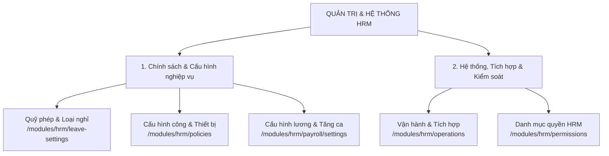

# TỔNG HỢP CHỨC NĂNG QUẢN TRỊ & HỆ THỐNG PHÂN HỆ HRM
> **Dự án**: Enterprise Platform  
> **Phân hệ**: HRM (Human Resource Management)  
> **Phiên bản tài liệu**: 1.0  
> **Ngày cập nhật**: 05/10/2026  

---

## I. ĐÁNH GIÁ TỔNG QUAN VỀ TÍNH SẴN SÀNG VẬN HÀNH

### Kết luận: **ĐÃ ĐỦ NĂNG LỰC VẬN HÀNH CHO DOANH NGHIỆP TỪ QUY MÔ VỪA ĐẾN LỚN (SME & ENTERPRISE)**

Hệ thống quản trị HRM được thiết kế với kiến trúc chuẩn doanh nghiệp, đáp ứng đầy đủ các tiêu chuẩn khắt khe về:
1. **Tuân thủ Luật Lao động**: Phép thâm niên, tăng ca ban đêm/ngày nghỉ, bảo hiểm, giảm trừ gia cảnh, phép chuyển năm.
2. **Kiểm soát & Chống gian lận**: Chấm công 3 lớp bảo vệ (Dải IP mạng nội bộ + Bán kính GPS Geofencing + Định danh thiết bị 1-1).
3. **Tính toàn vẹn dữ liệu (Data Integrity)**: Quản lý theo phiên bản thời gian (Versioning), không xóa đè dữ liệu quá khứ, sổ cái kế toán kép (Dual-entry Ledger) cho quỹ phép, khóa sửa các bản ghi đã chốt kỳ.
4. **Tự động hóa & Khả năng mở rộng**: Tiến trình nền (Background Worker) tự động hóa định kỳ, tích hợp quy trình phê duyệt BPMN Procedure liên module.

---

## II. MA TRẬN 5 PHÂN HỆ QUẢN TRỊ HỆ THỐNG HIỆN CÓ

---

## III. CHI TIẾT TỪNG PHÂN HỆ QUẢN TRỊ

---

### 1. Quản lý Quỹ phép & Loại nghỉ (`/modules/hrm/leave-settings`)
* **Mục đích**: Thiết lập danh mục các hình thức nghỉ phép, định mức thâm niên, theo dõi sổ cái quỹ phép và quy chế chuyển phép cuối năm.
* **Cơ chế điều hướng**: Giao diện chuẩn **3 Tab cấp trang** đồng bộ với URL (`?tab=...`):

| Tab | Chức năng chi tiết | Ý nghĩa nghiệp vụ |
| :--- | :--- | :--- |
| **`types` (Danh mục loại nghỉ)** | • Khai báo không giới hạn loại phép (Phép năm, ốm, thai sản...). • Đơn vị tính: **Ngày** hoặc **Giờ**. • Thiết lập chế độ: Có hưởng lương, Có trừ quỹ phép, Hạn mức ứng âm phép. • Hạn mức và tháng hết hạn phép chuyển năm. • **Gộp loại nghỉ (Merge)**: Gom 2 loại phép trùng tên/chính sách, chuyển giao quỹ và đơn sang loại đích an toàn. | Chuẩn hóa quy chế nghỉ phép doanh nghiệp, cho phép tái cấu trúc chính sách mà không làm gián đoạn số liệu lịch sử. |
| **`ledger` (Quỹ & Sổ giao dịch)** | • Quỹ theo năm: Đầu kỳ, Tích lũy, Điều chỉnh, Đã dùng, Giữ chỗ (đơn chờ duyệt), Còn lại. • Sổ cái giao dịch thời gian thực (`ACCRUAL`, `USAGE`, `REFUND`, `ADJUSTMENT`, `CARRYOVER`, `EXPIRE`). • Điều chỉnh quỹ thủ công kèm lý do và ghi nhận kiểm toán. | Minh bạch số dư phép của từng nhân viên; loại bỏ tranh chấp về ngày phép thừa/thiếu. |
| **`schedules` (Lịch cộng & Vận hành)** | • Lập lịch cộng phép định kỳ: Tháng, Quý, Năm. • Phân bổ theo ngày vào làm (Proration). • Cộng thêm ngày nghỉ theo thâm niên (Seniority Bonus). • Toolbar tác vụ: Chốt cộng phép tháng, Chuyển phép năm, Hết hạn phép tồn. | Tự động hóa tính định mức phép tích lũy theo thâm niên làm việc của nhân sự. |

---

### 2. Cấu hình Công & Thiết bị chấm công (`/modules/hrm/policies`)
* **Mục đích**: Cấu hình các điều kiện ràng buộc check-in/check-out, lịch ngày lễ Tết và quản lý danh sách thiết bị chấm công.
* **Cơ chế điều hướng**: Giao diện chuẩn **4 Tab cấp trang** đồng bộ với URL (`?tab=...`):

| Tab | Chức năng chi tiết | Ý nghĩa nghiệp vụ |
| :--- | :--- | :--- |
| **`rules` (Quy định chấm công)** | • Phiên bản chính sách theo mốc ngày (`effective_from` → `effective_to`). • Phạm vi áp dụng: Toàn công ty hoặc nhóm nhân viên chỉ định. • Ràng buộc dải IP mạng nội bộ (`allowedIps`). • Ràng buộc GPS và sai số bán kính tối đa cho phép. • Ràng buộc chấm công trên thiết bị đã được duyệt. | Thiết lập khung kỷ luật chấm công linh hoạt theo từng chi nhánh, văn phòng hoặc dự án. |
| **`calendar` (Lịch làm / OFF / Lễ)** | • Thiết lập chi tiết từng ngày làm, ngày nghỉ tuần, ngày lễ có hưởng lương. • Nạp sẵn danh mục Lịch nghỉ lễ theo năm quy định Nhà nước. • Nhân bản cấu hình ngày nghỉ từ năm trước sang năm mới. | Căn cứ chuẩn xác để hệ thống tính công, tính lương ngày nghỉ và tính hệ số làm thêm giờ. |
| **`sites` (Địa điểm GPS)** | • Khai báo danh sách các văn phòng, chi nhánh, công trường. • Nhập tọa độ GPS (Vĩ độ / Kinh độ) và bán kính check-in hợp lệ (ví dụ: 100m). • Bật / ngừng sử dụng địa điểm. | Geofencing chấm công bằng thiết bị di động cho nhân viên hiện trường / văn phòng. |
| **`devices` (Thiết bị)** | • Danh sách thiết bị nhân viên đã đăng ký chấm công. • Duyệt (`Approve`) thiết bị mới và tự động thu hồi thiết bị cũ. • Thu hồi (`Revoke`) thiết bị khi nhân viên đổi máy hoặc thôi việc. | Ngăn chặn tuyệt đối hành vi chấm công hộ hoặc giả lập thiết bị. |

---

### 3. Cấu hình Lương & Tăng ca OT (`/modules/hrm/payroll/settings`)
* **Mục đích**: Quản lý phiên bản công thức tính lương động, hệ số làm thêm giờ và các tham số lương cá nhân hóa.
* **Cơ chế điều hướng**: Giao diện chuẩn **2 Tab cấp trang** đồng bộ với URL (`?tab=...`):

| Tab | Chức năng chi tiết | Ý nghĩa nghiệp vụ |
| :--- | :--- | :--- |
| **`policies` (Danh sách chính sách)** | • Phiên bản công thức lương (GROSS/NET, giờ công chuẩn). • Component Engine: Thiết lập công thức động cho thu nhập, phụ cấp, giảm trừ, thuế, tạm ứng, thực lĩnh. • Khóa sửa (`Locked`): Bảo vệ các phiên bản đã được tham chiếu tính lương. • Cấu hình Tăng ca (OT): Khung giờ ca đêm, hệ số OT (ngày thường, ngày nghỉ, ngày lễ, ban đêm), trần phút OT theo ngày/tuần/tháng/năm. • Dòng thời gian trực quan lịch sử phiên bản (`PayrollVersionTimeline`). | Tự động hóa quy chế trả lương phức tạp, bảo đảm tính hồi cứu lịch sử lương không bao giờ bị sai lệch. |
| **`inputs` (Tham số lương nhân viên)** | • Thiết lập hồ sơ mức lương cơ bản (GROSS/NET) theo nhân viên và ngày hiệu lực. • Quản lý tham số động: Số người phụ thuộc giảm trừ gia cảnh, Mức đóng bảo hiểm, Thưởng cố định cá nhân. • Bảng tổng hợp tra cứu tham số lương toàn bộ nhân sự. | Cá nhân hóa các yếu tố tiền lương cho từng nhân sự mà không phải sửa công thức tổng thể. |

---

### 4. Vận hành & Tích hợp (`/modules/hrm/operations`)
* **Mục đích**: Trung tâm kiểm soát kỹ thuật hậu trường, tiến trình nền tự động, tích hợp quy trình và an ninh kiểm toán.
* **Cơ chế điều hướng**: Giao diện **3 Tab chuyên sâu**:

| Tab | Chức năng chi tiết | Ý nghĩa nghiệp vụ |
| :--- | :--- | :--- |
| **`automation` (Tác vụ tự động tính phép)** | • Lịch chạy tiến trình nền (Worker) hàng ngày (múi giờ, giờ chạy tự động). • Nút "Chạy đối soát ngay" (Idempotent run - không trùng lặp số liệu). • **Year-End Checklist**: Đếm ngược ngày hết năm, cảnh báo quên bật kết chuyển phép, cảnh báo lệch số dư đầu năm. • Nhật ký lịch sử các lượt chạy worker kèm log chi tiết JSON. | Giảm thiểu 100% công sức tính phép thủ công mỗi tháng và các rủi ro sót phép cuối năm. |
| **`workflow` (Quy trình liên module)** | • Cấu hình chuyển tiếp từng loại đơn (Nghỉ phép, Tăng ca, Đổi ca, Công tác, Giải trình công, Tạm ứng...):   - Duyệt trực tiếp trong HRM.   - Khởi tạo quy trình liên phòng ban qua Procedure BPMN Engine. • Giám sát tiến độ đồng bộ mã đơn và mã quy trình. • Thử lại (`Retry`) khi đơn bị lỗi kết nối hoặc timeout. | Mở rộng khả năng phê duyệt đa cấp độ cho các doanh nghiệp có ma trận thẩm quyền phức tạp. |
| **`audit` (Nhật ký kiểm toán)** | • Sổ cái ghi nhận mọi thao tác: Tạo, sửa, duyệt, hủy, cấu hình chính sách, gộp loại phép. • Bộ lọc theo Hành động (`action`) và Mã đối tượng (`entity_id`). • Lưu vết chi tiết người thực hiện (`actor_id`) và snapshot dữ liệu trước/sau biến động. | Đảm bảo tính minh bạch, đáp ứng các tiêu chuẩn thanh tra lao động và kiểm toán an toàn thông tin (ISO/SOX). |

---

### 5. Danh mục Quyền hạn HRM (`/modules/hrm/permissions`)
* **Mục đích**: Quản trị phân quyền dựa trên vai trò (Role-Based Access Control - RBAC) cho toàn bộ hệ thống HRM.
* **Chức năng chi tiết**:
  * Mã hóa toàn bộ các tác vụ thành permission key độc lập:
    * Chấm công: `hrm.time.configure`, `hrm.timesheet.read`, `hrm.timesheet.manage`
    * Thiết bị: `hrm.device.manage`
    * Quỹ phép: `hrm.leave.read`, `hrm.leave.manage`
    * Tiền lương: `hrm.payroll.read`, `hrm.payroll.configure`, `hrm.salary.manage`
    * Phê duyệt & Tạm ứng: `hrm.request.read`, `hrm.advance.read`
    * Vận hành & Kiểm toán: `hrm.automation.manage`, `hrm.integration.manage`, `hrm.audit.read`
  * Nút **"Tạo vai trò mẫu HRM"**: Nạp nhanh bộ quyền chuẩn doanh nghiệp (HR Manager, Payroll Specialist, Timekeeper, Employee) mà không ghi đè cấu hình hiện hữu.

---

## IV. BẢNG TỔNG KẾT MỨC ĐỘ ĐÁP ỨNG DOANH NGHIỆP

| Tiêu chí Doanh nghiệp | Mức độ đáp ứng | Ghi chú kỹ thuật |
| :--- | :---: | :--- |
| **Tuân thủ Luật Lao động Việt Nam** | **100%** | Đầy đủ quy định thâm niên, tăng ca đêm/lễ, chuyển phép, khấu trừ thuế & bảo hiểm. |
| **Chống gian lận chấm công** | **Xuất sắc** | Kết hợp 3 yếu tố: Geofencing GPS + Dải IP nội bộ + Khóa thiết bị 1-1. |
| **Tự động hóa vận hành** | **Tự động 100%** | Background worker tự động chốt kỳ, tính lũy kế và xử lý phép hết hạn. |
| **Tính nhất quán dữ liệu** | **Xuất sắc** | Versioning theo thời gian, chống ghi đè lịch sử, sổ cái giao dịch chuẩn kiểm toán. |
| **Khả năng tích hợp mở rộng** | **Rất cao** | Sẵn sàng liên kết với BPMN Workflow Engine cho các luồng phê duyệt tập đoàn. |

> **Khuyến nghị mở rộng tương lai (Giai đoạn tiếp theo)**:
> 1. Tích hợp cổng Webhook/API kéo trực tiếp dữ liệu từ máy chấm công vân tay / nhận diện khuôn mặt phần cứng.
> 2. Bổ sung tính năng xuất báo cáo Excel/PDF động theo mẫu biểu đặc thù của từng ngành nghề.
