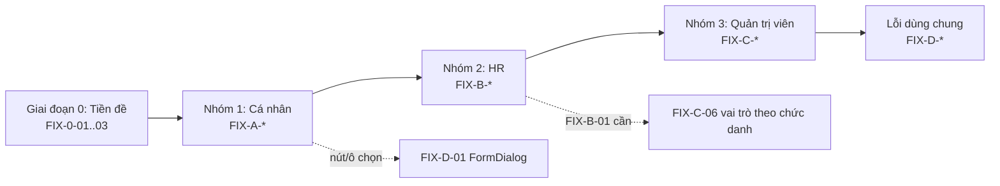

# KẾ HOẠCH SỬA LỖI MODULE HRM - TỔNG QUAN (HRM_FIX_00_OVERVIEW_PLAN.md)

Tài liệu này là mục lục và khung điều phối cho đợt sửa lỗi HRM. Chi tiết từng nhóm nằm ở các tệp con cùng thư mục:

| Tệp | Nhóm | Phạm vi |
| :--- | :--- | :--- |
| `HRM_FIX_01_CANHAN_PLAN.md` | Nhóm 1 - Cá nhân | Hồ sơ, Chấm công, Đơn từ của nhân viên |
| `HRM_FIX_02_HR_PLAN.md` | Nhóm 2 - HR | Quản trị hồ sơ, Bảng công, Bảng lương, Xử lý đơn từ |
| `HRM_FIX_03_QUANTRI_PLAN.md` | Nhóm 3 - Quản trị viên | Chính sách, ca, nghỉ phép, công thức lương, phân quyền, tích hợp |
| `HRM_FIX_04_CHUNG_PLAN.md` | Lỗi dùng chung | Chuẩn UI, kiến trúc backend, test/CI, hạ tầng (làm sau cùng, xen kẽ khi cần) |

---

## 1. Mục tiêu & phạm vi

- Sửa các lỗi HRM đã tổng hợp tại `Tong_hop_loi_HRM.docx`, theo thứ tự **Nhóm 1 (Cá nhân) → Nhóm 2 (HR) → Nhóm 3 (Quản trị viên)**, sau cùng là nhóm lỗi dùng chung.
- Sau khi sửa, chạy lại toàn bộ test case trong `TEST_2026_29_09_bosung_sapxep.xlsx` và đưa số bước **Lỗi (Fail) về 0** cho phần HRM. Các bước **Bỏ qua** do giao diện khác mô tả được xử lý bằng cách chốt thiết kế rồi sửa giao diện hoặc sửa test case (xem mục 7).
- Không mở rộng sang module khác (Inventory, Maintenance, Workspace) trừ khi lỗi HRM phụ thuộc trực tiếp (ví dụ Procedure Engine, shared-ui).

## 2. Nguồn dữ liệu lỗi

| Nguồn | Nội dung | Ghi chú |
| :--- | :--- | :--- |
| `issue.docx` | 231 issue gộp trùng (mã `ISS-UI-*`, `ISS-BE-*`, `ISS-OPS-*`) | Báo cáo review 02/10/2026 trên branch `review/codebase-audit`, tenant SVN |
| `report.docx` | Kết luận, lộ trình 5 đợt, ước lượng công sức | Cùng đợt review |
| `TEST_2026_29_09_bosung_sapxep.xlsx` | 245 bước test, trạng thái chạy thật 03/10/2026 trên nhánh `hai`, tenant `savina` | Mã bước ghi dạng `Test 6.1.8` trong các tệp kế hoạch |
| `Tong_hop_loi_HRM.docx` | Tổng hợp theo nhóm người dùng | Điểm xuất phát của kế hoạch này |

**Lưu ý đối chiếu:** báo cáo review chạy trên branch và tenant khác nhánh `hai`. Mỗi task bắt đầu bằng bước **xác nhận lại lỗi trên nhánh `hai`** (đọc mã hoặc tái hiện). Nếu lỗi đã được sửa thì đóng task và ghi vào bảng theo dõi, không sửa lại.

## 3. Nguyên tắc thực hiện

1. **Một task = một commit** trên nhánh làm việc riêng (ví dụ `hai-fix/<mã-task>`), tiêu đề `fix(hrm): <mô tả ngắn> (<mã task>)`. Không gom nhiều task vào một commit.
2. **Viết test thất bại trước, sửa sau** khi có thể: unit test cho logic thuần, integration test (cần `HRM_TEST_ADMIN_URL`) cho API/SQL, kịch bản Playwright cho luồng giao diện.
3. **Không sửa migration đã áp dụng.** Mọi thay đổi schema hoặc seed là migration mới trong `migrations/tenant/hrm/` (số thứ tự kế tiếp `0021`, kiểm tra không trùng), idempotent (`IF NOT EXISTS`, `ON CONFLICT DO NOTHING`).
4. **Tuân thủ `AGENTS.md`:** chạy tác vụ qua `pnpm nx ...`; giao diện dùng shadcn/ui + Tailwind, `SearchableSelect` cho mọi ô chọn, `Popconfirm` cho thao tác nguy hiểm, `Drawer` 580-720px cho nội dung phụ trợ, Dialog giữa màn hình cho form tạo/sửa; không dùng emoji; ưu tiên component dùng chung của `@enterprise-platform/shared-ui`.
5. **Không đụng dữ liệu thật của người khác khi kiểm thử.** Dữ liệu test dùng tiền tố `QA03-`. Xem mục 8 về dữ liệu đã bị thay đổi trong đợt chạy thử.
6. **Phạm vi kiểm thử mỗi task:** `pnpm nx test module-hrm`, `pnpm nx test feature-hrm`, `pnpm nx lint <project>` cho project bị chạm; chỉ chạy `typecheck`/`build` toàn workspace trước khi bàn giao đợt.

## 4. Thứ tự thực hiện

### 4.1. Giai đoạn 0 - Tiền đề (khoảng 1 ngày, làm trước Nhóm 1)

Hai lỗi nằm ở nhóm Quản trị viên nhưng **chặn việc xác nhận** mọi bước của Nhóm 1 và 2 nên phải xử lý trước:

| Mã | Việc | Lý do |
| :--- | :--- | :--- |
| FIX-0-01 | Dọn chính sách chấm công trùng hiệu lực (dữ liệu + điều tra nguyên nhân) | Đang chặn toàn bộ chấm công và gửi đơn nghỉ trên tenant `savina` |
| FIX-0-02 | Form tạo/sửa ca thêm giờ bắt đầu - kết thúc nghỉ | Không tạo được ca có giờ nghỉ nên không phân ca, không tính công, không khóa kỳ được |
| FIX-0-03 | Chuẩn bị tài khoản và vai trò kiểm thử | Chỉ Bùi Công Quyền có quyền HRM; Thịnh, Thắng, Như Quỳnh chưa vào được |

Chi tiết ba việc tiền đề nằm ở mục 1 của `HRM_FIX_01_CANHAN_PLAN.md`. Phần **chặn tái diễn** của FIX-0-01 (kiểm tra chồng hiệu lực trong mã) nằm ở `FIX-C-01`, làm đúng thứ tự ở Nhóm 3.

### 4.2. Thứ tự các nhóm

Phụ thuộc chéo đáng chú ý:

- `FIX-B-01` (duyệt theo đơn vị, chặn tự duyệt) cần dữ liệu chuỗi quản lý từ sơ đồ tổ chức. Phần mở rộng vai trò theo chức danh (`FIX-C-06`) chỉ làm tiếp sau, không chặn `FIX-B-01`.
- Chuỗi lương `FIX-B-08` chỉ chạy được khi `FIX-0-02` (ca có giờ nghỉ) và `FIX-B-05` (khóa kỳ công) xong.
- `FIX-A-11`, `FIX-A-12` sửa trong `shared-ui` và `hrm-permissions.tsx`, dùng chung cho cả ba nhóm nên làm sớm.

## 5. Bảng tổng hợp task

Mức: C = Critical, H = High, M = Medium, L = Low. Cỡ: S dưới 1 ngày, M 1-3 ngày, L trên 3 ngày (1 dev).

### Giai đoạn 0

| Mã | Tên | Mức | Cỡ | Lỗi nguồn |
| :--- | :--- | :--- | :--- | :--- |
| FIX-0-01 | Dọn chính sách ATTENDANCE trùng hiệu lực | C | S | Test 6.2.1-6.2.5, 7.1.7, 7.1.9 |
| FIX-0-02 | Form ca: giờ bắt đầu - kết thúc nghỉ | H | S | Test 3.2.2, 5.1.7 |
| FIX-0-03 | Tài khoản và vai trò kiểm thử | H | S | Báo cáo mục 3 |

### Nhóm 1 - Cá nhân

| Mã | Tên | Mức | Cỡ | Lỗi nguồn |
| :--- | :--- | :--- | :--- | :--- |
| FIX-A-01 | Bỏ hard-code "Tenant Administrator", tên công ty, ngày thâm niên | H | S | ISS-UI-004 |
| FIX-A-02 | Hồ sơ: trạng thái tải, bỏ dữ liệu giả | M | S | ISS-UI-033 |
| FIX-A-03 | Validate form hồ sơ cá nhân (client + backend) | M | S | Test 6.1.8, ISS-UI-023 |
| FIX-A-04 | Xóa người thân trả 500 | H | S | Test 6.1.11 |
| FIX-A-05 | Tab Phép năm, nút mở JD trong hồ sơ cá nhân | M | M | Test 6.1.4-6.1.6 |
| FIX-A-06 | Chấm công: bộ lọc trạng thái, hiển thị lỗi chính sách | M | S | Test 6.2.7, 6.2.1 |
| FIX-A-07 | "Hôm nay" theo múi giờ Việt Nam | M | S | ISS-UI-018 |
| FIX-A-08 | Binding duyệt mặc định cho tenant mới | H | S | ISS-BE-004, Test 7.1.7 |
| FIX-A-09 | Từ chối đổi ca có Popconfirm, khóa nút khi đang gửi | H | S | ISS-UI-003 |
| FIX-A-10 | Rút đơn: cập nhật trạng thái ngay, bỏ UUID thô | M | S | Test 7.1.5 |
| FIX-A-11 | SearchableSelect: Escape và Enter | H | S | ISS-UI-006 |
| FIX-A-12 | Provider quyền không unmount form khi refresh lỗi | H | S | ISS-UI-007 |
| FIX-A-13 | Form đơn: validate, focus lỗi, khoảng ngày, danh sách đồng nghiệp | M | M | ISS-UI-023 |
| FIX-A-14 | Gắn quyền cho nút Tạo/Lưu nháp/Gửi đơn, route deny-by-default | M | S | ISS-UI-034 |
| FIX-A-15 | Skeleton thay vì "Trống", toast thành công | M | M | ISS-UI-033, ISS-UI-017 |

### Nhóm 2 - HR

| Mã | Tên | Mức | Cỡ | Lỗi nguồn |
| :--- | :--- | :--- | :--- | :--- |
| FIX-B-01 | Duyệt đơn theo đơn vị, chặn tự duyệt, bắt buộc qua Procedure | C | L | ISS-BE-001 |
| FIX-B-02 | Tạo hợp đồng trả 500; ràng buộc ngày kết thúc | C | M | Test 4.3.2-4.3.5 |
| FIX-B-03 | Phân ca: gắn lại panel, lưu ô lịch phòng ban, thông báo trùng | H | M | Test 5.1.2, 5.1.4, 5.1.6 |
| FIX-B-04 | Danh sách nhân sự: phân trang phía server, hợp nhất API người phụ thuộc | M | M | ISS-UI-035, ISS-BE-024, ISS-BE-020 |
| FIX-B-05 | Khóa kỳ công: dòng bất thường, trùng mã kỳ, điều chỉnh ở ma trận | H | M | Test 9.1.6, 9.1.x |
| FIX-B-06 | Log chấm công thô: gắn lại panel, chọn tháng, cột IP/thiết bị/vị trí | M | S | Test 8.3.3 |
| FIX-B-07 | Duyệt giải trình khi đơn đã có Procedure | M | S | Test 8.2.5 |
| FIX-B-08 | Chuỗi lương: chạy lại, decimal, hủy kỳ, thông báo ngân hàng, trạng thái giải ngân | H | L | Test 10.1.x, ISS-BE-022 |
| FIX-B-09 | Màn duyệt: Popconfirm từ chối, phạm vi bước S, lưu Procedure, hủy mềm | H | L | ISS-UI-003, ISS-BE-005, 006, 025 |
| FIX-B-10 | Quy trình động Node S: thuộc tính và rẽ nhánh | H | M | Test 7.4.1-7.4.7 |

### Nhóm 3 - Quản trị viên

| Mã | Tên | Mức | Cỡ | Lỗi nguồn |
| :--- | :--- | :--- | :--- | :--- |
| FIX-C-01 | Chặn chồng hiệu lực chính sách; trường lý do | C | M | Test 3.1.1, 6.2.1 |
| FIX-C-02 | Ba dialog ở màn Ca: nối API hoặc gỡ | H | M | Test 3.1.7-3.1.9 |
| FIX-C-03 | Màn Ca: giá trị mặc định modal sửa, nhãn | L | S | Test 3.2.x |
| FIX-C-04 | Loại nghỉ trùng mã, sổ quỹ phép, kết quả đối soát | M | M | Test 3.3.1, ISS-BE-023 |
| FIX-C-05 | Công thức lương: xóa phiên bản không khôi phục phiên bản trước | H | S | Test 5.3 |
| FIX-C-06 | Phân quyền: picker hrm.*, guard mặc định, menu theo quyền, rate limit | H | L | Test 11.1.2-3, ISS-BE-014, 003 |
| FIX-C-07 | Tích hợp: biến môi trường S3/PROCEDURE_API_URL, 503, khóa tenant, reconnect | H | L | ISS-OPS-001, ISS-BE-002, 010, 064 |

### Lỗi dùng chung

| Mã | Tên | Mức | Cỡ |
| :--- | :--- | :--- | :--- |
| FIX-D-01 | FormDialog, Drawer, Popconfirm, toast, API client dùng chung | H | L |
| FIX-D-02 | Token màu, định dạng ngày/số, nhãn tiếng Việt | M | M |
| FIX-D-03 | Kiến trúc backend: tầng application, zod, bộ lọc lỗi, phân trang | M | L |
| FIX-D-04 | Test, lint, CI cho HRM | M | M |
| FIX-D-05 | Gateway, nâng `next`, README, script seed | M | S |

## 6. Quy trình xác nhận mỗi task

1. Tái hiện lỗi trên nhánh `hai` (bước test hoặc script `tmp/live-test`).
2. Viết test thất bại (nếu có thể) → sửa → test xanh.
3. Chạy lại **đúng bước** trong file test; cập nhật cột B (trạng thái) và cột G (ghi chú, ngày chạy lại).
4. Cuối mỗi nhóm: chạy lại toàn bộ mục test của nhóm đó (chuỗi mục ghi ở đầu từng tệp con) và ghi tổng số Đạt / Lỗi / Bỏ qua.
5. Cuối đợt: `pnpm nx run-many -t lint test -p module-hrm feature-hrm contracts-hrm hrm-api hrm-web`, sau đó `typecheck`/`build` cho các project bị chạm.

Kịch bản Playwright dùng lại thư mục `tmp/live-test/` (đăng nhập, `go()`, `text()`); kịch bản mới của từng task đặt trong `tmp/live-test/<mã-task>/`. Thư mục này không được git theo dõi; kịch bản nào có giá trị lâu dài thì chuyển sang `apps/web-e2e`.

## 7. Quyết định cần chốt trước khi sửa

| # | Câu hỏi | Ảnh hưởng |
| :--- | :--- | :--- |
| 1 | Việc gỡ `HrmRosterPanel` (phân ca đã lưu) và `HrmRawAttendancePanel` (log chấm công thô) khỏi `shifts-screen.tsx` là chủ đích hay nhầm? | `FIX-B-03`, `FIX-B-06`: gắn lại hoặc cập nhật test case |
| 2 | Phạm vi "đơn vị" của người duyệt: theo chuỗi quản lý trực tiếp, theo nút tổ chức (kể cả đơn vị con), hay cả hai? Có cho ngoại lệ tự duyệt cấu hình theo tenant không? | `FIX-B-01` |
| 3 | Hồ sơ cá nhân có cần đủ 6 tab (gồm Phép năm) như test case, hay giữ 3 tab và sửa test case? | `FIX-A-05` |
| 4 | Ba dialog "Lịch chuẩn công ty", "Nghỉ lễ", "Công chuẩn tháng" ở màn Ca: giữ ở màn Ca (nối API) hay chuyển hẳn sang `/policies`? | `FIX-C-02` |
| 5 | Các điểm Bỏ qua do khác nhãn (ví dụ "Duyệt" so với "Duyệt nhanh", "Hủy hiệu lực" so với "Đảo / Hoàn tác"): sửa giao diện hay sửa test case? Đề xuất mặc định: **sửa test case**, trừ khi nhãn gây hiểu nhầm. | Toàn bộ nhóm |
| 6 | Quy trình động Node S: thuộc tính động và rẽ nhánh do ai khai báo (seed hay HR Admin tự thiết kế trên Procedure Engine)? | `FIX-B-10` |

## 8. Dữ liệu cần xử lý sau đợt chạy thử 03/10/2026

Các thay đổi sau nằm ngoài tiền tố `QA03-` hoặc ảnh hưởng dữ liệu có sẵn của tenant `savina`. Cần kiểm tra và hoàn tác thủ công **trước** khi bắt đầu sửa:

| Hạng mục | Chi tiết | Hướng xử lý |
| :--- | :--- | :--- |
| Chính sách chấm công | Một phiên bản mới hiệu lực 03/10/2026 (GPS, thiết bị bắt buộc, sai số 50m) | Xóa hoặc kết thúc phiên bản; xem `FIX-0-01` |
| Đơn có sẵn | Đơn OT của SVN-029 ngày 09/10/2026 từng được duyệt rồi hủy hiệu lực; đơn EMP-ADMIN "test lần 2" bị từ chối; đơn EMP-ADMIN "test nghỉ nữa ngày không lương" được duyệt | Đối chiếu với chủ đơn, khôi phục nếu cần |
| Nháp | Hai nháp "QA03 annual" và "QA03 within2" bị xóa nhầm | Chấp nhận (nháp test) |
| Binding duyệt | Thêm binding "Đơn nghỉ / QA03-SUB / Duyệt trực tiếp" | Xóa |
| Công thức lương | Phiên bản v1 mang ngày kết thúc 2029-12-31 và nhãn "Hết hiệu lực" do tạo rồi xóa v2 | Đặt lại `effective_to = NULL`, xem `FIX-C-05` |
| Quỹ phép | "Cộng phép tháng" 2026-08 ghi 126 giao dịch | Đối chiếu số dư, đảo nếu sai |
| Kỳ lương PR-2026-10 | Thêm "lần tính" run 2 (DRAFT) | Xóa lần tính nháp |
| Tự động tính phép | Bật rồi tắt, giờ chạy hiện là 3 | Đặt lại giờ chạy ban đầu |
| Tenant `qa03` | Tạo mới, import 44 người dùng cùng đuôi `@savina.local` | Xác nhận giữ hoặc xóa (xóa tenant cần bật `TENANT_DELETION_ENABLED`) |
| Hồ sơ Bùi Công Quyền | Email và SĐT từng bị sửa tạm | Đã khôi phục; kiểm tra lại |

## 9. Ước lượng & mốc

| Mốc | Nội dung | Ước lượng (1 dev) |
| :--- | :--- | :--- |
| M0 | Giai đoạn 0 + dọn dữ liệu mục 8 | 1-2 ngày |
| M1 | Nhóm 1 hoàn tất, chạy lại mục test 6, 7.1, 7.2 | 1-1,5 tuần |
| M2 | Nhóm 2 hoàn tất, chạy lại mục test 4, 5, 8, 9, 10, 7.3, 7.4 | 3-4 tuần (FIX-B-01 chiếm 1,5-2 tuần) |
| M3 | Nhóm 3 hoàn tất, chạy lại mục test 1, 2, 3, 11 | 2-3 tuần |
| M4 | Lỗi dùng chung | 3-4 tuần, xen kẽ với M1-M3 theo từng PR nhỏ |

Các ước lượng lấy từ `report.docx` (Critical + High khoảng 6-8 tuần-người) và điều chỉnh theo phạm vi riêng HRM.

## 10. Tiêu chí hoàn thành đợt sửa

- Không còn bước **Lỗi (Fail)** thuộc HRM trong file test; mọi bước **Bỏ qua** có lý do rõ (đã chốt thiết kế).
- `ISS-BE-001` có test integration chứng minh: duyệt khác đơn vị bị 403, tự duyệt bị 403, đơn có Procedure không duyệt thẳng được.
- Không còn khả năng tồn tại hai chính sách cùng loại hiệu lực chồng nhau (có ràng buộc + test).
- Lint và test của `module-hrm`, `feature-hrm`, `contracts-hrm` xanh; các suite integration không bị skip trên CI.
