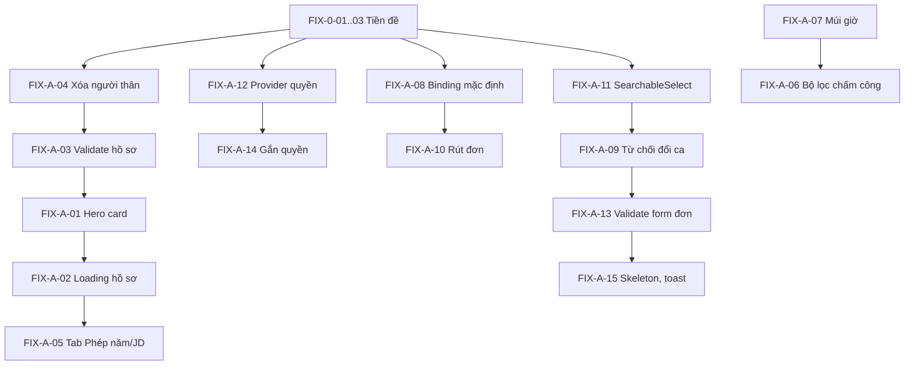

# KẾ HOẠCH SỬA LỖI NHÓM 1 - CHỨC NĂNG CÁ NHÂN (HRM_FIX_01_CANHAN_PLAN.md)

Phạm vi: các màn hình nhân viên tự sử dụng - **Hồ sơ của tôi** (`/modules/hrm/profile`), **Chấm công** (`/attendance`), **Đơn từ & Yêu cầu** (`/requests`), **Lịch & Thông báo** (`/calendar`), **Phiếu lương** (`/payslips`). Kèm **Giai đoạn 0 - Tiền đề** (mục 1) vì các việc này chặn việc xác nhận mọi task trong nhóm.

Khung điều phối, quy ước commit và bảng tổng hợp: xem `HRM_FIX_00_OVERVIEW_PLAN.md`.

**Mục test chạy lại khi kết thúc nhóm:** mục 6 (Nhân viên tự phục vụ), 7.1 (Tạo đơn, nháp, rút, đảo), 7.2 (Đổi ca chéo).

---

## 1. Giai đoạn 0 - Tiền đề

### FIX-0-01 - Dọn chính sách ATTENDANCE trùng hiệu lực

**Hiện tượng.** Trên tenant `savina` có hai chính sách `ATTENDANCE` cùng hiệu lực từ 03/10/2026. Hệ quả: trang `/attendance` hiện banner "Có nhiều chính sách ATTENDANCE cùng hiệu lực; cần điều chỉnh phạm vi/ngày áp dụng", thẻ ca ghi "Chưa phân ca", nút "Ghi nhận lượt Vào/Ra" bị vô hiệu hóa; mọi đơn nghỉ từ 03/10 bị 409.

**Nguyên nhân (đã đọc mã, cần xác nhận bằng SQL).**

- Thông báo phát sinh từ `resolvePolicy()` trong `packages/modules/hrm/src/lib/infrastructure/hrm-time.ts` (khoảng dòng 60-85). Hàm này lấy mọi `policy_versions` có `status IN ('ACTIVE','SUPERSEDED')` bao phủ ngày cần tra, rồi ném `ConflictException` nếu còn **nhiều hơn 1** bản sau khi lọc theo `employeeIds`.
- Ba nơi tạo phiên bản mới đều tự kết thúc phiên bản cũ nhưng điều kiện khác nhau: `hrm-time-settings.controller.ts:149` và `hrm-payroll-settings.controller.ts:252` chỉ đóng bản có `effective_to IS NULL` **trong cùng `policy_id`**; `hrm-policy.controller.ts:259` đóng bản `ACTIVE` có `effective_to IS NULL OR effective_to >= ngày mới`.
- Giả thuyết 1: có **hai bản ghi `policies`** cùng `policy_type='ATTENDANCE'` (một bản seed, một bản do lần chạy thử tạo), nên việc đóng phiên bản theo `policy_id` không chạm bản kia.
- Giả thuyết 2: phiên bản cũ có `effective_to` đã đặt ở tương lai (không NULL) nên không bị đóng.

**Việc cần làm.**

1. Chạy truy vấn đối chiếu trên DB tenant `savina`:
   ```sql
   SELECT p.id AS policy_id, p.policy_type, p.status, v.id AS version_id, v.version_no,
          v.status AS vstatus, v.effective_from, v.effective_to, v.config_json->>'employeeIds' AS scope
   FROM hrm_schema.policies p
   JOIN hrm_schema.policy_versions v ON v.policy_id = p.id
   WHERE p.policy_type = 'ATTENDANCE'
   ORDER BY v.effective_from DESC, v.version_no DESC;
   ```
2. Xác định phiên bản do lần chạy thử tạo (hiệu lực 03/10/2026, GPS và thiết bị bắt buộc, sai số 50m). Với phiên bản đó: đặt `status='CANCELLED'` (hoặc xóa nếu không có ràng buộc), **không** xóa phiên bản seed.
3. Ghi kết luận nguyên nhân (giả thuyết 1 hay 2) vào mục "Ghi chú" của task để làm đầu vào cho `FIX-C-01`.

**Nghiệm thu.** `GET /api/hrm/v1/...` của chấm công không còn lỗi; Test 6.2.1-6.2.5 và 7.1.7 chạy được; Bùi Công Quyền "Ghi nhận lượt Vào" được sau khi có phân ca (xem FIX-B-03).

**Cỡ:** S. **Phụ thuộc:** không.

### FIX-0-02 - Form ca làm việc: giờ bắt đầu và kết thúc nghỉ giữa ca

**Hiện tượng.** Dialog "Thêm ca làm việc" chỉ có ô "Thời gian nghỉ (phút)". Nhập giá trị lớn hơn 0 (kể cả ca qua đêm) thì `POST /api/hrm/v1/shifts` trả 400 "Cần giờ bắt đầu và kết thúc nghỉ giữa ca" (`hrm-shift.controller.ts` khoảng dòng 495-505), giao diện không hiện lỗi, modal giữ nguyên. Modal sửa ca hiện nghỉ 60 trong khi ca đang lưu là 0. Ca nghỉ 0 phút thì lưu được nhưng làm mọi dòng công thành "Bất thường" (`BREAK_WINDOW_REQUIRED` / `NO_SHIFT`), dẫn tới không khóa được kỳ công.

**Việc cần làm.**

1. `packages/features/hrm/src/lib/screens/shifts-screen.tsx` (dialog ca, khoảng dòng 1325 và 1726-1735): thêm hai ô giờ `breakStartTime`, `breakEndTime`, bật khi `breakMinutes > 0`; tự tính `breakMinutes = breakEnd - breakStart` (xử lý qua nửa đêm khi `crossMidnight`) hoặc kiểm tra khớp.
2. Hiển thị lỗi của server ngay trong dialog (không chỉ giữ modal), focus ô lỗi.
3. Modal sửa ca nạp đúng giá trị đang lưu (không mặc định 60).
4. Backend giữ nguyên ràng buộc; thêm unit test cho `hrm-shift.controller` với các trường hợp: nghỉ 0, nghỉ > 0 thiếu giờ, ca qua đêm có giờ nghỉ sau nửa đêm, nghỉ không khớp số phút.

**Nghiệm thu.** Test 3.2.2 và 5.1.7 Đạt; tạo được ca `QA03-CA_TRUC_12H` (07:00-19:00, nghỉ 60 phút) và ca đêm 22:00-06:00 nghỉ 60 phút.

**Cỡ:** S. **Phụ thuộc:** không.

### FIX-0-03 - Tài khoản và vai trò kiểm thử

**Hiện tượng.** Chỉ Bùi Công Quyền có vai trò FULL. Nguyễn Tấn Thịnh, Phan Đức Thắng, Nguyễn Trần Như Quỳnh chỉ có "Người dùng chuyển tiếp" nên vào `/modules/hrm` bị "Chưa được cấp quyền truy cập". Vì vậy nhiều bước phân quyền và luồng nhiều người (đổi ca chéo, duyệt) không kiểm thử đúng vai.

**Việc cần làm.** Qua `/authorization` bằng quản trị tenant, tạo các vai trò test và gán (chỉ dùng tên có tiền tố `QA03-`; không sửa vai trò hệ thống):

| Người | Vai trò kiểm thử | Hành động HRM (tham chiếu `docs/HRM-RBAC-actions.md`) |
| :--- | :--- | :--- |
| Phan Đức Thắng (NV-2) | `QA03-NhanVien` | `hrm.self.read`, `hrm.self.profile.write`, `hrm.self.attendance`, `hrm.self.request`, `hrm.self.payslip` |
| Nguyễn Tấn Thịnh (TN) | `QA03-QuanLy` | nhóm nhân viên + `hrm.leave.approve`, `hrm.ot.approve`, `hrm.trip.approve`, `hrm.shift.approve`, `hrm.attendance.approve` |
| Nguyễn Trần Như Quỳnh (HCTH) | `QA03-HR` | `hrm.employee.*`, `hrm.shift.manage`, `hrm.time.configure`, `hrm.leave.manage`, `hrm.timesheet.*`, `hrm.payroll.*`, `hrm.salary.manage`, `hrm.dependent.manage`, `hrm.integration.manage` |
| Bùi Công Quyền (NV-1) | Giữ FULL cho quản trị; cân nhắc thêm một tài khoản chỉ `QA03-NhanVien` | |

Lưu ý: lần chạy thử không dựng được vai trò chỉ có `hrm.payroll.*` hoặc `hrm.self.*` qua hộp thoại tạo vai trò (xem `FIX-C-06`). Danh sách `TENANT_PERMISSION_ACTIONS` có chứa `hrm.*`, nên thử tạo **Permission** ở tab Permission của `/authorization` rồi gắn vào vai trò; nếu vẫn không làm được thì dùng quyền module `hrm` đầy đủ cho tới khi `FIX-C-06` xong và ghi rõ giới hạn trong báo cáo.

**Nghiệm thu.** Đăng nhập từng tài khoản thấy đúng menu HRM theo vai trò; Test 7.2 (đổi ca chéo 2 bên) chạy được với NV-1 và NV-2.

**Cỡ:** S. **Phụ thuộc:** không (một phần chờ FIX-C-06).

---

## 2. Hồ sơ của tôi

### FIX-A-01 - Bỏ hard-code vai trò, tên công ty, ngày thâm niên (ISS-UI-004, High)

**Hiện trạng.** Đối chiếu mã nhánh `hai`: chuỗi "Tenant Administrator" và "SVN DTS Corporation" còn trong `ui/employee-hero-card.tsx` và `screens/profile-screen.tsx` (khoảng dòng 524); `requests-screen.tsx` (khoảng dòng 1836) và `hrm-shell.tsx` (khoảng dòng 158, hiện mã vai trò thô `tenant-user`). Mọi nhân viên đều thấy mình là Tenant Administrator.

**Việc cần làm.**

1. Backend: thêm `roleDisplayName`, `tenantName` vào phản hồi `/me` hoặc `GET /v1/capabilities` (`hrm-capabilities.controller.ts`); thêm `seniorityBonusDays` lấy từ chính sách phép.
2. `EmployeeHeroCard`: bỏ mọi giá trị mặc định, nhận `roleLabel`, `companyName`, `seniorityBonusDays` bắt buộc; thiếu dữ liệu thì hiện Skeleton.
3. Đưa các giá trị vào context của shell (`hrm-shell.tsx`) để các màn dùng lại, không gọi `/me` nhiều lần.
4. `rg "Tenant Administrator|SVN DTS Corporation"` trong `packages/features` chỉ còn trong bảng nhãn.

**Kiểm thử.** Unit test `EmployeeHeroCard` với/không có dữ liệu; Playwright: đăng nhập NV-2 và quản trị, mỗi người thấy đúng tên vai trò.
**Nghiệm thu.** Test 6.1.1 hiển thị vai trò và tên công ty đúng người. **Cỡ:** S.

### FIX-A-02 - Hồ sơ: trạng thái tải và dữ liệu giả (ISS-UI-033, Medium)

**Hiện trạng.** Màn Hồ sơ hiện giá trị giả ("CHÍNH THỨC", "Việt Nam / Kinh") và cho nhập trước khi tải xong (`profile-screen.tsx` khoảng dòng 157-160 và 682).

**Việc cần làm.** Thêm state `loading`; dùng Skeleton của shared-ui cho thẻ và panel; khóa form tới khi tải xong; bỏ mặc định trạng thái và quốc tịch; hiển thị lỗi tải rõ ràng thay vì để trống.
**Nghiệm thu.** Chặn mạng chậm (throttle) - không thấy giá trị giả trong lúc tải. **Cỡ:** S.

### FIX-A-03 - Validate form hồ sơ cá nhân (Test 6.1.8, ISS-UI-023, Medium)

**Hiện tượng.** Nhập SĐT `abc123`, để trống SĐT hoặc email `khong-hop-le` vẫn lưu thành công (PATCH 200).

**Việc cần làm.**

1. Client: schema zod cho `phone` (số Việt Nam 9-11 chữ số, cho phép `+84`), `email` (định dạng), trường bắt buộc theo `hrm.self.profile.write`; focus trường lỗi đầu tiên; dùng `<form>` thật.
2. Backend: validate cùng quy tắc trong handler PATCH hồ sơ tự phục vụ (`hrm-employee.controller.ts`), trả 400 có `fieldErrors`.
3. Dùng chung helper `requireText/requireDate` trong `infrastructure/hrm-validation.ts`; bổ sung `requirePhone`, `requireEmail`.

**Kiểm thử.** Unit test validator; integration test PATCH sai định dạng trả 400.
**Nghiệm thu.** Test 6.1.8 Đạt (SĐT sai, email sai đều bị chặn, thông báo nêu đúng trường). **Cỡ:** S.

### FIX-A-04 - Xóa người thân trả 500 (Test 6.1.11, High)

**Hiện tượng.** Popconfirm "Xóa thông tin người thân?" hiện đúng; xác nhận thì `DELETE /api/hrm/v1/my-dependents/:id` trả 500, bản ghi vẫn còn.

**Điều tra (đã đọc mã).** Handler `deleteMyDependent` (`hrm-employee.controller.ts` khoảng dòng 1342) lấy `body.expectedUpdatedAt` rồi gọi `deleteFamily()` (`infrastructure/hrm-family.ts` dòng 134-154) → `owned(db, tenantId, employeeId, id, version)`. Nghi vấn: giao diện gửi `DELETE` **không kèm body** (hoặc server không parse body cho DELETE), nên `version` là `undefined` và `owned()` hoặc `updateLifecycleRow` ném lỗi không được bắt → 500.

**Việc cần làm.**

1. Tái hiện bằng gọi API kèm và không kèm body; đọc log `hrm-api` để lấy stack.
2. Giao diện (`ui/hrm-family-panel.tsx`): gửi `expectedUpdatedAt` của dòng đang xóa trong body (hoặc chuyển phiên bản sang query/header nhất quán cho DELETE).
3. Backend: khi thiếu/ sai `expectedUpdatedAt` trả 400/409 có thông báo ("Dữ liệu đã thay đổi, tải lại"), không để lọt thành 500.
4. Thêm integration test: xóa thành công, xóa với phiên bản cũ (409), xóa không phiên bản (400).

**Nghiệm thu.** Test 6.1.11 Đạt; bản ghi `QA03-Nguoi than` của SVN-001 xóa được. **Cỡ:** S.

### FIX-A-05 - Tab Phép năm và nút mở JD (Test 6.1.4-6.1.6, Medium)

**Hiện trạng.** Hồ sơ cá nhân có 3 tab (Thông tin cá nhân, Quá trình công tác, Lương - Thuế - Ngân hàng). Test case mô tả 6 tab, trong đó có Phép năm. Hợp đồng chỉ đọc nằm trong tab "Quá trình công tác". Dialog JD còn trong mã nhưng không có nút mở và nội dung là dữ liệu tĩnh.

**Việc cần làm (sau khi chốt Quyết định #3 ở overview).**

- Phương án A (bổ sung): thêm tab **Phép năm** (số dư đầu kỳ, tích lũy, đã dùng, giữ chỗ, còn lại, có thể dùng từ `GET /v1/my-leave-balances`), dùng lại `ui/leave-ledger.tsx` ở chế độ chỉ đọc; thêm nút **Xem JD** mở Drawer JD lấy dữ liệu thật từ JD gán cho chức danh.
- Phương án B (giữ thiết kế): cập nhật test case 1.1.2-1.1.4 theo 3 tab hiện có và ghi nhận đã đóng.

**Nghiệm thu.** Theo phương án đã chọn. **Cỡ:** M (phương án A), S (phương án B).

---

## 3. Chấm công

### FIX-A-06 - Bộ lọc trạng thái và hiển thị lỗi chính sách (Test 6.2.7, 6.2.1)

**Hiện trạng.** Các tab chấm công không có nút lọc Tất cả / Hợp lệ / Bất thường / Đã duyệt sửa (chỉ có Ghi nhận Vào/Ra, Giải trình, Trình duyệt). Khi chính sách lỗi, cả trang bị khóa (nút Vào/Ra disabled) mà không nói rõ cách khắc phục.

**Việc cần làm.**

1. `screens/attendance-screen.tsx`: thêm nhóm lọc trạng thái cho nhật ký quẹt thẻ (dùng `SearchableSelect` theo `AGENTS.md` hoặc nhóm nút phân đoạn nếu thiết kế yêu cầu), nhãn tiếng Việt: Tất cả, Hợp lệ, Bất thường, Đã duyệt sửa.
2. Khi API trả lỗi chính sách (409 "nhiều chính sách..."), hiện banner có hướng dẫn "Liên hệ quản trị viên để chỉnh chính sách chấm công" và vẫn cho xem lịch sử; không ẩn toàn bộ trang.
3. Cập nhật test case 2.1.x cho đúng nhãn thực tế ("Ghi nhận lượt Vào/Ra", chưa có "TEST API").

**Nghiệm thu.** Test 6.2.1-6.2.7 Đạt sau FIX-0-01; Test 6.2.2 ghi nhãn đúng. **Cỡ:** S.

### FIX-A-07 - "Hôm nay" theo múi giờ Việt Nam (ISS-UI-018, Medium)

**Hiện trạng.** `toISOString().slice(0, 10)` xuất hiện 23 lần trong `packages/features/hrm/src` (dependents-screen, employees-screen, requests-screen, shifts-screen, operations-screen...). Lúc 00:00-07:00 giờ VN ngày hiển thị lệch một ngày; ngày công mặc định khác ngày mặc định của form nghỉ phép.

**Việc cần làm.**

1. Thêm `todayVn()`, `monthVn()` vào `packages/shared/ui` dựa trên `Intl.DateTimeFormat('en-CA', { timeZone: 'Asia/Ho_Chi_Minh' })`.
2. Thay toàn bộ 23 chỗ trong HRM (`rg -n "toISOString\(\)\.slice"`), kể cả các màn khác nếu cùng mục đích hiển thị ngày.
3. Thêm quy tắc ESLint `no-restricted-syntax` cấm mẫu này.
4. Unit test với đồng hồ giả lập 01:00 giờ VN (17:00 UTC ngày trước).

**Nghiệm thu.** Form nghỉ phép và ngày công cùng cho "hôm nay" đúng lúc 01:00. **Cỡ:** S.

---

## 4. Đơn từ

### FIX-A-08 - Binding duyệt mặc định cho tenant mới (ISS-BE-004, High)

**Hiện tượng.** Tenant provision sau migration `0015-hrm-procedure-sync.sql` không có binding duyệt nên mọi đơn nghỉ trả 409 "Chưa cấu hình chế độ duyệt cho loại đơn" (thông báo ở `hrm-procedure-links.ts` dòng khoảng 192 và `hrm-procedure-bridge.service.ts`).

**Việc cần làm.**

1. Migration mới `migrations/tenant/hrm/0021-hrm-default-bindings.sql` (đánh số kế tiếp, idempotent): với mọi tenant, chèn binding `DIRECT` cho 7 loại đơn (`leave`, `ot`, `business_trip`, `shift_change`, `correction`, `advance`, `profile_correction`) bằng `INSERT ... ON CONFLICT (tenant_id, request_kind, sub_type_code) DO NOTHING`, **không** phụ thuộc có nhân viên hay chưa.
2. Thêm bước seed tương tự vào luồng provision module HRM (`packages/platform/entitlement/src/lib/tenant-migrations.ts` và registry migration).
3. Dự phòng trong mã: ở `hrm-procedure-links.ts`, nếu không có binding thì xem là `DIRECT` và ghi log cảnh báo.
4. Đổi thông báo lỗi thành hướng dẫn: "Vào Vận hành & Tích hợp > Quy trình liên module để cấu hình chế độ duyệt".
5. Integration test: provision tenant mới → tạo nhân viên → gửi đơn nghỉ nhận 201.

**Nghiệm thu.** Test 7.1.7, 7.1.9, 7.4.4 chạy được trên tenant mới (`qa03`) và `savina` sau FIX-0-01. **Cỡ:** S.

### FIX-A-09 - Từ chối đổi ca có Popconfirm, khóa nút khi đang gửi (ISS-UI-003, High)

**Hiện trạng.** `requests-screen.tsx` (khoảng dòng 3893-3903 và 1640-1705): nút "Từ chối" đổi ca gửi ngay `POST /shift-change-requests/{id}/peer-confirm`; bấm ba lần gửi ba request; `catch` chỉ `console.error`, lỗi server hiện câu chung.

**Việc cần làm.** Bọc `Popconfirm` của `@enterprise-platform/shared-ui` (`okType="danger"`, nội dung nêu hậu quả: "Từ chối đổi ca? Yêu cầu sẽ được trả lại cho người gửi."); khóa nút theo `busy` trong lúc chờ; hiện thông báo lỗi của server trong Drawer.
**Kiểm thử.** Playwright: bấm "Từ chối" ba lần chỉ sinh một POST. **Nghiệm thu.** Test 7.2.x Đạt. **Cỡ:** S.

### FIX-A-10 - Rút đơn: cập nhật trạng thái ngay, bỏ UUID thô (Test 7.1.5, Medium)

**Hiện tượng.** Toast "Đã gửi yêu cầu rút đơn" nhưng đơn vẫn "Chờ phê duyệt" khoảng 2 phút rồi mới thành "Đã rút / hủy"; nút Rút/Huỷ chỉ nằm trong Drawer; cột "Người phê duyệt" của đơn đã rút hiện UUID `00000000-0000-4000-8000-000000000001`.

**Việc cần làm.**

1. Xác định nguồn trễ: rút đơn đi qua hàng đợi/job (Procedure sync) hay cập nhật đồng bộ. Nếu bất đồng bộ, hiển thị trạng thái trung gian "Đang rút đơn" ngay sau khi gửi yêu cầu và tự làm mới danh sách khi hoàn tất.
2. Map `approver_id` hệ thống (UUID đặc biệt) thành nhãn "Hệ thống" hoặc để trống; không hiển thị UUID.
3. Cân nhắc thêm nút Rút/Huỷ ở cột thao tác (khớp test case 3.1.4) nếu chốt thiết kế.

**Nghiệm thu.** Test 7.1.5 Đạt (trạng thái đổi ngay hoặc có trạng thái trung gian; không còn UUID). **Cỡ:** S.

### FIX-A-11 - SearchableSelect: Escape và Enter (ISS-UI-006, High)

**Hiện tượng.** Trong Dialog (ví dụ "Phân ca"), Escape để đóng danh sách chọn cũng đóng luôn Dialog cha và mất dữ liệu; Enter khi danh sách đóng làm submit form.

**Việc cần làm.** `packages/shared/ui/src/lib/searchable-select.tsx` (khoảng dòng 145-178): nhánh Escape khi đang mở gọi `preventDefault()` và `stopPropagation()` (và `nativeEvent.stopImmediatePropagation()` nếu Dialog nghe ở capture); nhánh Enter khi đóng `preventDefault()` rồi mở danh sách; bỏ qua option disabled khi dùng phím mũi tên; dọn `setTimeout` focus. Thêm test RTL: trong Dialog, Escape lần 1 chỉ đóng danh sách, lần 2 mới đóng Dialog; Enter không gọi `onSubmit`.
**Nghiệm thu.** Kịch bản "Phân ca" của báo cáo không còn mất dữ liệu. **Cỡ:** S.

### FIX-A-12 - Provider quyền không unmount form khi refresh lỗi (ISS-UI-007, High)

**Hiện tượng.** `HrmPermissionsProvider` (`hrm-permissions.tsx` khoảng dòng 36-80) gọi lại `/capabilities` mỗi 30 giây, khi focus và khi API trả 403. Một lần lỗi (503) làm state thành `{ actions: [], error }`, `hrm-shell.tsx` (khoảng dòng 453-466) thay toàn bộ nội dung bằng banner → form đang nhập bị unmount và không phục hồi.

**Việc cần làm.**

1. Chỉ chặn trang ở **lần tải đầu**; các lần refresh sau nếu lỗi thì giữ `actions` cũ, đặt cờ `staleError`, hiện banner không chặn (hoặc toast).
2. So sánh `actions` trước khi `setState`; `useMemo` giá trị context để tránh render lại cả shell mỗi 30 giây.
3. 403 từ API dữ liệu chỉ kích hoạt refresh, không xóa quyền cũ trước khi có kết quả mới.
4. Test provider với chuỗi phản hồi 200 → 503 → 200: nội dung con không bị unmount.

**Nghiệm thu.** Mở dialog tạo đơn, nhập lý do, cho `/capabilities` trả 503 rồi phát focus: dialog và dữ liệu còn nguyên. **Cỡ:** S.

### FIX-A-13 - Form đơn: validate, focus lỗi, khoảng ngày, danh sách đồng nghiệp (ISS-UI-023, Medium)

**Hiện trạng.** Form lớn trong `requests-screen.tsx` (khoảng dòng 496-606 và 1263-1270) không dùng `<form>`; thiếu thông tin chỉ có toast, không focus trường lỗi; không kiểm `toDate >= fromDate`; danh sách đồng nghiệp đổi ca chỉ lấy trang 1 và tự chọn sẵn ca; form bổ nhiệm mặc định `users[0]`.

**Việc cần làm.** Chuyển các form đơn sang `<form>` + schema zod theo trường, `aria-invalid`, focus trường lỗi đầu tiên; thêm quy tắc khoảng ngày trong `ActionField`; danh sách đồng nghiệp dùng tìm kiếm phía server (hoặc `hrmEmployeeOptions()`); bỏ mọi giá trị chọn sẵn có thể gửi nhầm. Có thể hoàn thành đầy đủ sau `FIX-D-01` (FormDialog), nhưng phần validate làm ngay.
**Nghiệm thu.** Test 7.1.1-7.1.4: gửi form trống focus đúng trường; ngày kết thúc nhỏ hơn ngày bắt đầu bị chặn. **Cỡ:** M.

### FIX-A-14 - Gắn quyền cho nút và route deny-by-default (ISS-UI-034, Medium)

**Hiện trạng.** Nút "Tạo đơn mới", "Lưu nháp", "Gửi duyệt đơn" không gắn `permission="hrm.self.request"`; "Chỉnh sửa ca" không gắn quyền (`shifts-screen.tsx` khoảng dòng 1726-1735); route chưa khai báo trong `hrmPagePermissions` mặc định cho vào (`hrm-permissions.tsx:87`, `hrm-shell.tsx:45,463`).

**Việc cần làm.** Gắn permission cho các nút; đổi gating route sang **deny-by-default** (route không khai báo thì không hiện trong menu và trả "Chưa được cấp quyền"); backend kiểm tra lại quyền ở mọi endpoint ghi (xem `FIX-C-06` về guard mặc định).
**Nghiệm thu.** Người chỉ có `hrm.self.read` không thấy nút tạo đơn. **Cỡ:** S.

### FIX-A-15 - Skeleton thay vì "Trống", toast thành công (ISS-UI-033, ISS-UI-017)

**Hiện trạng.** Khi đang tải, 9 màn hiện "Trống", "0 đơn chờ duyệt", "Chưa có kỳ lương"; 14/18 màn HRM không báo thành công sau thao tác; HRM dùng toast riêng (`hrm/ui/toast.tsx`) song song với `sonner`.

**Việc cần làm.** Thêm `loading` cho từng loader và truyền vào `Table` antd/Skeleton shared-ui; thống nhất: thành công dùng `toast.success`, lỗi form hiện inline, lỗi trang dùng `ErrorState`; bỏ `hrm/ui/toast.tsx` (chi tiết ở `FIX-D-01`). Làm trước cho các màn thuộc nhóm cá nhân (profile, attendance, requests, calendar, payslips).
**Nghiệm thu.** Throttle mạng: không màn nào hiện "Trống" khi đang tải. **Cỡ:** M.

---

## 5. Thứ tự thực hiện trong nhóm



Gợi ý chia PR: (1) shared-ui và provider: A-11, A-12; (2) lỗi chặn dữ liệu: A-04, A-08, A-03; (3) hiển thị và múi giờ: A-01, A-02, A-07, A-06; (4) đơn từ: A-09, A-10, A-13, A-14; (5) trải nghiệm tải: A-15, A-05.

## 6. Kiểm thử nghiệm thu nhóm

| Mục test | Bước | Kỳ vọng sau sửa |
| :--- | :--- | :--- |
| 6.1 Hồ sơ cá nhân | 6.1.1-6.1.11 | Không còn Lỗi; điểm khác thiết kế đã chốt (A-05) |
| 6.2 Chấm công cá nhân | 6.2.1-6.2.10 | Check-in/out hoạt động, bộ lọc có mặt |
| 6.3 Lịch & thông báo | 6.3.x | Đạt (không đổi) |
| 7.1 Đơn từ, nháp, rút, đảo | 7.1.1-7.1.12 | Gửi được đơn nghỉ; rút đơn đổi trạng thái ngay |
| 7.2 Đổi ca chéo | 7.2.1-7.2.6 | Chạy đủ với NV-1 và NV-2 sau FIX-0-03 |

Kết quả ghi vào cột B và G của file test, kèm ngày chạy lại.
