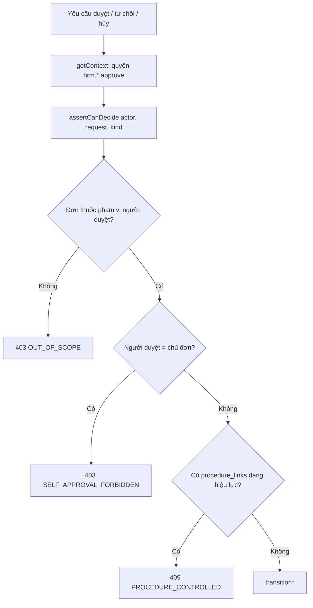
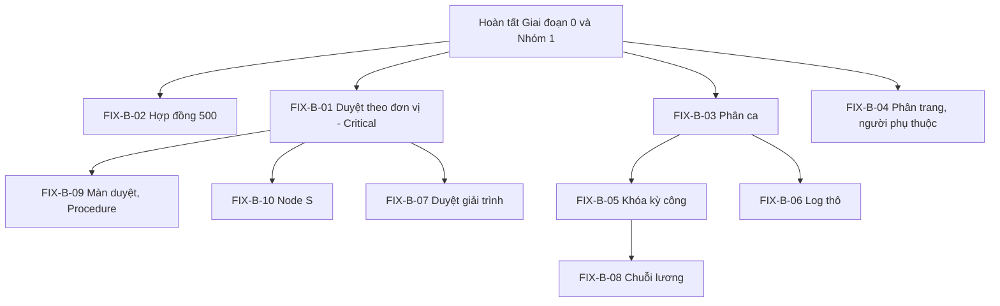

# KẾ HOẠCH SỬA LỖI NHÓM 2 - CHỨC NĂNG HR (HRM_FIX_02_HR_PLAN.md)

Phạm vi: các màn hình dành cho nhân sự (HR/C&B) và người duyệt - **Nhân sự & Chức danh** (`/modules/hrm/employees`), **Người phụ thuộc** (`/dependents`), **Quản lý Ca & Chấm công** (`/shifts`), **Bảng công tổng hợp** (`/timesheets`), **Tiền lương & Chi trả** (`/payroll`), **Ứng và thu hồi lương** (`/payroll/advances`), **Xử lý Đơn từ** (`/approvals`) và phần quy trình động liên quan.

Khung điều phối, quy ước commit: `HRM_FIX_00_OVERVIEW_PLAN.md`. Làm sau khi Nhóm 1 (`HRM_FIX_01_CANHAN_PLAN.md`) và Giai đoạn 0 hoàn tất.

**Mục test chạy lại khi kết thúc nhóm:** mục 4 (Hồ sơ nhân sự, hợp đồng, người phụ thuộc), 5 (Dữ liệu nền theo nhân viên), 7.3-7.4 (Duyệt đơn, quy trình động), 8 (Vận hành chấm công), 9 (Bảng công), 10 (Lương, tạm ứng).

---

## 1. Quản trị hồ sơ nhân sự

### FIX-B-02 - Tạo hợp đồng trả 500; ràng buộc ngày kết thúc (Test 4.3.2-4.3.5, Critical)

**Hiện tượng.** `POST /api/hrm/v1/employees/:employeeId/contracts` luôn trả 500 "Internal server error", kể cả dữ liệu tối thiểu (số hợp đồng + loại + hiệu lực từ). Vì không tạo được hợp đồng nháp nên không thể ban hành, lập phụ lục/gia hạn, xóa hay chấm dứt (Test 4.3.3-4.3.5). Ô "Đường dẫn chứng từ" hiện bắt buộc phải là đường dẫn nội bộ hoặc HTTP(S), để trống cũng bị 400.

**Luồng mã.** Route tạo hợp đồng nằm ở `hrm-employee.controller.ts` (khoảng dòng 1488-1496) gọi `insertContract()` trong `infrastructure/hrm-contracts.ts` (dòng 81-125), sau `validateContract()` (dòng 52-79).

**Giả thuyết nguyên nhân 500 (cần xác nhận bằng log `hrm-api` và SQL).**

1. Giao diện gửi chuỗi rỗng cho trường số/ngày: `baseSalary: ""` đi qua `body.baseSalary ?? null` (chuỗi rỗng không bị `??` thay) → PostgreSQL lỗi `22P02` cho cột `numeric(15,2)`. `validateContract` chấp nhận vì `Number('') = 0` hữu hạn.
2. Cột hoặc ràng buộc không khớp: `CHECK(effective_to IS NULL OR effective_to >= effective_from)` hoặc FK `(tenant_id, employee_id)` → `core_schema.employees` bị vi phạm và không được bắt, trả 500 thay vì 400/409.
3. Thiếu migration `0016-family-contract-lifecycle.sql` trên tenant `savina` (cột `parent_contract_id`, `issued_snapshot`, ... chưa có) - kiểm tra `information_schema.columns`.

**Việc cần làm.**

1. Tái hiện: gọi API với body tối thiểu và đọc stack trong log `hrm-api`; xác định giả thuyết đúng.
2. Chuẩn hóa dữ liệu vào: chuyển `""` thành `null` cho `signDate`, `effectiveTo`, `baseSalary`, `note`, `fileUrl` trước khi validate (một hàm `normalizeContractInput`); `baseSalary` phải là số hoặc `null`.
3. Ánh xạ lỗi PostgreSQL thành lỗi nghiệp vụ: `23514` (check) → 400 "Ngày hết hạn phải từ ngày hiệu lực", `23503` (FK) → 404 nhân viên không tồn tại, `22P02` → 400 "Giá trị không hợp lệ" kèm tên trường. Không để lỗi cơ sở dữ liệu thành 500 chung chung.
4. `validateContract`: **bắt buộc `effective_to`** khi `contract_type` là *Thử việc* hoặc *Xác định thời hạn*; chỉ cho phép trống với *Không xác định thời hạn*. Thông báo tiếng Việt rõ.
5. `fileUrl`: cho phép để trống ở bản nháp; chỉ bắt buộc dạng URL hợp lệ khi **ban hành** (`activate`). Giao diện (`ui/hrm-contract-panel.tsx`) ghi chú "Số / đường dẫn chứng từ".
6. Test: unit `validateContract` (từng loại hợp đồng, ngày, lương âm, chứng từ); integration (cần DB): tạo → ban hành → phụ lục → chấm dứt; hai hợp đồng chính trùng hiệu lực bị từ chối; số hợp đồng trùng trả 409.

**Nghiệm thu.** Test 4.3.2-4.3.5 Đạt; Test 4.3.6 (nhân viên xem hợp đồng chỉ đọc ở hồ sơ cá nhân) vẫn đạt. **Cỡ:** M. **Phụ thuộc:** không.

### FIX-B-03 - Phân ca: gắn lại panel, lưu ô lịch phòng ban, thông báo trùng (Test 5.1.2, 5.1.4, 5.1.6)

**Hiện trạng.**

- `<HrmRosterPanel>` (khối "Lịch phân ca đã lưu", file `ui/hrm-roster-panel.tsx`) đã bị gỡ khỏi `shifts-screen.tsx` trong thay đổi chưa commit của nhánh `hai` (bản `HEAD` còn ở các dòng khoảng 49 và 776). Hệ quả: không tìm/lọc được phân ca đã lưu, không có nút Sửa/Hủy kèm lý do dù API `PATCH`/`DELETE /shift-assignments/:id` còn.
- Sửa ô lịch phòng ban (Cell Popover) cập nhật state cục bộ, toast thành công nhưng **không gọi API**; tải lại là mất.
- Thêm phân ca trùng hiệu lực bị từ chối đúng nhưng thông báo không nêu khoảng ngày trùng.

**Việc cần làm (sau khi chốt Quyết định #1 ở overview).**

1. Gắn lại `HrmRosterPanel` vào tab Xếp lịch của `shifts-screen.tsx` (đối chiếu `git diff` của file để biết lý do gỡ; nếu chủ đích thì thay bằng thành phần tương đương và cập nhật test case).
2. Panel phải có: tìm theo mã NV/họ tên/ca, lọc theo phòng ban và trạng thái, nút **Điều chỉnh** (dialog nhập "Lý do điều chỉnh") và **Hủy** (Popconfirm + "Lý do hủy") gọi PATCH/DELETE.
3. Ô lịch phòng ban: nối `onSave` với API lưu lịch chuẩn (xem `FIX-C-02`); nếu chưa có API thì ẩn nút thay vì báo thành công giả.
4. Thông báo trùng phân ca: backend (`hrm-roster.ts`) trả kèm khoảng ngày xung đột (`conflictFrom`, `conflictTo`), giao diện hiển thị "Trùng phân ca từ dd/MM đến dd/MM".
5. Test: integration (thêm/trùng/điều chỉnh/hủy), Playwright cho panel.

**Nghiệm thu.** Test 5.1.4, 5.1.5, 5.1.6 Đạt; Test 5.1.2 không còn "thành công giả". **Cỡ:** M. **Phụ thuộc:** FIX-0-02 (ca có giờ nghỉ), Quyết định #1.

### FIX-B-04 - Danh sách nhân sự: phân trang, hợp nhất API người phụ thuộc, overview đúng contract (ISS-UI-035, ISS-BE-024, ISS-BE-020, Medium)

**Hiện trạng.**

- `employees-screen.tsx` (khoảng dòng 175-195 và 1047) tải toàn bộ nhân viên rồi render bảng thô: 33,3 KB cho 26 người, ước 2,5 MB với 2.000 người; `requests-screen.tsx` bắn 16 request khi mở, `/my-profile` gọi 2 lần; `hrmFetch` không có timeout/abort (`hrm-api.ts` dòng 55-118).
- Hai API người phụ thuộc song song trên hai bảng: `hrm-employee.controller.ts` (dòng 1075-1260, 1351) và `hrm-dependent.controller.ts` (dòng 83-289); mapper hợp đồng viết hai lần; bảng map loại đơn khai lại cục bộ trong `hrm-operations.controller.ts:179-188`.
- `GET employees/:id/overview` (`hrm-dashboard.controller.ts`) ép `snake_case as any` vào DTO camelCase, trả sai contract (hiện chưa có giao diện gọi).

**Việc cần làm.**

1. Phân trang phía server cho `GET /v1/employees` (`page`, `pageSize`, `q`, `status`, `orgUnitId`) với meta chung (xem `FIX-D-03`); giao diện dùng Table antd chế độ server-side.
2. Cache danh sách rút gọn cho các combobox (`hrmEmployeeOptions()`), tìm kiếm phía server khi gõ.
3. `hrmFetch`: thêm `AbortSignal.timeout(15000)` và hủy khi unmount; gộp lời gọi `/my-profile` trùng.
4. Chốt **một** mô hình người phụ thuộc (đề xuất giữ `hrm-dependent.controller.ts` với đăng ký có hiệu lực, vì được công thức lương dùng qua `REGISTERED_DEPENDENT_COUNT`); API còn lại chuyển thành lớp mỏng gọi cùng service hoặc ngừng dùng có kế hoạch.
5. Dùng `HRM_REQUEST_TABLES` và `normalizeHrmRequestKind` ở mọi nơi; gom một `mapContract`.
6. `overview`: dùng mapper có sẵn (`mapProfile`, `mapBalance`, `mapAttendance`, `mapShift`), bỏ `as any`, tính năm số dư theo múi giờ tenant, thêm contract test.
7. Sửa nhỏ giao diện: padding `DialogContent` ở `ui/dialog.tsx` và `create-employee-dialog.tsx` (ISS-UI-058), ô lọc `min-w-[200px]` và placeholder theo ngữ cảnh (ISS-UI-059).

**Nghiệm thu.** Test 4.1.x và 4.4.x Đạt; mạng Network thấy trả trang đầu nhỏ thay vì toàn bộ danh sách. **Cỡ:** M. **Phụ thuộc:** FIX-D-03 (quy ước phân trang) có thể làm song song.

---

## 2. Chấm công doanh nghiệp và bảng công

### FIX-B-05 - Khóa kỳ công, trùng mã kỳ, điều chỉnh ở ma trận (Test 9.1.6, 9.1.1, 9.1.4, High)

**Hiện tượng.**

- Bấm "Khóa kỳ" → Popconfirm "Khóa kỳ công này?" hiện đúng nhưng API trả 400 "Cần giải trình các dòng bất thường trước khi khóa kỳ" vì **mọi** dòng công đều "Bất thường" với mã `BREAK_WINDOW_REQUIRED` và `NO_SHIFT` (ca thiếu khung nghỉ, nhân viên chưa phân ca). Hệ quả: không có kỳ công "Đã khóa" → không tính được lương (`Cần bảng công đã khóa`).
- Tạo kỳ công trùng mã trả 500 "Internal server error"; trùng khoảng ngày thì bị chặn đúng (400).
- Nút "Điều chỉnh" chỉ có ở chế độ chi tiết từng ngày, không có ở ma trận.

**Nguyên nhân.** Hai lớp: (1) **dữ liệu**: ca và phân ca chưa đầy đủ (giải quyết bằng FIX-0-02 và FIX-B-03); (2) **chức năng**: dòng bất thường hợp lệ cần cách giải trình hàng loạt, và trùng mã kỳ chưa được bắt lỗi unique.

**Việc cần làm.**

1. Trong `hrm-timesheet.controller.ts`/`hrm-timesheet-calculation.ts`: phân biệt bất thường **chặn khóa** (thiếu log chưa giải trình) và **cảnh báo** (không phân ca/ngày nghỉ); với `NO_SHIFT` của ngày OFF/lễ không coi là bất thường. Làm rõ trong thông báo: liệt kê số dòng và hai mã lỗi, link tới bộ lọc "Bất thường".
2. Thêm thao tác **giải trình hàng loạt** (chọn nhiều dòng → nhập căn cứ → áp dụng điều chỉnh có lý do) hoặc cho phép khóa kỳ kèm xác nhận "chấp nhận bất thường" (ghi audit người chấp nhận), tuỳ chốt quy chế với HR.
3. Bắt lỗi unique `(tenant_id, period_code)` → 409 "Mã kỳ công đã tồn tại" thay vì 500.
4. Ma trận: thêm điều chỉnh từ ô công (mở dialog "Điều chỉnh" với Phút hưởng lương, Lý do, Căn cứ).
5. Test: integration khóa kỳ với ba loại dòng (hợp lệ, bất thường chặn, cảnh báo), tạo kỳ trùng mã; Playwright khóa/mở/xóa kỳ.

**Nghiệm thu.** Test 9.1.6 Đạt (khóa được ít nhất một kỳ `QA03-BC-...`); Test 9.1.7 (mở lại kỳ, quyền `hrm.timesheet.reopen`) chạy được. **Cỡ:** M. **Phụ thuộc:** FIX-0-02, FIX-B-03.

### FIX-B-06 - Log chấm công thô: gắn lại panel, chọn tháng, cột IP/thiết bị/vị trí (Test 8.3.3, Medium)

**Hiện trạng.** `ui/hrm-raw-attendance-panel.tsx` và API `GET /attendance-events` vẫn còn nhưng `<HrmRawAttendancePanel employees={employees} />` đã bị gỡ khỏi `shifts-screen.tsx` (chưa commit). Chế độ "Sự kiện quẹt thẻ thô" trên tab 3 chỉ là bảng bản ghi công phẳng, không có chọn *Tháng chấm công*, không có cột IP, thiết bị, vị trí.

**Việc cần làm.** Gắn lại panel ở tab "Dữ liệu chấm công" (sau Quyết định #1); chọn tháng bằng `SearchableSelect`/month picker, lọc nhân viên; bảng có cột thời điểm, nguồn, IP, thiết bị, vị trí GPS (nếu có), trạng thái hợp lệ; chỉ đọc; phân trang. Cần quyền `hrm.attendance.read`.
**Nghiệm thu.** Test 8.3.3 Đạt; log nguồn bất biến, gửi trùng không tạo bản ghi thứ hai (8.3.1). **Cỡ:** S.

### FIX-B-07 - Duyệt giải trình khi đơn đã có Procedure (Test 8.2.5, Medium)

**Hiện tượng.** Duyệt trực tiếp ở tab "Bổ sung & Sửa công" trả 400 "Đơn đang xử lý qua Procedure Engine; cần hoàn tất quy trình được liên kết"; đơn vẫn chờ duyệt, giao diện không báo lỗi rõ.

**Việc cần làm.** Backend giữ nguyên chặn (đúng thiết kế, liên quan FIX-B-01); giao diện: với đơn có `procedure_links` ẩn nút "Phê duyệt & Áp dụng" và hiện nhãn "Đang xử lý qua quy trình" kèm liên kết "Mở hồ sơ quy trình"; khi gặp 400 loại này hiển thị thông báo của server trong Drawer.
**Nghiệm thu.** Test 8.2.5 Đạt; đơn giải trình không gắn quy trình (binding `DIRECT`) duyệt trực tiếp được. **Cỡ:** S.

---

## 3. Bảng lương, chi trả, tạm ứng

### FIX-B-08 - Chuỗi lương: chạy lại, decimal, hủy kỳ, thông báo ngân hàng, trạng thái giải ngân (Test 10.1.x, 10.2.x, ISS-BE-022, High)

**Hiện trạng.** Cả chuỗi lương chưa kiểm chứng: "Tính lương" trả 400 "Cần bảng công đã khóa" vì không khóa được kỳ công. Đọc mã cho thấy các điểm cần sửa:

- Tính lương ~8 query mỗi nhân viên trong một transaction dài (N+1) và cộng tiền bằng `Number` float rồi mới làm tròn (`hrm-payroll-calculation.ts` dòng 70-262, 146-151; `hrm-leave-operations.ts:237`).
- UI không có thao tác **hủy cả kỳ lương** sang "Đã hủy" (chỉ có "Hủy lần tính" và "Xóa kỳ trống").
- Xuất chi trả thiếu thông tin ngân hàng bị chặn nhưng thông báo chung, không liệt kê nhân viên lỗi.
- Khoản ứng sau giải ngân hiển thị luôn "Đang thu hồi" (`DISBURSED`), bộ lọc không có "Đã giải ngân".
- Ở 1440x900 cột *Thực lĩnh* và *Thanh toán* nằm ngoài khung (ISS-UI-024); tên nút rút gọn ("Chốt lương", "Xuất đối soát") so với test case.

**Việc cần làm (thứ tự).**

1. **Chạy lại toàn bộ chuỗi trước khi sửa** sau FIX-B-05: tạo kỳ (`KL-QA03-...`), tính, điều chỉnh, chốt, phát hành, xuất CSV, ghi nhận chi trả, hủy; ghi các lỗi mới phát hiện vào task con `FIX-B-08.x`.
2. **Decimal:** thay `Number` bằng `bigint` (đơn vị đồng) hoặc thư viện decimal xuyên suốt `payroll-formula.ts`, `hrm-payroll-calculation.ts`; thêm test với các giá trị gây sai số float (0.1 + 0.2, chia lẻ OT).
3. **Hiệu năng:** nạp theo lô bằng `employee_id = ANY($n)` cho salary profile, timesheet, dependents, advances; kiểm tra ngày khóa bằng một query theo khoảng thay vì từng ngày (`assertOpenDate`).
4. **Hủy kỳ lương:** thêm trạng thái `CANCELLED` ở kỳ chưa chi trả, endpoint, nút kèm Popconfirm và "Lý do hủy"; chặn khi đã có dòng "Đã chi trả".
5. **Xuất chi trả:** khi chặn vì thiếu ngân hàng, trả `details: [{ employeeCode, employeeName, missing: ['bankName','accountNumber'] }]` và hiển thị danh sách.
6. **Trạng thái ứng:** thêm hiển thị riêng "Đã giải ngân" (đã giải ngân, chưa có lịch thu hồi) tách khỏi "Đang thu hồi"; bổ sung vào bộ lọc.
7. **Bố cục:** `payroll-screen.tsx` ở 1440x900: cột cố định, cuộn độc lập (dùng `MasterDetailSplit` khi có, xem `FIX-D-02`).
8. Test: unit công thức, integration vòng đời kỳ lương (`hrm-payroll-lifecycle.ts`), kiểm thử khấu trừ tạm ứng đúng một lần.

**Nghiệm thu.** Test 10.1.1-10.1.8 và 10.2.1-10.2.4 chạy được từ đầu đến cuối, trạng thái Đạt; phiếu lương chỉ hiện sau phát hành, NV-2 không xem được phiếu của NV-1 (403/404). **Cỡ:** L. **Phụ thuộc:** FIX-0-02, FIX-B-03, FIX-B-05.

---

## 4. Xử lý đơn từ và phê duyệt

### FIX-B-01 - Duyệt theo đơn vị, chặn tự duyệt, bắt buộc qua Procedure (ISS-BE-001, Critical)

**Hiện trạng (đã xác nhận trên nhánh `hai`).** Duyệt/từ chối/hủy đơn nghỉ, OT, công tác, tạm ứng, giải trình công chỉ gọi `getContext(req, '<permission>')` - một permission phẳng trên toàn tenant (`hrm-leave.controller.ts` dòng 842-857 và 895-909; `hrm-request.controller.ts:153-185`; `hrm-salary.controller.ts:683-696`; `hrm-attendance.controller.ts:461-471`; `infrastructure/hrm-leave-operations.ts:212-310`). Mã nhánh `hai` chưa có `assertCanDecide` hay kiểm tra tự duyệt. Ba lỗ hổng cùng nằm ở một chỗ:

1. Không giới hạn theo đơn vị: mọi người có `hrm.leave.approve` duyệt được đơn của bất kỳ ai và thấy mọi đơn của tenant.
2. Không chặn tự duyệt: người có quyền tự tạo đơn rồi tự duyệt (báo cáo tái hiện: nhận 201 APPROVED).
3. Đi vòng quy trình: đơn đã có `procedure_links` vẫn duyệt thẳng được qua `POST /leave-requests/:id/approve`; giao diện chỉ ẩn nút. Trạng thái HRM và Procedure lệch nhau, link `FAILED` retry mãi. (Riêng `withdraw` ở `hrm-operations.controller.ts:207-217` đã kiểm link - dùng làm mẫu.)

**Thiết kế.**

**Việc cần làm.**

1. Tạo `packages/modules/hrm/src/lib/application/hrm-approval-policy.ts` với `assertCanDecide(actor, request, kind)` dùng chung; gọi trong **mọi** handler approve/reject/cancel của 5 loại đơn **trước** `transition*`.
2. **Chặn tự duyệt:** `employee.user_id === actor.userId` → 403 `SELF_APPROVAL_FORBIDDEN`. Cấu hình ngoại lệ ở mức tenant (mặc định tắt), lưu trong `policies` hoặc bảng cấu hình HRM.
3. **Phạm vi đơn vị:** lấy chuỗi quản lý/đơn vị của chủ đơn qua API nội bộ của Core (`/api/platform/internal/...`) - không đọc thẳng `core_schema` (xem ISS-BE-019). Quy tắc theo Quyết định #2 ở overview; mặc định đề xuất: người duyệt phải là quản lý trực tiếp hoặc quản lý cấp trên trong chuỗi, hoặc có quyền `hrm.manage`/`hrm.leave.manage` phạm vi toàn tenant (HR).
4. **Danh sách đơn:** lọc kết quả `GET` các hộp xử lý theo cùng phạm vi (người duyệt chỉ thấy đơn trong phạm vi của mình, HR thấy tất cả).
5. **Đi vòng Procedure:** nếu `procedure_links` đang hiệu lực (`START_PENDING`, `RUNNING`, `APPLY_PENDING`, `CONFLICT`) → 409 `PROCEDURE_CONTROLLED` kèm `instanceId` để giao diện dẫn tới hồ sơ quy trình.
6. Giao diện (`approvals-screen.tsx`): ẩn nút theo `canDecide` do server trả trong từng dòng; hiển thị lý do khi bị chặn.
7. Test integration bắt buộc: (a) trưởng phòng A duyệt đơn phòng B → 403; (b) tự tạo rồi tự duyệt → 403; (c) đơn có Procedure duyệt trực tiếp → 409; (d) HR toàn tenant duyệt được; (e) thu hồi quyền → request mới bị từ chối.

**Nghiệm thu.** Ba kịch bản trên có test; Test 7.3.x chạy lại bằng đúng vai (QA03-QuanLy duyệt đơn nhân viên cùng đơn vị, không duyệt được đơn người ngoài đơn vị). **Cỡ:** L (1,5-2 tuần). **Phụ thuộc:** FIX-0-03; dữ liệu chuỗi quản lý trong sơ đồ tổ chức.

### FIX-B-09 - Màn duyệt: Popconfirm từ chối; phạm vi bước S; lưu Procedure; hủy mềm (ISS-UI-003, ISS-BE-005, ISS-BE-006, ISS-BE-025, High)

**Hiện trạng.**

- `approvals-screen.tsx` (khoảng dòng 270-279, 582-590, 884-891): nút "Từ chối" gửi ngay sau khi nhập lý do, không `confirmTitle`.
- ISS-BE-005: bất kỳ ai trong đơn vị cũng hoàn thành được **bước S** của hồ sơ Procedure của người khác (ảnh hưởng luồng duyệt đơn qua Procedure).
- ISS-BE-006: `postgres-procedure-store.ts` (dòng 71-183) xóa 11 bảng rồi ghi lại toàn bộ dữ liệu quy trình của tenant ở mỗi lần ghi; `versions.id` sinh mới (`randomUUID()`), nên `hrm_schema.procedure_links.definition_version_id` có thể trỏ vào id không còn tồn tại; từng làm mất tệp đính kèm.
- ISS-BE-025: xóa hồ sơ Procedure là xóa cứng, không phát event nên đơn HRM liên kết kẹt `PENDING`.

**Việc cần làm.**

1. Giao diện: bọc nút Từ chối bằng `Popconfirm` (`okType="danger"`), giữ ô nhập lý do trong dialog/Drawer.
2. ISS-BE-005: ở `procedure-engine.application.ts`/`procedure-authorization.ts` giới hạn hoàn thành bước theo người được phân vai (RACI) của bước đó; test với người ngoài vai.
3. ISS-BE-006 **ngắn hạn:** giữ `id` version ổn định (lấy từ state thay vì `randomUUID()` mỗi lần ghi); thay `continue` ở dòng ~183 bằng lỗi có log để không mất instance im lặng; thêm spec cấm FK mới trỏ vào bảng chuẩn hóa của PE. **Dài hạn** (tách riêng, ngoài đợt này): ghi theo aggregate bằng UPSERT, khóa theo dòng.
4. ISS-BE-025: hủy mềm (`status='cancelled'`, giữ audit) và phát outbox `procedure.instance.cancelled` để HRM đóng đơn liên kết; nhả tài nguyên sau commit.

**Nghiệm thu.** Test 7.3.3-7.3.5 (từ chối có xác nhận); test mới: hoàn thành bước S bởi người ngoài vai → 403; `definition_version_id` trong link vẫn tồn tại sau 10 lần ghi. **Cỡ:** L. **Phụ thuộc:** FIX-B-01.

### FIX-B-10 - Quy trình động Node S: thuộc tính và rẽ nhánh (Test 7.4.1-7.4.7, High)

**Hiện tượng.** Mọi form đơn (nghỉ, OT, công tác, giải trình, tạm ứng) dùng chung "Quy trình xét duyệt đơn từ nhân sự" và chỉ có dòng "Quy trình áp dụng"; không có khối "Thông tin bổ trợ quy trình", không có thuộc tính động, không có rẽ nhánh theo số ngày nghỉ (`so_ngay_nghi > 3`). Luồng của đơn nghỉ chỉ có hai bước tuyến tính (khởi tạo, HR thẩm định).

**Nguyên nhân.** Cấu hình trong Procedure Engine (thuộc tính Node S và điều kiện rẽ nhánh) **chưa được khai báo** cho các quy trình đang gắn - không phải lỗi hiển thị. Cơ chế nạp thuộc tính động nằm ở `ui/dynamic-attribute-form.tsx`, `hrm-procedure-bridge.service.ts`, `hrm-procedure-sync.ts`.

**Việc cần làm (sau Quyết định #6).**

1. Seed hoặc hướng dẫn HR Admin tạo hai định nghĩa mẫu trong Procedure Engine: *Quy trình nghỉ phép* (Node S có thuộc tính `so_ngay_nghi`, nhánh > 3 ngày cần "Giám đốc phê duyệt bổ sung") và *Quy trình tạm ứng lương* (thuộc tính số tiền).
2. Gắn qua `Vận hành & Tích hợp > Quy trình liên module > Cấu hình quy trình mới` (loại đơn + mã loại con + chế độ `PROCEDURE`).
3. Kiểm tra payload lai (hybrid form payload) gửi đủ thuộc tính; `excludeCodes` loại trường trùng với trường cốt lõi.
4. Viết hướng dẫn ngắn trong `docs/` để HR tự cấu hình lại khi triển khai tenant mới.

**Nghiệm thu.** Test 7.4.1-7.4.7: form nghỉ hiện khối thông tin bổ trợ; đơn 1 ngày đi một cấp, đơn 5 ngày rẽ nhánh sang cấp bổ sung; đơn tạm ứng nạp đúng định nghĩa. **Cỡ:** M. **Phụ thuộc:** FIX-A-08, FIX-B-01.

---

## 5. Thứ tự thực hiện trong nhóm

Gợi ý chia PR và nhịp: tuần 1 - `FIX-B-02`, `FIX-B-03`, `FIX-B-04`; tuần 1-3 - `FIX-B-01` (làm song song, nhánh riêng); tuần 2-3 - `FIX-B-05`, `FIX-B-06`, `FIX-B-07`; tuần 3-4 - `FIX-B-08`, `FIX-B-09`, `FIX-B-10`.

## 6. Kiểm thử nghiệm thu nhóm

| Mục test | Bước | Kỳ vọng sau sửa |
| :--- | :--- | :--- |
| 4.1-4.4 Hồ sơ, hợp đồng, người phụ thuộc | 4.1.x-4.4.x | Hợp đồng tạo/ban hành/phụ lục/chấm dứt được |
| 5.1 Phân ca | 5.1.1-5.1.7 | Panel phân ca có tìm/lọc/sửa/hủy; ô lịch lưu thật |
| 7.3 Duyệt đơn | 7.3.1-7.3.11 | Duyệt đúng phạm vi, chặn tự duyệt, Procedure không bị vòng |
| 7.4 Quy trình động | 7.4.1-7.4.13 | Node S có thuộc tính, rẽ nhánh hoạt động |
| 8 Vận hành chấm công | 8.1-8.4 | Log thô, duyệt giải trình, tác vụ phép |
| 9 Bảng công | 9.1.1-9.1.8 | Khóa/mở kỳ được |
| 10 Lương, tạm ứng | 10.1.1-10.2.4 | Chạy trọn chuỗi, không còn Bỏ qua do chặn dữ liệu |

Ngoài test thủ công: bổ sung các kịch bản `tmp/live-test/<mã-task>/` và các integration test nêu trong từng task. Kết quả ghi vào cột B và G của file test.
