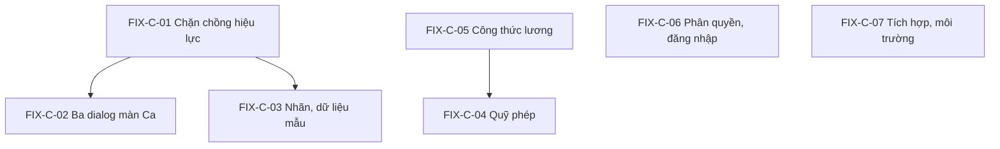

# KẾ HOẠCH SỬA LỖI NHÓM 3 - CHỨC NĂNG QUẢN TRỊ VIÊN (HRM_FIX_03_QUANTRI_PLAN.md)

Phạm vi: các màn hình cấu hình do quản trị viên tenant và quản trị HRM sử dụng - **Cấu hình công & thiết bị / Chính sách** (`/modules/hrm/policies`), **Danh mục ca** (`/shifts`), **Quỹ phép** (`/leave-settings`), **Cấu hình lương** (`/payroll/settings`), **Danh mục quyền HRM** (`/permissions`), **Vận hành & Tích hợp** (`/operations`) và cổng tenant (`/authorization`, `/roles`, `/users`).

Khung điều phối, quy ước commit: `HRM_FIX_00_OVERVIEW_PLAN.md`. Làm sau Nhóm 1 và Nhóm 2. Hai việc tiền đề `FIX-0-01` (dọn chính sách trùng) và `FIX-0-02` (form ca có giờ nghỉ) đã hoàn tất ở Giai đoạn 0; tệp này làm phần **chặn tái diễn** và các lỗi cấu hình còn lại.

**Cập nhật 05/10/2026.** Sau khi rà soát giao diện thực tế trên `localhost:8080` dưới góc nhìn HR (tài liệu nhận xét trong hội thoại), kế hoạch được bổ sung: nguyên nhân gốc của `FIX-C-01` đã **xác nhận bằng SQL**; `FIX-C-02` chốt **phương án B**; thêm các task `FIX-C-08` đến `FIX-C-13` (dọn dữ liệu cấu hình, lịch nghỉ lễ mẫu, chuẩn hóa loại nghỉ, công thức/OT, vai trò mẫu và phân tách nhiệm vụ, UAT có HR ký). Bảng **trạng thái triển khai** ở mục 9.

**Mục test chạy lại khi kết thúc nhóm:** mục 1, 2 (Superadmin và Tenant Admin, chỉ phần HRM liên quan), 3 (Cấu hình nền HRM), 5.2-5.3 (Quỹ phép, Cấu hình lương), 8.4 (Tác vụ phép tự động), 11 (Phân quyền chéo).

---

## 1. Chính sách, nội quy, ca làm việc

### FIX-C-01 - Chặn chồng hiệu lực chính sách; trường lý do thay đổi (Test 3.1.1, 6.2.1, Critical)

**Hiện trạng.** `resolvePolicy()` (`infrastructure/hrm-time.ts` dòng ~60-85) ném `ConflictException("Có nhiều chính sách {type} cùng hiệu lực; cần điều chỉnh phạm vi/ngày áp dụng")` nếu có nhiều hơn một phiên bản bao phủ cùng ngày (sau khi lọc theo `employeeIds`). Một lần cấu hình sai là chặn **toàn bộ** chấm công, gửi đơn nghỉ và tính công của tenant. Giao diện nhập phiên bản mới **không ngăn** việc này; dialog "Thêm phiên bản" cũng không có ô "Lý do thay đổi" và nhãn dung sai là "Sai số GPS tối đa (m)" (khác test case "Dung sai GPS").

**Điểm yếu trong mã (3 nơi tạo phiên bản, điều kiện đóng bản cũ khác nhau).**

| Vị trí | Cách đóng phiên bản cũ |
| :--- | :--- |
| `hrm-policy.controller.ts:259` | `status='ACTIVE' AND (effective_to IS NULL OR effective_to >= ngày mới)` |
| `hrm-time-settings.controller.ts:149` | chỉ `WHERE policy_id=$1 AND effective_to IS NULL` |
| `hrm-payroll-settings.controller.ts:252` | chỉ `WHERE policy_id=$1 AND effective_to IS NULL` |

Hai đường sau bỏ sót phiên bản đã có `effective_to` ở tương lai, và mọi đường chỉ xét trong **cùng `policy_id`** - nếu có hai bản ghi `policies` cùng `policy_type`, bản kia không bị đóng.

**Nguyên nhân gốc đã xác nhận (SQL trên tenant `savina`, 05/10/2026).** Bảng `hrm_schema.policies` có **hai bản ghi `ATTENDANCE` cùng `ACTIVE`**: (1) `a1000000-...-0001` "Quy chế chấm công & chuyên cần SVN DTS 2026" (seed; phiên bản hiệu lực từ 2026-01-01; khóa cấu hình kiểu snake_case: `break_minutes`, `grace_late_minutes`, `workday_standard_minutes`); (2) "Quy định chấm công" do màn Cấu hình công & thiết bị tạo (phiên bản hiệu lực từ 2026-10-03; khóa camelCase: `timezone`, `requireGps`...). Mỗi bản có một phiên bản không có `effective_to` nên từ 03/10/2026 hai phiên bản cùng bao phủ → `resolvePolicy()` ném 409. Giao diện chỉ liệt kê **phiên bản của bản ghi do nó tạo** nên HR không thấy được bản seed, và lúc sửa không biết có xung đột. Hai bản ghi còn dùng **hai bộ khóa cấu hình khác nhau**, nên gộp không đơn giản là đóng phiên bản.

**Việc cần làm.**

0. **Hợp nhất nguồn chính sách.** `hrm-time-settings.controller.ts` phải tái sử dụng bản ghi `policies` ATTENDANCE đang hoạt động (tra theo `tenant_id + policy_type`) thay vì tạo bản ghi mới; khi xuất bản phiên bản mới, **thừa kế** các khóa chưa khai báo từ phiên bản đang áp dụng (giữ `break_minutes`, `grace_late_minutes`, `workday_standard_minutes`); hàm đọc cấu hình chấp nhận cả hai kiểu khóa (snake_case và camelCase) trong giai đoạn chuyển tiếp.
1. Tạo một hàm duy nhất `publishPolicyVersion(db, tenantId, policyType, { effectiveFrom, effectiveTo, scope, config, reason, actorId })` trong `infrastructure/hrm-policy-versions.ts`; cả ba controller gọi hàm này, bỏ ba câu `UPDATE` rời rạc.
2. Bên trong hàm: khóa theo `(tenant_id, policy_type)` (advisory lock), tìm mọi phiên bản **cùng loại, cùng phạm vi** có khoảng hiệu lực giao với khoảng mới; đóng bản đang mở (`effective_to = from - 1`); nếu còn giao với bản **đã có ngày kết thúc ở tương lai** thì trả 409 với danh sách bản xung đột (mã phiên bản, khoảng ngày) thay vì lưu.
3. Migration mới `migrations/tenant/hrm/0022-hrm-policy-single-owner.sql` (sau khi FIX-0-01 làm sạch dữ liệu): `CREATE UNIQUE INDEX IF NOT EXISTS ... ON hrm_schema.policies(tenant_id, policy_type) WHERE status='ACTIVE' AND <phạm vi toàn tenant>` để mỗi loại chính sách toàn tenant chỉ có một bản ghi `policies` hoạt động.
4. Dialog "Thêm phiên bản" (`screens/time-settings-screen.tsx`): thêm ô bắt buộc **Lý do thay đổi** (ghi vào audit), ô **Hiệu lực đến** (tùy chọn) và **Phạm vi áp dụng** (toàn công ty hoặc danh sách nhân viên/đơn vị, để chạy thử cho một nhóm trước khi áp dụng toàn công ty - cấu hình đã hỗ trợ `employeeIds`); hiển thị trước khoảng hiệu lực sẽ bị đóng ("Phiên bản v2 sẽ kết thúc ngày 02/10/2026"); danh sách phiên bản hiển thị **mọi phiên bản của mọi bản ghi cùng loại** kèm cột phạm vi; đổi nhãn thành "Dung sai GPS (m)" nếu thống nhất với test case, hoặc cập nhật test case.
4b. **Quy tắc nghiệp vụ HR:** (a) không được để **khoảng trống** hiệu lực (cảnh báo khi phiên bản sớm nhất bắt đầu sau ngày vào làm sớm nhất hoặc sau ngày đầu năm); (b) chặn xuất bản phiên bản có hiệu lực **hồi tố** vào kỳ công hoặc kỳ lương đã khóa (hoặc yêu cầu mở lại kỳ có quyền riêng); (c) mặc định của dialog là không bật bất kỳ ràng buộc chặt nào (GPS, thiết bị) - chính sách chặt phải được chạy thử theo nhóm trước.
5. Giao diện chấm công: nếu vẫn gặp lỗi chính sách, hiển thị chính sách đang áp dụng và hướng dẫn liên hệ quản trị (xem `FIX-A-06`) thay vì khóa cả trang.
6. Test: unit cho `publishPolicyVersion` (bản đang mở, bản có ngày kết thúc tương lai, phạm vi `employeeIds` giao nhau, hai `policies` cùng loại); integration: tạo liên tiếp hai phiên bản không bao giờ làm `resolvePolicy()` ném 409.

**Nghiệm thu.** Test 3.1.1 Đạt (có Lý do thay đổi, bản cũ tự đóng đúng ngày); thử cố tình tạo phiên bản chồng hiệu lực bị từ chối với thông báo nêu rõ xung đột. **Cỡ:** M. **Phụ thuộc:** FIX-0-01.

### FIX-C-02 - Ba dialog ở màn Ca: gỡ, dẫn về một nơi cấu hình duy nhất (Test 3.1.7-3.1.9, High) - ĐÃ CHỐT PHƯƠNG ÁN B

**Hiện tượng.** Ba dialog trong màn Quản lý Ca & Chấm công chỉ hiện toast, **không gọi API lưu**:

- "Cấu hình Lịch chuẩn Công ty mẹ" - nút "Khôi phục Chuẩn Hành chính 8h" đặt Ca 1 thứ 2-6 thành `[C1] Ca sáng (06:00-14:00)` chứ không phải ca hành chính; chưa bấm Lưu thì không đổi dữ liệu.
- "Nghỉ Lễ / Sự kiện đột xuất" - "Áp dụng Sự kiện Ngay" đóng dialog, không có toast, sự kiện **không xuất hiện** ở tab "Lịch làm / OFF / lễ" của `/policies`.
- "Cấu hình Công chuẩn tháng" - mặc định 26 ngày (test case ghi 22).

Phần lưu thật nằm ở màn **Cấu hình công & thiết bị** (`time-settings-screen.tsx`, bảng lịch làm/OFF/lễ, API `hrm-time-settings.controller.ts`).

**Việc cần làm (sau Quyết định #4 ở overview).**

**Quyết định (05/10/2026): chọn phương án B.** Lý do: cùng một cấu hình (lịch làm/OFF/lễ, công chuẩn) không được có hai nơi nhập; HR cần một nguồn chuẩn duy nhất ở "Cấu hình công & thiết bị" và có thể kiểm toán thay đổi ở đó. Phương án A giữ lại để tham khảo:

- Phương án A (không chọn): nối ba dialog vào API của `/policies` - "Lịch chuẩn" ghi lịch tuần mặc định; "Nghỉ lễ / Sự kiện" ghi vào lịch `WORK/OFF/HOLIDAY` (kèm Hưởng lương Có/Không); "Công chuẩn tháng" ghi vào cấu hình công chuẩn của chính sách. Sau khi lưu, làm mới dữ liệu và hiển thị toast thành công thật.
- Phương án B (**chọn**): gỡ ba nút khỏi màn Ca, thêm liên kết "Mở Cấu hình công & thiết bị"; cập nhật test case 3.1.7-3.1.9.
- Dù chọn phương án nào: sửa "Khôi phục Chuẩn Hành chính 8h" dùng đúng mã ca hành chính của tenant; công chuẩn mặc định lấy từ cấu hình, không hard-code 26.

**Nghiệm thu.** Test 3.1.7-3.1.9 Đạt; ngày nghỉ lễ tạo ở dialog xuất hiện ở tab "Lịch làm / OFF / lễ" và ảnh hưởng bảng công của ngày đó. **Cỡ:** M. **Phụ thuộc:** FIX-C-01, FIX-B-03 (ô lịch phòng ban dùng chung API).

### FIX-C-03 - Màn Ca: giá trị mặc định modal sửa, nhãn và dữ liệu mẫu (Test 3.2.1, 3.2.3, Low)

**Hiện trạng.** Modal sửa ca hiện "nghỉ 60" trong khi ca đang lưu là 0 (đã xử lý trong `FIX-0-02`); tab tên "1. Định nghĩa ca" hiển thị dạng **bảng** thay vì thẻ ca; ca mẫu là `CA-HC`, không có seed `CA_SANG`, `CA_CHIEU`, `CA_DEM`; nút xem là "Xem" thay vì "Chi tiết".

**Bổ sung từ rà soát giao diện.** (1) Thẻ KPI "Nhân sự đã phân ca" hiện **72 / 47 - 153% độ phủ**: số 72 là số phân ca, không phải số nhân viên khác nhau; phải đếm `DISTINCT employee_id` và không bao giờ vượt 100%. (2) Cột "Trạng thái" và bộ lọc hiện `ACTIVE`/`INACTIVE` tiếng Anh: đổi thành "Đang dùng"/"Tạm dừng". (3) Bảng ca không cho biết khung giờ nghỉ và số giờ công chuẩn của ca: thêm cột "Công chuẩn (giờ)" tính từ khung giờ trừ nghỉ.

**Việc cần làm.** Quyết định dùng bảng hay thẻ (khuyến nghị giữ bảng vì hợp với mật độ dữ liệu); cập nhật test case 4.1.x theo đó. Nếu cần ca mẫu cho demo, thêm seed idempotent vào migration seed của tenant demo, không đưa vào mã nguồn mặc định.
**Cỡ:** S. **Phụ thuộc:** không.

## 2. Nghỉ phép và quỹ phép

### FIX-C-04 - Loại nghỉ trùng mã, sổ quỹ phép, kết quả đối soát (Test 3.3.1, ISS-BE-023, Medium)

**Hiện trạng.**

- Thêm loại nghỉ trùng mã: DB chặn bằng `UNIQUE (tenant_id, code)` (`migrations/tenant/hrm/0001-hrm.sql:236`) nhưng API trả 500 thay vì thông báo "mã trùng".
- `leave_balances.remaining` bị cộng/trừ ở ít nhất 7 câu `UPDATE` theo `id`, không kèm `tenant_id`, không đối soát với `leave_transactions` (`hrm-leave-operations.ts:152, 272-274`; `hrm-leave-accrual.ts:112`; `hrm-leave-carryover.ts:101, 194, 198, 260`).
- "Chạy đối soát ngay" không hiển thị số giao dịch tạo mới (chỉ nằm trong JSON mở rộng).
- Màn Approvals không có nút "Điều chỉnh tồn phép"; chức năng ở "Điều chỉnh quỹ" trong màn Cấu hình nghỉ phép (đã chạy đúng: double-click chỉ tạo một giao dịch, đảo điều chỉnh giữ bản gốc, cộng phép tháng chạy lại bỏ qua đủ bản ghi).

**Việc cần làm.**

1. Bắt lỗi `23505` ở handler tạo loại nghỉ → 409 "Mã loại nghỉ đã tồn tại".
2. Gom mọi cập nhật số dư về hàm `applyLeaveDelta(db, tenantId, balanceId, delta, txRef)` trong `infrastructure/hrm-leave-balance.ts`: kiểm bất biến `remaining >= -limit`, luôn kèm `tenant_id` trong `WHERE`, ghi `leave_transactions` cùng transaction; thêm job/endpoint **đối soát** so khớp `remaining` với tổng ledger và báo chênh lệch.
3. Kết quả "Chạy đối soát ngay": hiển thị `createdTransactions`, `skipped`, `errors` trong dialog kết quả; lịch sử chạy hiện cột "Số giao dịch mới".
4. Cập nhật test case 5.2.6: nút "Điều chỉnh quỹ" ở Cấu hình nghỉ phép; thêm liên kết "Quỹ phép & Sổ phép" từ Approvals (đã có).
5. Ghi nhận dữ liệu thật đã bị tác động trong đợt thử: **126 giao dịch** cộng phép tháng 2026-08 trên `savina` - đối chiếu bằng job đối soát vừa thêm.
6. Test: unit `applyLeaveDelta` (âm quá hạn mức, cộng trùng với cùng `txRef`), integration vòng đời quỹ (giữ chỗ → duyệt → hoàn khi hủy).

**Bổ sung từ rà soát giao diện (xem thêm `FIX-C-10`).** Sổ quỹ đang hiện số dư âm cho loại **không trừ quỹ** ("Nghỉ không lương" còn lại -1) và cho loại không có hạn mức âm ("Nghỉ bù" còn lại -2); giao diện phải ghi "không áp dụng quỹ" cho loại có `deducts_balance = false`, và cảnh báo màu cho số dư âm vượt hạn mức. Định dạng số thập phân thống nhất (`-0.5` và `-0,5` đang lẫn nhau).

**Nghiệm thu.** Test 3.3.1 Đạt (thông báo mã trùng rõ); Test 5.2.1-5.2.5 vẫn Đạt; kết quả đối soát hiển thị số giao dịch. **Cỡ:** M. **Phụ thuộc:** không.

## 3. Công thức và cấu hình lương

### FIX-C-05 - Xóa phiên bản công thức không khôi phục phiên bản trước (Test 5.3, High)

**Hiện tượng.** Tạo phiên bản v2 (hiệu lực 2030-01-01) rồi xóa: v1 vẫn mang `effective_to = 2029-12-31` và nhãn "Hết hiệu lực" thay vì mở lại (`effective_to = NULL`). Hiện công thức lương của tenant `savina` đang ở trạng thái này.

**Nguyên nhân.** Khi tạo v2, `hrm-payroll-settings.controller.ts:252` đóng v1 (`effective_to = from - 1`, `status='SUPERSEDED'`). Khi xóa/kết thúc v2 (khối lệnh ở khoảng dòng 442 chỉ cập nhật `effective_to` và `status='SUPERSEDED'` của chính bản đó - cần xác nhận lại đúng handler xóa khi thực hiện), không thấy bước **mở lại** phiên bản liền trước.

**Việc cần làm.**

1. Xử lý dữ liệu hiện tại ngay: đặt lại `effective_to = NULL` và `status = 'ACTIVE'` cho phiên bản v1 của công thức lương `savina` (ghi audit "Khôi phục thủ công sau lỗi").
2. Khi xóa hoặc hủy một phiên bản: tìm phiên bản liền trước (cùng `policy_id`, `effective_to = bản_xóa.from - 1`); nếu bản bị xóa là bản **mới nhất** thì mở lại bản trước (`effective_to = bản_xóa.effective_to` hoặc `NULL`), cùng transaction; nếu xóa bản ở giữa chuỗi thì chặn (409) hoặc nối lại khoảng hở theo quy tắc rõ ràng.
3. Chỉ cho phép xóa phiên bản **chưa có hiệu lực** (`effective_from > hôm nay`) và chưa được kỳ lương nào tham chiếu; ngược lại hướng dẫn tạo phiên bản mới.
4. Hiển thị trạng thái "Chưa hiệu lực / Đang áp dụng / Hết hiệu lực" tính theo ngày thay vì chỉ dựa vào cột `status`.
5. Test integration: tạo v2 tương lai → xóa → v1 trở lại "Đang áp dụng"; xóa bản ở giữa; xóa bản đã được kỳ lương dùng bị từ chối.
6. Kiểm tra quyền `hrm.salary.manage` bằng tài khoản `QA03-HR` (chưa làm vì phần lớn bước chạy bằng quản trị FULL): chỉ người có quyền mới sửa được mức lương; xem lại `Test 5.3`.

**Nghiệm thu.** Phiên bản v1 hiển thị "Đang áp dụng" sau khi xóa v2; Test 5.3.x Đạt. **Cỡ:** S. **Phụ thuộc:** không.

## 4. Phân quyền và tài khoản

### FIX-C-06 - Picker hrm.*, guard mặc định, menu theo quyền, vai trò theo chức danh, giới hạn đăng nhập (Test 11.1.2-3, ISS-BE-014, ISS-BE-003, ISS-UI-045, ISS-BE-018, High)

**Hiện trạng.**

- Khi thử dựng vai trò "chỉ tính lương" (`hrm.payroll.calculate`, `hrm.payroll.adjust`) hoặc "chỉ cá nhân" (`hrm.self.*`), hộp thoại tạo vai trò ở cổng tenant chỉ cho chọn module và một quyền Workspace. **Lưu ý khi xác nhận:** danh sách `TENANT_PERMISSION_ACTIONS` ở `packages/contracts/identity/src/lib/tenant-authorization.ts` đã chứa các hành động `hrm.*`; cần kiểm tra lỗi nằm ở màn `/roles` (`tenant-roles.tsx`, chỉ gán module + quyền sẵn có) hay ở bộ chọn của `/authorization` (`permission-picker.tsx`, nơi tạo **Permission** gồm nhiều hành động rồi gắn vào vai trò). Có thể chỉ là khác luồng, không phải thiếu dữ liệu.
- Nhiều tài khoản chỉ có vai trò "Người dùng chuyển tiếp" (xem `FIX-0-03`); import người dùng không gán vai trò nên người được import chưa có quyền gì.
- HRM tự viết lại verify JWT/CSRF; khoảng 168 route dựa vào việc từng handler nhớ gọi `getContext(...)`, không có guard mặc định; CSRF double-submit không gắn phiên, so sánh không constant-time (`module-access.ts:66-73`, `hrm-context.service.ts`).
- Chức danh trên sơ đồ tổ chức không tự sinh quyền; menu module vẫn hiện dù server đã chặn; khi thu hồi module HRM, API trả 403 ngay nhưng thẻ HRM trên dashboard còn tới khi tải lại trang.
- Đăng nhập không giới hạn tần suất (8 lần sai liên tiếp vẫn 401 rồi lần đúng 200); `hrm-api` kéo cả `PlatformIdentityModule` nên có endpoint login thứ hai `/api/hrm/auth/v1/login`; mỗi lần login tenant tạo `pg.Pool` mới (`platform-identity.service.ts`).

**Việc cần làm.**

1. **Xác nhận picker:** tạo Permission chứa các hành động `hrm.payroll.calculate`, `hrm.payroll.adjust` ở `/authorization` rồi gắn vào vai trò `QA03-TinhLuong`. Nếu làm được thì chỉ cần cập nhật hướng dẫn và Test 11.1.2-11.1.3; nếu không thì bổ sung nhóm "HRM" (51 hành động, tìm theo mã/tên) vào `permission-picker.tsx` và đảm bảo `GET /tenant-permission-actions` trả đủ.
2. **Guard mặc định:** viết `HrmAccessGuard` (`APP_GUARD`) dựa trên `ModuleAccess` + decorator `@RequirePermission('hrm.x')`; route không khai quyền mặc định **từ chối**; chuyển dần các handler (bắt đầu bằng nhóm duyệt/lương); gom helper CSRF với `timingSafeEqual` và gắn phiên (HMAC theo `sessionId`).
3. **Capabilities cho menu:** dùng `GET /v1/capabilities` của HRM để ẩn mục menu và nút; khi 403 `MODULE_ROLE_FORBIDDEN` hiện màn "Chưa được cấp quyền" thay vì spinner (liên quan `FIX-A-12`, `FIX-A-14`).
4. **Thu hồi module:** dashboard tenant nạp lại danh sách ứng dụng theo entitlement khi cửa sổ lấy lại focus; thẻ HRM biến mất sau khi thu hồi.
5. **Vai trò theo chức danh:** phần **bộ vai trò mẫu** được đưa vào đợt này (xem `FIX-C-12`); phần tự gán vai trò khi bổ nhiệm theo chức danh vẫn là epic riêng (ước 3-4 tuần-người, chưa chốt); import người dùng nhận vai trò mặc định "Nhân viên".
6. **Giới hạn đăng nhập (ISS-BE-003):** thêm `@nestjs/throttler` cho `login`, `refresh`, `tenant-password-reset` (theo IP và email chuẩn hóa), bảng `login_attempts` khóa tạm có backoff, cùng thông báo lỗi để không lộ trạng thái; bỏ `PlatformIdentityModule` khỏi `ModuleHrmModule` (dùng `platform-module-access`) để `/api/hrm/auth/v1/login` trả 404; dùng `PostgresPoolRegistry` cho truy cập DB tenant trong identity.
7. Test: ma trận quyền (mỗi vai trò × hành động → 200/403) bằng integration; e2e 10 lần đăng nhập sai → lần 11 nhận 429; tải 50 login song song không tăng kết nối DB vượt giới hạn.

**Nghiệm thu.** Test 11.1.2, 11.1.3 Đạt (vai trò chỉ tính lương tính được nhưng không chốt/phát hành/chi trả; vai trò `hrm.self.*` chưa liên kết nhân viên không thấy dữ liệu cá nhân); Test 11.1.5, 11.1.6 (thu hồi quyền/module) Đạt cả menu lẫn API. **Cỡ:** L. **Phụ thuộc:** FIX-0-03, FIX-A-12, FIX-A-14.

## 5. Tích hợp Procedure, sự kiện và vận hành

### FIX-C-07 - Biến môi trường S3/PROCEDURE_API_URL, lỗi 503, khóa tenant, reconnect (ISS-OPS-001, ISS-BE-002, ISS-BE-010, ISS-BE-064, High)

**Ưu tiên (rà soát HR).** Việc 1-3 (biến môi trường, fail-fast, 503) làm **sớm**: loại nghỉ có thuộc tính "Yêu cầu chứng từ kèm theo" (giấy ốm, giấy kết hôn), nếu upload hỏng trên production thì cấu hình đó vô dụng. Việc 4-6 (khóa hai mức, reconnect) làm sau.

**Hiện trạng.**

- **ISS-OPS-001 (High):** trong `compose.coolify.yml` (service `hrm-api`, `worker`) và `compose.full.yml`, hrm-api chỉ có `*database-environment` và `*platform-access-environment`, **không có** `S3_*`; cả hrm-api và worker thiếu `PROCEDURE_API_URL` (cầu nối mặc định gọi `http://localhost:3334`). Hệ quả trên production: không upload/tải được đính kèm đơn HRM; `POST /operations/workflow-rules` (chế độ `PROCEDURE`) và `GET /operations/procedure-definitions` trả 500; worker không khởi tạo được hồ sơ Procedure.
- **ISS-BE-064:** lỗi kết nối Procedure API (ECONNREFUSED) trả 500 thô (`hrm-procedure-bridge.service.ts:76`, `hrm-work-references.ts:19,50`).
- **ISS-BE-002 (Critical):** worker và consumer tranh khóa tenant (`pg_try_advisory_lock`, không chờ) nên event liên module rơi vào hàng đợi lỗi (DLQ) và mất; HRM tự bù nhờ `reconcile()`, Bảo trì thì không.
- **ISS-BE-010 (High):** consumer RabbitMQ không tự kết nối lại; khi broker restart worker ngừng tiêu thụ `hrm.integrations.v1` mà container vẫn "Up".
- ISS-BE-046: danh sách hàng đợi mặc định khi xóa tenant thiếu `hrm.integrations.v1`.

**Việc cần làm.**

1. **Compose:** thêm khối `x-s3-environment` dùng chung (`S3_INTERNAL_ENDPOINT: http://minio:9000`, `S3_PUBLIC_ENDPOINT`, `S3_REGION`, `S3_BUCKET`, `S3_ACCESS_KEY_ID`, `S3_SECRET_ACCESS_KEY`) và merge vào `hrm-api`, `worker`, `workspace-api`; thêm `PROCEDURE_API_URL: http://procedure-api:3334/api/procedure` cho `hrm-api` và `worker`; `depends_on: minio-init (completed)`, `procedure-api (healthy)`. Áp cho cả `compose.coolify.yml` và `compose.full.yml`. Kiểm tra `.env.example` có đủ biến.
2. **Fail-fast production:** khi `NODE_ENV=production` mà thiếu `PROCEDURE_API_URL` hoặc `S3_*` thì dừng khởi động với thông báo rõ.
3. **503 thay vì 500:** bọc lỗi kết nối ở `hrm-procedure-bridge.service.ts` và `hrm-work-references.ts` → `ServiceUnavailableException("Không kết nối được Procedure Engine")`.
4. **Khóa tenant hai mức** (`packages/adapters/database/src/lib/tenant-lifecycle.ts`): thao tác thường (tick outbox, HRM jobs, consumer) dùng `pg_try_advisory_lock_shared`; chỉ provisioning, migration, xóa tenant dùng khóa exclusive. Trong tick, mỗi tenant gọi `withActiveTenant` **một lần** và chạy tuần tự outbox rồi HRM jobs; log mức `warn` kèm `tenantId` khi busy. Consumer phân biệt lỗi tạm thời (retry có độ trễ) với lỗi vĩnh viễn; thêm công cụ replay DLQ và cảnh báo khi DLQ tăng.
5. **Reconnect** (`packages/adapters/events/src/lib/adapter-events.ts` dòng 142-174): vòng reconnect exponential backoff + jitter (1-30 giây), khai báo lại queue/consumer sau kết nối, gắn listener `error` cho connection/channel; nếu không kết nối lại sau ~5 phút thì `process.exit(1)`; thêm healthcheck container cho worker.
6. Thêm `hrm.integrations.v1` vào danh sách mặc định của `tenant-deletion.ts` (ISS-BE-046).
7. Test: integration RabbitMQ thật - `rabbitmqctl close_all_connections` rồi publish event, consumer nhận trong 30 giây; công bố quy trình 5 lần liên tiếp không sinh message vào `enterprise.events.dead`.

**Nghiệm thu.** Đính kèm đơn từ tải lên/xuống được trên môi trường build bằng `compose.full.yml`; `POST /operations/workflow-rules` chế độ `PROCEDURE` trả 201; Test 7.4.8-7.4.13 (thử lại, xung đột, rút đơn) có thể chạy; sau restart RabbitMQ, đồng bộ HRM tự tiếp tục. **Cỡ:** L. **Phụ thuộc:** không (chạy độc lập về mã, cần môi trường Docker).

## 6. Vận hành & Tích hợp - việc nhỏ kèm theo

| Mục | Việc | Nguồn |
| :--- | :--- | :--- |
| Giờ chạy | Hiển thị "Chưa cấu hình" khi `run_hour` null thay vì "—:00" (`operations-screen.tsx:221`) | ISS-UI-060 |
| Tự động tính phép | Đặt lại giờ chạy ban đầu (hiện là 3) và trạng thái tắt sau đợt thử; ghi rõ trong hướng dẫn rằng mặc định tắt | Mục 8 overview |
| Audit Trail | Lọc theo mã đối tượng và thao tác (APPROVE, REJECT, CALCULATE...) đã đạt; cần quyền `hrm.audit.read` - kiểm tra bằng vai trò `QA03-HR` | Test 7.4.13 |
| Migration trùng số | Thêm spec kiểm không trùng số migration (HRM có trùng `0002`, `0003`, `0015`, `0016`) và không có file ngoài danh sách | ISS-BE-074 |

## 6b. Task bổ sung từ rà soát giao diện dưới góc nhìn HR (05/10/2026)

### FIX-C-08 - Dọn dữ liệu cấu hình test (làm ĐẦU TIÊN, High)

**Hiện trạng.** Dữ liệu `QA03-` và dữ liệu thử nằm trong cấu hình thật của tenant `savina` và **ảnh hưởng tính công/lương**: ngày `2026-11-20` "QA03-Le Test" loại `HOLIDAY` hưởng lương **Có** (cả công ty được tính nghỉ lễ có lương), ngày `2026-11-22` "QA03-OFF Test"; hai địa điểm GPS `QA03-Bad`, `QA03-Dia diem`; ca `QA03-CA_TRUC_12H`, `QA03-DEM`; các loại nghỉ `QA03-AL`, `QA03-SL`, `QA03-AM`; ngạch lương `QA03-GR`; thiết bị `QA03-Browser`; binding `QA03-SUB`; một bản ghi chính sách chấm công do thử nghiệm tạo (xem `FIX-C-01`). Thêm ca `TEST_Ca làm việc_1`.

**Việc cần làm.**

1. Liệt kê (`SELECT`) trước, ghi lại số bản ghi từng bảng; chỉ xử lý bản ghi mang tiền tố `QA03` hoặc đã xác nhận là dữ liệu thử.
2. Bản ghi chưa có tham chiếu: xóa; bản ghi đã có tham chiếu (số dư, giao dịch, phân ca): **ngừng sử dụng** thay vì xóa.
3. Chính sách chấm công: xử lý theo `FIX-C-01` (hợp nhất về bản ghi chính thức); đặt lại giờ chạy tự động tính phép về giá trị ban đầu.
4. Công thức lương: khôi phục `effective_to = NULL` cho phiên bản v1 (xem `FIX-C-05`).
5. Ghi biên bản dọn dữ liệu (`docs/hrm-fix-plan/HRM_FIX_03_CLEANUP_LOG.md`): bảng, số bản ghi, hành động, thời điểm.

**Nghiệm thu.** Lịch OFF/lễ, địa điểm GPS, danh mục ca, loại nghỉ không còn bản ghi `QA03`; bảng công tháng 11/2026 không còn ngày lễ giả. **Cỡ:** S. **Phụ thuộc:** không.

### FIX-C-09 - Lịch nghỉ lễ mẫu theo năm (High)

**Hiện trạng.** Tab "Lịch làm / OFF / lễ" chỉ có hai dòng test, **không có ngày lễ theo luật** (Tết Dương lịch, Tết Nguyên đán, Giỗ Tổ Hùng Vương, 30/4, 1/5, Quốc khánh). Hệ thống sẽ tính các ngày này là ngày làm, dẫn đến sai ngày công và sai tiền lương/OT.

**Việc cần làm.**

1. Nút **"Nạp lịch nghỉ lễ theo năm"** ở tab Lịch làm / OFF / lễ: chọn năm, hệ thống sinh **bản nháp** các ngày lễ từ một bộ mẫu do HR/pháp chế duy trì (tệp cấu hình, không hard-code ngày trong mã vì lịch nghỉ Tết thay đổi theo năm và theo thông báo của Nhà nước); người dùng rà soát, chỉnh ngày, rồi xác nhận lưu; không ghi đè ngày đã có.
2. Nút **"Nhân bản từ năm trước"** (dịch ngày cố định theo dương lịch, ngày âm lịch để nhập tay).
3. **Cảnh báo** trên màn Bảng công và đầu tab lịch khi năm hiện tại chưa có ngày lễ nào ("Năm 2026 chưa có lịch nghỉ lễ - ngày công có thể bị tính sai").
4. Mỗi ngày lễ có cờ "hưởng lương" (mặc định Có cho lễ theo luật), tên ngày, ghi chú nguồn quyết định.
5. Bộ mẫu **không** thay HR kiểm tra: nhãn rõ "Mẫu tham khảo - cần HR xác nhận theo thông báo hiện hành".

**Nghiệm thu.** Nạp mẫu 2026 tạo được bản nháp, lưu xong ngày lễ xuất hiện ở bảng công; cảnh báo biến mất. **Cỡ:** M. **Phụ thuộc:** `FIX-C-01` (cùng màn), `FIX-C-08`.

### FIX-C-10 - Chuẩn hóa loại nghỉ, quỹ phép và checklist cuối năm (Medium)

**Hiện trạng.** Quỹ phép có **hai loại trùng ý nghĩa**: "Phép năm" và "Nghỉ phép năm (Annual Leave)"; "Phép thâm niên" tách riêng; số dư âm cho loại không trừ quỹ. Cấu hình tự động: "Chuyển phép năm: Tắt", "Tích phép từ 2026-10" (các tháng trước phải chạy tay). Dialog "Thêm loại nghỉ" mặc định `Hưởng lương = Có`, `Trừ quỹ = Có`; không có đối tượng áp dụng, báo trước tối thiểu, thanh toán phép tồn khi nghỉ việc.

**Việc cần làm.**

1. **Danh mục loại nghỉ chuẩn** (mẫu tham khảo, HR xác nhận): phép năm, phép thâm niên (hoặc gộp vào phép năm qua `Lịch cộng phép`), nghỉ việc riêng hưởng lương (kết hôn, tang), nghỉ ốm đau (BHXH), thai sản (BHXH), nghỉ không lương, nghỉ bù. Nút **"Gộp loại nghỉ"** (chuyển giao dịch và số dư từ loại A sang loại B trong một giao dịch có kiểm toán) và cảnh báo khi hai loại có tên gần giống nhau.
2. Hiển thị "Không áp dụng quỹ" thay vì số âm cho loại `deducts_balance = false` (liên kết `FIX-C-04`).
3. **Checklist cuối năm** trên màn Vận hành & Tích hợp: kết chuyển phép (bật/tắt, số ngày tối đa), hạn dùng phép chuyển (tháng hết hạn), chạy hết hạn, đối soát số dư đầu năm mới; cảnh báo khi sát cuối năm mà "Chuyển phép năm" đang Tắt.
4. **Thanh toán phép tồn khi nghỉ việc:** báo cáo số ngày phép chưa nghỉ tại ngày nghỉ việc (đầu vào cho offboarding và tính lương cuối), không tự động chi.
5. Dialog loại nghỉ: thêm "Đối tượng áp dụng" (tất cả/giới tính/loại hợp đồng) và "Báo trước tối thiểu (ngày)". Nếu chưa làm trong đợt này thì ghi vào backlog, **không** để trường giả.

**Nghiệm thu.** Danh mục còn một loại phép năm; sổ quỹ không còn số âm vô nghĩa; có checklist cuối năm. **Cỡ:** M. **Phụ thuộc:** `FIX-C-04`.

### FIX-C-11 - Công thức lương và OT: mẫu, ô giờ, tính thử, khóa sau khi dùng (High)

**Hiện trạng.** Công thức mặc định chỉ có `SALARY`, `ADVANCE`, `NET`; không có OT, BHXH, thuế TNCN. Cấu hình OT có **15 ô trống** không gợi ý, giờ đêm nhập bằng **phút từ 00:00** ("22:00 = 1320"). Không có chỗ tính thử; công thức đã được kỳ lương dùng vẫn sửa được hoặc tạo phiên bản chồng.

**Việc cần làm.**

1. **Mẫu công thức:** nút "Dùng mẫu" nạp bộ thành phần tham khảo (lương theo công, OT, phụ cấp, BHXH/BHYT/BHTN, giảm trừ gia cảnh, thuế TNCN, tạm ứng, thực lĩnh) với biến hệ thống có sẵn. Các mức, trần, tỷ lệ và biểu thuế là **tham số do HR/kế toán nhập và xác nhận**; mẫu không hard-code số theo năm.
2. **OT:** thay ô "phút từ 00:00" bằng ô chọn **giờ (HH:mm)**; hiển thị gợi ý hệ số tham chiếu theo quy định phổ biến và **cảnh báo** (không chặn) khi HR nhập hệ số hoặc trần giờ OT thấp hơn mức tham chiếu; tham chiếu cần HR/pháp chế xác nhận theo văn bản hiện hành.
3. **Tính thử:** nút "Tính thử" trong dialog công thức: chọn tối đa 3 nhân viên và một kỳ công đã tính, chạy công thức **không ghi dữ liệu**, hiển thị từng khoản và thực lĩnh.
4. **Khóa sau khi dùng:** phiên bản công thức/OT đã được kỳ lương `FINALIZED` tham chiếu không được sửa/xóa; chỉ tạo phiên bản kế tiếp có hiệu lực sau kỳ đó.
5. **Dòng thời gian phiên bản:** hiển thị các phiên bản theo trục thời gian để thấy khoảng trống/chồng lấn (kết hợp `FIX-C-05`).
6. Mọi thay đổi công thức/OT yêu cầu "Lý do thay đổi" và ghi audit.

**Nghiệm thu.** Tạo công thức từ mẫu, tính thử khớp tính tay cho 3 nhân viên; OT nhập bằng giờ; sửa phiên bản đã dùng bị chặn. **Cỡ:** L. **Phụ thuộc:** `FIX-C-05`.

### FIX-C-12 - Bộ vai trò mẫu và phân tách nhiệm vụ lương (High)

**Hiện trạng.** `/modules/hrm/permissions` chỉ liệt kê 51 hành động rời; quản trị phải tự ghép. Người cấu hình lương, tính lương, chốt và chi lương chưa bị tách (tài liệu ERP-114 ghi "phân tách bắt buộc người lập/người chốt chưa có").

**Việc cần làm.**

1. **Bộ vai trò mẫu** (nút "Tạo vai trò mẫu", tên đổi được): Nhân viên, Trưởng bộ phận (duyệt đơn), Nhân sự (hồ sơ), Chấm công viên, C&B (cấu hình và tính lương), Người chốt lương, Kế toán chi trả, Quản trị HRM; mỗi vai trò gắn nhóm hành động theo bảng gợi ý trong `docs/HRM-ERP114-chuc-nang-va-huong-dan.md` (mục 2).
2. **Phân tách nhiệm vụ lương:** cấu hình tenant "Người chốt lương phải khác người tính lương" và "Người phát hành/chi phải khác người chốt" (mặc định bật cho tenant mới, tắt được kèm lý do); backend từ chối khi vi phạm (403 `SEGREGATION_OF_DUTIES`), giao diện ẩn nút kèm lý do.
3. Hiển thị trên `/permissions` cột "Vai trò mẫu chứa hành động này".
4. Dữ liệu lương nhạy cảm (mức lương, phiếu lương) chỉ xem được với `hrm.salary.*`/`hrm.payroll.read`; kiểm tra bằng ma trận quyền.

**Nghiệm thu.** Tạo bộ vai trò mẫu bằng một lần bấm; tài khoản vừa tính lương không chốt được cùng kỳ khi bật phân tách. **Cỡ:** M-L. **Phụ thuộc:** `FIX-C-06`.

### FIX-C-13 - UAT có HR và kế toán ký xác nhận (Medium)

**Việc cần làm.** Lập kịch bản UAT chạy một kỳ mẫu từ đầu đến cuối với số liệu tính tay: cấu hình chính sách và lịch lễ, phân ca 3 nhân viên, chấm công và đơn nghỉ/OT, khóa công, tính lương, so sánh với bảng tính tay, ghi chênh lệch. Tệp `docs/hrm-fix-plan/HRM_FIX_03_UAT.md` gồm dữ liệu đầu vào, kết quả tính tay mong đợi, bảng đối chiếu, chữ ký HR/kế toán. **Không đóng đợt sửa chỉ vì test tự động xanh.**
**Cỡ:** M. **Phụ thuộc:** các task trên và `FIX-B-05`, `FIX-B-08`.

## 7. Thứ tự thực hiện trong nhóm

Gợi ý nhịp (cập nhật 05/10): ngày 1 - `FIX-C-08` (dọn dữ liệu); tuần 1 - `FIX-C-01`, `FIX-C-05`, `FIX-C-03`, `FIX-C-09`, `FIX-C-07` (việc 1-3); tuần 1-2 - `FIX-C-04`, `FIX-C-02`; tuần 2-3 - `FIX-C-07` (song song, cần Docker) và `FIX-C-06` (guard mặc định làm từng nhóm route để dễ review).

## 8. Kiểm thử nghiệm thu nhóm

| Mục test | Bước | Kỳ vọng sau sửa |
| :--- | :--- | :--- |
| 1, 2 (phần HRM của Superadmin / Tenant Admin) | 1.2.x, 2.3.x | Cấp/thu hồi module HRM đúng; vai trò, permission, gán người dùng |
| 3 Cấu hình nền | 3.1.1-3.4.x | Chính sách không chồng; dialog ở màn Ca lưu thật; công thức không lệch phiên bản |
| 5.2, 5.3 Quỹ phép, lương | 5.2.1-5.3.x | Điều chỉnh/đảo/cộng phép đúng, mức lương và công thức lưu đúng |
| 8.4 Tác vụ phép tự động | 8.4.1-8.4.2 | Hiển thị số giao dịch mới |
| 11 Phân quyền chéo | 11.1.1-11.1.7 | Vai trò hạn chế đúng; thu hồi quyền có hiệu lực ngay |

Kết quả ghi vào cột B và G của file test, kèm ngày chạy lại.

## 9. Trạng thái triển khai

Cập nhật khi từng task hoàn tất. Quy ước: **Xong** = mã đã sửa và có test hoặc đã kiểm tra trên giao diện thật; **Một phần** = đã làm một số việc, phần còn lại ghi rõ; **Chưa** = chưa làm.

| Task | Trạng thái | Ghi chú |
| :--- | :--- | :--- |
| FIX-C-01 | Một phần | Mã xong, có unit test (migration 0022 chưa chạy, chưa có integration test, chưa xem trên trình duyệt). Còn: cảnh báo khoảng trống hiệu lực theo ngày vào làm sớm nhất. Người dùng phải gộp 2 bản ghi ATTENDANCE trong DB. |
| FIX-C-02 (phương án B) | Xong (mã) | Đã gỡ 3 dialog, chuyển liên kết sang Cấu hình công. Chưa xem trên trình duyệt. |
| FIX-C-03 | Xong (mã) | KPI theo nhân viên, nhãn Đang dùng/Tạm dừng, cột Công chuẩn. Không sửa seed ca mẫu. |
| FIX-C-04 | Xong (mã) | applyLeaveDelta, đối soát, gộp loại nghỉ (cần migration 0024). Chưa có integration test. |
| FIX-C-05 | Một phần | Xóa phiên bản mở lại bản trước, có test. Chưa làm kiểm tra quyền hrm.salary.manage bằng QA03-HR. Dữ liệu v1 chờ chạy SQL. |
| FIX-C-06 | Một phần | Hướng dẫn /roles, làm mới dashboard, rate limit đăng nhập. HrmAccessGuard mới ở chế độ audit (5/168 route khai báo quyền). Chưa gỡ PlatformIdentityModule khỏi ModuleHrmModule. |
| FIX-C-07 | Một phần | Biến S3/PROCEDURE, assert production, 503, reconnect, khóa shared: xong có test. Chưa có replay DLQ, cảnh báo DLQ, healthcheck worker. workspace-api (coolify) chưa sửa. |
| FIX-C-08 | Chưa | SQL dọn dữ liệu đã chuẩn bị (HRM_FIX_03_CLEANUP.sql), chưa chạy, cần người dùng thực hiện sau khi sao lưu. |
| FIX-C-09 | Xong (mã) | Mẫu lịch lễ, nhân bản năm trước, cảnh báo thiếu năm. Chưa cảnh báo trên màn Bảng công. |
| FIX-C-10 | Một phần | Checklist cuối năm, đối soát, phép tồn khi nghỉ việc (chỉ báo cáo). Chưa làm Đối tượng áp dụng, Báo trước tối thiểu. |
| FIX-C-11 | Một phần | Mẫu công thức, ô giờ OT + cảnh báo tham chiếu, Tính thử (3 endpoint), khóa bản đã dùng, timeline: có test, typecheck/lint sạch. Chưa đối soát tay 3 NV, chưa thử giao diện, chưa có integration test; backend chưa bắt buộc "Lý do" khi tạo mới. controller payroll-settings từng bị đặt lại về HEAD giữa chừng và đã dựng lại: cần đối chiếu với FIX-C-05. |
| FIX-C-12 | Một phần | 8 vai trò mẫu, SoD lương có API và test. Chưa có nút bật/tắt SoD và ẩn nút kèm lý do trên màn lương. |
| FIX-C-13 | Một phần | Đã có HRM_FIX_03_UAT.md; việc chạy UAT thuộc HR, kế toán, quản trị. |
