# HƯỚNG DẪN SỬ DỤNG — 04. QUY TRÌNH & MA TRẬN RCSI

> Phạm vi: Workspace vận hành hồ sơ, công việc con, trao đổi, vật tư, liên kết/đính kèm, thiết kế quy trình, ma trận RCSI và cài đặt (ảnh 62–85). Phân hệ dùng dữ liệu tổ chức, người dùng và thiết bị từ các module Core/Inventory.

## 1. Mục tiêu và điều kiện sử dụng

Module Quy trình cung cấp hai không gian làm việc:

- **Workspace:** tạo, xử lý, theo dõi và đóng hồ sơ theo quy trình đã công bố.
- **Thiết kế quy trình:** định nghĩa bước, vai trò RCSI, SLA và trạng thái phát hành của quy trình.

Trước khi thiết kế hoặc vận hành, kiểm tra Core đã có sơ đồ tổ chức, chức danh, bổ nhiệm hiệu lực và người dùng có quyền phù hợp. Các nút phê duyệt, từ chối, công bố, xóa hoặc hủy chỉ hiển thị khi tài khoản có quyền và đang ở đúng bước xử lý.

| Quy ước | Ý nghĩa |
|---|---|
| Hộp chọn có tìm kiếm | Gõ mã/tên, dùng `↑`/`↓` rồi `Enter` để chọn. |
| Hồ sơ | Một yêu cầu/đơn việc chạy theo một quy trình. |
| Bước | Một chặng xử lý trong hồ sơ. |
| Drawer | Ngăn chi tiết bên phải, thường hiển thị thông tin bước/SLA. |
| Popup form | Hộp tạo/sửa dữ liệu độc lập. |
| Popconfirm | Hộp xác nhận nhanh cho công bố, đưa về bản nháp, xóa hoặc hủy. |

## 2. Workspace: tạo và xử lý hồ sơ

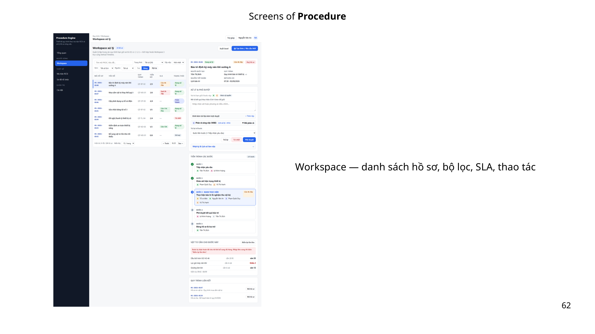

### 2.1. Tạo đơn/yêu cầu mới

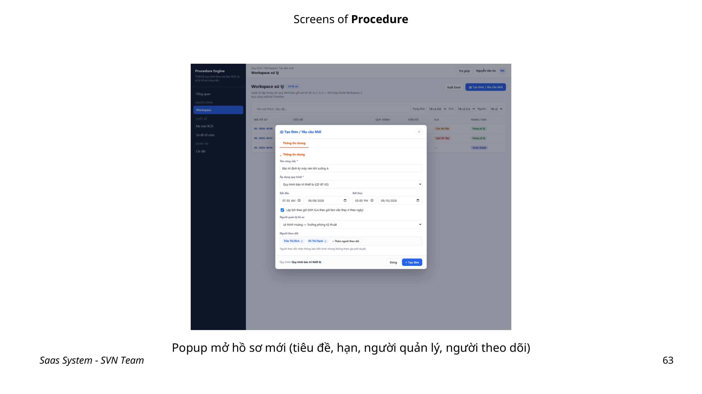

1. Tại Workspace, nhấn `+ Tạo đơn / Yêu cầu mới`.
2. Nhập **Tiêu đề** thể hiện rõ nội dung cần xử lý.
3. Chọn **Áp dụng quy trình ***; chỉ chọn quy trình đã công bố và phù hợp nghiệp vụ.
4. Chọn ngày bắt đầu/kết thúc theo yêu cầu; tích áp lịch theo giờ khi cần tính SLA theo giờ.
5. Chọn **Người quản lý hồ sơ**, thêm người theo dõi nếu cần.
6. Rà soát và lưu để khởi tạo hồ sơ.

| Trường / nút | Loại UI | Bắt buộc | Hướng dẫn |
|---|---|---:|---|
| Tiêu đề | Input | Có | Nêu đối tượng, mục đích và mã tham chiếu nếu có. |
| Áp dụng quy trình | Hộp chọn có tìm kiếm | Có | Chọn đúng luồng đã được công bố. |
| Ngày bắt đầu / kết thúc | DatePicker | Theo quy trình | Đặt mốc kế hoạch; không nhập kết thúc sớm hơn bắt đầu. |
| Áp lịch theo giờ tính SLA | Checkbox | Không | Bật khi thời hạn cần đo theo giờ làm việc/SLA. |
| Người quản lý hồ sơ | Hộp chọn có tìm kiếm | Theo quy trình | Người theo dõi/điều phối hồ sơ. |
| Người theo dõi | Hộp chọn có tìm kiếm | Không | Thêm các bên cần nhận thông tin. |
| `+ Tạo đơn / Yêu cầu mới` | Button | — | Mở popup khởi tạo hồ sơ. |

### 2.2. Xử lý bước hiện tại

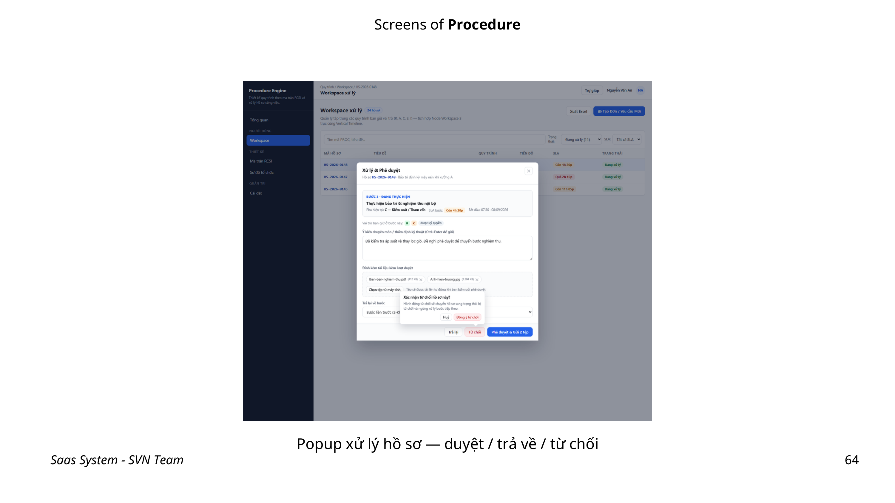

Mở một dòng hồ sơ từ bảng để xem chi tiết. Chỉ người được phân công/được cấp quyền mới có thể thao tác bước hiện tại.

| Nút | Loại UI | Khi dùng | Kết quả |
|---|---|---|---|
| `Phê duyệt & Gửi X tệp` | Button chính | Hồ sơ đã đủ điều kiện chuyển bước | Ghi nhận phê duyệt và gửi tệp được chọn. |
| `Trả lại` | Button | Cần bổ sung/chỉnh sửa trước khi tiếp tục | Chuyển hồ sơ về điểm xử lý theo thiết kế luồng. |
| `Từ chối` | Button cảnh báo | Không chấp thuận yêu cầu | Ghi nhận trạng thái từ chối theo luồng. |
| `Chọn thiết bị` | Button | Hồ sơ cần gắn tài sản | Mở popup chọn tài sản Inventory. |

### 2.3. Gắn thiết bị

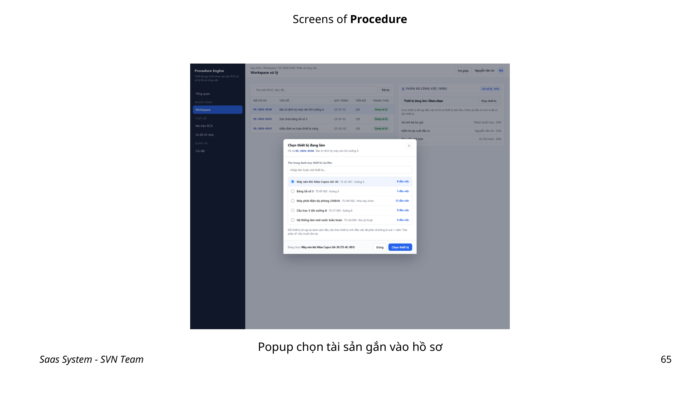

1. Trong chi tiết hồ sơ, nhấn `Chọn thiết bị`.
2. Tìm thiết bị bằng mã/tên, kiểm tra đúng cây tài sản hoặc tình trạng thiết bị.
3. Chọn thiết bị và xác nhận gắn vào hồ sơ.
4. Kiểm tra thiết bị xuất hiện trong chi tiết trước khi phê duyệt/gửi hồ sơ.

> Gắn thiết bị đúng ngay từ đầu giúp lịch sử hồ sơ, vật tư và bảo trì có thể truy vết theo tài sản.

## 3. Công việc con, trao đổi và lịch sử

### 3.1. Công việc con

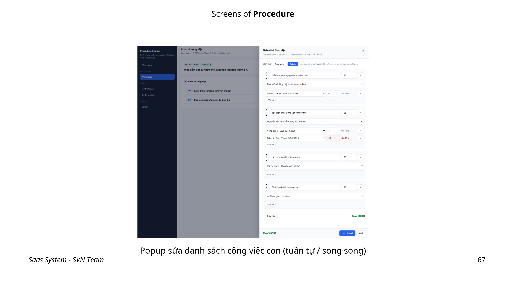

Trong tab **Công việc con**, dùng `Chỉnh sửa công việc phân rã` để tạo hoặc cập nhật bước nhỏ của hồ sơ.

| Thành phần | Loại UI | Hướng dẫn |
|---|---|---|
| Tuần tự / Song song | Radio | Chọn **Tuần tự** nếu việc sau phải chờ việc trước; chọn **Song song** nếu có thể làm đồng thời. |
| Tỷ trọng % | Number input | Nhập tỷ trọng để phản ánh mức độ đóng góp/tiến độ. |
| Người phụ trách | Hộp chọn có tìm kiếm | Chọn đúng nhân sự/chức danh chịu trách nhiệm. |
| Vật tư liên quan | Input / chọn dữ liệu | Ghi/chọn vật tư phục vụ công việc nếu có. |
| `Chỉnh sửa công việc phân rã` | Button | Lưu cấu trúc công việc con sau khi kiểm tra. |

### 3.2. Trao đổi

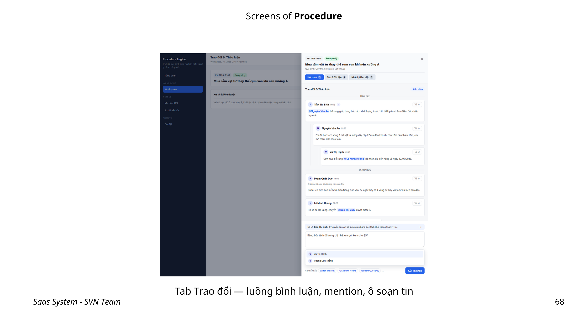

1. Mở tab **Trao đổi**.
2. Viết nội dung ngắn gọn, nêu rõ việc cần phản hồi hoặc quyết định cần xác nhận.
3. Dùng `@mention` để nhắc đúng người; tránh gắn thẻ không cần thiết.
4. Nhấn `Gửi tin nhắn`.

| Thành phần | Loại UI | Mục đích |
|---|---|---|
| Ô soạn thảo | Textarea/editor | Ghi trao đổi gắn với hồ sơ. |
| `@mention` | Action | Nhắc người dùng liên quan. |
| `Gửi tin nhắn` | Button | Lưu và phát nội dung trao đổi. |
| Tab `Lịch sử` | Tab | Xem diễn biến, phiên duyệt và thay đổi trạng thái. |

## 4. Vật tư, liên kết và đính kèm

### 4.1. Yêu cầu vật tư

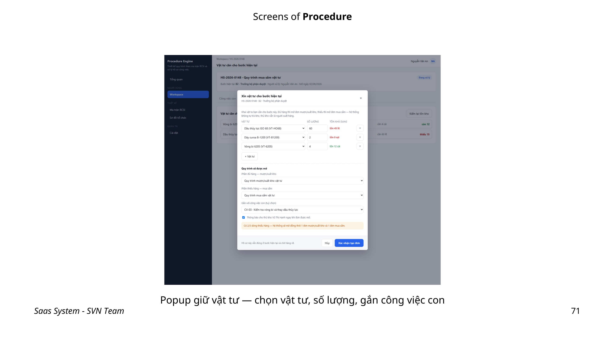

1. Vào tab **Vật tư**, nhấn `+ Vật tư`.
2. Chọn vật tư và nhập số lượng cần dùng.
3. Chọn **Quy trình mượn/xuất kho vật tư** để đưa yêu cầu sang luồng kho thích hợp.
4. Chọn **Gắn vào công việc con** nếu vật tư phục vụ một đầu việc cụ thể.
5. Nhấn `Xác nhận tạo đơn`.

| Trường | Loại UI | Bắt buộc | Ý nghĩa |
|---|---|---:|---|
| Vật tư | Hộp chọn có tìm kiếm | Có | Chọn vật tư từ danh mục Inventory. |
| Số lượng | Number input | Có | Nhập nhu cầu thực tế theo đơn vị tính. |
| Quy trình mượn/xuất kho vật tư | Hộp chọn có tìm kiếm | Có | Xác định luồng xử lý yêu cầu kho. |
| Gắn vào công việc con | Hộp chọn có tìm kiếm | Không | Liên kết nhu cầu với đầu việc phân rã. |
| `Xác nhận tạo đơn` | Button | — | Khởi tạo yêu cầu cấp phát/mượn vật tư. |

### 4.2. Liên kết hồ sơ

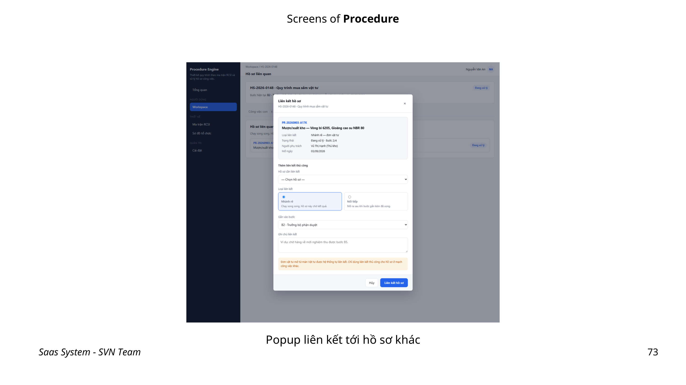

Dùng tab **Liên kết** khi một hồ sơ phụ thuộc, bổ sung hoặc có liên quan tới hồ sơ khác. Nhấn `+ Liên kết hồ sơ`, tìm hồ sơ đích, kiểm tra loại quan hệ và lưu. Chỉ tạo liên kết khi người xử lý sau cần thấy ngữ cảnh đó; tránh liên kết trùng lặp.

### 4.3. Đính kèm tệp

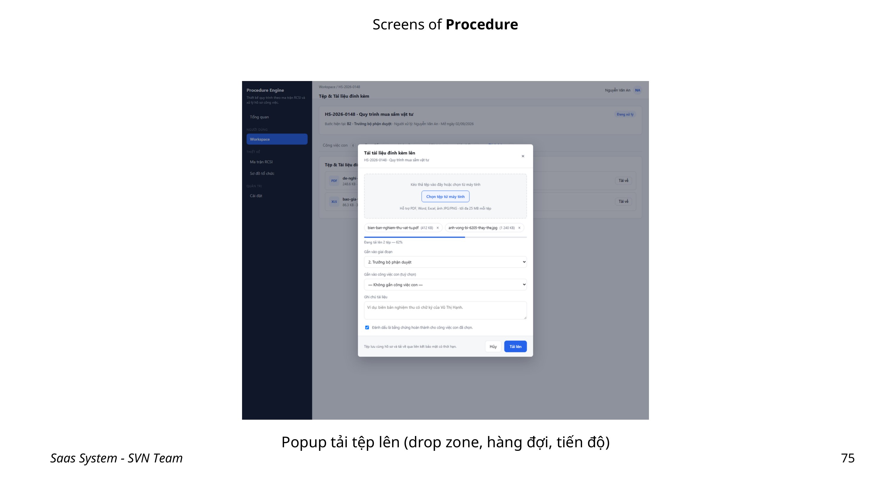

1. Mở tab **Đính kèm**, nhấn `+ Tải tệp lên`.
2. Kéo thả hoặc chọn tệp trong popup.
3. Chọn bước cần gắn tệp.
4. Đánh dấu là **minh chứng hoàn thành** khi tệp là bằng chứng bắt buộc của bước.
5. Xác nhận tải tệp và kiểm tra tên/tệp đã xuất hiện đúng hồ sơ.

| Nội dung | Khuyến nghị |
|---|---|
| Tên tệp | Đặt tên có mã hồ sơ, nội dung và ngày khi phù hợp. |
| Bước gắn tệp | Gắn vào đúng bước để người phê duyệt dễ đối chiếu. |
| Minh chứng hoàn thành | Chỉ đánh dấu tệp là bằng chứng khi tài liệu/ảnh thực sự chứng minh kết quả. |

## 5. Drawer bước và hủy hồ sơ

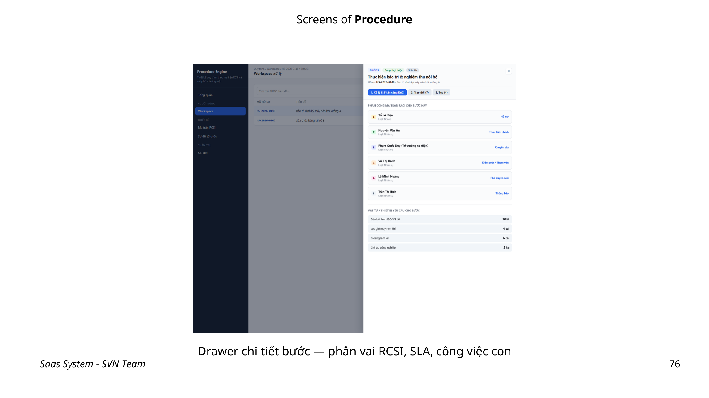

Nhấp vào bước/công việc để mở drawer. Drawer hiển thị phân vai RCSI, thời hạn SLA và nội dung cần xử lý. Dùng thông tin này để biết ai thực hiện, ai rà soát/phê duyệt và mốc cần đáp ứng.

### Hủy hồ sơ

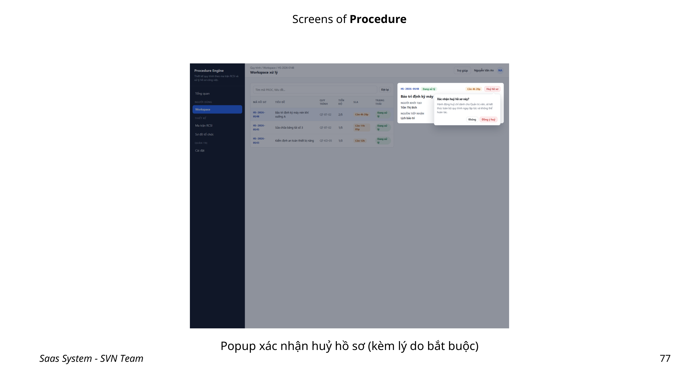

1. Chọn `Hủy hồ sơ` trong chi tiết hồ sơ.
2. Nhập lý do hủy bắt buộc, nêu rõ bối cảnh hoặc mã hồ sơ thay thế khi có.
3. Đọc lại ảnh hưởng đến các bước, yêu cầu vật tư và liên kết.
4. Xác nhận trong Popconfirm chỉ khi hồ sơ không thể tiếp tục.

> Hủy không phải là cách sửa dữ liệu thông thường. Dùng `Trả lại` hoặc chỉnh sửa thông tin khi hồ sơ vẫn cần được xử lý.

## 6. Thiết kế quy trình và ma trận RCSI

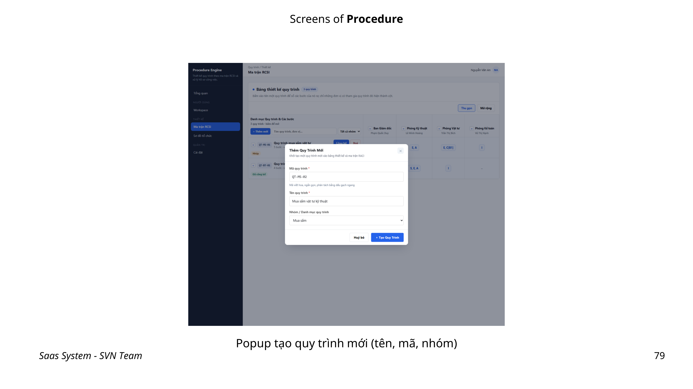

### 6.1. Tạo quy trình

1. Vào danh mục quy trình, nhấn `+ Thêm mới`.
2. Nhập tên, mã, mô tả và các thông tin yêu cầu trong popup.
3. Lưu ở trạng thái bản nháp.
4. Thêm bước, thiết kế RCSI, SLA và kiểm thử trước khi công bố.

### 6.2. Thiết lập ma trận RCSI

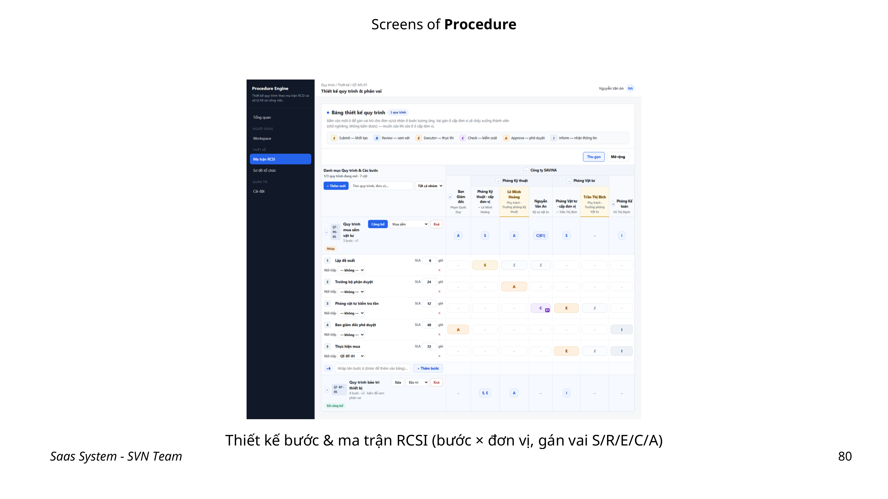

Trong ma trận, **cột** là phòng ban/chức danh từ Sơ đồ tổ chức; **dòng** là các bước quy trình. Nhấp ô giao điểm để gán vai trò. Thêm bước bằng nút `+ Thêm bước`; nhập SLA cho từng bước theo giờ/ngày.

| Ký hiệu | Vai trò | Trách nhiệm thực tế |
|---|---|---|
| `S` | Submit | Khởi tạo/gửi thông tin ở bước. |
| `R` | Review | Rà soát nội dung trước khi chuyển tiếp. |
| `E` | Executor | Thực hiện công việc. |
| `C` | Check | Kiểm tra chất lượng/kết quả. |
| `A` | Approve | Phê duyệt quyết định. |
| `I` | Inform | Nhận thông tin, không nhất thiết xử lý. |

### Quy trình thiết kế RCSI

1. Kiểm tra các phòng ban/chức danh đã tồn tại trong Core và bổ nhiệm còn hiệu lực.
2. Thêm các bước theo trình tự nghiệp vụ.
3. Với từng bước, gán đúng vai trò RCSI tại giao điểm dòng–cột.
4. Nhập SLA; quy ước rõ đơn vị giờ/ngày và cách xử lý quá hạn.
5. Kiểm thử các trường hợp: hồ sơ thường, trả lại, từ chối, người kiêm nhiệm và tệp minh chứng.
6. Rà soát trước khi công bố.

## 7. Công bố, sửa và xóa quy trình

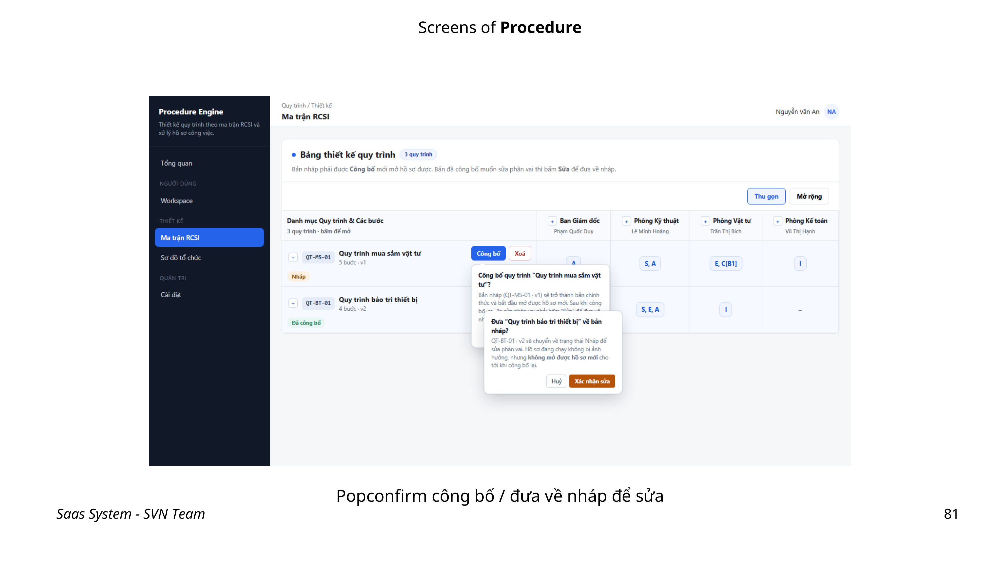

| Nút | Loại UI | Hướng dẫn | Kết quả |
|---|---|---|---|
| `Công bố` | Button + Popconfirm | Xác nhận sau khi đã kiểm thử đầy đủ | Đưa quy trình vào danh sách có thể áp dụng cho hồ sơ mới. |
| `Sửa` | Button + Popconfirm | Đưa quy trình về bản nháp để hiệu chỉnh | Ngăn thay đổi trực tiếp trên bản công bố. |
| `Xóa` | Button + Popconfirm | Chỉ dùng khi không còn nhu cầu sử dụng và không có phụ thuộc | Hệ thống chặn xóa nếu có hồ sơ đang chạy. |

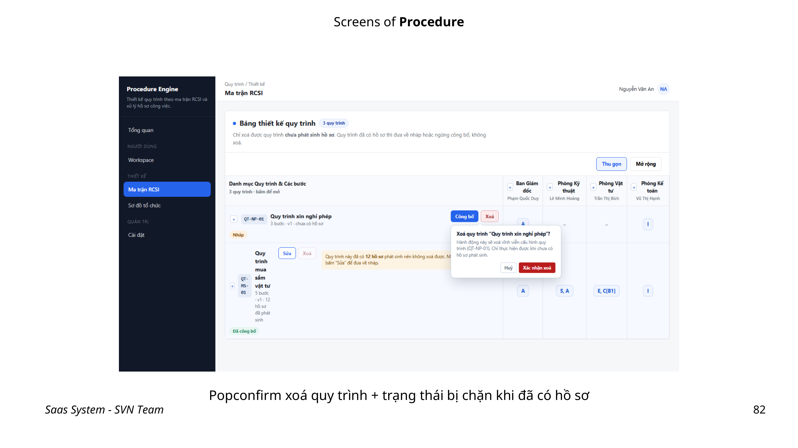

### Kiểm tra trước khi công bố

- [ ] Mã/tên quy trình rõ ràng và không trùng.
- [ ] Mọi bước có người/chức danh chịu trách nhiệm phù hợp.
- [ ] RCSI không bỏ sót bước phê duyệt/kiểm tra cần thiết.
- [ ] SLA có đơn vị, thời hạn hợp lý và được thống nhất.
- [ ] Luồng trả lại/từ chối và minh chứng tệp đã được kiểm thử.

## 8. Cài đặt quy trình và nhóm quy trình

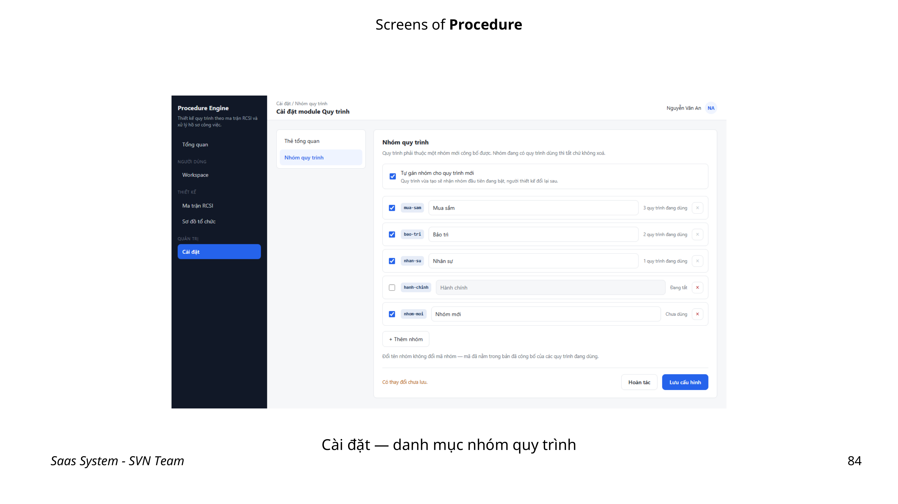

### 8.1. Thẻ tổng quan

Trong tab **Thẻ tổng quan**, bật/tắt thẻ Dashboard theo nhu cầu theo dõi của đơn vị. Chỉ hiển thị chỉ số thật sự phục vụ điều hành để tránh làm Dashboard quá tải.

### 8.2. Tạo nhóm quy trình

1. Vào tab **Nhóm quy trình**, nhấn `+ Thêm nhóm`.
2. Nhập tên nhóm và mã nhóm.
3. Chọn trạng thái bật/tắt; đánh dấu mặc định nếu đây là nhóm dùng làm lựa chọn chuẩn.
4. Lưu và kiểm tra nhóm xuất hiện trong danh mục.

| Trường | Loại UI | Bắt buộc | Hướng dẫn |
|---|---|---:|---|
| Tên nhóm | Input | Có | Tên dễ hiểu theo lĩnh vực nghiệp vụ. |
| Mã nhóm | Input | Có | Mã duy nhất, ổn định. |
| Bật/Tắt | Switch/Checkbox | Có | Kiểm soát khả năng sử dụng nhóm. |
| Đặt mặc định | Checkbox | Không | Chỉ chọn khi đây là nhóm mặc định phù hợp. |
| `+ Thêm nhóm` | Button | — | Mở popup tạo nhóm. |

## 9. Kiểm tra nhanh và xử lý tình huống

| Vấn đề | Cách kiểm tra/xử lý |
|---|---|
| Không tạo được hồ sơ | Kiểm tra đã chọn quy trình công bố, các trường bắt buộc và quyền Workspace. |
| Không thấy nút phê duyệt/từ chối | Kiểm tra tài khoản có được phân công đúng bước/role và trạng thái hồ sơ. |
| Không chọn được phòng ban/chức danh trong RCSI | Rà soát sơ đồ tổ chức, loại node và bổ nhiệm hiệu lực ở Core. |
| Không tạo được yêu cầu vật tư | Kiểm tra danh mục vật tư, số lượng, quy trình kho và quyền Inventory/Procedure. |
| Không thể xóa quy trình | Kiểm tra thông báo phụ thuộc; hoàn tất/hủy đúng quy trình các hồ sơ đang chạy trước. |
| SLA không như kỳ vọng | Kiểm tra đơn vị giờ/ngày, cấu hình áp lịch theo giờ và SLA của từng bước. |

## 10. Checklist bàn giao vận hành

- [ ] Core có sơ đồ tổ chức, chức danh và bổ nhiệm cập nhật.
- [ ] Quy trình được tạo ở bản nháp, có bước/RCSI/SLA đầy đủ và đã kiểm thử.
- [ ] Chỉ công bố sau khi thống nhất chủ sở hữu, người thực hiện, người phê duyệt và trường hợp trả lại/từ chối.
- [ ] Người dùng biết tạo hồ sơ, trao đổi, đính kèm minh chứng và theo dõi lịch sử.
- [ ] Luồng yêu cầu vật tư đã liên kết đúng quy trình kho.
- [ ] Nhóm quy trình và các thẻ Dashboard đã cấu hình theo nhu cầu vận hành.
