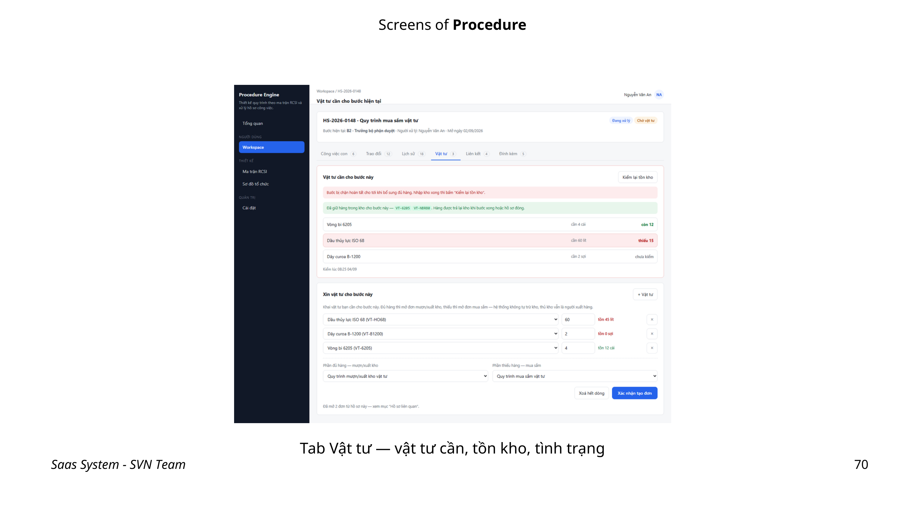

# HƯỚNG DẪN SỬ DỤNG SAAS ENTERPRISE PLATFORM

> Tài liệu tổng hợp cho người dùng doanh nghiệp, tham chiếu bộ ảnh giao diện từ `screen_01.png` đến `screen_85.png`. Các chức năng hiển thị phụ thuộc vào module và quyền mà quản trị viên đã cấp.

## 1. Bắt đầu sử dụng

### 1.1. Điều hướng chung

- Dùng thanh điều hướng để chuyển giữa **Core**, **Kho & Tài sản**, **Bảo trì** và **Quy trình**.
- Nhấp vào một dòng trong bảng hoặc tên đối tượng để mở chi tiết. Chi tiết có thể mở trong trang, popup hoặc ngăn kéo bên phải.
- Các trường chọn trong hệ thống là **hộp chọn có tìm kiếm**: gõ mã hoặc tên, dùng mũi tên lên/xuống để chọn, `Enter` để xác nhận và `Esc` để đóng.
- Trường có dấu `*` là bắt buộc. Lưu biểu mẫu chỉ khi các trường bắt buộc hợp lệ.
- Các thao tác xóa, gỡ, hủy hoặc công bố đều có bước xác nhận. Kiểm tra kỹ đối tượng trước khi xác nhận.

### 1.2. Quy ước thao tác

| Thành phần | Cách dùng | Kết quả |
|---|---|---|
| Nút `+ Thêm` / `+ Tạo` | Khởi tạo dữ liệu mới | Mở popup biểu mẫu |
| Nút `Chỉnh sửa` | Cập nhật đối tượng đang xem | Mở form chỉnh sửa |
| Menu thao tác trên dòng | Chọn thao tác cho đúng một bản ghi | Thực hiện theo bản ghi được chọn |
| Checkbox đầu bảng | Chọn nhiều bản ghi | Hiển thị thao tác hàng loạt |
| Tab | Chuyển nhóm thông tin | Giữ nguyên ngữ cảnh đối tượng |
| Drawer bên phải | Xem/hoàn tất thông tin phụ trợ | Đóng drawer để trở về danh sách |

---

## 2. Core & quản trị doanh nghiệp

### 2.1. Dashboard và danh mục ứng dụng

Từ Dashboard, quản trị viên xem số người dùng, module đã bật và trạng thái gói dịch vụ. Dùng nút `Mở` trên từng thẻ để vào phân hệ tương ứng; `Xem tất cả` mở danh mục ứng dụng.

| Thành phần | Loại | Hướng dẫn |
|---|---|---|
| Ô tìm kiếm ứng dụng | Input | Gõ tên module để lọc ngay danh sách. |
| `Mở ứng dụng` | Button | Vào module đang có trạng thái Active. |
| `Yêu cầu kích hoạt` | Button | Gửi yêu cầu kích hoạt module chưa đăng ký/tạm dừng. |
| `+ Thêm người dùng` | Button | Mở nhanh form tạo tài khoản. |
| `Quản lý vai trò`, `Cài đặt công ty` | Button | Đi tới cấu hình phân quyền hoặc thông tin doanh nghiệp. |

### 2.2. Sơ đồ tổ chức và bổ nhiệm

1. Chọn tab **Cây tổ chức** và nhấn `+ Thêm sơ đồ` nếu doanh nghiệp chưa có sơ đồ.
2. Khai báo tên, mã, mô tả, trạng thái; có thể chọn sơ đồ chính.
3. Nhấn `+ Thêm node` để tạo Công ty, Khối, Phòng ban, Bộ phận hoặc Chức danh.
4. Sắp xếp node trên canvas rồi nhấn `Lưu vị trí các node`.

| Trường / nút | Loại | Mục đích |
|---|---|---|
| `Sơ đồ`, `Node cha`, `Loại node` | SearchableSelect | Xác định cấu trúc và cấp quản lý của node. |
| `Tên`, `Mã node` | Input | Nhập định danh dễ nhận biết; mã nên thống nhất quy ước nội bộ. |
| `Thứ tự` | Number input | Sắp xếp các node cùng cấp. |
| `Lưu thay đổi` | Button | Ghi nhận cấu trúc vừa khai báo. |

Để bổ nhiệm nhân sự, vào tab **Bổ nhiệm**, nhấn `+ Bổ nhiệm người dùng`, chọn **Chức danh** và **Người dùng**, thiết lập thời gian hiệu lực, đánh dấu **Vị trí chính** khi cần rồi lưu.

### 2.3. Người dùng

| Thành phần | Loại | Hướng dẫn |
|---|---|---|
| Tìm kiếm; lọc Trạng thái/Vai trò | Input, SearchableSelect | Thu hẹp danh sách nhân sự. |
| `+ Thêm người dùng` | Button | Nhập họ tên, email, mật khẩu khởi tạo, vai trò và trạng thái. |
| Menu dòng | Action menu | Chỉnh sửa, vô hiệu hóa hoặc xóa theo quyền quản trị. |

---

## 3. Kho, vật tư và cây tài sản

### 3.1. Tìm và quản lý cây thiết bị

1. Nhập mã hoặc tên vào ô tìm kiếm để tìm một thiết bị trên cây.
2. Dùng biểu tượng `+`/`-` trên nhánh để mở rộng hoặc thu gọn; `Thu` thu gọn toàn bộ cây.
3. Nhấn `+ Gốc` để tạo tài sản cấp cao nhất, hoặc chọn thiết bị để mở chi tiết.
4. Dùng `Dạng bảng` khi cần lọc, chọn nhiều và xử lý hàng loạt.

### 3.2. Gỡ/lắp thiết bị và vật tư

| Tình huống | Thao tác |
|---|---|
| Gỡ nhiều thiết bị | Chọn checkbox các dòng, nhấn `Gỡ X thiết bị đã chọn`, chọn kho tiếp nhận cho từng dòng hoặc áp dụng một kho chung, nhập ghi chú rồi xác nhận. |
| Lắp vật tư | Nhấn biểu tượng `+` tại node, chọn **Vật tư cần lắp**, **Xuất từ kho**, nhập số lượng và ghi chú, rồi `Xác nhận xuất kho & lắp`. |
| Tháo một thiết bị/vật tư | Nhấn biểu tượng `-`, chọn **Kho tiếp nhận**; có thể chọn quy trình liên kết để tự tạo Work Order, sau đó xác nhận nhập về kho. |
| Điều chuyển vị trí trên cây | Kéo node đến node cha mới và xác nhận khi hệ thống yêu cầu. |

### 3.3. Chi tiết thiết bị, QR và hồ sơ kỹ thuật

| Tab / thao tác | Cách dùng |
|---|---|
| `Chỉnh sửa` | Cập nhật tên, trạng thái, độ quan trọng và thông tin cơ bản. |
| `+ Thêm thiết bị con` | Tạo tài sản phụ thuộc dưới thiết bị hiện tại. |
| `In mã QR` | Mở xem trước tem 50×30 mm, sau đó chọn in ra máy in tem. |
| **Tổng quan tham số** | Thêm/sửa các thông số kỹ thuật; nhập giá trị theo đơn vị phù hợp. |
| **Tài liệu** | Chọn `Choose File` để đính kèm hồ sơ kỹ thuật. |
| **Lịch sử vận hành – sự cố** | Nhấn `+ Ghi nhận sự cố`, chọn mức ưu tiên/phân loại, nhập tiêu đề và mô tả; tích đồng bộ CMMS nếu cần. |
| **Phụ tùng (BOM)** | Khai báo phụ tùng và đánh dấu vật tư trọng yếu. |
| **Kế hoạch bảo trì** | Khai báo đầu việc, tần suất và thời lượng dự kiến. |

### 3.4. Nhập, xuất, điều chuyển và kiểm kê kho

Khi có yêu cầu cấp phát từ quy trình, dùng `Xem chi tiết` để kiểm tra danh mục. Có thể tải bảng kê CSV, kiểm tra tồn kho rồi chọn `Xử lý phiếu yêu cầu`. Trên từng dòng, chọn **Soi kho**, **Xuất kho món này**, **Chuyển kho**, **Tách kho xuất** hoặc **Đề xuất mua sắm** theo thực tế.

1. Nhấn `+ Xuất/nhập kho`.
2. Chọn tab **Nhập kho**, **Xuất kho** hoặc **Điều chuyển kho**.
3. Chọn kho nguồn/đích, nhập số hóa đơn hoặc lệnh và đính kèm chứng từ nếu có.
4. Rà soát số lượng trước khi xác nhận vì giao dịch sẽ làm thay đổi tồn kho.

Khi tạo vật tư, nhập **Mã SKU**, **Tên vật tư**, đơn vị tính, mức tồn Min/Max và chọn một phương thức quản lý định danh: **Theo Sê-ri**, **Theo Lô** hoặc **Thông thường**. Trong tab **Vị trí & Kho**, dùng `Đổi vị trí kệ` để cập nhật bin location. Trong tab **Kiểm kê**, nhập kết quả đếm và nhấn `Xác nhận số đếm`.

---

## 4. Bảo trì phòng ngừa (CMMS)

### 4.1. Thiết lập ma trận bảo trì

1. Tìm thiết bị theo mã/tên hoặc nhấn `+ Thêm thiết bị từ Kho` để bổ sung vào ma trận.
2. Lọc theo đơn vị, mức ưu tiên; tích chu kỳ **Ngày/Tuần/Tháng/Quý/Năm** cho từng thiết bị.
3. Chọn **Luồng thực thi khi tạo lệnh** và lưu cấu hình.
4. Dùng `Bảo trì ngay` cho một đợt phát sinh ngoài chu kỳ.
5. Nhấp tên thiết bị để mở drawer xem đầu việc, lịch sử và liên kết `Sửa trong Kho`.

Nút `Gỡ` luôn mở xác nhận; chỉ nhấn `Gỡ thiết bị` khi chắc chắn dừng theo dõi thiết bị trong ma trận.

### 4.2. Lịch và nghiệm thu

| Chức năng | Hướng dẫn |
|---|---|
| `+ Tạo lịch bảo trì` | Chọn thiết bị, đầu việc, lịch thực hiện và người phụ trách trong popup. |
| `Tạo sự cố` | Tại tab **Phiếu phát sinh**, lập phiếu khi cần xử lý bất thường. |
| Hoàn thành công việc | Mở lịch sử, nhập **Nội dung thực hiện & Đánh giá kết quả**, tải biên bản/ảnh hiện trường rồi nhấn `Đánh dấu hoàn thành`. |
| Cài đặt module | Bật/tắt thẻ Dashboard, cấu hình tần suất bằng số lượng và đơn vị thời gian. |

---

## 5. Động cơ quy trình và ma trận RCSI

### 5.1. Tạo và xử lý hồ sơ

1. Tại Workspace, nhấn `+ Tạo đơn / Yêu cầu mới`.
2. Nhập tiêu đề, chọn **Áp dụng quy trình**, ngày bắt đầu/kết thúc, tùy chọn SLA theo giờ, người quản lý và người theo dõi.
3. Mở dòng hồ sơ vừa tạo để theo dõi tiến độ và xử lý bước hiện tại.

| Thành phần trong hồ sơ | Cách dùng |
|---|---|
| `Phê duyệt & Gửi X tệp`, `Trả lại`, `Từ chối` | Hoàn tất quyết định tại bước hiện tại; kiểm tra tệp và nội dung trước khi gửi. |
| `Chọn thiết bị` | Gắn tài sản liên quan vào hồ sơ. |
| **Công việc con** | Thêm/sửa đầu việc, chọn tuần tự hoặc song song, tỷ trọng và người phụ trách. |
| **Trao đổi** | Viết bình luận, dùng `@mention` để nhắc người liên quan, rồi gửi tin nhắn. |
| **Lịch sử** | Xem dấu vết các phiên duyệt và thay đổi trạng thái. |
| **Vật tư** | Nhấn `+ Vật tư`, chọn vật tư, số lượng, quy trình kho và công việc con cần gắn. |
| **Liên kết** | Dùng `+ Liên kết hồ sơ` để tạo quan hệ với hồ sơ khác. |
| **Đính kèm** | Tải tệp, gắn tệp vào bước và đánh dấu làm minh chứng hoàn thành. |

Để hủy hồ sơ, chọn `Hủy hồ sơ`, nhập lý do bắt buộc trong hộp xác nhận và xác nhận chỉ khi không thể tiếp tục quy trình.

### 5.2. Thiết kế quy trình và RCSI

1. Vào danh mục quy trình, nhấn `+ Thêm mới`, nhập thông tin quy trình và lưu bản nháp.
2. Trong ma trận, các cột là phòng ban/chức danh lấy từ sơ đồ tổ chức; các dòng là bước xử lý.
3. Nhấp ô giao điểm để gán vai trò: **S** gửi, **R** rà soát, **E** thực hiện, **C** kiểm tra, **A** phê duyệt, **I** nhận thông tin.
4. Nhập SLA theo giờ/ngày cho từng bước và dùng `+ Thêm bước` khi cần.
5. Khi kiểm tra hoàn tất, nhấn `Công bố` và xác nhận để đưa quy trình vào sử dụng.

| Trạng thái / nút | Hướng dẫn |
|---|---|
| `Công bố` | Xác nhận phát hành quy trình cho người dùng. |
| `Sửa` | Đưa quy trình về bản nháp để hiệu chỉnh. |
| `Xóa` | Chỉ xóa khi không còn hồ sơ đang chạy; hệ thống chặn xóa nếu còn phụ thuộc. |
| `+ Thêm nhóm` | Trong Cài đặt Quy trình, tạo nhóm bằng tên, mã, trạng thái và tùy chọn mặc định. |

---

## 6. Khuyến nghị vận hành

- Thiết lập sơ đồ tổ chức và người dùng trước khi phân công bảo trì hoặc thiết kế RCSI.
- Chuẩn hóa mã tài sản, SKU, kho và quy trình để tìm kiếm/lập báo cáo chính xác.
- Luôn đính kèm chứng từ cho giao dịch kho và biên bản/ảnh hiện trường cho việc bảo trì quan trọng.
- Không dùng thao tác gỡ, hủy, vô hiệu hóa hoặc xóa để thay cho việc chỉnh sửa dữ liệu thông thường.
- Nếu không thấy chức năng hoặc không thể lưu, kiểm tra lại quyền truy cập, trạng thái module và các trường bắt buộc.

## 7. Danh mục ảnh tham chiếu

| Phân hệ | Ảnh chính |
|---|---|
| Core & Tenant Portal | 01–07 |
| Kho & cây tài sản | 08–41 |
| Bảo trì | 44–58 |
| Quy trình & RCSI | 62–85 |

Các ảnh còn lại trong thư mục `images/` là ảnh từng bước, popup và trạng thái chi tiết để đối chiếu khi người dùng cần xác minh đúng vị trí thao tác.
