# HƯỚNG DẪN SỬ DỤNG SAAS ENTERPRISE PLATFORM

> Tài liệu hợp nhất hướng dẫn vận hành bốn phân hệ: Core & Tenant Portal, Nhà kho & Cây tài sản, Bảo trì phòng ngừa và Quy trình & RCSI. Tất cả ảnh minh họa được tham chiếu từ thư mục `docs/user-guide/images/`.

## Phạm vi và quy ước chung

Tài liệu áp dụng cho người dùng doanh nghiệp được cấp quyền trên từng module. Các nút tạo, sửa, phê duyệt, công bố, vô hiệu hóa, gỡ, hủy hoặc xóa chỉ xuất hiện khi tài khoản có quyền phù hợp và đang ở đúng ngữ cảnh xử lý.

| Quy ước | Cách dùng |
|---|---|
| Trường có `*` | Là trường bắt buộc; hoàn tất trước khi lưu hoặc xác nhận. |
| Hộp chọn có tìm kiếm | Gõ mã/tên, dùng `↑`/`↓` để di chuyển và `Enter` để chọn. |
| Popup form | Dùng để tạo hoặc cập nhật một đối tượng độc lập. |
| Drawer | Ngăn chi tiết bên phải; đóng drawer để quay lại danh sách. |
| Popconfirm | Hộp xác nhận ngay tại thao tác có ảnh hưởng, như gỡ, hủy, công bố hoặc xóa. |
| Checkbox trong bảng | Dùng để chọn nhiều dòng và kích hoạt thao tác hàng loạt. |

## Trình tự triển khai liên module

1. Thiết lập tổ chức, người dùng, vai trò và bổ nhiệm tại **Core**.
2. Chuẩn hóa kho, vật tư, vị trí kệ và cây tài sản tại **Nhà kho**.
3. Khai báo thiết bị, đầu việc, tần suất và vận hành tại **Bảo trì**.
4. Thiết kế/công bố luồng RCSI, sau đó tạo và xử lý hồ sơ tại **Quy trình**.

## Mục lục

1. Core & Tenant Portal
2. Nhà kho & Cây tài sản
3. Bảo trì phòng ngừa (CMMS)
4. Quy trình & Ma trận RCSI

---
# PHẦN I. CORE & TENANT PORTAL

> Phạm vi: Dashboard, Ứng dụng, Sơ đồ tổ chức và Người dùng; tham chiếu ảnh 01–07. Hoàn tất phần này trước khi vận hành Kho, Bảo trì và Quy trình.

## 1. Mục tiêu và điều kiện sử dụng

Core là nơi quản trị nền tảng doanh nghiệp: kiểm tra thuê bao/module, xây dựng sơ đồ tổ chức, bổ nhiệm nhân sự và quản lý tài khoản. Các nút tạo, sửa, vô hiệu hóa và xóa chỉ hiện với tài khoản có quyền quản trị tenant.

| Thành phần chung | Cách dùng | Lưu ý |
|---|---|---|
| Hộp chọn có tìm kiếm | Gõ tên/mã, dùng `↑`/`↓`, `Enter` để chọn | Dùng cho Sơ đồ, Node cha, Chức danh, Người dùng, Vai trò. |
| Trường có `*` | Nhập/chọn trước khi lưu | Hệ thống báo lỗi nếu để trống. |
| Checkbox | Nhấp để bật/tắt | Kiểm tra kỹ tác động trước khi chọn sơ đồ/vị trí chính. |
| `Lưu thay đổi` | Ghi dữ liệu biểu mẫu | Chỉ lưu khi dữ liệu hợp lệ. |
| `Hủy` hoặc nút đóng | Hủy dữ liệu chưa lưu | Không tác động đến dữ liệu hiện có. |
| Menu ba chấm | Thao tác cho từng dòng | Luôn kiểm tra đúng tên bản ghi. |

## 2. Dashboard Tenant Portal

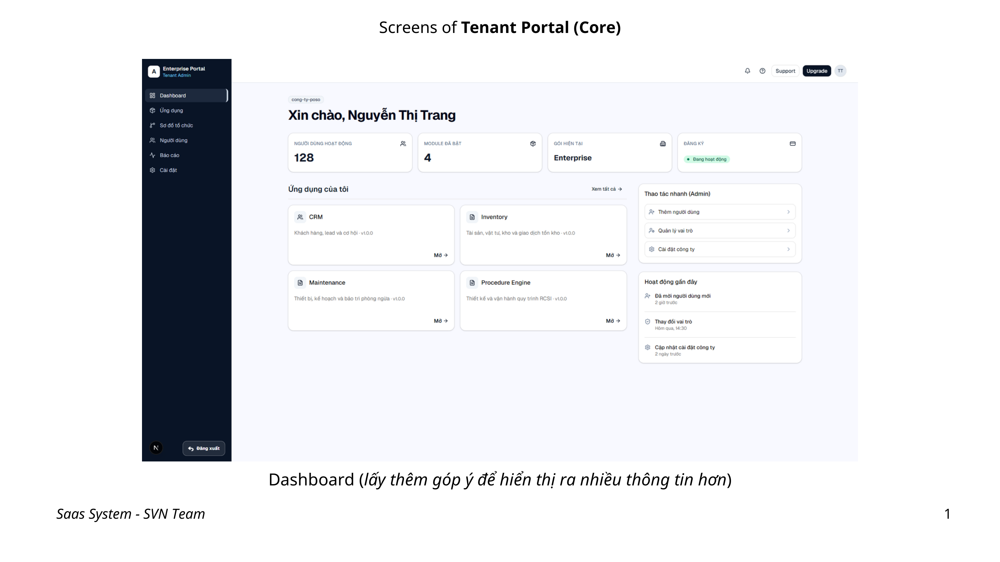

### Mục đích

Dashboard là điểm bắt đầu của quản trị viên: theo dõi số tài khoản hoạt động, module đã bật, gói dịch vụ và điều hướng nhanh đến từng phân hệ.

| Thành phần | Loại UI | Mục đích | Kết quả khi thao tác |
|---|---|---|---|
| **Người dùng hoạt động** | Thẻ chỉ số | Tổng tài khoản được phép đăng nhập | Mở danh sách Người dùng để kiểm tra. |
| **Module đã bật** | Thẻ chỉ số | Số phân hệ sẵn sàng sử dụng | Mở danh mục Ứng dụng. |
| **Gói hiện tại** | Thẻ chỉ số | Gói SaaS của tenant | Đối chiếu phạm vi tính năng được cấp. |
| **Đăng ký** | Nhãn trạng thái | Hiệu lực thuê bao | Theo dõi tình trạng sử dụng dịch vụ. |
| `Mở →` CRM / Inventory / Maintenance / Procedure Engine | Button | Vào phân hệ tương ứng | Chuyển vùng làm việc nếu module đang Active. |
| `Xem tất cả →` | Link | Xem toàn bộ module | Mở trang Ứng dụng. |
| `+ Thêm người dùng` | Button | Tạo nhanh tài khoản nhân sự | Mở form tạo người dùng. |
| `Quản lý vai trò` | Button | Quản trị vai trò/phân quyền | Mở cấu hình khi có quyền. |
| `Cài đặt công ty` | Button | Quản lý thông tin tenant | Mở khu vực cài đặt doanh nghiệp. |

### Quy trình kiểm tra đầu ngày

1. Kiểm tra nhãn **Đăng ký** đang hoạt động.
2. Đối chiếu số **Người dùng hoạt động** nếu vừa có thay đổi nhân sự.
3. Kiểm tra module cần dùng đã được bật.
4. Nhấn `Mở →` trên thẻ module cần làm việc.

## 3. Ứng dụng doanh nghiệp

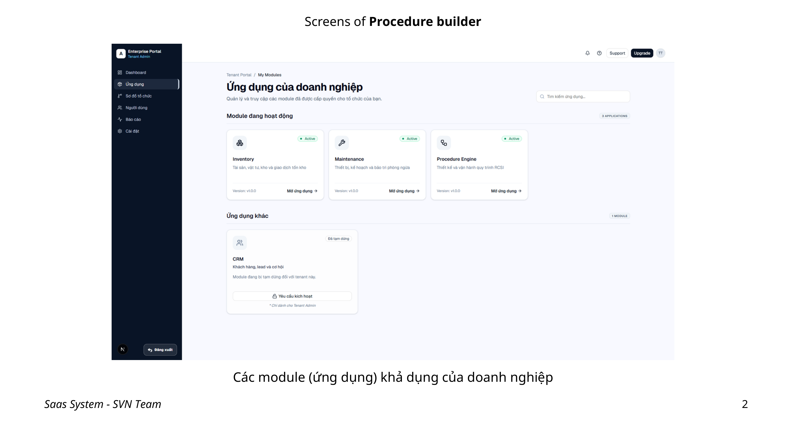

Màn hình này dùng để tìm module, kiểm tra module đang khả dụng hoặc đề nghị kích hoạt module mới.

| Thành phần | Loại UI | Hướng dẫn |
|---|---|---|
| Ô tìm kiếm ứng dụng | Input | Gõ toàn bộ/một phần tên để lọc thẻ ứng dụng. |
| Nhãn `Active` | Nhãn trạng thái | Module có thể mở và sử dụng theo quyền tài khoản. |
| `Mở ứng dụng →` | Button | Đi vào module có trạng thái Active. |
| Ứng dụng khác | Danh sách thẻ | Hiển thị module chưa đăng ký hoặc tạm dừng. |
| `Yêu cầu kích hoạt` | Button | Gửi yêu cầu đến đầu mối quản trị dịch vụ SaaS. |

### Kích hoạt module

1. Tìm module trong danh sách **Ứng dụng khác**.
2. Xác nhận module chưa có trạng thái Active.
3. Nhấn `Yêu cầu kích hoạt`.
4. Chờ đầu mối quản trị kích hoạt; sau đó người dùng vẫn cần được cấp quyền phù hợp để truy cập.

## 4. Sơ đồ tổ chức

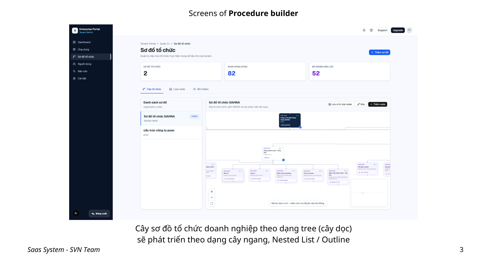

### Trình tự thiết lập khuyến nghị

1. Tạo sơ đồ tổ chức.
2. Rà soát hoặc bổ sung loại node.
3. Tạo node từ cấp cao xuống: Pháp nhân → Khối → Phòng ban → Bộ phận → Chức danh.
4. Lưu vị trí hiển thị trên canvas.
5. Bổ nhiệm người dùng vào chức danh.

| Thành phần | Loại UI | Cách dùng | Kết quả |
|---|---|---|---|
| Thẻ **Số sơ đồ tổ chức** | Thẻ chỉ số | Theo dõi số mô hình đang lưu | Kiểm soát phạm vi cấu hình. |
| Thẻ **Node đang dùng** | Thẻ chỉ số | Theo dõi số đơn vị/chức danh | Chỉ hiển thị. |
| Thẻ **Bổ nhiệm hiệu lực** | Thẻ chỉ số | Theo dõi số bổ nhiệm còn hiệu lực | Đối chiếu mức độ hoàn thiện nhân sự. |
| Tab `Cây tổ chức` | Tab | Quay lại canvas | Hiển thị quan hệ cha–con. |
| Tab `Loại node` | Tab | Quản lý danh mục cấp tổ chức | Mở registry loại node. |
| Tab `Bổ nhiệm` | Tab | Gán người vào chức danh | Mở danh sách bổ nhiệm. |
| `+ Thêm sơ đồ` | Button | Khởi tạo mô hình mới | Mở form sơ đồ. |
| `+ Thêm node` | Button | Bổ sung đơn vị/chức danh | Mở form node. |
| `Lưu vị trí các node` | Button | Nhấn sau khi sắp xếp node | Lưu tọa độ canvas. |
| `Sửa` | Button | Cập nhật sơ đồ đang chọn | Mở form chỉnh sửa. |
| Zoom `+`, `-`, Reset | Icon button | Phóng/thu/cân góc nhìn | Không đổi cấu trúc dữ liệu. |

### Tạo hoặc cập nhật sơ đồ

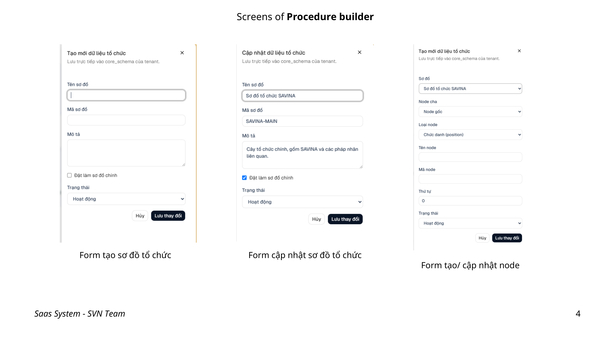

1. Nhấn `+ Thêm sơ đồ`; dùng `Sửa` nếu cập nhật sơ đồ hiện có.
2. Nhập tên hiển thị và mã duy nhất, ví dụ `COMPANY-MAIN`.
3. Nhập mô tả về phạm vi/pháp nhân áp dụng.
4. Chọn **Đặt làm sơ đồ chính** chỉ nếu đây là sơ đồ chuẩn đang dùng.
5. Chọn trạng thái, sau đó nhấn `Lưu thay đổi`.

| Trường | Loại | Bắt buộc | Hướng dẫn |
|---|---|---:|---|
| Tên sơ đồ | Input | Có | Tên dễ nhận biết của mô hình tổ chức. |
| Mã sơ đồ | Input | Có | Mã duy nhất; nên dùng chữ in hoa và dấu gạch nối. |
| Mô tả | Textarea | Không | Ghi phạm vi hoặc lưu ý quản trị. |
| Đặt làm sơ đồ chính | Checkbox | Không | Chọn cho sơ đồ làm nguồn tổ chức hiện hành. |
| Trạng thái | Hộp chọn | Có | Hoạt động hoặc tạm dừng theo chính sách nội bộ. |

### Tạo hoặc cập nhật node

1. Chọn sơ đồ cần bổ sung và nhấn `+ Thêm node`.
2. Chọn **Node cha**; dùng **Node gốc** nếu đây là cấp cao nhất.
3. Chọn loại node, nhập tên, mã, thứ tự và trạng thái.
4. Nhấn `Lưu thay đổi`, kiểm tra node xuất hiện đúng nhánh.

| Trường | Loại | Bắt buộc | Ý nghĩa |
|---|---|---:|---|
| Sơ đồ | Hộp chọn có tìm kiếm | Có | Sơ đồ chứa node. |
| Node cha | Hộp chọn có tìm kiếm | Có | Đơn vị cấp trên hoặc Node gốc. |
| Loại node | Hộp chọn có tìm kiếm | Có | Bản chất tổ chức/chức danh. |
| Tên node | Input | Có | Tên hiển thị trên cây. |
| Mã node | Input | Có | Mã quản trị nội bộ. |
| Thứ tự | Number input | Không | Thứ tự giữa các node cùng cấp. |
| Trạng thái | Hộp chọn | Có | Hiệu lực của node. |

> Không đổi node cha hoặc vô hiệu hóa node đang là nguồn phân quyền/quy trình nếu chưa đánh giá người dùng, bổ nhiệm và hồ sơ liên quan.

## 5. Danh mục loại node

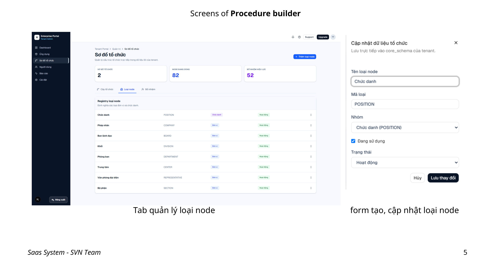

| Mã | Tên gợi ý | Nhóm |
|---|---|---|
| `COMPANY` | Pháp nhân | Đơn vị |
| `BOARD` | Ban lãnh đạo | Đơn vị |
| `DIVISION` | Khối | Đơn vị |
| `DEPARTMENT` | Phòng ban | Đơn vị |
| `CENTER` | Trung tâm | Đơn vị |
| `REPRESENTATIVE` | Văn phòng đại diện | Đơn vị |
| `SECTION` | Bộ phận | Đơn vị |
| `POSITION` | Chức danh | Chức danh |

### Thêm hoặc cập nhật loại node

1. Vào tab **Loại node**, nhấn `+ Thêm loại node`, hoặc mở menu ba chấm ở dòng muốn sửa.
2. Nhập **Tên loại node**, **Mã loại**, chọn **Nhóm**.
3. Đánh dấu **Đang sử dụng** nếu loại node được phép chọn khi tạo node; chọn trạng thái phù hợp.
4. Nhấn `Lưu thay đổi`.

| Thành phần | Loại UI | Ý nghĩa |
|---|---|---|
| Tên loại node, Mã loại | Input | Tên hiển thị và mã danh mục. Tránh đổi mã đang được sử dụng. |
| Nhóm | Hộp chọn | Phân loại thành Đơn vị hoặc Chức danh. |
| Đang sử dụng | Checkbox | Cho phép/ngừng cho phép loại node trong form tạo node. |
| Trạng thái | Hộp chọn | Kiểm soát hiệu lực danh mục. |
| Menu ba chấm | Action menu | Cập nhật đúng loại node trên dòng được chọn. |

## 6. Bổ nhiệm người dùng

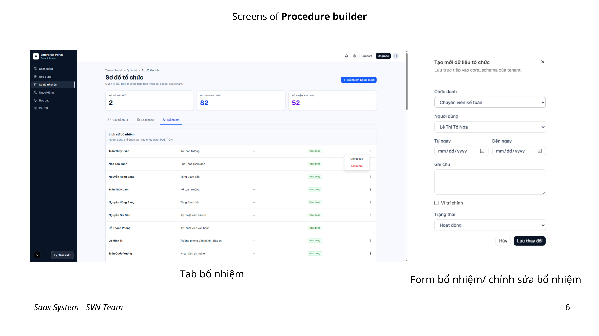

Tạo bổ nhiệm sau khi đã có tài khoản người dùng và node thuộc nhóm Chức danh. Bổ nhiệm là dữ liệu nguồn để quy trình và phân công xác định người giữ vai trò.

### Quy trình bổ nhiệm

1. Mở tab **Bổ nhiệm**, nhấn `+ Bổ nhiệm người dùng`.
2. Chọn **Chức danh** và **Người dùng**.
3. Nhập **Từ ngày**; nhập **Đến ngày** nếu có thời hạn.
4. Đánh dấu **Vị trí chính** nếu đây là vai trò chính của nhân sự.
5. Thêm ghi chú/số quyết định khi cần và lưu.

| Trường | Loại | Bắt buộc | Hướng dẫn |
|---|---|---:|---|
| Chức danh | Hộp chọn có tìm kiếm | Có | Chỉ chọn node thuộc nhóm Chức danh. |
| Người dùng | Hộp chọn có tìm kiếm | Có | Chọn tài khoản đang hoạt động. |
| Từ ngày / Đến ngày | DatePicker | Từ ngày: Có | Xác định khoảng hiệu lực. |
| Vị trí chính | Checkbox | Không | Dùng khi nhân sự kiêm nhiệm nhiều vai trò. |
| Ghi chú | Textarea | Không | Lưu số quyết định hoặc lý do điều chuyển. |
| Menu chỉnh sửa/kết thúc | Action menu | — | Cập nhật hiệu lực theo chính sách nội bộ. |

## 7. Quản lý người dùng

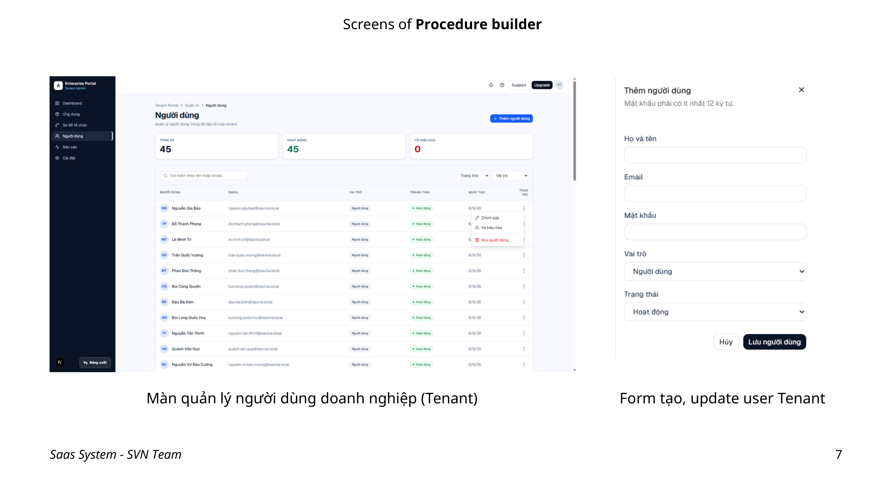

### Tra cứu và thao tác

| Thành phần | Loại UI | Hướng dẫn |
|---|---|---|
| Thẻ Tổng số / Hoạt động / Vô hiệu hóa | Thẻ chỉ số | Theo dõi cơ cấu trạng thái tài khoản. |
| Ô tìm kiếm nhân viên | Input tìm kiếm | Nhập họ tên hoặc email để lọc. |
| Lọc Trạng thái, Lọc Vai trò | Hộp chọn có tìm kiếm | Thu hẹp danh sách theo điều kiện. |
| `+ Thêm người dùng` | Button | Mở biểu mẫu tạo tài khoản. |
| Menu thao tác | Action menu | Chỉnh sửa, vô hiệu hóa hoặc xóa theo quyền. |

### Tạo người dùng mới

1. Nhấn `+ Thêm người dùng`.
2. Nhập họ tên đầy đủ và email doanh nghiệp; email dùng để đăng nhập.
3. Nhập mật khẩu khởi tạo tối thiểu **6 ký tự**.
4. Chọn vai trò theo đúng trách nhiệm công việc và trạng thái **Hoạt động** nếu cần truy cập ngay.
5. Lưu, sau đó tìm lại bằng email để xác nhận đã tạo đúng.

| Trường | Loại | Bắt buộc | Lưu ý |
|---|---|---:|---|
| Họ và tên | Input | Có | Tên nhận diện trong trao đổi/báo cáo. |
| Email | Email input | Có | Đúng định dạng và không trùng tài khoản hiện có. |
| Mật khẩu khởi tạo | Password input | Có | Tối thiểu 6 ký tự, không gửi qua kênh không an toàn. |
| Vai trò | Hộp chọn có tìm kiếm | Có | Quyết định phạm vi quyền. |
| Trạng thái | Hộp chọn | Có | Hoạt động cho phép đăng nhập; Vô hiệu hóa chặn truy cập. |

### Vô hiệu hóa, chỉnh sửa và xóa

- Dùng **Chỉnh sửa** khi cần thay đổi tên, vai trò hoặc trạng thái.
- Dùng **Vô hiệu hóa** khi nhân sự tạm thời không được truy cập; đây là phương án giữ lịch sử nghiệp vụ.
- Chỉ **Xóa** tài khoản tạo nhầm khi chính sách lưu trữ cho phép; kiểm tra kỹ tên/email trước khi xác nhận.

## 8. Kiểm tra nhanh và xử lý sự cố

| Vấn đề | Cách xử lý |
|---|---|
| Không thấy module | Vào **Ứng dụng**, kiểm tra trạng thái Active; nếu chưa bật, gửi yêu cầu kích hoạt. |
| Không thấy nút thêm/sửa/xóa | Nhờ Tenant Admin kiểm tra vai trò và quyền. |
| Không thể lưu form | Rà soát trường bắt buộc, mã trùng, email và trạng thái lựa chọn. |
| Không chọn được người để bổ nhiệm | Kiểm tra tài khoản đang hoạt động và node Chức danh đã tồn tại. |
| Quy trình không tìm được chức danh/phòng ban | Rà soát node, loại node và hiệu lực bổ nhiệm trong Core. |

## 9. Checklist bàn giao vận hành

- [ ] Sơ đồ tổ chức chính đang hoạt động.
- [ ] Đơn vị/chức danh có tên và mã thống nhất.
- [ ] Vị trí node trên canvas đã được lưu.
- [ ] Người dùng cần thiết đã được tạo và cấp vai trò.
- [ ] Các bổ nhiệm có hiệu lực đã được khai báo.
- [ ] Module nghiệp vụ cần triển khai có trạng thái Active.

---

# PHẦN II. NHÀ KHO & CÂY TÀI SẢN

> Phạm vi: Cây thiết bị, danh mục vật tư, giao dịch kho, yêu cầu cấp phát và kiểm kê (ảnh 08–41). Người dùng cần có quyền Inventory phù hợp; giao dịch nhập/xuất/điều chuyển tác động đến tồn kho và phải được kiểm tra trước khi xác nhận.

## 1. Mục tiêu và quy ước vận hành

Module Nhà kho quản lý đồng thời vật tư trong kho và thiết bị/tài sản ngoài hiện trường. Thiết bị có thể được tổ chức theo cây; vật tư có thể lắp vào, tháo khỏi thiết bị hoặc giao dịch qua phiếu kho.

| Quy ước | Ý nghĩa |
|---|---|
| `*` | Trường bắt buộc. |
| Hộp chọn có tìm kiếm | Gõ mã hoặc tên, dùng `↑`/`↓` và `Enter` để chọn. |
| Checkbox trong bảng | Chọn nhiều dòng để xử lý hàng loạt. |
| Biểu tượng `+` / `-` trên node | Mở rộng/thu gọn nhánh; trong ngữ cảnh thao tác có thể mở lắp/tháo. Đọc nhãn/hộp thoại trước khi xác nhận. |
| `Kho tiếp nhận` | Kho nhận vật tư/thiết bị được tháo về. |
| `Kho xuất` | Kho giảm tồn khi vật tư được lắp hoặc xuất. |

### Trình tự khuyến nghị

1. Chuẩn hóa kho, vị trí kệ, SKU và đơn vị tính.
2. Tạo cây tài sản/thiết bị theo vị trí thực tế.
3. Khai báo tài liệu, thông số, BOM và kế hoạch bảo trì cho thiết bị quan trọng.
4. Xử lý cấp phát, nhập/xuất/điều chuyển theo chứng từ.
5. Đối chiếu tồn và thực hiện kiểm kê định kỳ.

## 2. Cây thiết bị vận hành

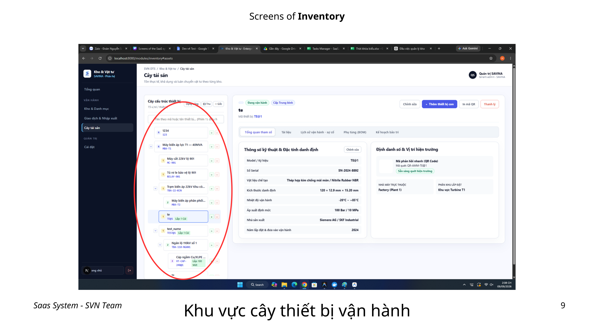

### 2.1. Thành phần chính

| Thành phần | Loại UI | Cách dùng | Kết quả |
|---|---|---|---|
| `Dạng bảng` | Button | Chuyển từ cây sang danh sách | Dễ lọc, chọn nhiều và thao tác hàng loạt. |
| `Thu` | Button | Thu gọn toàn bộ nhánh đang mở | Giảm độ rối của cây. |
| `+ Gốc` | Button | Tạo thiết bị/node cấp cao nhất | Mở form tạo node gốc. |
| Tìm theo mã hoặc tên thiết bị | Input tìm kiếm | Nhập mã/tên thiết bị | Định vị nhanh node phù hợp. |
| Biểu tượng mở/thu nhánh | Icon button | Nhấp trên một nhánh | Hiện hoặc ẩn node con. |
| Tên node | Link/row action | Nhấp thiết bị cần xem | Mở hồ sơ chi tiết thiết bị. |

### 2.2. Tìm thiết bị và duy trì cây

1. Nhập mã hoặc tên thiết bị vào ô tìm kiếm.
2. Mở các nhánh liên quan bằng biểu tượng mở rộng; nhấn `Thu` để quay về trạng thái gọn.
3. Dùng `+ Gốc` để tạo tài sản đầu cấp, sau đó tạo node con theo cấu trúc thực tế.
4. Nhấp tên node để cập nhật hồ sơ thay vì tạo lại dữ liệu trùng lặp.

> Mã thiết bị nên ổn định, duy nhất và nhất quán với tem QR, chứng từ kho và hồ sơ bảo trì.

## 3. Thiết bị dạng bảng và xử lý hàng loạt

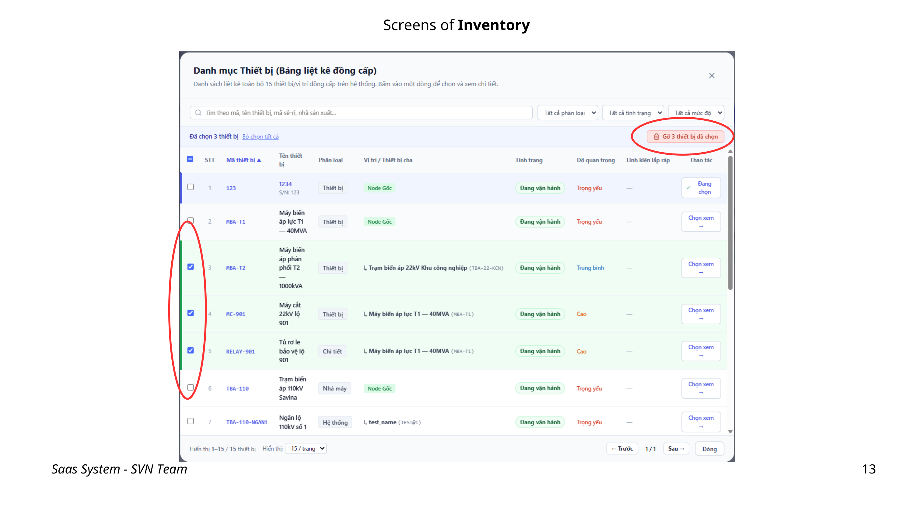

### 3.1. Chọn và gỡ nhiều thiết bị

| Thành phần | Loại UI | Hướng dẫn |
|---|---|---|
| Checkbox từng dòng | Checkbox | Chọn các thiết bị cần gỡ. |
| Checkbox đầu bảng | Checkbox | Chọn tất cả thiết bị trong phạm vi danh sách hiện tại. |
| `Gỡ X thiết bị đã chọn` | Button cảnh báo | Chỉ dùng sau khi đã rà soát số lượng và đối tượng được chọn. |
| Form tháo dỡ hàng loạt | Popup form | Khai báo kho nhận và ghi chú cho giao dịch gỡ. |

### 3.2. Quy trình gỡ hàng loạt

1. Chuyển sang `Dạng bảng` và lọc danh sách nếu cần.
2. Chọn checkbox của từng thiết bị hoặc checkbox đầu bảng.
3. Kiểm tra nhãn `Gỡ X thiết bị đã chọn` để xác nhận đúng số lượng.
4. Nhấn nút gỡ; trong popup, chọn **Áp dụng kho chung** nếu tất cả cùng trả về một kho.
5. Chọn **Kho tiếp nhận** cho từng dòng còn lại, nhập ghi chú tháo dỡ.
6. Nhấn `Xác nhận tháo dỡ (X thiết bị)`.

| Trường trong popup | Loại | Bắt buộc | Mục đích |
|---|---|---:|---|
| Áp dụng kho chung cho tất cả các dòng | Hộp chọn | Không | Dùng một kho tiếp nhận cho nhiều thiết bị. |
| Kho tiếp nhận | Hộp chọn có tìm kiếm | Có | Kho nhận thiết bị/vật tư sau khi gỡ. |
| Ghi chú tháo dỡ | Textarea | Không | Ghi lý do, tình trạng hoặc số chứng từ. |
| `Xác nhận tháo dỡ` | Button | — | Ghi nhận thao tác và cập nhật trạng thái/tồn liên quan. |

## 4. Lắp vật tư và tháo dỡ đơn lẻ

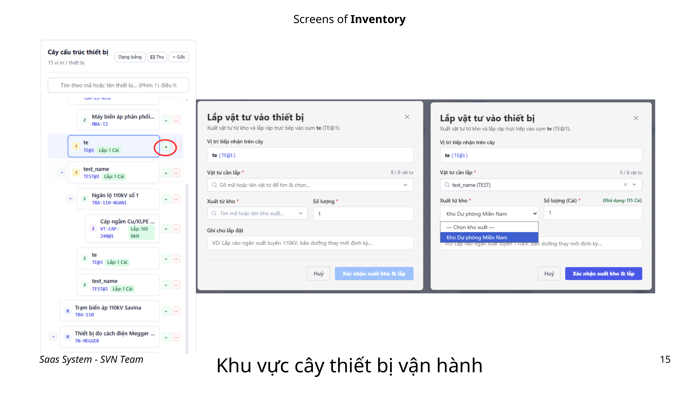

### 4.1. Lắp vật tư vào thiết bị

1. Tại cây thiết bị, chọn đúng node đích và dùng thao tác lắp (`+`).
2. Trong popup **Lắp vật tư vào thiết bị**, tìm và chọn **Vật tư cần lắp**.
3. Chọn **Xuất từ kho**; kiểm tra số lượng khả dụng hệ thống hiển thị.
4. Nhập **Số lượng**, ghi chú lắp đặt nếu cần.
5. Nhấn `Xác nhận xuất kho & lắp`.

| Trường / nút | Loại UI | Bắt buộc | Hướng dẫn |
|---|---|---:|---|
| Vật tư cần lắp | Hộp chọn có tìm kiếm | Có | Tìm theo mã SKU hoặc tên vật tư. |
| Xuất từ kho | Hộp chọn có tìm kiếm | Có | Chọn kho có đủ số lượng khả dụng. |
| Số lượng | Number input | Có | Không vượt quá số lượng khả dụng. |
| Ghi chú lắp đặt | Textarea | Không | Ghi vị trí, tình trạng hoặc yêu cầu kỹ thuật. |
| `Xác nhận xuất kho & lắp` | Button | — | Xuất vật tư khỏi kho và liên kết với thiết bị. |

### 4.2. Tháo dỡ đơn lẻ và liên kết Work Order

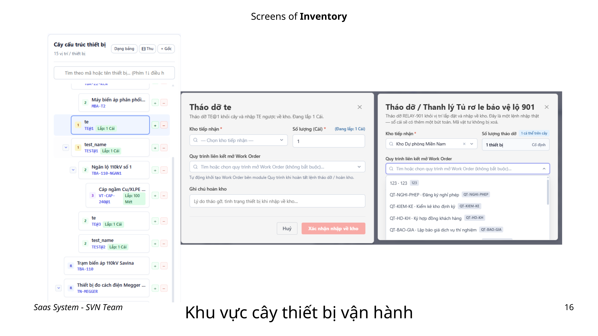

1. Chọn thiết bị/vật tư cần tháo và dùng thao tác tháo (`-`).
2. Chọn **Kho tiếp nhận**.
3. Nếu công việc tháo dỡ cần được theo dõi, chọn **Quy trình liên kết mở Work Order**; trường này không bắt buộc.
4. Nhập ghi chú cần thiết, rồi nhấn `Xác nhận nhập về kho`.

| Trường | Loại UI | Ý nghĩa |
|---|---|---|
| Kho tiếp nhận | Hộp chọn có tìm kiếm | Kho nhận lại vật tư/thiết bị đã tháo. |
| Quy trình liên kết mở Work Order | Hộp chọn có tìm kiếm | Tự khởi tạo Work Order bên module Quy trình khi có nhu cầu theo dõi công việc. |
| Ghi chú | Textarea | Lý do tháo dỡ, tình trạng, thông tin hiện trường. |
| `Xác nhận nhập về kho` | Button | Hoàn tất nghiệp vụ tháo và nhập kho. |

### 4.3. Điều chuyển node trên cây

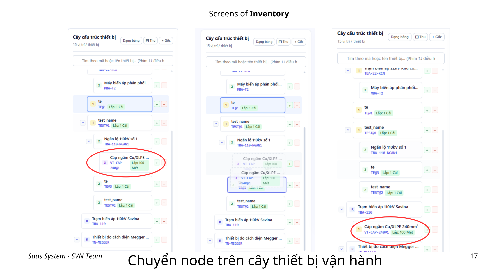

Kéo node cần điều chuyển đến node cha mới theo cấu trúc thực tế. Trước khi thả, kiểm tra node đích có đúng vị trí/quản lý trực tiếp không. Sau khi hệ thống xác nhận, mở lại cây để bảo đảm quan hệ cha–con đã cập nhật đúng.

## 5. Hồ sơ chi tiết thiết bị

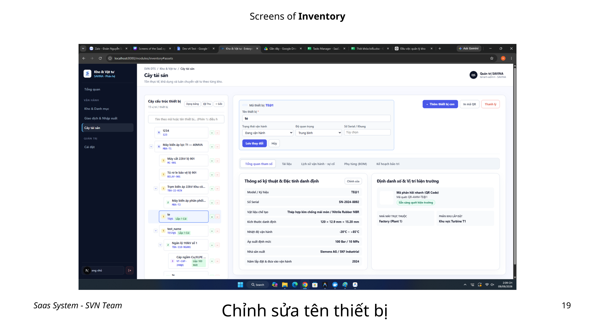

### 5.1. Thao tác cơ bản

| Thành phần | Loại UI | Hướng dẫn |
|---|---|---|
| `Chỉnh sửa` | Button | Cập nhật tên, trạng thái, độ quan trọng và dữ liệu cơ bản. |
| `+ Thêm thiết bị con` | Button | Tạo tài sản phụ thuộc dưới thiết bị đang mở. |
| `In mã QR` | Button | Mở xem trước tem nhãn; chọn in khi đúng thiết bị và kích cỡ tem. |
| Tab `Tổng quan tham số` | Tab | Khai báo thông số kỹ thuật. |
| Tab `Tài liệu` | Tab | Đính kèm hồ sơ kỹ thuật/chứng từ. |
| Tab `Lịch sử vận hành – sự cố` | Tab | Xem và ghi nhận sự cố. |
| Tab `Phụ tùng (BOM)` | Tab | Khai báo phụ tùng cấu thành. |
| Tab `Kế hoạch bảo trì` | Tab | Xây dựng đầu việc và chu kỳ bảo trì. |

### 5.2. QR, thông số và tài liệu

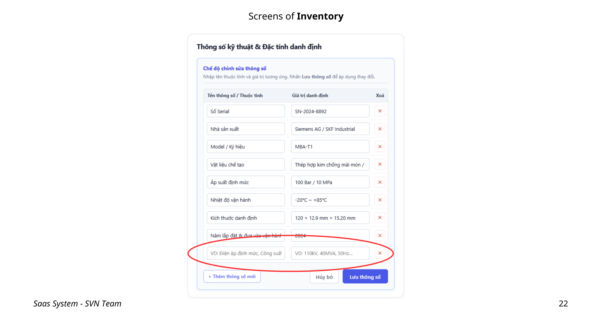

- Dùng `In mã QR` để mở bản xem trước tem chuẩn 50×30 mm; chỉ chọn `In ra máy in tem` sau khi đối chiếu tên/mã tài sản.
- Trong **Tổng quan tham số**, dùng `Chỉnh sửa` hoặc `+ Thêm thông số mới`; nhập tên thông số, giá trị và đơn vị theo tài liệu kỹ thuật.
- Trong **Tài liệu**, nhấn `Choose File` để tải bản vẽ, hướng dẫn vận hành, biên bản hoặc ảnh thiết bị.

| Nội dung | Kiểm tra trước khi lưu |
|---|---|
| Thông số kỹ thuật | Đơn vị đo, giá trị và tên thông số không bị trùng/nhầm thiết bị. |
| Tệp đính kèm | Tệp đúng phiên bản, tên tệp dễ tra cứu, không chứa dữ liệu không được phép chia sẻ. |
| Tem QR | Mã và tên trên tem thuộc đúng thiết bị đang xem. |

### 5.3. Ghi nhận sự cố

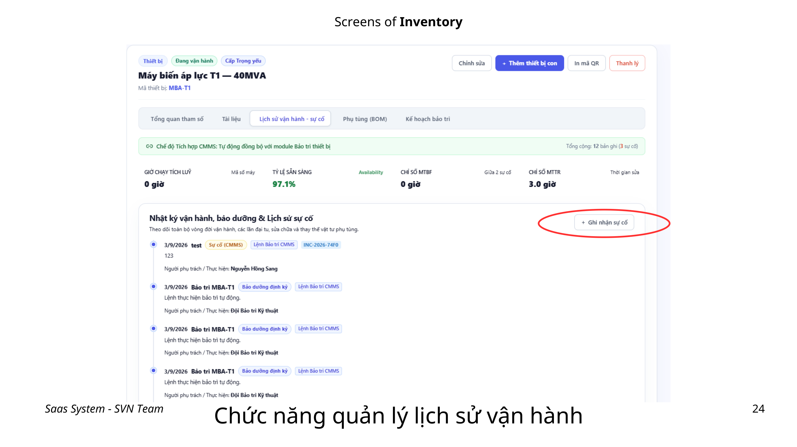

1. Mở tab **Lịch sử vận hành – sự cố** và nhấn `+ Ghi nhận sự cố`.
2. Chọn mức ưu tiên: `P4 - Thấp`, `P3 - Trung bình`, `P2 - Cao` hoặc `P1 - Khẩn cấp`.
3. Chọn **Phân loại sự cố**, nhập **Tiêu đề** và **Mô tả chi tiết**.
4. Tích **Đồng bộ sang Module Bảo trì (CMMS)** khi sự cố cần được xử lý/bám theo hoạt động bảo trì.
5. Lưu và kiểm tra sự cố xuất hiện trong lịch sử thiết bị.

### 5.4. BOM và kế hoạch bảo trì

| Khu vực | Thao tác | Kết quả |
|---|---|---|
| `Phụ tùng (BOM)` | Khai báo phụ tùng, đánh dấu **Trọng yếu**, nhấn `Lưu phụ tùng (BOM)` | Có danh mục phụ tùng phục vụ bảo trì/thay thế. |
| `Kế hoạch bảo trì` | Thêm các đầu việc T1, T2…, tần suất và thời lượng phút | Cung cấp dữ liệu nguồn cho module Bảo trì. |

## 6. Yêu cầu cấp phát vật tư từ Quy trình

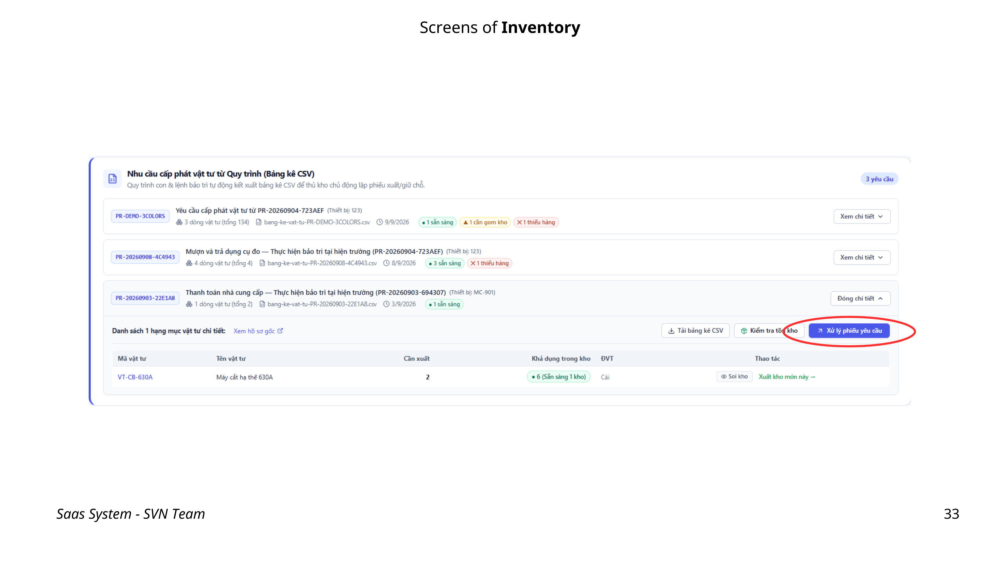

Khi Quy trình tạo nhu cầu vật tư, khu vực **Nhu cầu cấp phát vật tư từ Quy trình** hiển thị danh sách phiếu/yêu cầu cần xử lý.

| Thành phần | Loại UI | Hướng dẫn |
|---|---|---|
| `Xem chi tiết` | Button | Mở danh mục vật tư và bối cảnh phiếu. |
| `Tải bảng kê CSV` | Button | Tải danh sách để đối chiếu hoặc chia sẻ nội bộ. |
| `Kiểm tra tồn kho` | Button | Kiểm tra lượng đáp ứng trước khi quyết định xử lý. |
| `Xử lý phiếu yêu cầu (X vật tư)` | Button | Bắt đầu xử lý các dòng đã chọn/đủ điều kiện. |
| `Soi kho` | Button dòng | Xem tồn theo kho/vị trí. |
| `Xuất kho món này` | Button dòng | Xuất riêng một vật tư. |
| `Chuyển kho` | Button dòng | Điều chuyển để đáp ứng nhu cầu. |
| `Tách kho xuất` | Button dòng | Phân bổ một dòng từ nhiều kho xuất. |
| `Đề xuất mua sắm` | Button dòng | Ghi nhận phương án khi tồn không đáp ứng. |

### Quy trình xử lý cấp phát

1. Nhấn `Xem chi tiết` để xác định hồ sơ/quy trình và vật tư yêu cầu.
2. Nhấn `Kiểm tra tồn kho`; dùng `Soi kho` khi cần biết vị trí cụ thể.
3. Chọn cách đáp ứng: xuất một kho, tách nhiều kho, điều chuyển hoặc đề xuất mua sắm.
4. Tải CSV nếu cần đối chiếu độc lập trước khi chốt.
5. Nhấn `Xử lý phiếu yêu cầu` sau khi rà soát số lượng và kho xuất.

## 7. Nhập kho, xuất kho và điều chuyển

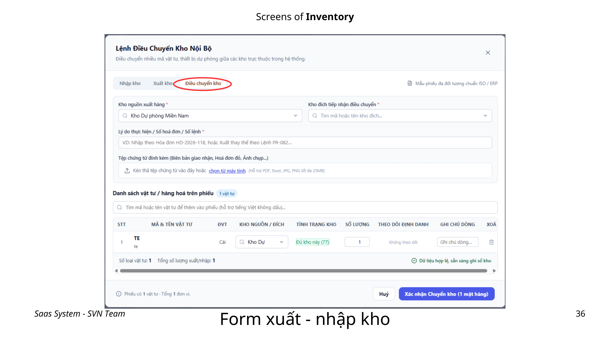

### 7.1. Khởi tạo giao dịch

1. Nhấn `+ Xuất/nhập kho`.
2. Chọn tab **Nhập kho**, **Xuất kho** hoặc **Điều chuyển kho**.
3. Chọn kho phù hợp, nhập số hóa đơn/lệnh và đính kèm chứng từ khi có.
4. Kiểm tra vật tư, số lượng và kho nguồn/đích trước khi xác nhận.

| Tab | Kho cần chọn | Mục đích |
|---|---|---|
| Nhập kho | Kho nhập | Tăng tồn kho từ nhà cung cấp, hoàn trả hoặc nguồn hợp lệ khác. |
| Xuất kho | Kho xuất | Giảm tồn khi cấp phát, sử dụng, bán hoặc phục vụ nghiệp vụ được phê duyệt. |
| Điều chuyển kho | Kho nguồn và kho đích | Chuyển tồn nội bộ giữa các kho/vị trí. |

| Trường thường dùng | Loại UI | Lưu ý |
|---|---|---|
| Kho xuất/nhập/nguồn/đích | Hộp chọn có tìm kiếm | Chọn đúng hướng giao dịch. |
| Số hóa đơn/lệnh | Input | Dùng số chứng từ có thể đối chiếu. |
| Chứng từ | Upload | Đính kèm file liên quan theo quy định nội bộ. |
| Danh sách vật tư | Bảng dòng | Kiểm tra SKU, đơn vị tính, số lượng trước khi lưu. |

> Không dùng điều chuyển để sửa sai số tồn. Khi có chênh lệch thực tế, thực hiện quy trình kiểm kê/điều chỉnh theo quy định của doanh nghiệp.

## 8. Danh mục vật tư, vị trí kho và kiểm kê

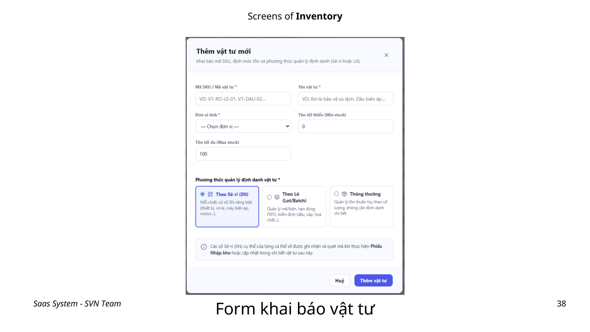

### 8.1. Tạo vật tư mới

1. Nhấn `+ Thêm vật tư`.
2. Nhập **Mã SKU** và **Tên vật tư**; hai thông tin phải dễ tìm và không trùng.
3. Chọn **Đơn vị tính**, nhập mức tồn **Min/Max stock** nếu doanh nghiệp quản lý định mức.
4. Chọn phương thức định danh: **Theo Sê-ri (SN)**, **Theo Lô (Lot/Batch)** hoặc **Thông thường**.
5. Lưu, sau đó kiểm tra vật tư mới trong danh mục.

| Trường | Loại | Bắt buộc | Hướng dẫn |
|---|---|---:|---|
| Mã SKU | Input | Có | Mã vật tư duy nhất, dùng nhất quán trên chứng từ. |
| Tên vật tư | Input | Có | Tên mô tả rõ loại/quy cách chính. |
| Đơn vị tính | Hộp chọn có tìm kiếm | Có | Đơn vị ghi nhận tồn và giao dịch. |
| Min/Max stock | Number input | Không | Ngưỡng tồn phục vụ theo dõi kế hoạch. |
| Phương thức quản lý định danh | Radio | Có | Chọn SN, Lot/Batch hoặc Thông thường theo đặc tính vật tư. |

### 8.2. Vị trí kệ và kiểm kê

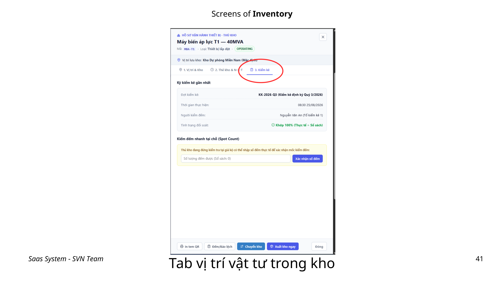

| Khu vực | Thao tác | Hướng dẫn |
|---|---|---|
| Tab `Vị trí & Kho` | `Đổi vị trí kệ` | Cập nhật bin location khi vật tư được đặt sang kệ/vị trí khác. |
| Tab `Kiểm kê` | Nhập số đếm và `Xác nhận số đếm` | Ghi nhận spot count tại chỗ theo quy trình kiểm kê. |

### Quy trình kiểm kê nhanh

1. Xác định đúng kho, vị trí kệ và vật tư cần đếm.
2. Mở tab **Kiểm kê**, nhập số lượng thực đếm.
3. Đối chiếu số đếm với tồn hệ thống và ghi chú chênh lệch theo quy định nội bộ.
4. Nhấn `Xác nhận số đếm` khi đã kiểm tra số liệu.

## 9. Kiểm tra nhanh và xử lý sự cố

| Vấn đề | Cách kiểm tra/xử lý |
|---|---|
| Không tìm được thiết bị | Rà soát mã/tên, mở rộng nhánh hoặc chuyển sang Dạng bảng. |
| Không đủ tồn để lắp/xuất | Kiểm tra kho khác, dùng điều chuyển/tách kho hoặc đề xuất mua sắm theo quy trình. |
| Không chọn được kho | Kiểm tra quyền Inventory và trạng thái kho. |
| Gỡ nhầm thiết bị | Dừng thao tác nếu chưa xác nhận; nếu đã xác nhận, thực hiện nghiệp vụ lắp lại có chứng từ/ghi chú. |
| Không thấy vật tư trong danh mục | Kiểm tra SKU, trạng thái vật tư và quyền xem kho. |
| Chênh lệch tồn | Không tự sửa bằng giao dịch tùy tiện; thực hiện kiểm kê và quy trình điều chỉnh được phê duyệt. |

## 10. Checklist bàn giao vận hành

- [ ] Kho, vị trí kệ và đơn vị tính đã được chuẩn hóa.
- [ ] Vật tư có SKU, tên và phương thức quản lý định danh phù hợp.
- [ ] Cây tài sản phản ánh đúng quan hệ lắp đặt thực tế.
- [ ] Thiết bị quan trọng có QR, thông số, tài liệu và BOM khi cần.
- [ ] Người thực hiện giao dịch kho hiểu rõ kho nguồn, kho đích và chứng từ.
- [ ] Quy trình kiểm kê và xử lý chênh lệch đã được thống nhất.

---

# PHẦN III. BẢO TRÌ PHÒNG NGỪA (CMMS)

> Phạm vi: Ma trận bảo trì, lịch bảo trì, phiếu phát sinh, lịch sử/nghiệm thu và cài đặt module (ảnh 44–58). Module sử dụng thiết bị, đầu việc và phụ tùng đã được khai báo trong Nhà kho & Cây tài sản.

## 1. Mục tiêu và điều kiện sử dụng

Module Bảo trì giúp lập kế hoạch bảo trì phòng ngừa, theo dõi các lần thực hiện và tạo hồ sơ cho sự cố phát sinh. Trước khi thiết lập, nên bảo đảm thiết bị, mức độ quan trọng, đầu việc và BOM trong Inventory đã chính xác.

| Quy ước | Ý nghĩa |
|---|---|
| Hộp chọn có tìm kiếm | Gõ mã/tên để tìm, chọn bằng `Enter`. |
| Tần suất | Ngày, Tuần, Tháng, Quý hoặc Năm. Một thiết bị có thể theo nhiều kế hoạch tùy cấu hình. |
| Drawer | Ngăn chi tiết bên phải, dùng để xem đầu việc/lịch sử hoặc nghiệm thu. |
| Popconfirm | Hộp xác nhận ngay tại nút; dùng cho thao tác gỡ thiết bị. |
| `*` | Trường bắt buộc, cần hoàn tất trước khi lưu/đánh dấu hoàn thành. |

### Trình tự vận hành khuyến nghị

1. Bổ sung thiết bị vào ma trận bảo trì và chọn chu kỳ/luồng xử lý.
2. Tạo lịch bảo trì định kỳ.
3. Khi đến hạn, mở hồ sơ lịch sử để ghi nhận nội dung thực hiện, bằng chứng và nghiệm thu.
4. Lập phiếu phát sinh cho sự cố ngoài kế hoạch.
5. Dùng báo cáo/lịch sử để rà soát chất lượng bảo trì và cập nhật ma trận khi cần.

## 2. Ma trận bảo trì

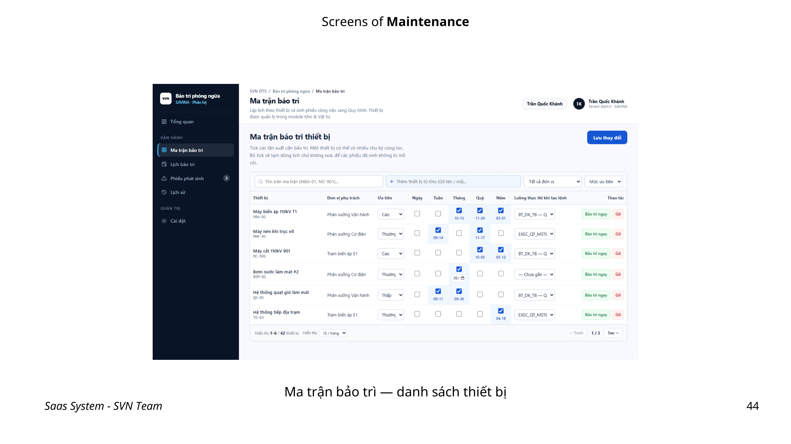

### 2.1. Thành phần trên ma trận

| Thành phần | Loại UI | Cách dùng | Kết quả |
|---|---|---|---|
| Tìm trên ma trận | Input tìm kiếm | Nhập mã/tên, ví dụ `MBA-01` | Lọc nhanh thiết bị trong ma trận. |
| `+ Thêm thiết bị từ Kho` | Button | Tìm và chọn thiết bị từ Inventory | Bổ sung thiết bị cần theo dõi bảo trì. |
| Tất cả đơn vị | Hộp chọn có tìm kiếm | Chọn đơn vị để lọc | Chỉ hiển thị thiết bị thuộc phạm vi cần xem. |
| Mức ưu tiên | Hộp chọn có tìm kiếm | Lọc theo độ ưu tiên | Tập trung vào nhóm thiết bị quan trọng. |
| Checkbox Ngày/Tuần/Tháng/Quý/Năm | Checkbox | Chọn chu kỳ bảo trì cho từng dòng | Khai báo tần suất thực hiện. |
| Luồng thực thi khi tạo lệnh | Hộp chọn có tìm kiếm | Chọn quy trình, ví dụ `BT_DK_TB - Q` | Xác định luồng xử lý khi sinh lệnh. |
| `Bảo trì ngay` | Button | Dùng cho đợt ngoài chu kỳ | Kích hoạt bảo trì đột xuất cho thiết bị. |
| `Gỡ` | Button cảnh báo | Dừng quản lý thiết bị trong ma trận | Mở xác nhận gỡ. |
| Tên thiết bị | Link/row action | Nhấp vào tên | Mở drawer chi tiết thiết bị trong bối cảnh CMMS. |

### 2.2. Thêm thiết bị và thiết lập chu kỳ

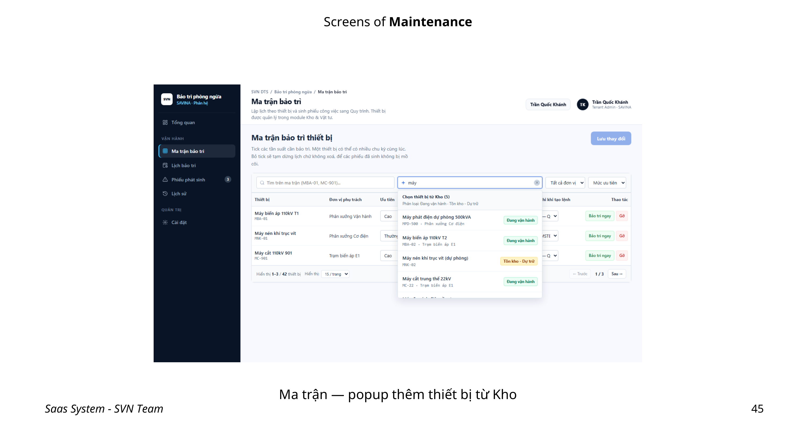

1. Nhấn `+ Thêm thiết bị từ Kho`.
2. Gõ tên hoặc mã thiết bị, chọn đúng đối tượng trong popup và xác nhận.
3. Trên dòng thiết bị mới, tích các chu kỳ cần áp dụng: **Ngày**, **Tuần**, **Tháng**, **Quý**, **Năm**.
4. Chọn **Luồng thực thi khi tạo lệnh** cho đúng loại công việc.
5. Kiểm tra đơn vị và mức ưu tiên, sau đó lưu theo thao tác của màn hình.

> Không đưa thiết bị vào ma trận chỉ để theo dõi đơn thuần. Thiết bị nên có đầu việc/kế hoạch rõ ràng để tránh sinh lệnh không thể nghiệm thu.

### 2.3. Xem chi tiết từ drawer

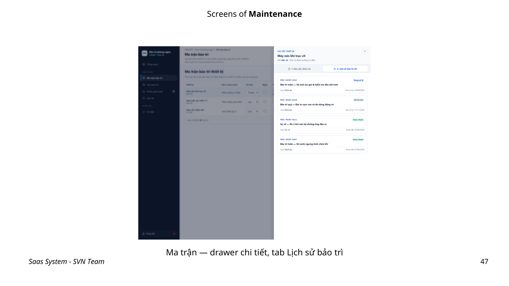

| Tab / liên kết | Nội dung | Cách dùng |
|---|---|---|
| `1. Đầu việc (Kho)` | Danh sách bước kiểm tra lấy từ Inventory | Rà soát đầu việc, phụ tùng và hướng dẫn kỹ thuật trước khi thực hiện. |
| `2. Lịch sử bảo trì` | Các lần can thiệp trước đó | Đối chiếu ngày thực hiện, kết quả và người xử lý. |
| `Sửa trong Kho →` | Hồ sơ thiết bị nguồn | Mở Inventory khi cần thay đổi dữ liệu kỹ thuật/cây tài sản. |

### 2.4. Bảo trì ngay và gỡ thiết bị

- Dùng `Bảo trì ngay` khi thiết bị cần được xử lý ngoài chu kỳ. Kiểm tra thiết bị và luồng thực thi trước khi tạo lệnh.
- Dùng `Gỡ` khi không còn muốn thiết bị xuất hiện trong ma trận. Hệ thống hiển thị Popconfirm; đọc tên thiết bị, nhấn `Gỡ thiết bị` để xác nhận hoặc `Hủy` để giữ nguyên.

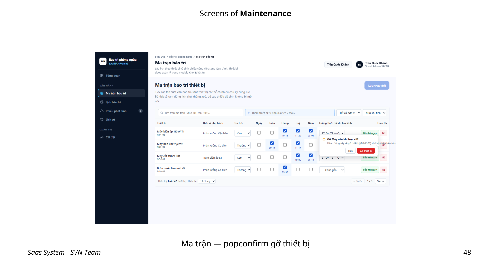

> Gỡ khỏi ma trận không phải là xóa thiết bị khỏi Kho. Muốn thay đổi thông tin gốc hoặc cấu trúc thiết bị, dùng liên kết `Sửa trong Kho →`.

## 3. Lập lịch bảo trì và phiếu phát sinh

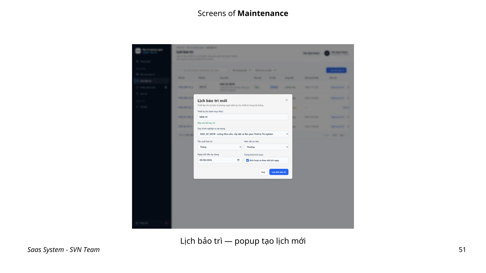

### 3.1. Tạo lịch bảo trì

1. Tại khu vực lịch, nhấn `+ Tạo lịch bảo trì`.
2. Chọn thiết bị/đầu việc phù hợp từ ma trận hoặc danh sách có sẵn.
3. Chọn ngày, chu kỳ, người/phòng ban phụ trách và các thông tin được yêu cầu trên form.
4. Rà soát xung đột lịch hoặc thời hạn, sau đó lưu.

| Thành phần | Loại UI | Hướng dẫn |
|---|---|---|
| `+ Tạo lịch bảo trì` | Button | Mở popup tạo lịch cho công việc phòng ngừa. |
| Thiết bị, đầu việc, người phụ trách | Hộp chọn có tìm kiếm | Chọn đúng dữ liệu nguồn và trách nhiệm thực hiện. |
| Ngày/kỳ thực hiện | DatePicker / cấu hình tần suất | Xác định thời điểm và chu kỳ công việc. |
| Lưu | Button | Ghi lịch sau khi kiểm tra nguồn lực và phạm vi. |

### 3.2. Lập phiếu phát sinh

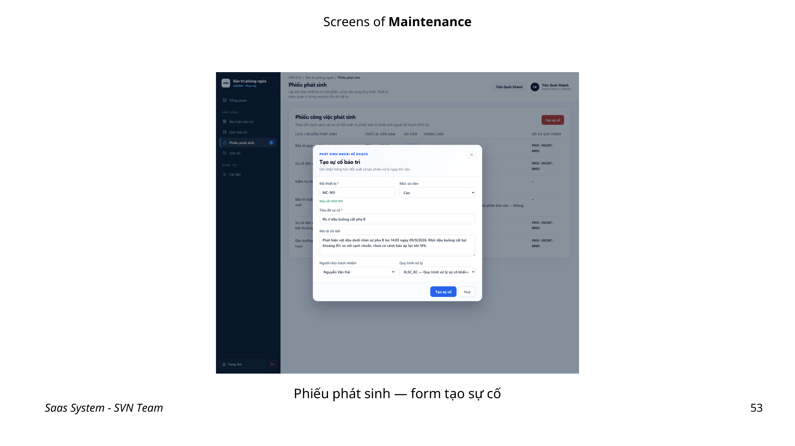

Trong tab **Phiếu phát sinh**, dùng nút `Tạo sự cố` khi có bất thường không chờ đến lịch định kỳ.

1. Mở tab **Phiếu phát sinh**.
2. Nhấn `Tạo sự cố`.
3. Chọn/kiểm tra thiết bị liên quan, mô tả biểu hiện, mức ưu tiên và các thông tin bắt buộc trong popup.
4. Lưu phiếu để đưa sự cố vào luồng xử lý và theo dõi.

| Tình huống | Chức năng nên dùng |
|---|---|
| Công việc đã có lịch đến hạn | Lịch bảo trì định kỳ. |
| Hỏng hóc/bất thường cần xử lý ngay | `Tạo sự cố` tại Phiếu phát sinh. |
| Cần kiểm tra ngoài chu kỳ nhưng không nhất thiết là sự cố | `Bảo trì ngay` tại ma trận. |

## 4. Ghi nhận thực hiện và nghiệm thu

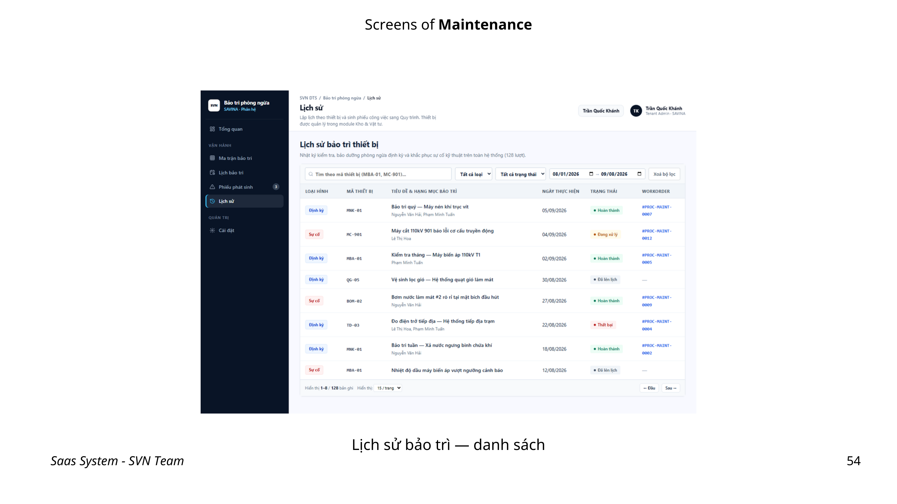

### 4.1. Mở hồ sơ và ghi nhận

1. Trong danh sách lịch sử, nhấp dòng công việc cần cập nhật.
2. Drawer bên phải mở ra; kiểm tra thiết bị, đầu việc và trạng thái.
3. Nhập **Nội dung thực hiện & Đánh giá kết quả**.
4. Tải **Tệp đính kèm / Biên bản nghiệm thu & Ảnh hiện trường** khi có.
5. Rà soát một lần cuối, sau đó nhấn `Đánh dấu hoàn thành`.

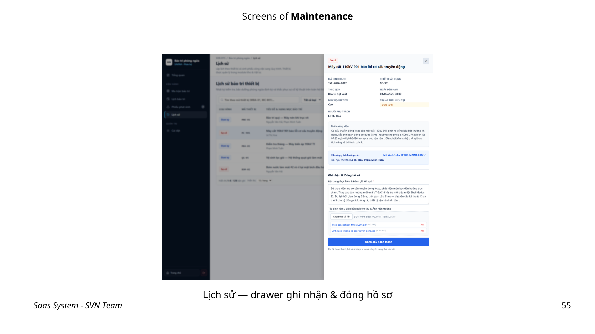

| Thành phần | Loại UI | Bắt buộc | Hướng dẫn |
|---|---|---:|---|
| Nội dung thực hiện & Đánh giá kết quả | Textarea | Có | Ghi công việc đã làm, phát hiện, kết quả và kiến nghị. |
| Tệp đính kèm / Biên bản nghiệm thu & Ảnh hiện trường | Upload | Theo quy định nội bộ | Đính kèm bằng chứng theo đúng hồ sơ và thời điểm. |
| `Đánh dấu hoàn thành` | Button xác nhận | — | Đóng công việc sau khi nội dung và bằng chứng đầy đủ. |

### 4.2. Sau khi hoàn thành

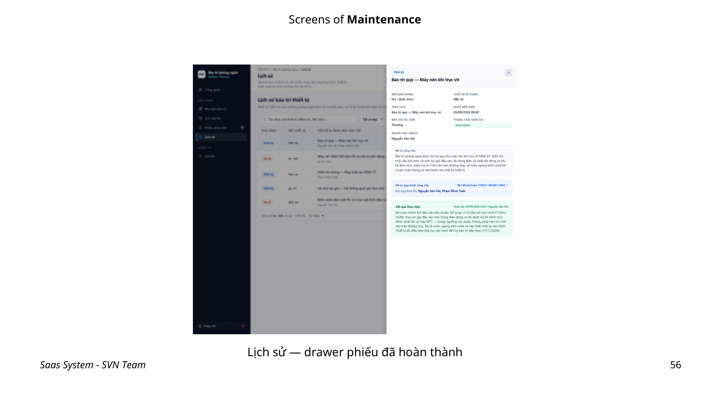

Drawer hiển thị kết quả sau khi hoàn tất để người dùng đối chiếu. Không dùng trạng thái hoàn thành nếu công việc vẫn còn lỗi, thiếu bằng chứng hoặc cần tiếp tục xử lý; cập nhật/trao đổi theo quy trình nội bộ trước khi chốt.

## 5. Cài đặt module Bảo trì

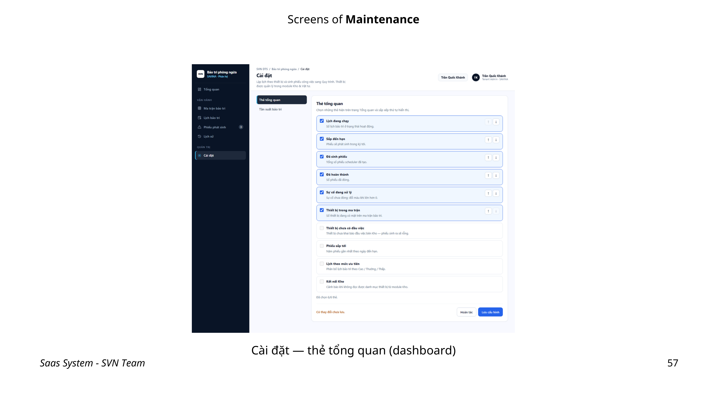

### 5.1. Thẻ tổng quan

Trong tab **Thẻ tổng quan**, bật/tắt các thẻ trên Dashboard và sắp xếp vị trí hiển thị theo ưu tiên quản trị. Chỉ bật chỉ số mà bộ phận thực sự theo dõi để Dashboard dễ đọc.

### 5.2. Tần suất bảo trì

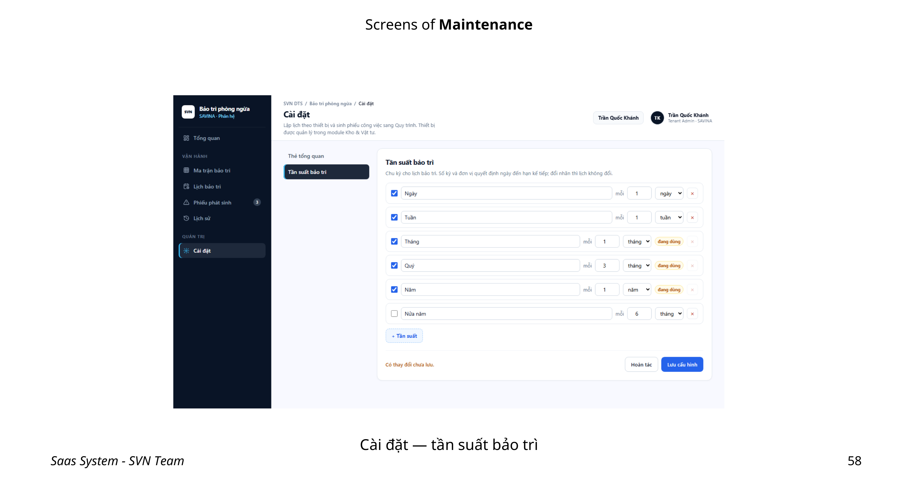

| Thành phần | Loại UI | Hướng dẫn |
|---|---|---|
| Checkbox bật/tắt | Checkbox | Kích hoạt hoặc ngưng một cấu hình tần suất. |
| Số lượng | Number input | Nhập chu kỳ, ví dụ `2`. |
| Đơn vị | Hộp chọn có tìm kiếm | Chọn Ngày, Tuần, Tháng hoặc đơn vị hệ thống hỗ trợ. |

Ví dụ: `2` + `Tuần` nghĩa là lặp lại theo chu kỳ hai tuần. Cần thống nhất quy ước tần suất với kế hoạch bảo trì và năng lực thực hiện thực tế.

## 6. Kiểm tra nhanh và xử lý tình huống

| Vấn đề | Cách kiểm tra/xử lý |
|---|---|
| Không tìm thấy thiết bị trong ma trận | Kiểm tra thiết bị đã tồn tại trong Inventory, trạng thái/quyền truy cập và dùng `+ Thêm thiết bị từ Kho`. |
| Không có đầu việc trong drawer | Bổ sung kế hoạch/đầu việc ở hồ sơ thiết bị trong Inventory. |
| Không nên gỡ thiết bị nhưng đã mở xác nhận | Nhấn `Hủy`; không xác nhận gỡ. |
| Không đánh dấu hoàn thành được | Kiểm tra trường bắt buộc, đặc biệt nội dung thực hiện/đánh giá và bằng chứng theo yêu cầu. |
| Tạo nhầm lịch | Xử lý theo quyền/quy trình quản trị lịch, tránh đánh dấu hoàn thành một công việc chưa thực hiện. |
| Sự cố cần theo dõi liên phòng ban | Tạo Phiếu phát sinh, mô tả đủ bối cảnh và dùng luồng được cấu hình. |

## 7. Checklist bàn giao vận hành

- [ ] Thiết bị quan trọng đã có đầu việc, thông số và BOM phù hợp trong Inventory.
- [ ] Ma trận đã có đúng thiết bị, mức ưu tiên, chu kỳ và luồng thực thi.
- [ ] Người xử lý hiểu cách mở drawer và ghi nhận kết quả/bằng chứng.
- [ ] Quy tắc sử dụng Bảo trì ngay, Tạo sự cố và Gỡ thiết bị đã được thống nhất.
- [ ] Tần suất và thẻ Dashboard phản ánh nhu cầu quản trị thực tế.

---

# PHẦN IV. QUY TRÌNH & MA TRẬN RCSI

> Phạm vi: Workspace vận hành hồ sơ, công việc con, trao đổi, vật tư, liên kết/đính kèm, thiết kế quy trình, ma trận RCSI và cài đặt (ảnh 62–85). Phân hệ dùng dữ liệu tổ chức, người dùng và thiết bị từ các module Core/Inventory.

## 1. Mục tiêu và điều kiện sử dụng

Module Quy trình cung cấp hai không gian làm việc:

- **Workspace:** tạo, xử lý, theo dõi và đóng hồ sơ theo quy trình đã công bố.
- **Thiết kế quy trình:** định nghĩa bước, vai trò RCSI, SLA và trạng thái phát hành của quy trình.

Trước khi thiết kế hoặc vận hành, kiểm tra Core đã có sơ đồ tổ chức, chức danh, bổ nhiệm hiệu lực và người dùng có quyền phù hợp. Các nút phê duyệt, từ chối, công bố, xóa hoặc hủy chỉ hiển thị khi tài khoản có quyền và đang ở đúng bước xử lý.

| Quy ước | Ý nghĩa |
|---|---|
| Hộp chọn có tìm kiếm | Gõ mã/tên, dùng `↑`/`↓` rồi `Enter` để chọn. |
| Hồ sơ | Một yêu cầu/đơn việc chạy theo một quy trình. |
| Bước | Một chặng xử lý trong hồ sơ. |
| Drawer | Ngăn chi tiết bên phải, thường hiển thị thông tin bước/SLA. |
| Popup form | Hộp tạo/sửa dữ liệu độc lập. |
| Popconfirm | Hộp xác nhận nhanh cho công bố, đưa về bản nháp, xóa hoặc hủy. |

## 2. Workspace: tạo và xử lý hồ sơ

### 2.1. Tạo đơn/yêu cầu mới

1. Tại Workspace, nhấn `+ Tạo đơn / Yêu cầu mới`.
2. Nhập **Tiêu đề** thể hiện rõ nội dung cần xử lý.
3. Chọn **Áp dụng quy trình ***; chỉ chọn quy trình đã công bố và phù hợp nghiệp vụ.
4. Chọn ngày bắt đầu/kết thúc theo yêu cầu; tích áp lịch theo giờ khi cần tính SLA theo giờ.
5. Chọn **Người quản lý hồ sơ**, thêm người theo dõi nếu cần.
6. Rà soát và lưu để khởi tạo hồ sơ.

| Trường / nút | Loại UI | Bắt buộc | Hướng dẫn |
|---|---|---:|---|
| Tiêu đề | Input | Có | Nêu đối tượng, mục đích và mã tham chiếu nếu có. |
| Áp dụng quy trình | Hộp chọn có tìm kiếm | Có | Chọn đúng luồng đã được công bố. |
| Ngày bắt đầu / kết thúc | DatePicker | Theo quy trình | Đặt mốc kế hoạch; không nhập kết thúc sớm hơn bắt đầu. |
| Áp lịch theo giờ tính SLA | Checkbox | Không | Bật khi thời hạn cần đo theo giờ làm việc/SLA. |
| Người quản lý hồ sơ | Hộp chọn có tìm kiếm | Theo quy trình | Người theo dõi/điều phối hồ sơ. |
| Người theo dõi | Hộp chọn có tìm kiếm | Không | Thêm các bên cần nhận thông tin. |
| `+ Tạo đơn / Yêu cầu mới` | Button | — | Mở popup khởi tạo hồ sơ. |

### 2.2. Xử lý bước hiện tại

Mở một dòng hồ sơ từ bảng để xem chi tiết. Chỉ người được phân công/được cấp quyền mới có thể thao tác bước hiện tại.

| Nút | Loại UI | Khi dùng | Kết quả |
|---|---|---|---|
| `Phê duyệt & Gửi X tệp` | Button chính | Hồ sơ đã đủ điều kiện chuyển bước | Ghi nhận phê duyệt và gửi tệp được chọn. |
| `Trả lại` | Button | Cần bổ sung/chỉnh sửa trước khi tiếp tục | Chuyển hồ sơ về điểm xử lý theo thiết kế luồng. |
| `Từ chối` | Button cảnh báo | Không chấp thuận yêu cầu | Ghi nhận trạng thái từ chối theo luồng. |
| `Chọn thiết bị` | Button | Hồ sơ cần gắn tài sản | Mở popup chọn tài sản Inventory. |

### 2.3. Gắn thiết bị

1. Trong chi tiết hồ sơ, nhấn `Chọn thiết bị`.
2. Tìm thiết bị bằng mã/tên, kiểm tra đúng cây tài sản hoặc tình trạng thiết bị.
3. Chọn thiết bị và xác nhận gắn vào hồ sơ.
4. Kiểm tra thiết bị xuất hiện trong chi tiết trước khi phê duyệt/gửi hồ sơ.

> Gắn thiết bị đúng ngay từ đầu giúp lịch sử hồ sơ, vật tư và bảo trì có thể truy vết theo tài sản.

## 3. Công việc con, trao đổi và lịch sử

### 3.1. Công việc con

Trong tab **Công việc con**, dùng `Chỉnh sửa công việc phân rã` để tạo hoặc cập nhật bước nhỏ của hồ sơ.

| Thành phần | Loại UI | Hướng dẫn |
|---|---|---|
| Tuần tự / Song song | Radio | Chọn **Tuần tự** nếu việc sau phải chờ việc trước; chọn **Song song** nếu có thể làm đồng thời. |
| Tỷ trọng % | Number input | Nhập tỷ trọng để phản ánh mức độ đóng góp/tiến độ. |
| Người phụ trách | Hộp chọn có tìm kiếm | Chọn đúng nhân sự/chức danh chịu trách nhiệm. |
| Vật tư liên quan | Input / chọn dữ liệu | Ghi/chọn vật tư phục vụ công việc nếu có. |
| `Chỉnh sửa công việc phân rã` | Button | Lưu cấu trúc công việc con sau khi kiểm tra. |

### 3.2. Trao đổi

1. Mở tab **Trao đổi**.
2. Viết nội dung ngắn gọn, nêu rõ việc cần phản hồi hoặc quyết định cần xác nhận.
3. Dùng `@mention` để nhắc đúng người; tránh gắn thẻ không cần thiết.
4. Nhấn `Gửi tin nhắn`.

| Thành phần | Loại UI | Mục đích |
|---|---|---|
| Ô soạn thảo | Textarea/editor | Ghi trao đổi gắn với hồ sơ. |
| `@mention` | Action | Nhắc người dùng liên quan. |
| `Gửi tin nhắn` | Button | Lưu và phát nội dung trao đổi. |
| Tab `Lịch sử` | Tab | Xem diễn biến, phiên duyệt và thay đổi trạng thái. |

## 4. Vật tư, liên kết và đính kèm

### 4.1. Yêu cầu vật tư

1. Vào tab **Vật tư**, nhấn `+ Vật tư`.
2. Chọn vật tư và nhập số lượng cần dùng.
3. Chọn **Quy trình mượn/xuất kho vật tư** để đưa yêu cầu sang luồng kho thích hợp.
4. Chọn **Gắn vào công việc con** nếu vật tư phục vụ một đầu việc cụ thể.
5. Nhấn `Xác nhận tạo đơn`.

| Trường | Loại UI | Bắt buộc | Ý nghĩa |
|---|---|---:|---|
| Vật tư | Hộp chọn có tìm kiếm | Có | Chọn vật tư từ danh mục Inventory. |
| Số lượng | Number input | Có | Nhập nhu cầu thực tế theo đơn vị tính. |
| Quy trình mượn/xuất kho vật tư | Hộp chọn có tìm kiếm | Có | Xác định luồng xử lý yêu cầu kho. |
| Gắn vào công việc con | Hộp chọn có tìm kiếm | Không | Liên kết nhu cầu với đầu việc phân rã. |
| `Xác nhận tạo đơn` | Button | — | Khởi tạo yêu cầu cấp phát/mượn vật tư. |

### 4.2. Liên kết hồ sơ

Dùng tab **Liên kết** khi một hồ sơ phụ thuộc, bổ sung hoặc có liên quan tới hồ sơ khác. Nhấn `+ Liên kết hồ sơ`, tìm hồ sơ đích, kiểm tra loại quan hệ và lưu. Chỉ tạo liên kết khi người xử lý sau cần thấy ngữ cảnh đó; tránh liên kết trùng lặp.

### 4.3. Đính kèm tệp

1. Mở tab **Đính kèm**, nhấn `+ Tải tệp lên`.
2. Kéo thả hoặc chọn tệp trong popup.
3. Chọn bước cần gắn tệp.
4. Đánh dấu là **minh chứng hoàn thành** khi tệp là bằng chứng bắt buộc của bước.
5. Xác nhận tải tệp và kiểm tra tên/tệp đã xuất hiện đúng hồ sơ.

| Nội dung | Khuyến nghị |
|---|---|
| Tên tệp | Đặt tên có mã hồ sơ, nội dung và ngày khi phù hợp. |
| Bước gắn tệp | Gắn vào đúng bước để người phê duyệt dễ đối chiếu. |
| Minh chứng hoàn thành | Chỉ đánh dấu tệp là bằng chứng khi tài liệu/ảnh thực sự chứng minh kết quả. |

## 5. Drawer bước và hủy hồ sơ

Nhấp vào bước/công việc để mở drawer. Drawer hiển thị phân vai RCSI, thời hạn SLA và nội dung cần xử lý. Dùng thông tin này để biết ai thực hiện, ai rà soát/phê duyệt và mốc cần đáp ứng.

### Hủy hồ sơ

1. Chọn `Hủy hồ sơ` trong chi tiết hồ sơ.
2. Nhập lý do hủy bắt buộc, nêu rõ bối cảnh hoặc mã hồ sơ thay thế khi có.
3. Đọc lại ảnh hưởng đến các bước, yêu cầu vật tư và liên kết.
4. Xác nhận trong Popconfirm chỉ khi hồ sơ không thể tiếp tục.

> Hủy không phải là cách sửa dữ liệu thông thường. Dùng `Trả lại` hoặc chỉnh sửa thông tin khi hồ sơ vẫn cần được xử lý.

## 6. Thiết kế quy trình và ma trận RCSI

### 6.1. Tạo quy trình

1. Vào danh mục quy trình, nhấn `+ Thêm mới`.
2. Nhập tên, mã, mô tả và các thông tin yêu cầu trong popup.
3. Lưu ở trạng thái bản nháp.
4. Thêm bước, thiết kế RCSI, SLA và kiểm thử trước khi công bố.

### 6.2. Thiết lập ma trận RCSI

Trong ma trận, **cột** là phòng ban/chức danh từ Sơ đồ tổ chức; **dòng** là các bước quy trình. Nhấp ô giao điểm để gán vai trò. Thêm bước bằng nút `+ Thêm bước`; nhập SLA cho từng bước theo giờ/ngày.

| Ký hiệu | Vai trò | Trách nhiệm thực tế |
|---|---|---|
| `S` | Submit | Khởi tạo/gửi thông tin ở bước. |
| `R` | Review | Rà soát nội dung trước khi chuyển tiếp. |
| `E` | Executor | Thực hiện công việc. |
| `C` | Check | Kiểm tra chất lượng/kết quả. |
| `A` | Approve | Phê duyệt quyết định. |
| `I` | Inform | Nhận thông tin, không nhất thiết xử lý. |

### Quy trình thiết kế RCSI

1. Kiểm tra các phòng ban/chức danh đã tồn tại trong Core và bổ nhiệm còn hiệu lực.
2. Thêm các bước theo trình tự nghiệp vụ.
3. Với từng bước, gán đúng vai trò RCSI tại giao điểm dòng–cột.
4. Nhập SLA; quy ước rõ đơn vị giờ/ngày và cách xử lý quá hạn.
5. Kiểm thử các trường hợp: hồ sơ thường, trả lại, từ chối, người kiêm nhiệm và tệp minh chứng.
6. Rà soát trước khi công bố.

## 7. Công bố, sửa và xóa quy trình

| Nút | Loại UI | Hướng dẫn | Kết quả |
|---|---|---|---|
| `Công bố` | Button + Popconfirm | Xác nhận sau khi đã kiểm thử đầy đủ | Đưa quy trình vào danh sách có thể áp dụng cho hồ sơ mới. |
| `Sửa` | Button + Popconfirm | Đưa quy trình về bản nháp để hiệu chỉnh | Ngăn thay đổi trực tiếp trên bản công bố. |
| `Xóa` | Button + Popconfirm | Chỉ dùng khi không còn nhu cầu sử dụng và không có phụ thuộc | Hệ thống chặn xóa nếu có hồ sơ đang chạy. |

### Kiểm tra trước khi công bố

- [ ] Mã/tên quy trình rõ ràng và không trùng.
- [ ] Mọi bước có người/chức danh chịu trách nhiệm phù hợp.
- [ ] RCSI không bỏ sót bước phê duyệt/kiểm tra cần thiết.
- [ ] SLA có đơn vị, thời hạn hợp lý và được thống nhất.
- [ ] Luồng trả lại/từ chối và minh chứng tệp đã được kiểm thử.

## 8. Cài đặt quy trình và nhóm quy trình

### 8.1. Thẻ tổng quan

Trong tab **Thẻ tổng quan**, bật/tắt thẻ Dashboard theo nhu cầu theo dõi của đơn vị. Chỉ hiển thị chỉ số thật sự phục vụ điều hành để tránh làm Dashboard quá tải.

### 8.2. Tạo nhóm quy trình

1. Vào tab **Nhóm quy trình**, nhấn `+ Thêm nhóm`.
2. Nhập tên nhóm và mã nhóm.
3. Chọn trạng thái bật/tắt; đánh dấu mặc định nếu đây là nhóm dùng làm lựa chọn chuẩn.
4. Lưu và kiểm tra nhóm xuất hiện trong danh mục.

| Trường | Loại UI | Bắt buộc | Hướng dẫn |
|---|---|---:|---|
| Tên nhóm | Input | Có | Tên dễ hiểu theo lĩnh vực nghiệp vụ. |
| Mã nhóm | Input | Có | Mã duy nhất, ổn định. |
| Bật/Tắt | Switch/Checkbox | Có | Kiểm soát khả năng sử dụng nhóm. |
| Đặt mặc định | Checkbox | Không | Chỉ chọn khi đây là nhóm mặc định phù hợp. |
| `+ Thêm nhóm` | Button | — | Mở popup tạo nhóm. |

## 9. Kiểm tra nhanh và xử lý tình huống

| Vấn đề | Cách kiểm tra/xử lý |
|---|---|
| Không tạo được hồ sơ | Kiểm tra đã chọn quy trình công bố, các trường bắt buộc và quyền Workspace. |
| Không thấy nút phê duyệt/từ chối | Kiểm tra tài khoản có được phân công đúng bước/role và trạng thái hồ sơ. |
| Không chọn được phòng ban/chức danh trong RCSI | Rà soát sơ đồ tổ chức, loại node và bổ nhiệm hiệu lực ở Core. |
| Không tạo được yêu cầu vật tư | Kiểm tra danh mục vật tư, số lượng, quy trình kho và quyền Inventory/Procedure. |
| Không thể xóa quy trình | Kiểm tra thông báo phụ thuộc; hoàn tất/hủy đúng quy trình các hồ sơ đang chạy trước. |
| SLA không như kỳ vọng | Kiểm tra đơn vị giờ/ngày, cấu hình áp lịch theo giờ và SLA của từng bước. |

## 10. Checklist bàn giao vận hành

- [ ] Core có sơ đồ tổ chức, chức danh và bổ nhiệm cập nhật.
- [ ] Quy trình được tạo ở bản nháp, có bước/RCSI/SLA đầy đủ và đã kiểm thử.
- [ ] Chỉ công bố sau khi thống nhất chủ sở hữu, người thực hiện, người phê duyệt và trường hợp trả lại/từ chối.
- [ ] Người dùng biết tạo hồ sơ, trao đổi, đính kèm minh chứng và theo dõi lịch sử.
- [ ] Luồng yêu cầu vật tư đã liên kết đúng quy trình kho.
- [ ] Nhóm quy trình và các thẻ Dashboard đã cấu hình theo nhu cầu vận hành.

---

